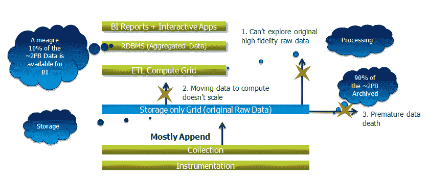
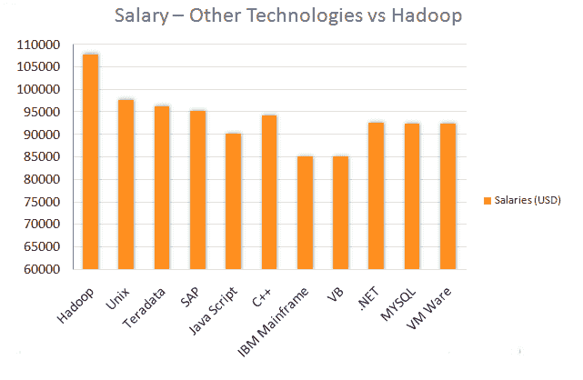
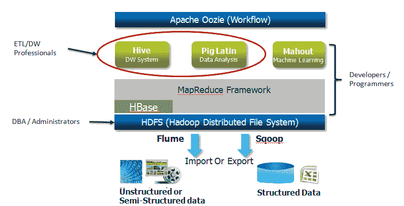

# Hadoop 简介

> 原文：<https://www.edureka.co/blog/introduction-to-big-data-n-hadoop/>

大数据是一个术语，指的是如此庞大和复杂的数据集集合，以至于难以使用手动数据库管理工具或传统数据处理应用程序进行处理。让我们在这篇介绍 Hadoop 的文章中详细讨论这一点。

大数据现在已经成为描述数据爆炸的流行术语，Hadoop 已经成为大数据的代名词。正是因为这个原因，Doug Cutting 创建了 Apache Hadoop。Hadoop 现在已经成为存储、处理和分析数百 TB 甚至数 Pb 数据的事实标准。Hadoop 允许在存储和处理数据的廉价行业标准服务器上分布式并行处理大量数据。

[//www.youtube.com/embed/FYvQcqg7w58](//www.youtube.com/embed/FYvQcqg7w58)

上面的视频是主题为“Hadoop 简介”的网络研讨会的录制部分，该研讨会于 2014 年 8 月 8 日举行。

## **以上视频详细涵盖以下话题:**

*   什么是大数据
*   传统仓库 Vs Hadoop
*   为什么要学习 Hadoop 及相关技术
*   大数据领域的工作和趋势
*   Hadoop 架构和生态系统

## **演示:**

[//www.slideshare.net/slideshow/embed_code/37875094?rel=0](//www.slideshare.net/slideshow/embed_code/37875094?rel=0)

[//www.slideshare.net/slideshow/embed_code/37875094?rel=0](//www.slideshare.net/slideshow/embed_code/37875094?rel=0)

## **为什么要学习 Hadoop &相关技术？**

*   **非结构化数据呈爆炸式增长—**数字世界去年增长了 62%,达到 80 万 Pb，到今年年底将进一步增长到 1.2。

*   **大数据挑战—**来自不同来源、不同数据类型的数据量不断增加，带来了巨大的挑战。

## **大数据客户场景:**

以下是零售、银行和金融领域的一些大数据使用案例:

**银行和金融服务:**

*   模拟真实风险
*   威胁分析
*   欺诈检测
*   贸易监督
*   信用评分和分析

**零售:**

*   销售点交易分析
*   客户流失分析
*   情感分析

## **案例分析:**

该视频包括一个案例研究，其中讨论了 Sears 对 Hadoop 的使用。Sears 以前使用 Oracle Exadata、Teradata 和 SAS 等传统系统来存储和处理客户活动和销售数据。通过采用 Hadoop，Sears 获得了宝贵的优势，例如:

*   对数据的洞察提供了宝贵的业务优势
*   对企业来说意味着财富的关键早期指标
*   用更多数据进行精准分析 你甚至可以用 [数据工程课程](https://www.edureka.co/microsoft-azure-data-engineering-certification-course) 查看大数据的细节。

## **现有数据分析架构的局限性及 Hadoop 如何克服:**

该视频逐步解释了数据流及其在现有数据分析架构中面临的限制，以及 Hadoop 如何克服这些限制。Hadoop 提供了一种利用组合存储计算机层的解决方案。因此，Sears 迁移到 300 节点的 Hadoop 集群，将 100%的数据用于处理，而不是现有非 Hadoop 解决方案中仅有的 10%。

继续这篇介绍 Hadoop 的文章，让我们看看为什么要转向 Hadoop。

在这里，本次 **[Hadoop 培训](https://www.edureka.co/big-data-hadoop-training-certification)** 将向您详细介绍具有实时项目经验的工具和概念，该培训由顶级行业工作专家精心组织。

## **为什么要迁移到 Hadoop？**

以下原因非常清楚地说明了为什么必须迁移到 Hadoop。

*   允许使用简单的编程模型跨计算机集群分布式处理大型数据集。
*   已经成为存储、处理和分析数百 TB 和数 Pb 数据的事实标准。
*   与其他传统专有技术相比，使用成本更低。
*   处理来自不同系统的所有类型的数据。

## **Hadoop——成长与工作机会:**

“我们听说这是一种时尚，听说它被大肆宣传，听说它转瞬即逝，但很明显，数据专业人员很受欢迎，而且报酬丰厚。分析大型数据流并从战略上影响公司整体业务目标的技术专业人士有机会书写自己的人生。”Dice.com 董事总经理爱丽丝·希尔说。 成为一名数据工程师的最佳途径是在印度接受 [Azure 数据工程培训](https://www.edureka.co/microsoft-azure-data-engineering-certification-course-india) 。

**根据领先的技术和工程专业人士职业网站 Dice 的 2012-13 年薪资调查:**

*   大数据工作对薪资产生了积极的、不成比例的影响。
*   拥有 Hadoop、NoSQL 和 MongoD 技能的专业人士可以赚超过 10 万美元
*   Gartner 表示，到 2015 年，大数据将在全球创造 440 万个 IT 工作岗位来支持大数据。点击 [此处](https://www.edureka.co/blog/5-reasons-to-learn-hadoop "5 Reasons to Learn Hadoop") 了解更多关于 Hadoop 的需求。

继续这篇介绍 Hadoop 的文章，让我们看看 Hadoop 生态系统及其架构。

## **Hadoop 生态系统&架构:**

Hadoop 由两个主要组件组成:

**HDFS—Hadoop 分布式文件系统—用于存储**

*   高度容错
*   对应用程序数据的高吞吐量访问
*   适合具有大型数据集的应用程序
*   天生多余

**MapReduce–用于处理**

*   用于轻松编写应用程序的软件框架，这些应用程序以可靠、容错的方式在大型集群(数千个节点)上并行处理大量数据(多 TB 数据集)
*   在处理器之间拆分任务

*Got a question for us? Mention it in the comments section and we will get back to you. ***Related Posts:**

[面向 Java 专业人士的 Hadoop](https://www.edureka.co/blog/videos/free-webinar-on-hadoop-for-java-professionals/ "Hadoop for Java Professionals")

[大数据是你的正确选择吗？](https://www.edureka.co/blog/is-big-data-the-right-move/ "Is Big Data the Right Move for You?")

[学习 Hadoop 的 5 个理由](https://www.edureka.co/blog/5-reasons-to-learn-hadoop "5 Reasons to Learn Hadoop")

[大数据和 Hadoop 培训](https://www.edureka.co/big-data-and-hadoop)