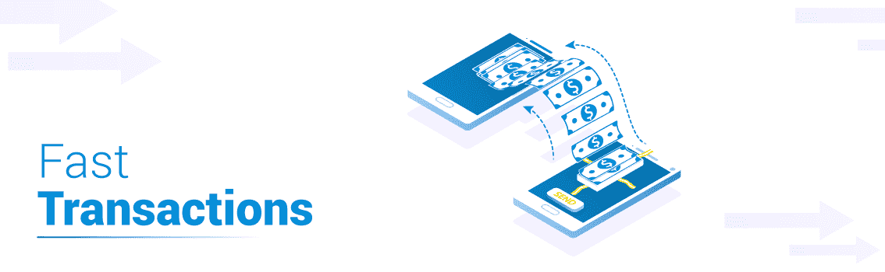
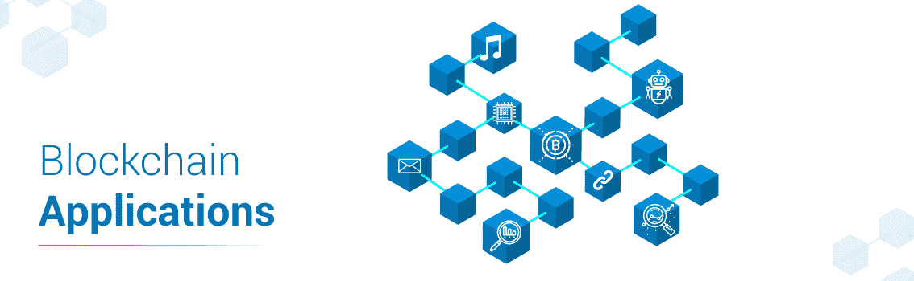
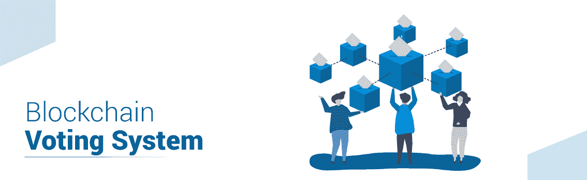

# 如何学习区块链？优势、学习路径和未来

> 原文：<https://www.edureka.co/blog/how-to-learn-blockchain-technology-advantages-future/>

你可能听说过有人想投资加密货币，但你知道区块链技术是更有价值的投资吗？即使有解释区块链是什么的资源，但是很少有地方告诉你如何学习区块链。在这篇文章中，与其解释[什么是区块链](https://www.edureka.co/blog/how-blockchain-works/)，我将谈论如何学习区块链。

我将涉及以下主题:

*   [区块链的优势](#AdvantagesofBlockchain)
*   [如何学习区块链？](#HowtolearnBlockchain)
*   [区块链的未来](#FutureofBlockchain)

*“A high paying job is fine but I can get that in other technologies too, then why should I learn Blockchain?”*

**如果你心中有这个问题，那么你就走在了正确的学习道路上。区块链除了只是提供高薪工作，还有自己独特的方式。所以在我告诉你如何学习区块链之前，我先告诉你区块链的一些优势。**

## ****区块链的优势****

**区块链被称为[颠覆性技术](https://www.edureka.co/community/32046/why-is-blockchain-called-a-disruptive-technology?show=32046#q32046)。颠覆性技术是指在行业中引起巨大变化的东西，并不是每种技术都有这个称号。在这一部分，我将告诉你区块链的主要优势，这使它成为当今最[趋势技术](https://www.edureka.co/blog/top-10-trending-technologies/)之一。**

**区块链是开源账本，是公开的。发生的每一笔交易都经过节点的确认和验证，这使得欺诈几乎不可能发生。**

****

### ****没有中央权威****

**区块链没有控制网络的中央权威机构。这防止了集中控制的滥用。思考如果没有控制，区块链是如何工作的？嗯，区块链没有中央权威，但它是由用户控制的，由严格的机制驱动，这使它安全可靠。**

### ****廉价交易****

**区块链中的交易是在双方之间进行的，因为没有中央权威机构，所以不需要支付高额费用。这使得区块链交易很便宜。**

### ****快速交易****

**如今使用的在线交易系统速度相当快。但众所周知，区块链交易要快 10 倍。**

****

**很有趣不是吗？既然你们都在炒作区块链，我也不再拖延，就来告诉你们如何学习区块链。**

## ****如何学习区块链？****

**学习一项新技术既有趣又令人沮丧。有趣是因为你对探索和学习新概念充满好奇，令人沮丧是因为你不知道从哪里和如何开始。你似乎已经对区块链非常感兴趣，为了帮助你克服“挫折”部分，让我告诉你如何学习区块链。**

### ****学习基础知识****

**学习任何新技术并以此为职业的第一步是了解它的基础知识。区块链 是一片浩瀚的大海，要想成为这片大海的游泳健将，你需要知道大海的深度。但是，你不能直接潜入海底，到达海底。你需要从海滩开始。要成为区块链专家，基础知识是你必须开始的地方。例如:**

****1。什么是区块链？****

**区块链是不可变记录的**去中心化分布式数据库**。简单来说，区块链是一个区块链，其中每个区块都包含账本记录，并且是不可变的。不可变意味着它不能被改变或删除。**

****2。什么是加密？区块链有多重要？****

**区块链最著名的特点之一就是数据安全。加密是一种通过将数据转换成无意义的数据来保护数据的方法。这些无意义的数据可以通过解密过程转换成有意义的数据。区块链使用加密来保护敏感数据。**

****3。区块链上可以存储什么？****

**区块链上可以存储何种数据没有限制。任何种类的数字数据/账本都可以存储在区块链上。**

**这里有一个关于[区块链问题和答案](https://www.edureka.co/blog/interview-questions/blockchain-interview-questions/)的完整列表，但这不是这篇博客的内容。这个博客是关于如何学习区块链的，所以让我们回到它。**

**完成基础知识？让我们继续前进。**

****了解我们在顶级城市/国家的区块链培训****

| **印度** | **其他城市/国家** |
| [班加罗尔](https://www.edureka.co/blockchain-training-bangalore) | [纽约](https://www.edureka.co/blockchain-training-new-york-city) |
| [海德拉巴](https://www.edureka.co/blockchain-training-hyderabad) | [英国](https://www.edureka.co/blockchain-training-uk) |
| 喀拉拉邦 | [美国](https://www.edureka.co/blockchain-training-usa) |
| [钦奈](https://www.edureka.co/blockchain-training-chennai) | [加拿大](https://www.edureka.co/blockchain-training-canada) |
| [孟买](https://www.edureka.co/blockchain-training-mumbai) | [澳大利亚](https://www.edureka.co/blockchain-training-australia) |
| [浦那](https://www.edureka.co/blockchain-training-pune) | [新加坡](https://www.edureka.co/blockchain-training-singapore) |

### ****借鉴资源****

**在任何技术领域，基础知识都不足以成就一番事业。一旦完成了基础工作，是时候潜入更深的海底了。我所说的“资源”是指任何能给你知识的东西。它可以是一个博客、一本书、YouTube 上的视频、在线[区块链认证](https://www.edureka.co/blockchain-training)课程等等。这些资源对学习任何技术都很重要。有很多资源足以让你掌握区块链技术。**

### ****爱情文献****

**我是那些喜欢学习新技术的人之一。根据我学习这些技术的经验，我觉得文档是你最好的老师。尽管文档有点复杂，过于枯燥，但当你掌握区块链技术时，博客和视频将毫无用处，因为你已经知道那里有什么了。现在，你必须从文档中学习。所以喜欢文档！**

### ****问你问题****

**任何人在学习时都会有疑问，这是很正常的。而且我相信你在学习区块链的同时也会得到很多疑惑。每当你有疑问时，就问出来。如果你把它藏在心里，它会导致进一步的混乱。有很多社区会帮你解惑。**

**有每个人都喜欢的 [StackOverflow](https://stackoverflow.com/) ，区块链特定社区，如[以太坊社区论坛](https://forum.ethereum.org/)， [Hyperledger 社区](https://www.hyperledger.org/community)，以及我们自己的 [edureka！社区](https://www.edureka.co/community/)。**

### ****动手练习****

**光看书是学不到区块链技术的。你需要亲自动手 练习 。尝试实现来自不同资源的演示、教程。你在实际做的过程中会学到比仅仅阅读区块链更多的东西。**

### ****造东西****

**做演示很容易，因为你所要做的就是重现步骤。真正的考验是当你试着自己建立一些东西的时候。这个时候你就知道自己学了多少，应该学什么了。会有很多事情你不知道如何实现，这是一个阶段，你将学习它。不断创造不同的东西，因为你所创造的一切都会教会你新的东西。**

**这就是你了解区块链技术的方式。**

**既然你知道了如何学习区块链，那我来告诉你区块链技术的优势。**

## ****区块链的未来****

**你可以使用区块链创造的东西的限制仅仅局限于你的想象力。**

****

**区块链可以用于各种领域，如[保险](https://www.edureka.co/blog/ethereum-smart-contract-project#SmartContractUseCase)，身份管理，房地产，版权保护，跨境支付等。**

**为了您的理解，我将解释区块链如何用于数字选举。**

****

**你可能听说过选举中的投票舞弊。利用一个负责建设国家的进程是一个关键问题。这可以用区块链来解决。你知道区块链的数据是不可变的。所以，投票是不能改变的。由于更快的交易，结果将更快可用。由于严格的机制和透明性，使用区块链的数字投票将消除单人的双重投票。**

**我刚刚讲了区块链的一个应用。想想看，当其他领域也开始采用区块链技术时，那该有多好。**

**好了，伙计们，这就是我的博客。祝学习区块链好运！**

**也可以看看区块链关于[职业的讨论，参与其中。](https://www.edureka.co/community/21164/career-in-blockchain)**

***有问题吗？请将它发布在 [Edureka 社区](https://edureka.co/community)上，我们将会回复您。***

**如果您希望学习区块链并在区块链技术方面建立职业生涯，那么请查看我们在海得拉巴的[***区块链培训***](http://www.edureka.co/blockchain-training-hyderabad) ，其中包含讲师指导的现场培训和真实项目体验。本培训将帮助您全面了解什么是区块链，并帮助您掌握该主题。**