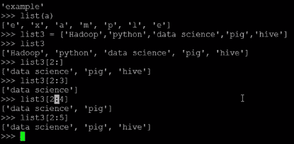
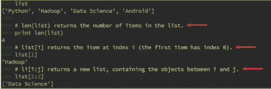

# 理解 Python 中的范围函数和序列

> 原文：<https://www.edureka.co/blog/understanding-range-function-and-sequences-in-python>

[//www.youtube.com/embed/MxrNwnt6O_E](//www.youtube.com/embed/MxrNwnt6O_E)

## **测距功能**

Range()生成包含等差数列的列表。

range()函数有三种变体:

>>范围(停止)–从 0 开始直到(停止–1)

>>范围(开始，停止)–结束于(停止–1)

>>范围(开始、停止、步进)–步进不能为 0，默认为 1

## **测距函数的例子**

**范围(stop)** :如果范围定义为 5，则只显示 0-5 范围内的数字列表。根据定义，默认情况下，它从 0 开始，在 5 之前停止。

**范围(开始，停止):**在此，开始点和停止点被定义。如下例所示，开始范围被定义为 5，而停止范围被定义为 10。因此，它将显示数字 5、6、7、8、9，范围在 5 到 10 之间。

**range(start，stop，step):** 这里定义的前两个值是相同的，start 和 stop，第三个是 step，意思是每两个连续数的差。例如，如果 range 是这样定义的:range(0，10，2)。它会给出 0 到 10 之间的数字，但相差 2，以这种方式:[0，2，4，6，8]。此处的步骤不能被赋予 0 值。它必须是 1 或大于 1。

## **Python 中的序列**

序列是由反映其类型的容器绑定在一起的一系列值。几乎你放入 Python 的每个流都是一个序列。

**序列的类型**

*   列表
*   元组
*   Xrange
*   线

Python 支持的一些序列是字符串、列表、元组和 Xrange 对象。Python 有一系列的方法和格式化操作，可以对其中的每一个执行。

## **列表**

*   列表是一种容器，以给定的顺序保存许多其他对象。
*   list 类型实现了 sequence 协议，它还允许您在序列中添加和删除对象。
*   它是用方括号括起来的一组有序的元素。

列表的简单定义–Li =[]

```
li = list() # empty list
li = list(sequence)
li = list(expression for variable in sequence)
```

****

## **访问列表元素**

要访问列表的元素:

```
n = len(li)
item = li[index] #Indexing
slice = li[start:stop] #Slicing
```

**例子**



## **列表索引**

list[i]返回索引 I 处的值，其中 I 是一个整数。负索引从列表末尾开始访问元素，向后计数。任何非空列表的最后一个元素总是 li[-1]。如果索引在列表之外，Python 会引发 IndexError 异常。

有问题要问我们吗？？在评论区提到它们，我们会给你回复。

**相关帖子**

[Python 中命令行参数](https://www.edureka.co/blog/command-line-arguments-in-python "Command Line Arguments in Python")

[巨蟒中的异常](https://www.edureka.co/blog/exceptions-in-python/ "Exception in Python")

[Python 101:Hello World 程序](https://www.edureka.co/blog/python-101-hello-world-program/ "Python 101: Hello World Program")

[今天就开始您的 Python 培训吧！](https://www.edureka.co/python-programming-certification-training)