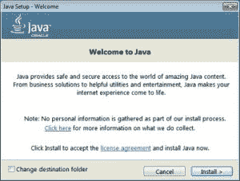
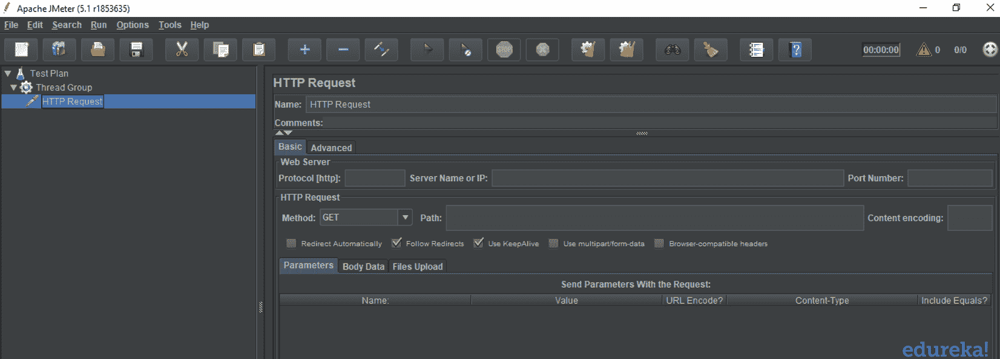
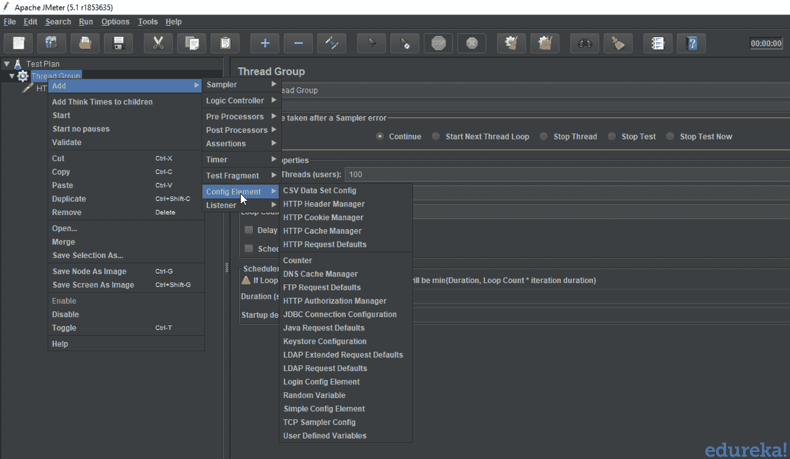

# JMeter 初学者教程:关于性能测试您需要知道的一切

> 原文：<https://www.edureka.co/blog/jmeter-tutorial/>

在过去的十年里，软件测试行业发生了翻天覆地的变化，让位给了更好的前景。确保软件应用程序的有效性能是很重要的，并且需要软件测试来确保应用程序运行时没有任何故障。这篇关于“JMeter 教程”的博客将按以下顺序提供关于分析和测量性能的负载测试工具的深入知识:

*   [什么是性能测试？](#performancetesting)
*   [什么是 JMeter？](#jmeter)
*   [JMeter 的优势](#jmeteradvantages)
*   [JMeter 教程](#jmetertutorial)

## **什么是性能测试？**

验证产品是否满足预期或要求的性能是非常重要的。不幸的是，我们在产品交付后才发现这个缺陷。但是现在，性能已经成为一个不可避免的因素，尤其是对于 web 和移动应用程序，因为每个应用程序的用户量都非常大。

性能测试被定义为一种[类型的软件测试](https://www.edureka.co/blog/types-of-software-testing/)，以确保软件应用程序在其预期的工作负载下运行良好。它关注软件程序的某些因素，例如:

*   **速度**–检查应用程序的响应是否快速。
*   **可扩展性**–它决定了最大用户负载。
*   **稳定性**–它检查应用程序在变化的负载下是否稳定。

现在让我们继续我们的“JMeter 教程”,并找出一些用于性能测试的最佳工具。

### **用于性能测试的工具**

性能测试在实时中是非常重要的，尤其是从客户满意度的角度来看。有几种可用的性能测试工具，例如:

*   阿帕奇 JMeter
*   负载运行器
*   WebLOAD
*   装载机队
*   LoadView
*   新负载

JMeter 是性能测试的首选工具之一。因此，让我们继续我们的“JMeter 教程”,了解更多关于特定测试工具的信息。

## **什么是 JMeter？**

Apache JMeter 是一个测试工具，用于分析和测量不同软件服务和产品的性能。这是一个纯 Java 开源软件，用于测试 Web 应用程序或 FTP 应用程序。

它用于执行 web 应用程序的性能测试、负载测试和功能测试。JMeter 还可以通过为 web 服务器创建大量虚拟并发用户来模拟服务器上的重负载。

**JMeter 如何执行测试？**

让我们看看 JMeter 在测试过程中执行的不同步骤:

1.  它创建一个请求并发送给服务器。
2.  它接收来自服务器的响应，收集它们，并在图表或图形中可视化这些细节。
3.  它处理来自服务器的响应。
4.  它以文本、XML、JSON 等多种格式生成测试结果，以便测试人员可以分析数据。

现在让我们继续我们的“JMeter 教程”,看看是什么让 JMeter 成为最受欢迎的测试工具之一。

## **JMeter 的优点**

Apache JMeter 开源软件通过简化测试过程填补了一大空白。JMeter 的一些优势包括:

****

**开源**–JMeter 是一款开源软件。这意味着它可以免费下载。它也是一个 100%纯 Java 应用程序。开发人员可以使用它的源代码，可以根据他们的要求修改和定制它。

****

**用户友好的**–JMeter 具有全面的 GUI，有助于创建测试计划和配置元素。添加元素也很容易。你只需要右击树形场景，然后添加你需要做的事情。

****

**支持**——基本上它是为性能测试而设计的，但也通过创建测试计划来支持其他非功能性测试，如压力测试、分布式测试、Web 服务测试等。

****

**综合文档**–这是需要强调的最重要的事情之一。由于其强大的文档，用户可以对每一个步骤有一个清晰的想法，从零开始，包括测试设置的安装和配置，并生成最终报告。

****

**记录**–JMeter 允许用户使用记录设备记录 HTTP/HTTPS 以创建测试计划。我们使用代理服务器，允许 JMeter 在您使用普通浏览器浏览 web 应用程序时观察和记录您的操作。

****

**报告**–JMeter 支持仪表板报告生成。通过 JMeter 生成大量的报告，帮助用户理解性能测试的执行结果。

## **JMeter 教程**

既然您已经知道什么是 JMeter，以及为什么我们更喜欢这个测试工具，让我们继续关注以下内容:

*   [JMeter 安装流程](#installjmeter)
*   [JMeter 的元素](#jmeterelements)

### **JMeter 安装流程**

让我们来看看 JMeter 安装过程中涉及的步骤:

**步骤 1–安装 Java**

JMeter 是纯 Java 桌面应用程序，它需要完全兼容的 JVM 6 或更高版本。您可以下载并安装最新版本的 Java SE 开发工具包。

您可以在命令提示符下检查安装是否成功。它将为您提供以下输出:

**步骤 2–下载 JMeter**

JMeter 的最新版本是 5.1。您可以下载任何二进制文件。

**步骤 3–安装 JMeter**

JMeter 的安装极其容易和简单。您只需将 zip/tar 文件解压到您希望安装 JMeter 的目录中。没有繁琐的安装屏幕需要处理。

如果使用的是 Window，只需运行文件 **/bin/jmeter.bat** 就可以在 GUI 模式下启动 JMeter:

现在你已经了解了 JMeter 的安装过程，让我们继续学习“JMeter 教程”,了解 JMeter 的不同元素。

## **JMeter 的元素**

JMeter 的不同组件被称为元素。每个元素都有特定的用途。一些主要因素是:

*   线程组
*   样品
*   听众
*   配置

**线程组** 线程组是线程的集合。每个线程代表一个使用被测应用程序的用户。它模拟一个真实的用户对服务器的请求。线程组的控件还允许您设置每个组的线程数量。

 例如，如果你设置线程数为 100，JMeter 将创建并模拟 100 个用户对被测服务器的请求。

### **采样器**

JMeter 支持测试 HTTP、FTP、JDBC 和更多的协议。线程组模拟用户对服务器的请求。采样器帮助线程组知道哪种类型的请求(HTTP、FTP 等。)它需要制造。 

*   **FTP 请求:**可以使用 JMeter 中的 FTP 请求采样器在 FTP 服务器上做性能测试。该控制器允许您向 FTP 服务器发送 FTP“下载文件”或“上传文件”请求。
*   这个采样器可以让你发送一个 HTTP/HTTPS 请求到一个 web 服务器。
*   **[JDBC](https://www.edureka.co/blog/advanced-java-tutorial) 请求:**这个采样器可以让您执行数据库性能测试。它向数据库发送一个 JDBC 请求。
*   BSF 取样器:这个取样器允许你使用 BSF 脚本语言编写一个取样器。
*   **访问日志采样器:**这个采样器允许你读取访问日志并生成 HTTP 请求。
*   **SMTP 采样器:**该采样器用于使用 SMTP 协议发送电子邮件消息。

### **听者**

监听器显示测试执行的结果。它们可以以不同的格式显示结果，如树、表、图或日志文件。

*   图形结果监听器在图形上显示服务器响应时间
*   查看结果树以基本 HTML 格式显示用户请求的结果
*   表格结果以表格形式显示测试结果的总结
*   日志在文本文件中显示测试结果的摘要

### **配置元素**

配置元素用于设置缺省值和变量，供采样器以后使用。 

*   **CSV 数据集配置:【TheCSV 数据集配置允许您从文本文件中读取不同的参数。它用于从文件中读取行，并将它们分成变量。**
*   **HTTP Cookie Manager:**HTTP Cookie Manager 具有与 web 浏览器相同的功能。如果您有一个 HTTP 请求，并且响应包含一个 cookie，那么 cookie 管理器会自动存储该 Cookie，以便在将来的所有请求中使用。
*   **HTTP 请求默认值:**这个元素允许您设置 HTTP 请求控制器使用的默认值。
*   **Login Config 元素:**log in Config 元素允许您添加或覆盖采样器中的用户名和密码设置。

*至此，我们结束了这个“JMeter 教程”博客。我希望你们喜欢这篇文章，并且理解什么是性能测试以及 JMeter 是如何工作的。*

*既然您已经了解了什么是 JMeter，那么就来看看由 Edureka 提供的使用 [JMeter 认证](https://www.edureka.co/jmeter-training-performance-testing)课程的**性能测试吧，Edureka 是一家值得信赖的在线学习公司，拥有遍布全球的 250，000 多名满意的学习者。本课程让您深入了解工作负载期间的软件行为。在本课程中，您将学习如何检查软件的响应时间和延迟，以及测试软件包是否能够高效扩展。本课程将帮助您检查强度并分析应用在不同负载类型下的整体性能。有问题要问我们吗？请在“JMeter 教程”的评论部分提到它，我们会给你回复。***