# ServiceNow ITSM 工具:为 ITSM 增添社交色彩

> 原文：<https://www.edureka.co/blog/servicenow-itsm-tools/>

您是否发现处理所有服务请求变得越来越困难？还停留在手工处理？如果我告诉你，ServiceNow 在云上提供了一个单一的记录系统来解决您所有的内部瓶颈，会怎么样？如果你不熟悉 ServiceNow，请随意阅读我之前的[博客](https://www.edureka.co/blog/what-is-servicenow/)。在今天的博客中，我们将通过深入探索信息技术服务管理(ITSM)领域来关注 ServiceNow ITSM 工具。我们将研究 ITSM 的理论概念，以及如何在 ServiceNow 平台上实现这些概念。

让我们大致了解一下 ServiceNow ITSM 工具博客所涵盖的主题。

*   [事件管理](#Incident_Management)
*   [问题管理](#Problem_Management)
*   [变更管理](#Change_Management)
*   [知识管理](#Knowledge_Management)
*   [ServiceNow 工具演示](#Tools_Demo)

在这篇 ServiceNow ITSM 工具博客中，我们将分别介绍 ITSM 的每一项服务。让我们从事故管理开始。

## **事件管理**

首先，让我们看看什么是 ServiceNow 中的事件。W 当用户面临一个问题并希望与支持团队取得联系时，首先需要做的是在用户表单中记录详细信息。 简单来说，一个事件就是一个用户或一组用户报告的任何问题，这些问题都有一个唯一的记录 ID。

为了更清楚地了解事故，让我们看一下事故管理中涉及的步骤:

### **第一步: 分类**

该问题可能与硬件、软件、网络或它们的任何可能组合有关。

**例子:**

1.  这台笔记本电脑停止工作了。这可能是由于底层硬件或软件问题。
2.  Wi-Fi 有性能问题。这可能是由网络问题或软件问题引起的。

### **第二步:优先级**

所报告的事件根据其优先级进行处理。 优先级是事件对组织的**影响**及其**紧急程度**的组合。

事件根据其各自的优先级别分为 P1、P2、P3、P4:

*   P1- **危急**
*   P2- **高**
*   P3- **温和**
*   P4- **低**
*   P5- **策划**

**举例:**

在组织级别具有高影响且时间紧迫的事件被视为 P1 级别或关键级别事件，而在用户级别具有正常时间表的低影响事件被归类为 P5 级别或计划级别事件。

除了解决 事件、 之外，避免相关事件并减少总体事件 量也很重要。这只能在发现潜在问题时进行。这就把我们带到了下一个话题问题管理。

## **问题管理**

问题管理处理识别事故的根本原因。 我们分析如何减轻或减少事故。 假设有许多关于电子邮件的事件。 我们可以执行根本原因分析来识别根本原因。

### **第一步:**识别并记录问题

IT 人员可以手动创建一个记录来记录“问题”， 或者我们可以关联到一个事件记录。

### **第二步:**更新&调查问题

更新可以通过电子邮件进行交流。我们选择入站电子邮件配置来实现这一点。

**【服务水平协议(SLA):** 用于分配任务的优先级以及监控团队进度。

**不活动跟踪器** : 我们可以创建事件，当问题在一定的时间间隔内没有被关注时触发这些事件。此事件可能是脚本或电子邮件通知。

### **第三步:**解决问题

问题解决后，与问题相关的事件将自动关闭。 如果我们找不到给定问题的解决方案，我们可以称之为已知错误，这样可以节省我们未来的时间。

对于那些不熟悉配置项的人来说，配置项(CI)是(配置管理数据库)CMDB 中的基本资产。

示例:工作站、服务器或商业服务

静态资产列表与 CMDB 的最大区别在于，我们映射配置项之间的**关系**。这就给我们带来了下一个话题**依赖** **观点** 。 依赖视图描述了不同配置项之间的关系。下图是依赖关系视图的一个示例。

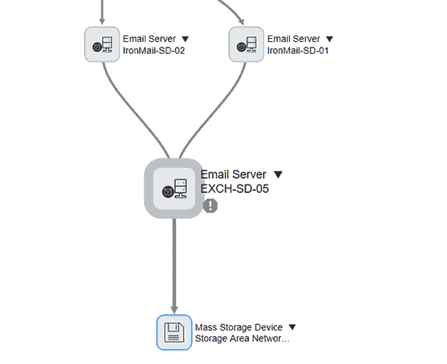

**图** ***:** ServiceNow ITSM 工具-依赖视图*

现在我们可以看到电子邮件交换服务器和各种电子邮件服务器之间的关系。 同样，San 存储设备也可以被检查。

接下来我们创建问题任务来识别受影响的区域。我们可以指定两个团队，分别负责网络和服务器领域。 由于事件至关重要，在特定服务器修复之前，我们需要一个临时解决方案，如备用服务器。为了永久解决问题 ，可能需要服务器团队提供软件补丁来修复邮件服务器。

一旦发现问题，我们需要解决导致问题的问题。这就把我们带到了下一个话题，即变革管理。

## **变革管理**

变更管理是提议的变更和反映的变更的生命周期。报告事故后，我们会创建问题并进行根本原因分析。我们根据给定的情况进一步创建变更请求。然后计划变更任务，并在完成后关闭/解决与其相关的事件和问题。

变更请求可分为标准变更请求和紧急变更请求。标准变更需要书面批准，并有一套适当的程序，而对于紧急变更，口头沟通就足够了。

工作流用于描述变更请求生命周期中从启动到批准的各个阶段。下图对此进行了描述。

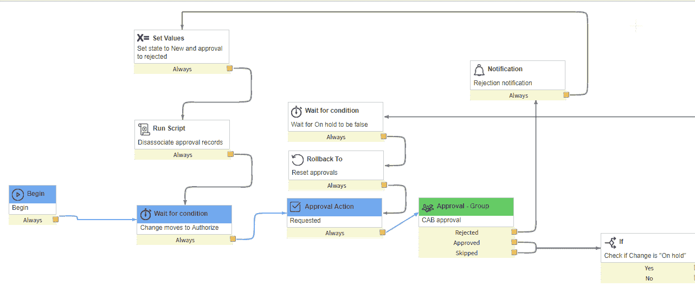

**图*****:**service now ITSM 工具–变更请求工作流程*

拥有一个包含以前的支持查询和与平台相关的文章的文件库是非常有益的。这就引出了我们的下一个主题知识管理。进一步了解这项服务现在 ITSM 工具博客让我们来看看知识管理。

## **知识管理**

ServiceNow 附带一个知识库，其中包含文章、常见问题解答和故障排除。这是跨越几个类别的大量信息。谁可以向知识库添加文章？所有者或管理者能够添加知识文章以及有权向知识库添加信息的贡献者。管理员也可以对知识库做出贡献。

在我们的 ServiceNow ITSM 工具博客中，让我们了解一下 ServiceNow 平台中的知识文章生命周期。

### **发表文章**

当作者发表他的文章时，可能有两种不同的情况:

如果配置了**批准发布工作流**，则文章进入**草稿**状态，该状态将被转发给审阅者，审阅者可以批准或拒绝文章。

如果配置了**即时发布工作流**，则文章会立即发布并出现在知识库中。

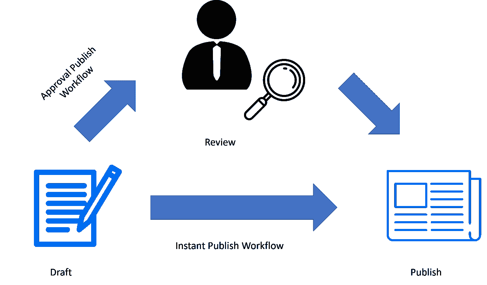

**图** ***:** ServiceNow ITSM 工具-发布文章*

### **退休篇**

如果文章不再有用，可以将其从知识库中删除。这个过程被称为退休。

如果实施了**批准撤销工作流**，则文章将进入待定撤销状态，知识库的所有者需要批准其撤销。

如果实施了**即时退出工作流程**，那么文章将跳过审核，直接进入退出阶段。一旦文章过期，它就不会出现在知识库中。但是，文章仍然驻留在系统中，并且可以在需要时恢复到草稿状态。

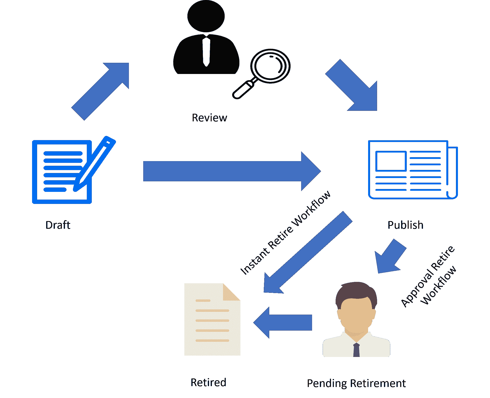 **图*****:**service now ITSM 工具-退役篇* 

现在您已经熟悉了 ITSM 概念，让我们继续探索 ServiceNow 提供的不同 ITSM 工具。

你甚至可以通过 ITIL 认证查看 ITIL 的详细信息。

## **ServiceNow ITSM 工具演示**

我们现在将深入了解 ServiceNow ITSM 工具。我将带您经历从创建事件开始的整个生命周期，然后执行根本原因分析，以避免将来发生此类事件。我们还将了解解决问题和事件所需的变更请求流程。我还将向您展示如何将问题作为一篇文章导出到知识库。

### **第一步:**创建事件

按照以下说明在 ServiceNow 平台中创建一个事件

****

我们创建一个事件记录来报告问题**电子邮件服务**不工作。该记录包含任务受理人、对组织的影响、受影响的业务服务和配置项目、紧急程度以及问题描述。下图描述了同样的情况。

### **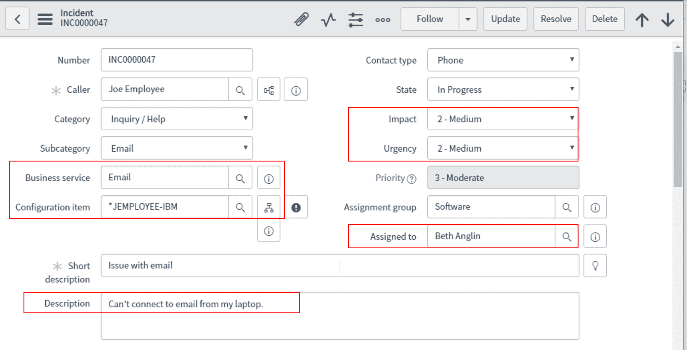第二步:**做题

为了执行根本原因分析，我们通过单击事件属性选项卡创建一个问题，如下所示。

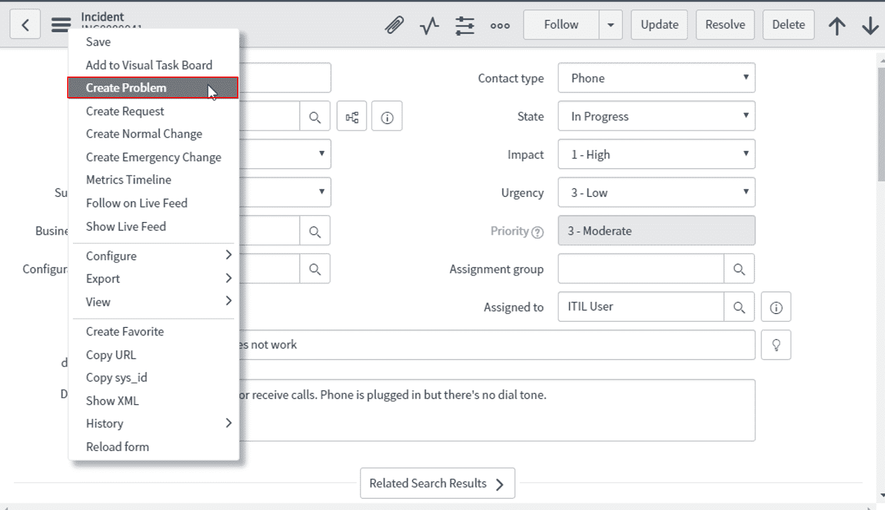

查看依赖关系视图后，我们可以继续创建问题任务，并将其分配给特定的组或用户。

在我们的例子中，在根本原因分析后确定的问题发现了一个受损的网络适配器，因此我们将问题任务分配给网络组，并将弗雷德·乐迪分配为关联用户。

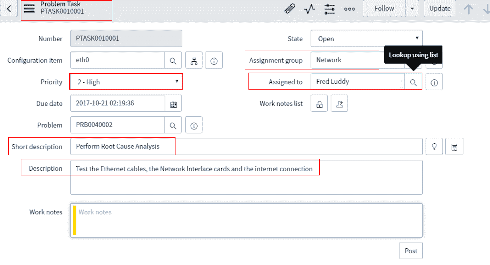

## **第三步:**变更请求

一旦问题被识别，任务受派者就决定是否需要变更请求来解决问题。一旦变更请求启动，问题状态就会变更为“待定”。

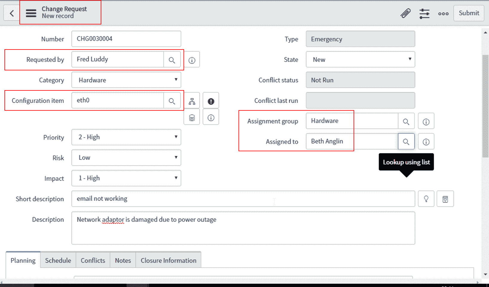

在我们的例子中，被分配人弗雷德·乐迪处理更换 识别的网络适配器的变更请求。

### **第四步:** 关闭问题和事件

一旦变更请求完成/关闭，所有相关问题都会自动解决。

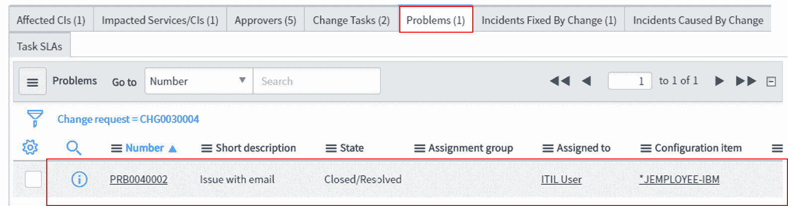

所有相关事件在一天后自动关闭。我们也可以通过将**状态**参数设置为已关闭/已解决来手动关闭它们。

**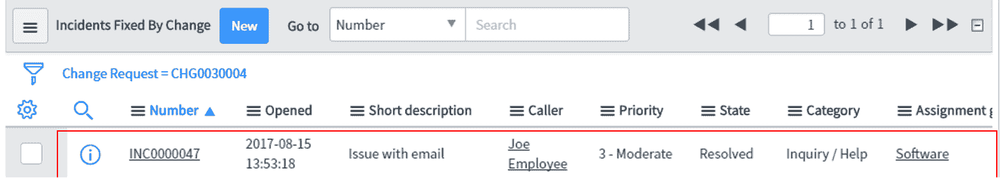**

### **第五步 :** 向知识库导入问题

我们可以直接从问题记录的填写表格中提取信息。这可以作为一篇文章添加到知识库中，为将来可能遇到相同问题的用户提供支持。

为了实现这一点，我们打开相关的问题记录并悬停到**帖子知识**选项。

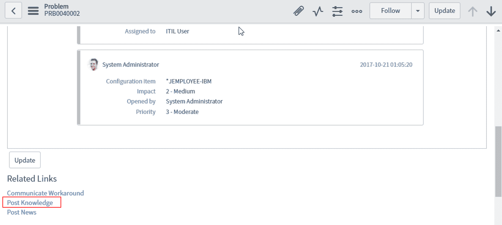

在下图中，我们可以看到已经添加了知识文章，并且还列出了相关问题。

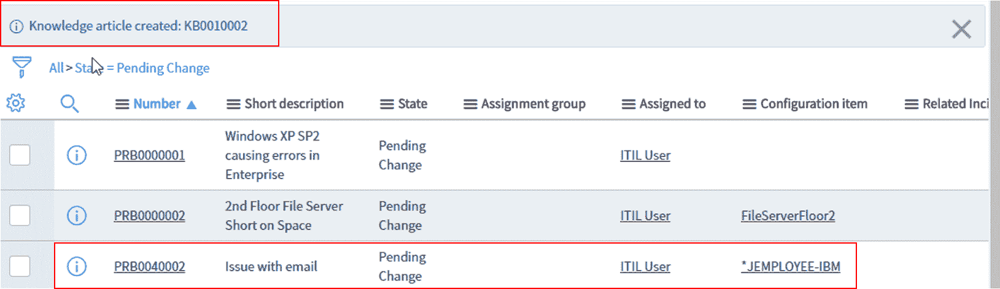

它目前处于草稿状态，将在批准后发布到知识库。

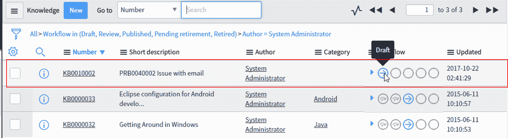

今天的博客到此结束。我相信您已经了解了 ServiceNow ITSM 工具是如何带有消费主义色彩的。这种现象在社交媒体应用中很普遍，然而在 ITSM 和 T2 已经存在很长时间了。ServiceNow 旨在将我们在日常任务中体验到的易用性复制到组织内部的支持任务中。

*如果您觉得“ **ServiceNow ITSM 工具”**上的这篇博客很有用，请查看由 Edureka 提供的 [ServiceNow 管理认证](https://www.edureka.co/blog/servicenow-itsm-tools/)课程，edu reka 是一家值得信赖的在线学习公司，在全球拥有超过 250，000 名满意的学习者。本课程将为您提供对 ServiceNow 平台的全面深入了解，包括管理功能和自动化工作流。*

*有问题吗？请在评论区提到它，我们会给你回复。*