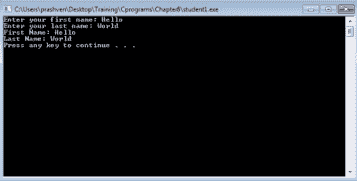
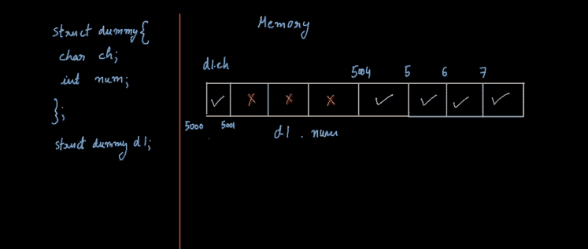
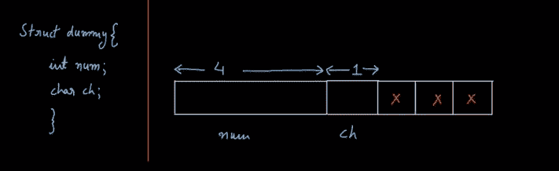

# 理解 C 语言中的结构和填充

> 原文：<https://www.edureka.co/blog/understanding-structures-and-padding-in-c/>

[//www.youtube.com/embed/l_usJK7b6OI](//www.youtube.com/embed/l_usJK7b6OI)

## **C 中结构的定义:**

结构是不同类型的多个变量的集合。结构用于创建用户定义的数据类型，作为其他数据类型的集合。例如，地球上位置的坐标由纬度和经度组成。让我们看看它的语法；

```
Struct coord{
Float latitude;
Char lat_direction;
Float longitude;
Float long_direction;
};
```

上述语法声明了一个新的用户定义的数据类型‘struct coord ’,它可用于存储坐标。

## **使用结构的例子:**

```
#include<stdio.h>
struct name {
char fname[50];
char lname[50];
};
int main()
{
struct name student;
printf(“Enter your first name:”);
gets(student.fname);
printf(“Enter your last name:”);
gets(student.lname);
printf(“First Name:%s
”,student.fname);
printf(“Last Name:%s
”, student.lname);
system(“PAUSE”);
Return 0;
}
```

让我们编译并运行程序。

输入名字和姓氏。输出如下所示:



## **C 中的结构填充:**

许多处理器都希望根据变量的大小来调整变量的内存。一个 1 字节的“char”可以分配在内存中的任何位置，如 0x5000 或 0x5001。和 4 字节的“int”必须从像 0x5004 或 0x5008 这样的 4 字节边界开始。结构填充由编译器自动完成，以确保其所有成员都是字节对齐的。

由于结构填充，以下结构的大小为 16 字节:

```
Struct dummy {
Char ch;
Int num;
Double temp;
}
```

这里的“char”只有 1 个字节，但经过 3 个字节的填充后，数字从 4 个字节的边界开始。对于' int '和' double '，分别占用 4 和 8 个字节。



编译器使用 3 个浪费的字节(用红色标记)来填充结构，以便所有其他成员都是字节对齐的。现在，结构的大小是 4 + 1 +3 = 8 字节。整个结构的大小是 8 个字节。知道了结构化的填充，重新设计或重写结构就容易了。

让我们看另一个语法略有不同的例子；



```
#include<stdio.h>
Struct dummy {
Int num;
Double x;
Float f;
};
Struct dummy1 {
Double x;
Int num;
Float f;
};
Int main()
{
Printf(“size:%d %d
”, sizeof(struct dummy ), sizeof(struct dummy1));
System(“PAUSE”);
Return 0;
}
```

输出如下所示；

*有问题吗？请在评论区提及它们，我们将会回复您。*

**相关帖子:**

[指针在 C](https://www.edureka.co/blog/pointers-in-c/ "Pointers in C")

[C 编程入门——算法](https://www.edureka.co/blog/introduction-to-c-programming-algorithms/ "Introduction to C Programming-Algorithms")