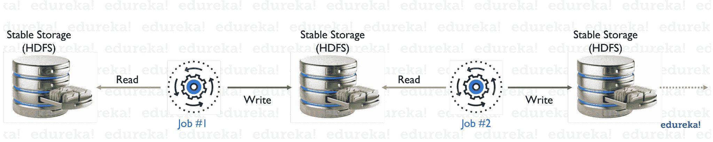
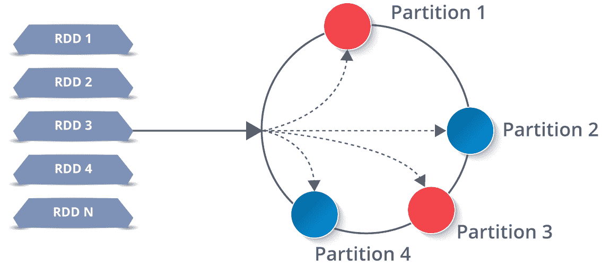
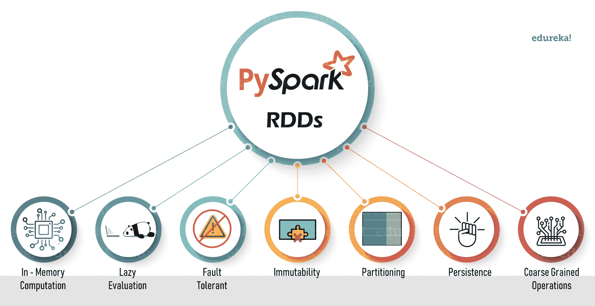
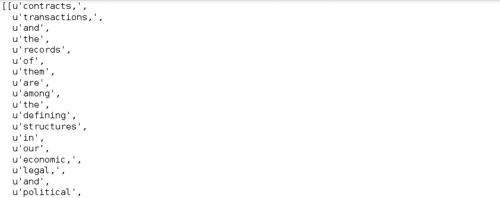
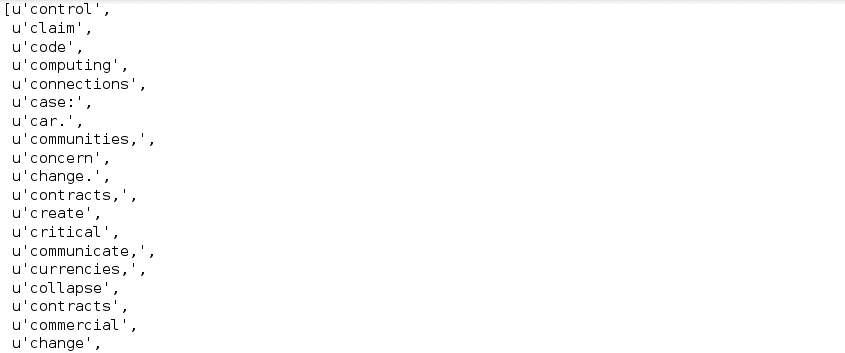
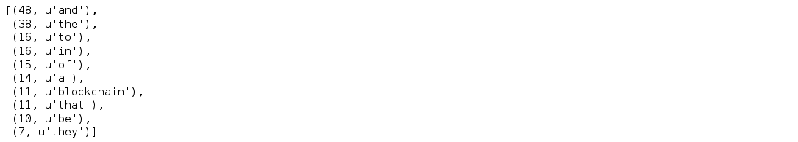
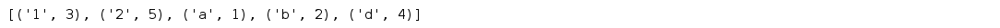
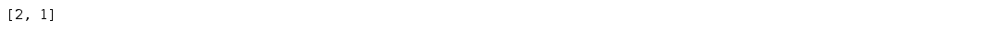
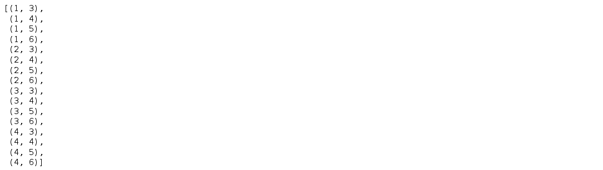
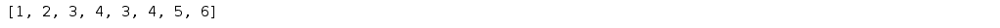

# PySpark 中的 rdd——PySpark 的构建模块

> 原文：<https://www.edureka.co/blog/pyspark-rdd/>

在大数据分析方面，Apache Spark 是最好的框架之一。这项强大的技术刚与 Python 这样简单而高效的语言集成，就给了我们一个极其方便易用的 API，叫做 PySpark。 在本文中，我将介绍 PySpark 的 *构建模块* 中的一个，称为 **弹性分布式数据集** 或更通俗地称为 **PySpark RDD** 。

学完本 PySpark RDD 教程后，您将对以下主题有所了解:

*   [为什么是 RDDs？](#whyrdd)
*   [什么是 PySpark RDDs？](#whatarerdd)
*   [RDDs 的特性](#rddfeatures)
*   [RDD 在 PySpark](#rddoperations) 作战
*   [PySpark RDD 用例](#rddusecase)

## **为什么是 RDDs？**

迭代分布式计算，即在多个作业上处理数据需要在它们之间重用和共享数据。在 rdd 出现之前，像 Hadoop 这样的框架在处理多个操作/任务时面临困难。此外，还需要一个稳定的分布式中间数据存储，比如 HDFS 或亚马逊 S3。这些用于**数据共享的媒体**帮助执行各种计算，如逻辑回归、K 均值聚类、页面排名算法、特别查询等。但是没有什么是免费的，数据共享会导致数据处理速度变慢，因为需要多次 I/O 操作，比如复制和序列化。这个场景描述如下:



因此，需要一种能够通过数据共享克服多个 I/O 操作的问题并减少其数量的方法。这就是 **RDDs** 的确切位置。

*您可以浏览 PytSpark RDDs 的网上研讨会录像，我们的讲师已经用各种例子详细解释了这些主题。*

## **PySpark RDD 教程| PySpark 在线培训| Edureka**


[//www.youtube.com/embed/e5ol7oyKV0A?rel=0&showinfo=0](//www.youtube.com/embed/e5ol7oyKV0A?rel=0&showinfo=0)

*本视频将为您提供详细而全面的 RDD 知识，它被认为是 Apache Spark 的支柱。*

## **什么是 PySpark RDDs？**

弹性分布式数据集(RDDs)是一种分布式内存抽象，帮助程序员在大型集群上以容错方式执行内存计算。

rdd 被认为是 PySpark 的 ***骨干。它是基本的无模式数据结构的先驱之一，可以处理结构化和非结构化数据。内存中的数据共享使 RDDs **比网络和磁盘共享快 10-100 倍**。***

现在你可能想知道它是如何工作的。嗯，RDD 中的数据是根据一个键分割成块的。rdd 具有很高的弹性，也就是说，当相同的数据块在多个执行器节点上复制时，它们能够从任何问题中快速恢复。因此，即使一个执行器节点失败，另一个仍将处理数据。这允许您通过利用多个节点的能力，非常快速地对数据集执行函数计算。

此外，一旦你创建了一个 RDD，它就变成了。我所说的不可变的意思是，一个对象的状态在它被创建后不能被修改，但是它们肯定可以被转换。

在我继续阅读 PySpark RDD 教程之前，让我先介绍几个 PySpark 更有趣的特性。

## **RDDs 的特性**



1.  ***内存计算** :* 它将性能提高了一个数量级。
2.  ***惰性评估**:*rdd 中的所有转换都是惰性的，即不立即计算结果。
3.  ***容错** :* RDDs 跟踪数据血统信息，自动重建丢失的数据。
4.  ***不变性** :* 数据可以随时创建或检索，一旦定义，其值不可更改。
5.  ***划分** :* 它是 PySpark RDD 中并行的基本单位。
6.  ***持久性** :* 用户可以重用 PySpark RDDs，并为其选择存储策略。
7.  ***粗粒度操作** :* 这些操作通过 map 或 filter 或 group by 操作应用于数据集中的所有元素。

在 PySpark RDD 教程的下一部分，我将向您介绍 PySpark RDDs 提供的各种操作。

## **RDD 在 PySpark 的作战**

RDD 支持两种类型的操作，即:

1.  ***变换** :* 这些是应用于 RDD 创建新 RDD 的操作。转换遵循**惰性评估**的原则(这意味着直到一个动作被触发，执行才会开始)。这允许您在任何时候通过调用数据上的操作来执行操作。RDDs 提供的一些转换是:
    *   地图
    *   平面图
    *   过滤器
    *   截然不同的
    *   减少 ByKey
    *   地图分区
    *   排序依据
2.  ***动作** :* 动作是应用在 RDD 上的操作，用于指示 Apache Spark 应用计算并将结果返回给驱动程序。几个动作包括:
    *   收藏
    *   收藏地图
    *   减少
    *   计数键/计数值
    *   乘
    *   第一次

让我来帮你在 PySpark 中创建一个 RDD，并对其进行一些操作。

### **创建并显示 RDD**

```
myRDD = sc.parallelize([('JK', 22), ('V', 24), ('Jimin',24), ('RM', 25), ('J-Hope', 25), ('Suga', 26), ('Jin', 27)])
myRDD.take(7)

```

****

### **从文本文件中读取数据并显示前 4 个元素**

```
New_RDD = sc.textFile("file:///home/edureka/Desktop/Sample")
New_RDD.take(4)

```


### **改变最小分区数，将字符串列表中的数据映射到列表列表中**

```
CSV_RDD = (sc.textFile("file:///home/edureka/Downloads/fifa_players.csv", minPartitions= 4).map(lambda element: element.split("	")))
CSV_RDD.take(3)

```


### **统计 RDD 的总行数**

```
CSV_RDD.count()
```


### **创建函数将数据转换成小写并拆分**

```
def Func(lines):
lines = lines.lower()
lines = lines.split()
return lines
Split_rdd = New_RDD.map(Func)
Split_rdd.take(5)
```



### **用展平的数据创建一个新的 RDD，f 从整个 RDD** 中过滤掉“停用词”

```
stopwords = ['a','all','the','as','is','am','an','and','be','been','from','had','I','I’d','why','with']
RDD = New_RDD.flatMap(Func)
RDD1 = RDD.filter(lambda x: x not in stopwords)
RDD1.take(4)

```


### **过滤以‘c’开头的单词**

```
import re
filteredRDD = RDD.filter(lambda x: x.startswith('c'))
filteredRDD.distinct().take(50)
```



### **将数据按键分组，然后排序**

```
rdd_mapped = RDD.map(lambda x: (x,1))
rdd_grouped = rdd_mapped.groupByKey()
rdd_frequency = rdd_grouped.mapValues(sum).map(lambda x: (x[1],x[0])).sortByKey(False)
rdd_frequency.take(10)
```



### **用键值对创建 rdd**

```
a = sc.parallelize([('a',2),('b',3)])
b = sc.parallelize([('a',9),('b',7),('c',10)])
```

**对 RDDs** 执行 Join 操作

```
c = a.join(b)
c.collect()
```


### **创建一个 RDD，执行 lambda 函数，得到 RDD** 中元素的和

```
num_rdd = sc.parallelize(range(1,5000))
num_rdd.reduce(lambda x,y: x+y)
```

###  **使用 ReduceByKey 变换减少数据**

```
data_keydata_key = sc.parallelize([('a', 4),('b', 3),('c', 2),('a', 8),('d', 2),('b', 1),('d', 3)],4)
data_keydata_key.reduceByKey(lambda x, y: x + y).collect()
```


### **将数据保存在文本文件中**

```
RDD3.saveAsTextFile("file:///home/edureka/Desktop/newoutput.txt")
```

### **根据一个键对数据进行排序**

```
test = [('a', 1), ('b', 2), ('1', 3), ('d', 4), ('2', 5)]
sc.parallelize(test).sortByKey(True, 1).collect()
```

****

### **执行设定操作**

```
##Creating two new RDDs

rdd_a = sc.parallelize([1,2,3,4])
rdd_b = sc.parallelize([3,4,5,6])

```

*   **路口**

```
rdd_a.intersection(rdd_b).collect()
```


*   **减法**

```
rdd_a.subtract(rdd_b).collect()
```



*   **笛卡尔**

```
rdd_a.cartesian(rdd_b).collect()
```



*   **联盟**

```
rdd_a.union(rdd_b).collect()
```



#### 订阅我们的 YouTube 频道了解更多..！