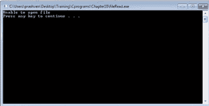
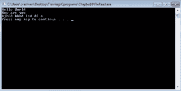

# C 语言中的文件操作

> 原文：<https://www.edureka.co/blog/file-operations-in-c/>

[//www.youtube.com/embed/_ChkXLOabZw](//www.youtube.com/embed/_ChkXLOabZw)

File 是在' stdio.h '中定义的用于处理文件操作的结构。可以进行各种操作，如打开文件读/写文件和关闭文件。上述操作可以如下图所示进行:

**打开文件:**

*   打开文件的语法是: File* fopen(char* name，char * mode)；
*   打开文件“名称”并返回文件指针。
*   ‘模式’的值为‘r’、‘w’和‘a’。
*   如果无法打开文件，fopen 返回 NULL。
*   如果文件不存在，fopen 将创建文件，如果模式为‘w’或‘a’。

**读取/写入文件:**

读取或写入字符的语法如下所示:

*   读取单个字符–int getc(FILE * FP)；
*   写单个字符–int putc(intc，FILE * FP)；

**关闭一个文件**–int fclose(File * FP)；

## **示例——打开文件:**

```
#include<stdio.h>
int main()
{
                FILE* fp;
                char ch;
                fp-fopen(“test.txt”, “r”);
                do
{
ch=getc(fp);
printf(“%c”,ch);
}
while(ch !=EOF);
fclose(fp);
printf(“
”);
system(“PAUSE”);
return 0;
}
```

下面是文件“test.txt”。

在编译和运行程序时，会获得以下输出。


**程序–当试图打开一个不存在的文件时:**

如果没有名为“test1”的文件，程序将返回值 NULL。在这种情况下，它需要返回消息“无法打开文件”

```
#include<stdio.h>
int main()
{
                FILE* fp;
                char ch;
                fp-fopen(“test1.txt”, “r”);
if (fp == NULL)
{
                printf(“Unable to open file
”);
                system(“PAUSE”);
                Return 0;
}
                do
{
ch=getc(fp);
printf(“%c”,ch);
}
while(ch !=EOF);
fclose(fp);
printf(“
”);
system(“PAUSE”);
return 0;
}
```

在编译和运行时，输出如下所示:



## **将字符放入文件:**

**例 1:**

```
#include<stdio.h>
int main()
{
                FILE* fp;
                char ch;
                fp-fopen(“test1.txt”, “r”);
if (fp == NULL)
{
                printf(“Unable to open file
”);
                system(“PAUSE”);
                Return 0;
}
                do
{
ch=getc(fp);
putc(ch,stdout);
}
while(ch !=EOF);
fclose(fp);
printf(“
”);
system(“PAUSE”);
return 0;
}
```

输出如下所示；



**例 2:**

```
#include<stdio.h>
int main()
{
                FILE* fp1,*fp2;
                char ch;
                fp1=fopen(“test1.txt”, “r”);
if (fp1 == NULL)
{
                printf(“Unable to open file
”);
                system(“PAUSE”);
                Return 0;
}
fp2=fopen(“dest1.txt”, “w”);
if (fp2 == NULL)
{
printf(“Unable to open file
”);
                system(“PAUSE”);
                Return 0;
}
                while((ch =getc(fp1)) != EOF)
{
putc(ch,fp2);
}
fclose(fp1);
printf(“
”);
system(“PAUSE”);
return 0;
}
```

运行和编译程序时，将使用文件夹中文件“test1”中的内容创建一个名为“dest1”的文件。

有问题要问我们吗？请在评论区提及它们，我们将会回复您。

**相关帖子:**

[C &数据结构训练](https://www.edureka.co/blog/c-data-structures)

[在 C 中冒泡排序](https://www.edureka.co/blog/bubble-sort-algo-in-c/ "Bubble Sorting in C")

[理解 C 中的结构和填充](https://www.edureka.co/blog/understanding-structures-and-padding-in-c/ "Understanding Structures and Padding in C")