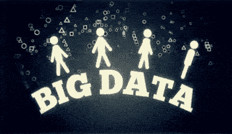

# 数据科学 vs 大数据 vs 数据分析

> 原文：<https://www.edureka.co/blog/data-science-vs-big-data-vs-data-analytics/>

我们生活在一个数据驱动的世界。事实上，现有的数字数据量正在快速增长，每两年翻一番，并改变着我们的生活方式。现在 Hadoop 和其他框架已经解决了存储的问题，对数据的主要关注已经转移到处理这种巨大的数据量上。当我们谈论数据处理时，人们可能会想到数据科学、大数据和数据分析，但它们之间一直存在混淆。

在这篇关于数据科学与大数据和数据分析的文章中，我将介绍以下主题，以便让您了解它们之间的相似之处和不同之处。

## **数据科学导论，大数据，&数据分析**

让我们首先了解数据科学、大数据和数据分析这几个术语。

### **什么是数据科学？**

数据科学融合了各种工具、算法和机器学习原理，目标是从原始数据中发现隐藏的模式。

它还涉及以各种方式解决问题以获得解决方案，另一方面，它涉及使用各种原型、算法、预测模型和定制分析来设计和构建数据建模和生产的新流程。您还可以通过在未来几年的运营中整合数据科学技术来预测业务的增长，预测潜在的问题，并根据数据制定战略以取得成功。参加[数据科学课程](https://www.edureka.co/masters-program/data-scientist-certification)，这是开启你在数据科学领域职业生涯的最佳机会。

### **什么是大数据？**

大数据是指从各种数据源涌入的大量数据，具有不同的格式。它可以用来分析洞察力，从而做出更好的决策和战略性业务举措。

### **什么是数据分析？**

数据分析是一门检查原始数据的科学，目的是得出关于该信息的结论。这一切都是为了从数据中发现有用的信息来支持决策。这个过程包括检查、清理、转换&建模数据。

<figure id="attachment_67458" aria-describedby="caption-attachment-67458" style="width: 391px" class="wp-caption aligncenter">

<figcaption id="caption-attachment-67458" class="wp-caption-text">                                     [Source: ibm.com]</figcaption>

</figure>

#### 订阅我们的 YouTube 频道获取新的更新...