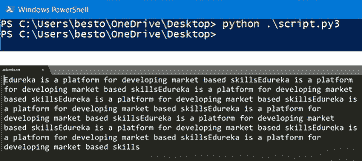
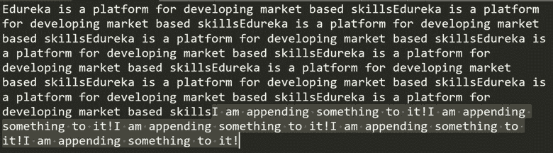

# 关于 Python 中的文件处理，您需要知道的是

> 原文：<https://www.edureka.co/blog/file-handling-in-python/>

[Python](https://www.edureka.co/blog/python-tutorial/)——截至*stack overflow*调查结果，毫无争议的 2018 最苛刻编程语言。在包括[数据科学](https://www.edureka.co/blog/data-science-tutorial/)、[机器学习](https://www.edureka.co/blog/machine-learning-tutorial/)、简写语法样式等等在内的所有原因中，最显著的特点就是文件处理。所有这些对文件的写入和读取都可以通过 Python 轻松完成。 够好奇这是怎么做到的？让我们按照以下顺序从这个关于*Python 中* 文件处理的教程开始:

*   [Python 简介](#what)
*   [Python 中文件处理的重要性](#importance)
*   [文件处理:打开](#opening)
*   [如何写入文件？【T2](#write)
*   [文件处理:追加并关闭文件](#closing)

## **Python 简介**

Python 是一种高级的面向对象的编程语言。它是 1991 年由 *圭多·范·罗森* 研发的。它的语法类似于英语，这就是它增强代码可读性的原因。它使用缩进来定义循环 if-else 结构、类等的范围。


Python 可以用来创建服务器端应用程序。

*   Python 可以帮助使用脚本实现任务自动化。

*   Python 用于创建独立的应用程序。

*   Python 用于大数据、数据科学、机器学习……

实际上，这个清单可以一直列下去。这定义了 Python 作为编程语言的强大之处。因此，学习如何使用 python 写入文件，然后从同一个文件中读取变得非常重要。

## **Python 中文件处理的重要性**

这个问题一定卡住你的脑袋了吧？为什么对这种简单的事情如此关注和强调。

让我们举个例子，假设你想让你的 python 脚本从互联网上获取数据，然后处理这些数据。现在，如果数据很小，那么每次运行脚本时都可以进行这种处理，但是如果数据很大，就不能进行重复处理，因此需要存储处理后的数据。这就是数据存储或写入文件的切入点。将数据写入文件时需要注意的一点是，应该保持数据的一致性和完整性。

一旦你将数据存储在一个文件中，现在最重要的事情就是它的检索，因为在计算机中，数据是以 1 和 0 的形式存储的，如果检索不当，数据就会变得完全无用，也就是说数据被破坏了。

因此，写和读也是 python 中文件处理的重要方面。

**如何用 Python 写文件？**

让我们举个例子来理解 Python 中文件处理的标准步骤。

*   打开文件进行写入。
*   追加和写入文件。
*   关闭文件

## **文件处理:打开**

考虑一本你想写的书。首先，你需要打开那本书，这样你就可以在上面写字了。不是吗？

这里也是一样，首先，你需要打开文件，这样你就可以写入它。所以在 python 中打开一个文件，我们使用下面的**语法**

```
object = open(file_name, mode)
```

open 函数返回你打开的文件的实例。它主要有两个参数，文件名和模式。有四种不同的模式可以打开文件:

1.  【r】=如果要从文件中读取。

2.  【w】=如果你想写入一个文件完全擦除以前的数据。

3.  "a" =如果你想追加到先前写好的文件中。

4.  【x】=如果你只想创建一个文件。

另外用来指定文件类型的模式是:

1.  【t】=文本文件，默认值。

2.  【b】=二进制文件。例如图像。

**例如:**

```
fp = open(“my_file.png”, “rb”)
```

这将打开一个名为 my_file.png 的二进制文件。

## **用 Python 写文件**

若要先写入文件，您必须以写入模式打开它，然后才能写入。但是，需要注意的是，所有之前写入的数据都将被覆盖。

对于这个例子，让我们做一个文件名*edu reka . txt*并用 python 写进去。

```
fp = open(“edureka.txt”, “wt”)
for _ in range(10):
	fp.write(“Edureka is a platform for developing market based skills”)
fp.close()

```

如你所见，为了写入一个文件，我首先打开了一个名为 edureka.txt 的文件，并将它的实例保存在变量 fp 中。现在，我运行了一个循环 10 次，将“Edureka 是一个开发基于市场的技能的平台”写入该文件 10 次。现在，为了更好地进行编程，您必须关闭所有打开的文件。

这里需要注意的一点是，要将文本写入文件，您必须以文本模式(“t”)打开它。如果您正在处理二进制文件，请在打开文件时使用“b”。



现在让我们写入一个二进制文件，写入二进制文件时要记住的第一件事是数据在写入前要转换成二进制格式。此外，二进制数据不是人类可读的，因此你不能通过简单地打开一个文件来阅读它。

```
fp = open(“binaryFile”, “wb”)
Data = [1,2,3]
fp.write(bytearray(Data))
fp.close()
```

在这里你可以看到我首先打开了 *二进制文件* 将我的数据写入其中。假设我有一个信息数组要写入一个文件(在本例中为 *数据* )那么首先我通过使用函数*bytearray()*将数据转换为二进制格式。然后，最后，我合上了文件。

## **附加到文件**

现在，大多数情况下你会在不破坏先前内容的情况下写入一个文件。在保存以前内容的同时写入文件称为追加到文件。

在这个例子中，让我们附加到我们已经创建的同一个文件中。让我们追加到 *edureka.txt*

```
fp = open(“edureka,txt”, “at”)
for _ in range(5):
	fp.write(“I am appending something to it!”)
fp.close()
```

在上面的例子中，你可以看到我已经使用 append 模式打开了一个名为 edureka.txt 的文件。这告诉 python 不要覆盖数据，而是从最后一行开始写。所以它现在要做的是，在结束行之后，它会加上“我正在给它添加东西！”5 次。然后我们关闭了那个文件。



**关闭文件**

嗯，我已经展示了如何关闭一个文件。只需使用 python 中的*file _ reference . close()*关闭一个打开的文件即可。

例如:

```
fp = open(“edureka,txt”, “at”)
# Do some work!
fp.close()
```

现在，为什么我一直强调关闭一个文件？

所以有很多原因:

*   如果一个文件被打开以执行任何操作，那么它将被锁定以被任何其他资源打开，直到进程本身关闭它。
*   操作系统会检查一个程序打开的文件的数量，因此在使用后关闭文件可以让你保持在这个限制内。
*   有效的资源管理。
*   良好的编程实践。

至此，我们结束了 Python 文章中的文件处理。我希望你已经理解了在 Python 中打开、读/写和最后关闭一个文件。

*要深入了解 Python 及其各种应用，您可以 [**在此**](https://www.edureka.co/python/) 注册参加在线直播培训，全天候支持，终身访问。*

*有问题吗？在“Python 中的文件处理”的评论部分提到它们，我们将会回复您。*