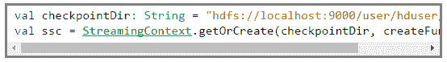
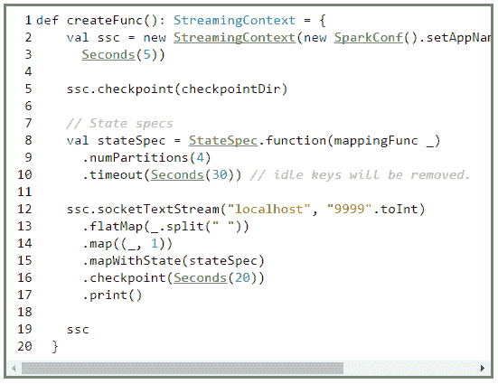
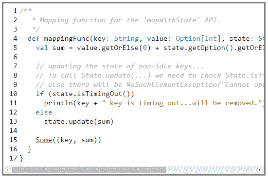

# Apache Spark 流中的累积状态转换

> 原文：<https://www.edureka.co/blog/apache-spark-cumulative-stateful-transformation/>

*供稿:Prithviraj Bose*

在我以前的博客中，我已经讨论了使用 Apache Spark 流的窗口概念的有状态转换。你可以在这里 读到 [。](https://www.edureka.co/blog/stateful-transformations-with-windowing-in-spark-streaming/)

在这篇文章中，我将讨论 Apache Spark 流中的累积状态操作。如果你是 Spark Streaming 的新手，那么我强烈建议你阅读我以前的博客，以便理解窗口是如何工作的。

### 火花流中状态转换的类型(续…)

### >累计跟踪

我们已经使用了***reduceByKeyAndWindow(…)***API 来跟踪键的状态，但是窗口对某些用例有限制。如果我们想累积所有键的状态，而不是将其限制在一个时间窗口内，该怎么办？在这种情况下，我们需要使用***updateStateByKey(…)***API。

这个 API 是在 Spark 1.3.0 中引入的，并且一直非常流行。然而，这个 API 有一些性能开销，随着状态大小的增加，它的性能会降低。我写了一个示例来展示这个 API 的用法。你可以在这里找到代码 [。](https://github.com/prithvirajbose/spark-dev/blob/master/src/main/scala/examples/streaming/TestUpdateStateByKey.scala)

Spark 1.6.0 引入了新的 API***mapWithState(…)***，解决了***updateStateByKey(…)***带来的性能开销。在这篇博客中，我将使用我写的一个示例程序来讨论这个特定的 API。你可以在 这里找到 [的代码。](https://github.com/prithvirajbose/spark-dev/blob/master/src/main/scala/examples/streaming/TestMapWithState.scala)

在我开始代码演练之前，让我们先简单介绍一下检查点。对于任何有状态转换，检查点是强制性的。检查点是一种在驱动程序失败时恢复密钥状态的机制。当驱动程序重新启动时，键的状态将从检查点文件中恢复。检查站的位置通常是 HDFS 或亚马逊 S3 或任何可靠的存储。在测试代码时，也可以存储在本地文件系统中。

在示例程序中，我们在 host = localhost 和 port = 9999 上监听套接字文本流。它将传入的流标记为(单词，出现次数)，并使用 1 . 6 . 0 API***mapwitstate(…)***跟踪单词计数。此外，使用***statespec . time out***API 移除没有更新的键。我们在 HDFS 进行检查点操作，检查点操作的频率是每 20 秒一次。

让我们首先创建一个 Spark 流会话，

我们在 HDFS 中创建一个*检查点目录*，然后调用对象方法 ***getOrCreate(…)*** 。 ***getOrCreate*** API 检查*check point dir*以查看是否有任何先前的状态要恢复，如果存在，则它重新创建 Spark 流会话，并在继续处理新数据之前从文件中存储的数据更新密钥的状态。否则，它会创建一个新的 Spark 流会话。

***getOrCreate*** 取检查点目录名和一个函数(我们已经命名为 *createFunc* *)* ，其签名应该是***()=>streaming context***。

让我们检查一下 *createFunc* 内部的代码。

第 2 行:我们创建一个流上下文，作业名为“TestMapWithStateJob ”,批处理间隔= 5 秒。

第 5 行:设置检查点目录。

第 8 行:使用类***org . Apache . streaming . statespec***对象设置状态规范。我们首先设置跟踪状态的函数，然后为后续转换过程中生成的结果数据流设置分区数。最后，我们设置超时(30 秒)，如果在 30 秒内没有收到任何密钥更新，则密钥状态将被删除。

第 12 行:设置套接字流，展平传入的批处理数据，创建一个键-值对，调用 ***mapWithState*** ，设置检查点间隔为 20s，最后打印结果。

Spark 框架为每个具有先前值和当前状态的键调用 th *e createFunc* 。我们计算总和并用累积总和更新状态，最后我们返回键的总和。

Github 源-> t1]test apstatwithkey . scale、[test updatestate by key . scale](https://github.com/prithvirajbose/spark-dev/blob/master/src/main/scala/examples/streaming/TestUpdateStateByKey.scala)

有问题要问我们吗？请在评论区提到它，我们会给你回复。

**相关帖子:**

Apache Spark 入门& Scala

[Spark 流中带窗口的状态转换](https://www.edureka.co/blog/stateful-transformations-with-windowing-in-spark-streaming/)