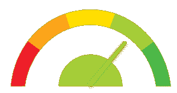
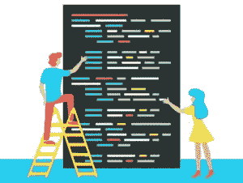
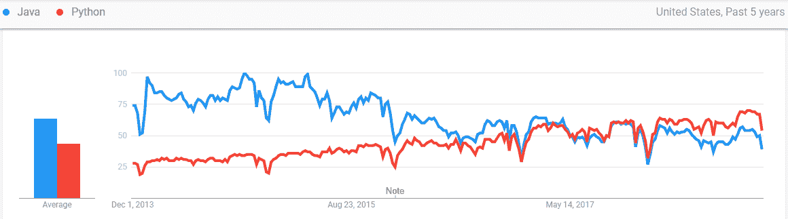
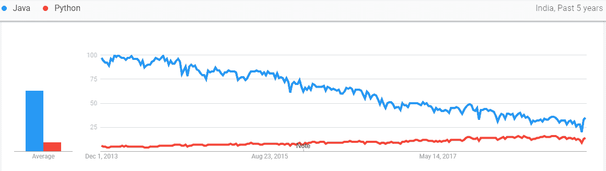
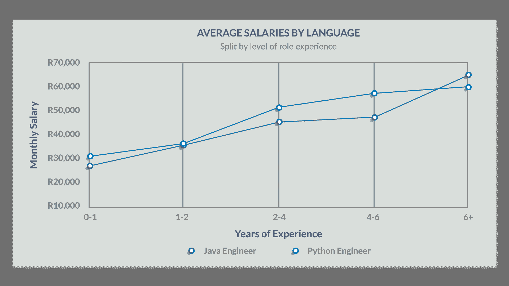
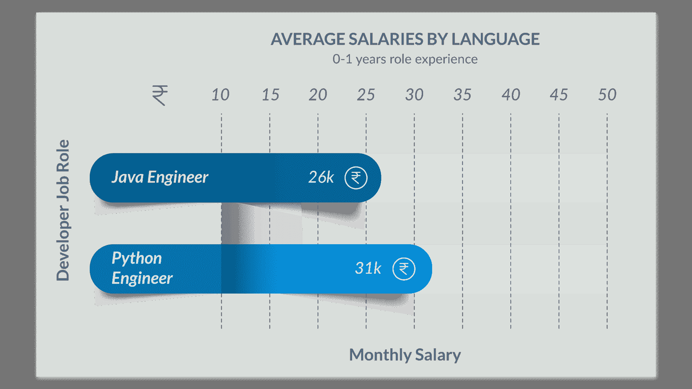
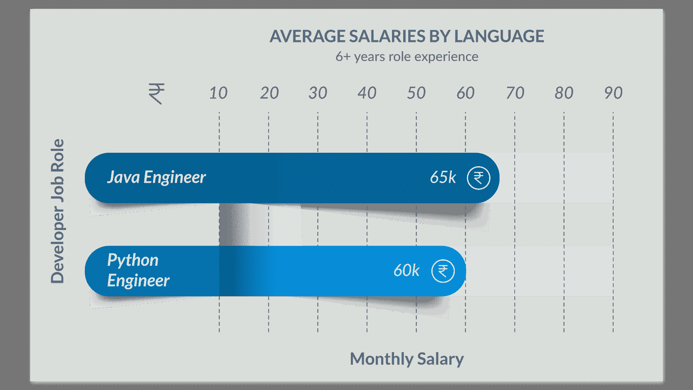

# Java 与 Python:最佳编程语言的比较

> 原文：<https://www.edureka.co/blog/java-vs-python/>

这个关于 **Java 与 Python** 的比较将为你提供关于这两种编程语言的清晰知识，并帮助你找到哪一种更适合你的目标。 **Java** 和 **Python** 是目前市场上最热门的两种编程语言，因为它们的通用性、效率和自动化能力。这篇 **Java vs Python** 的博客将按以下顺序为您提供对这些语言的全面了解:

*   [Java 历史&Python](#history)
*   [比较因素](#comparison)
    *   [速度](#speed)
    *   [遗留](#legacy)
    *   [代码](#code)
    *   [实用敏捷](#agility)
    *   [趋势](#trends)
    *   [工资](#salary)
    *   [语法](#syntax)

让我们回到过去，看看这两种语言的起源，看看 Python 和 Java 是否相似。

## Java 和 Python 的历史

**Java** 是一种面向对象的语言，具有许多程序员熟悉的类似 C/C++的语法。它是动态链接的，允许下载和运行新代码，但不是动态类型的。

Python 是两种语言中较老的一种，由它的发明者吉多·范·罗苏姆于 1991 年首次发布。它是一种可读、高效、强大的高级语言，具有自动内存管理功能。

**Java vs Python 对比|你该学哪个？|爱德华卡**


[https://www.youtube.com/embed/s3Ejdx6cIho?rel=0&showinfo=0](https://www.youtube.com/embed/s3Ejdx6cIho?rel=0&showinfo=0)

这个关于 Java 与 Python 的 Edureka 视频为您提供了软件行业中使用的两种顶级语言的简短描述。**

## 比较因素

Python&Java 有什么区别？这两种语言有相似之处也有不同之处，这使得从两种语言中选择一种变得更加困难。程序员问得最多的问题是 Python 是否比 Java 好。所以让我们开始比较，找出 Java 和 Python 的胜者。

让我们来看一下**因素**，我们将在 **Java 与 Python** : 的**比较中使用这些因素**

| **比较因素** | **Java** | **Python** |
| 速度 |  |  |
| 遗产 |  |  |
| 密码 |  |  |
| 实践敏捷性 |  |  |
| 趋势 |  |  |
| 薪水 |  |  |
| 句法 |  |  |

该表显示 Python 比 Java 略胜一筹，但是让我们详细讨论一下比较因素，并找出哪种编程语言更好。

**Java vs Python 对比|你该学哪个？|爱德华卡**


[https://www.youtube.com/embed/s3Ejdx6cIho?rel=0&showinfo=0](https://www.youtube.com/embed/s3Ejdx6cIho?rel=0&showinfo=0)This video will help you know the differences between Java and Python.

## 速度

<figure class="wpb_wrapper vc_figure"></figure>

就速度而言，Java 比 Python 更快，因为它是一种编译语言。执行一个代码需要更少的时间。

<figure class="wpb_wrapper vc_figure"></figure>

Python 是一种解释型语言，它在运行时决定数据的类型，这使得它相对来说**更慢**。

## 遗产

<figure class="wpb_wrapper vc_figure"></figure>

Java 在企业中的历史和它略显冗长的编码风格意味着 Java 遗留系统通常比 python 的系统更大、数量更多。

<figure class="wpb_wrapper vc_figure"></figure>

Python 的遗留问题较少，因此组织发现脚本复制和粘贴代码的**困难**并赋予它相对于其他语言的一点优势。

当我们谈论这两种语言时，出现的另一个困惑是 Java 和 python 之间哪一种更容易。因此，让我们看看用两种语言编写代码时所需的行数。

## 密码

<figure class="wpb_wrapper vc_figure"></figure>

与 Python 相比，Java 非常冗长。用 Java 读取一个文件需要 10 行 T2 代码。

<figure class="wpb_wrapper vc_figure"></figure>

在 Python 中只需要 **2 行**代码。这使得 Python 成为更受欢迎的语言。

## 在此查看代码

## 实用灵活性

<figure class="wpb_wrapper vc_figure"></figure>

得益于 Java 的静态类型系统和 IDE 在开发中的通用性，Java 比 python 享有更多不变的重构支持。它更受移动和网络应用的欢迎。

<figure class="wpb_wrapper vc_figure"></figure>

Python 在人才领域一直存在，被认为是最有利于[机器学习](https://www.edureka.co/blog/what-is-machine-learning/)、[人工智能](https://www.edureka.co/blog/what-is-artificial-intelligence)、[物联网](https://www.edureka.co/blog/iot-tutorial/)等等的语言。

## 趋势

### **美国**

<figure class="wpb_wrapper vc_figure"></figure>

### **印度**

<figure class="wpb_wrapper vc_figure"></figure>

虽然不像以前那么流行，但无论从哪方面来看， **Java** 仍然是最受欢迎的编程语言。另一方面，Python 的增长是天文数字，尤其是在发达的高收入国家。这一惊人增长的原因包括**开发人员生产力**、**语言灵活性**、**库支持、社区支持和学习便利性**。

## 薪水

<figure class="wpb_wrapper vc_figure"></figure>

<figure class="wpb_wrapper vc_figure"></figure>

现在我们大多数人都想知道 Python 是否会在最近取代 Java。当我们比较两个工程师在新生情况下的增长时， **Python** 比 java 有一点优势，因为它的**需求在最近**增加了。如今，这些工作大多与自动化和人工智能有关，他们更喜欢 Python 而不是 Java，这就是为什么我们可以在图表中看到这种转变。

<figure class="wpb_wrapper vc_figure"></figure>

然而，如果我们看看经验丰富的工程师的增长情况，java 一直占据主导地位。因为 **Java** 在 python 流行之前就已经在使用了。经验工程师**发现，对他们来说，坚守自己的舒适区比迁移到一门新语言更方便**。

## 基本差异

| 

### **爪哇**

 | 

### **巨蟒**

 |
| Java 是一种编译语言 | Python 是一种解释性语言 |
| 它是一种面向对象的编程语言 | 它是一种脚本语言 |
| Java 是静态类型的 | Python 是动态类型化的 |

## 句法

### 行数

```

public class HelloWorld {

public static void main(String[] args) {
System.out.println("Hello, World");
}

}

```

```

print ('Hello, World!')

```

### 分号

```

class programming {

programming() {

system.out.println("Constructor method called");

}

public static void main(String[] args) {

programming object = new programming();

}

}

```

```

class Student:

  def __init__(self, name):

     print("This is parameterized constructor")

     self.name = name

  def show(self):

     print("Hello", self.name)

student = Student("Daniel")

student.show()

```

### 刻痕

```

class Greater {

public static void main (String args[]) {

int a = 10;

if (a>0) {

system.out.println("a is positive");

}

else {

system.out.println("a is not positive");

}

system.out.println("This is executed");

}

}

```

```

a=200

b=300

if b > a:

  print("b is greater than a")

elif a==b:

  print("a and b are equal")

else:

  print("a is greater than b")

```

### 读取文件

```

import java.io.*;
public class ReadFromFile2
{
public static void main(String[] args)throws Exception
{
File file = new File("C:UsersdanielDesktoptest.txt");

BufferedReader br = new BufferedReader(new FileReader(file));

String st;
while ((st = br.readLine()) != null)
System.out.println(st);
}
}

```

```

> f = open("test.txt",'r',encoding = 'utf-8')
>>> f.read()

```

至此，我们结束了对 **Java 和 Python** 的比较。我希望你们喜欢这篇文章，并理解 ***Python 如何比 Java 略胜一筹，并在大多数因素*** 中胜出。所以，如果你读过这篇文章，你可能会清楚地知道哪种编程语言更好，你应该选择哪种。

*既然你已经了解了 Java & Python 之间的比较，那就来看看 Edureka 的 [**Java 认证**](https://www.edureka.co/java-j2ee-training-course) 培训& [**Python 认证**](https://www.edureka.co/python-programming-certification-training) 培训吧，edu reka 是一家值得信赖的在线学习公司，拥有遍布全球的 25 万多名满意的学习者。*

*Python 认证培训将帮助您获得定量分析、数据挖掘和数据呈现方面的专业知识，通过将您的职业生涯转变为数据科学家角色来超越数字。Java 认证培训将帮助你获得 Java 数组、Java OOPs、Java 函数、Java 循环、Java 集合、Java 线程、Java Servlet、Java 设计模式和使用行业用例的 Web 服务等概念的专业知识。*

*有问题吗？请在“Java 与 Python”的评论部分提到它，我们会给你回复。*