# 什么是大数据分析——将洞察转化为行动

> 原文：<https://www.edureka.co/blog/big-data-analytics/>

就像整个宇宙和我们的星系据说是由于大爆炸而形成的一样，同样，由于如此多的技术进步，数据也在呈指数级增长，导致了大数据爆炸。在这篇博客中，你将深入了解大数据分析及其应用。这些数据来自不同的来源，具有不同的格式，以可变的速率生成，还可能包含不一致的地方。因此，我们可以简单地将这种数据爆炸称为 ***[大数据](https://www.edureka.co/blog/what-is-big-data/)*** 。 我将在本博客中解释以下主题，让您深入了解大数据分析:

*   [为什么要大数据分析？](#Why%20Big%20Data%20Analytics?)
*   [什么是大数据分析？](#What%20is%20Big%20Data%20Analytics?)
*   [大数据工具](#Tools)
*   [大数据领域](#Domains)
*   [大数据用例](#Use%20Cases)
*   [大数据分析趋势](#Trends_in_Big_Data_Analytics)

## **为什么要大数据分析？**

在我开始向你们讲述什么是大数据分析之前，让我告诉你们为什么需要它。让我告诉你们，我们每天会产生大约 2.5 万亿字节的数据！因此，现在我们已经积累了大数据，我们既不能忽视它，也不能让它闲置，让它浪费掉。

全球各地的各种组织和部门开始采用数据分析，以获得众多好处。分析大数据提供了洞察力，许多公司正在将这些洞察力转化为行动，并在发现的同时获得巨额利润。我将列出四个这样的原因和有趣的例子。通过[大数据课程](https://www.edureka.co/big-data-hadoop-training-certification)了解更多关于大数据的信息。

第一个原因是，

1.  **打造更聪明、更高效的组织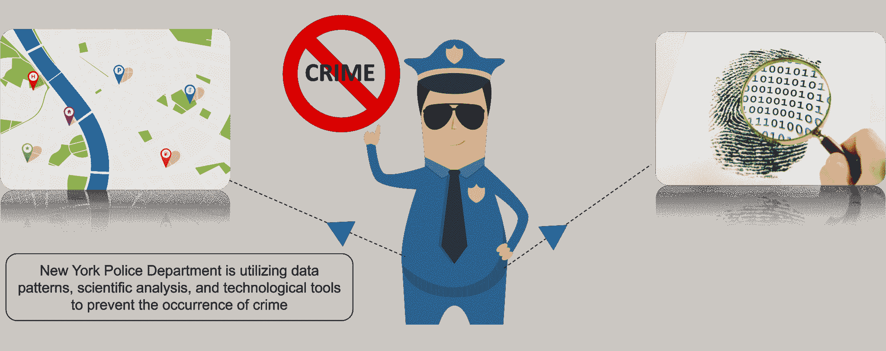  **  让我告诉你一个这样的组织，纽约警察局(NYPD)。NYPD 出色地利用大数据分析来检测和识别犯罪，防患于未然。他们分析历史逮捕模式，然后将它们与联邦假日、发薪日、交通流量、降雨量等事件对应起来。  这有助于他们利用这些数据模式立即分析信息。大数据分析战略 帮助 他们识别犯罪地点，通过这些地点部署他们的警员。因此，通过在犯罪发生前到达这些地点，他们防止了犯罪的发生。
2.  **通过分析客户行为优化业务运营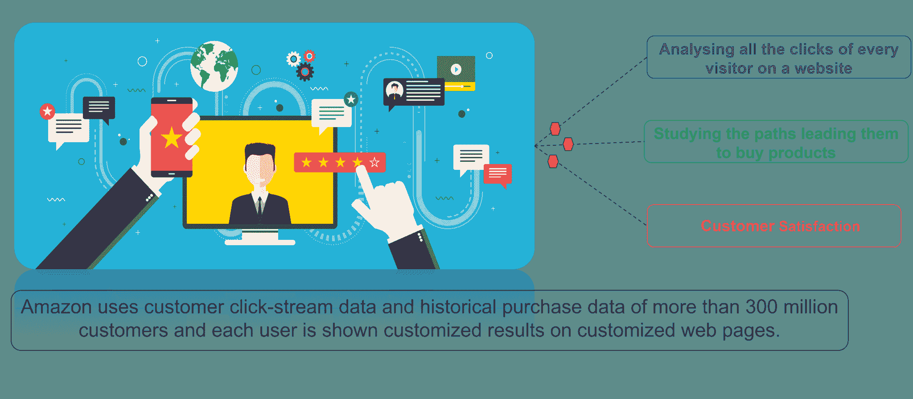** 大多数组织使用客户行为分析来提高客户满意度，从而扩大客户群。这方面最好的例子是亚马逊。亚马逊是最好的、使用最广泛的电子商务网站之一，拥有约 3 亿客户群。他们使用客户点击流数据和历史购买数据在定制的网页上为他们提供定制的结果。  分析 每位访问者在网站上的点击量有助于他们了解他们的网站导航行为、用户购买产品的路径、导致他们离开网站的路径等等。所有这些信息都有助于亚马逊改善他们的用户体验，从而提高他们的销售和营销。 
3.  **降低成本**大数据技术和云计算等技术进步在存储和处理大数据方面带来了显著的成本优势。让我告诉你医疗保健如何利用大数据分析来降低成本。如今，患者在家里或外面都使用新的传感器设备，这些设备可以发送持续的数据流，这些数据流可以被实时监控和分析，以帮助患者通过自我管理他们的病情来避免住院。 对于住院患者，医生可以使用预测分析来优化结果并减少再入院。帕克兰医院使用分析和预测模型来识别高风险患者，并预测患者回家后可能的结果。因此，Parkland 将心力衰竭患者的 30 天再入院时间减少了 31%  ，每年节省 50 万美元。

**新一代产品**

有了通过分析来衡量客户需求和满意度的能力，就有能力满足客户的需求。我在这里发现了三个这样有趣的产品。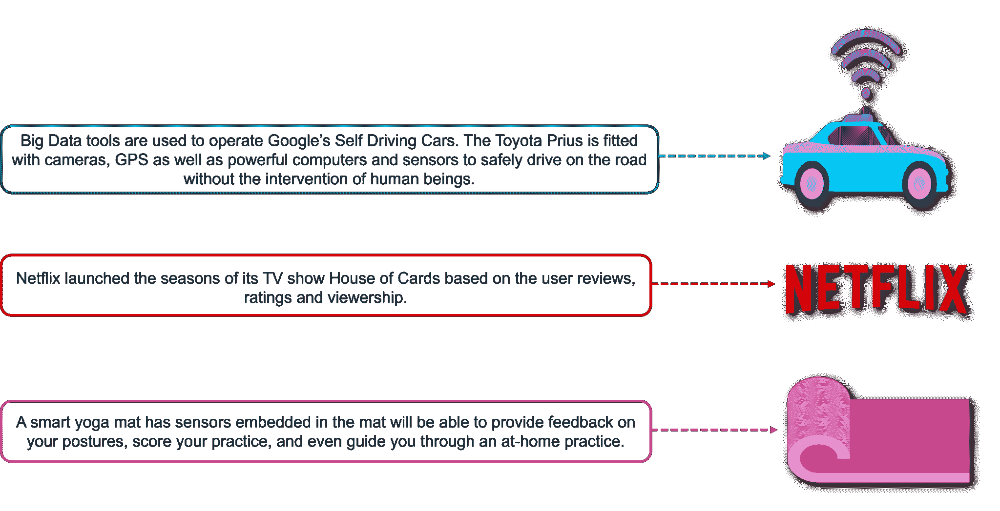 **首先是**，谷歌的无人驾驶汽车，它在每一次行程中进行数百万次计算，帮助汽车决定何时何地转弯，是减速还是加速，以及何时变道——人类司机在方向盘后也会做出同样的决定。 

**第二个**一个是网飞，凭借对大数据分析的完全信任，投入了两季其极受欢迎的电视剧《纸牌屋》！去年，网飞的美国用户数量增长了 10%，并增加了近 2000 万来自全球的用户。

**第三个**例子是我遇到的一个非常酷的新东西，是一个智能瑜伽垫。第一次使用智能垫子时，它会带你通过一系列动作来校准你的体形、尺寸和个人限制。这些个人资料信息存储在您的 Smart Mat 应用程序中，将帮助 Smart Mat 检测您何时失去对齐或平衡。随着时间的推移，它会随着你瑜伽练习的改进而自动更新数据。

## **什么是大数据分析？**

现在让我们正式定义“什么是大数据分析？”它检查大量不同类型的数据，以揭示隐藏的模式、相关性和其他见解。基本上，分析大数据在很大程度上被公司用来促进其增长和发展。这主要包括对给定的数据集应用各种数据挖掘算法，这将帮助他们做出更好的决策。有 有数量 的大数据 分析 工具用于 快速分析 数据和。Hadoop、Pig、Apache Spark 都是的一些大数据分析工具，你一定知道。您还可以通过本[大数据分析课程](https://www.edureka.co/big-data-and-analytics)以及本 [大数据工程师课程](https://www.edureka.co/masters-program/big-data-architect-training) 了解具有实时项目经验的大数据工具

### **大数据分析阶段**

这是该过程中涉及的以下阶段:

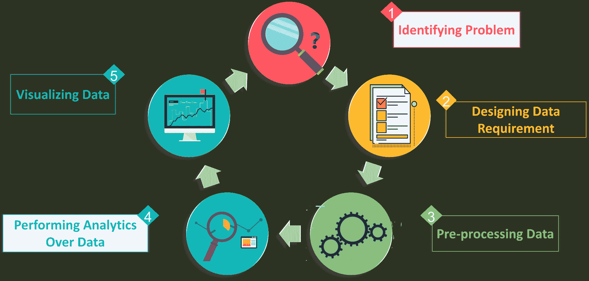

**大数据分析的类型**

大数据分析有四种类型:

1.  **描述性分析:**它使用数据聚合和数据挖掘来提供对过去的洞察，并回答:“发生了什么？”描述性分析顾名思义就是“描述”或总结原始数据，并使其能够被人类理解。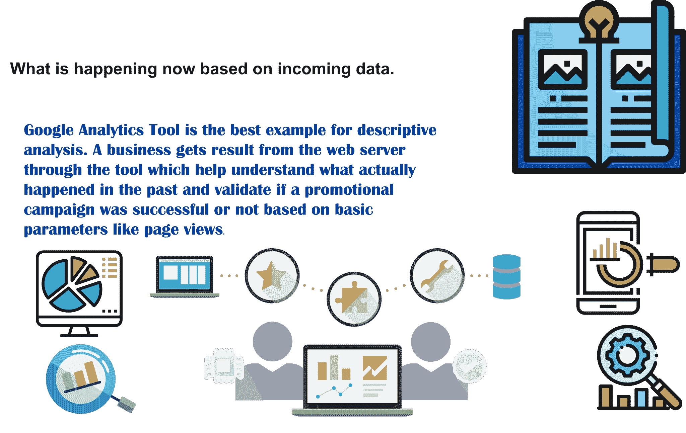
2.  **预测分析:**它使用统计模型和预测技术来了解未来，并回答:“会发生什么？”预测分析为公司提供基于数据的可行见解。它提供了对未来结果可能性的估计。
3.  **规定性分析:**它使用优化和模拟算法对可能的结果和答案提出建议:“我们应该做什么？”它允许用户“开出”许多不同的可能操作，并引导他们找到解决方案。简而言之，这种分析就是提供建议。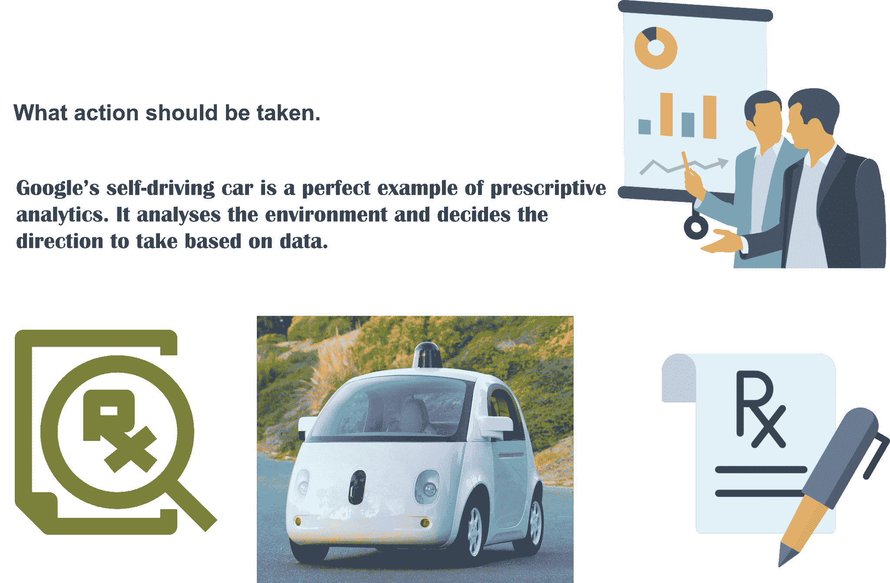
4.  **诊断分析:**用来确定过去为什么会发生一些事情。它的特点是技术，如钻取，数据发现，数据挖掘和相关性。诊断分析更深入地查看数据，以了解事件的根本原因。

## **工具**

以下是一些用于大数据分析的工具: ***[Hadoop](https://www.edureka.co/blog/hadoop-career/) ， [Pig](https://www.edureka.co/blog/pig-tutorial/) ， [Apache HBase](https://www.edureka.co/blog/hbase-tutorial) ， [Apache Spark](https://www.edureka.co/blog/spark-streaming/) ， [Talend](https://www.edureka.co/blog/talend-big-data-tutorial/) ， [Splunk](https://www.edureka.co/blog/splunk-tutorial) ， [Apache Hive](https://www.edureka.co/blog/hive-tutorial/) ， [Kafka](https://www.edureka.co/blog/apache-kafka-next-generation-distributed-messaging-system) 。***

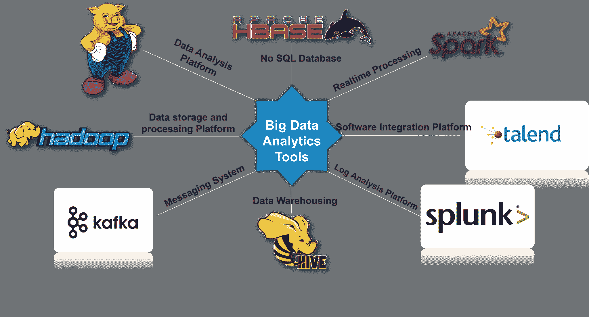

## **大数据领域**

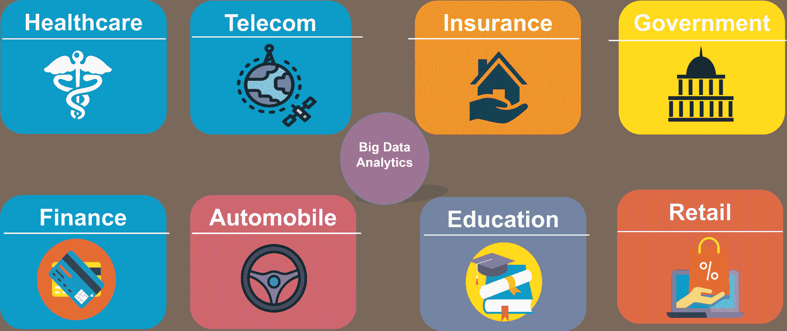

*   **医疗保健:** 医疗保健是利用数据分析来降低成本，预测流行病，避免可预防的疾病，提高总体生活质量。大数据在医疗保健中最广泛的应用之一是电子健康记录(EHRs)。Hhealth care行业 几乎大部分 都知道 关于 重要性大数据分析近年来，
*   **电信:** 他们是大数据最显著的贡献者之一。电信行业提高服务质量，更有效地路由流量。通过实时分析通话数据记录，这些公司可以识别欺诈行为，并立即采取行动。营销部门可以修改其活动，以更好地瞄准客户，并利用获得的见解开发新产品和服务。
*   **保险:**这些公司使用大数据分析进行风险评估、欺诈检测、营销、客户洞察、客户体验等。
*   **政府:**印度政府使用数据分析来获得该国贸易的估计值。他们使用中央销售税发票来分析各州之间的贸易程度。
*   **金融:**银行和金融服务公司使用分析来区分欺诈性互动和合法商业交易。分析系统会建议立即采取行动，例如阻止不正常的交易，这可以在欺诈发生之前阻止欺诈，并提高盈利能力。
*   **汽车:**劳斯莱斯通过在发动机和推进系统中安装数百个传感器来接受大数据分析，这些传感器记录了它们运行的每一个微小细节。数据的实时变化会报告给工程师，工程师将决定最佳行动方案，如安排维护或派遣工程团队。
*   **教育:**这是一个大数据分析正在被慢慢和逐渐吸收的领域。选择大数据驱动的技术作为学习工具，而不是传统的讲课方法，增强了学生的学习，并帮助教师更好地跟踪他们的表现。
*   **零售:**包括电子商务和店内的零售正在广泛使用大数据分析来优化他们的业务。比如亚马逊，沃尔玛等。 从华盛顿 [Azure 数据工程课程](https://www.edureka.co/microsoft-azure-data-engineering-certification-course-washington) 了解更多大数据及其应用。

## **大数据用例**

我在这里采用的第一个用例是星巴克。

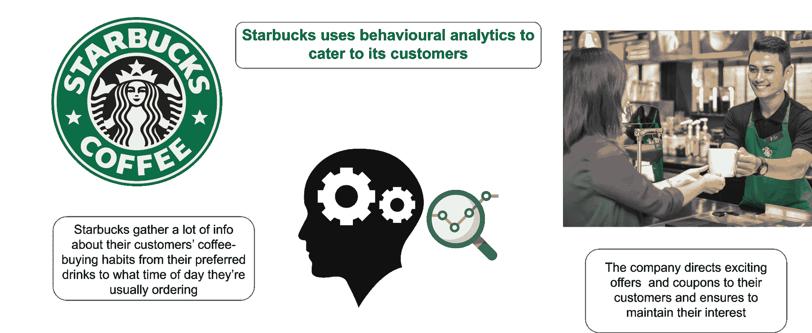

我想和大家分享的第二个使用案例是宝洁公司(T2)的产品。

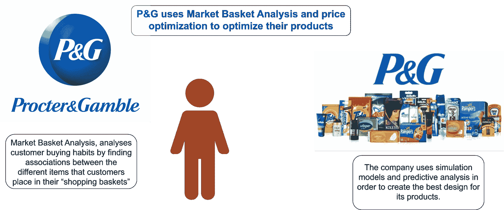

###### **大数据分析趋势**

下图描绘了 2011 年至 2027 年大数据的**市场收入，单位为**亿美元。

以下是《福布斯》的一些**事实和统计数据:**

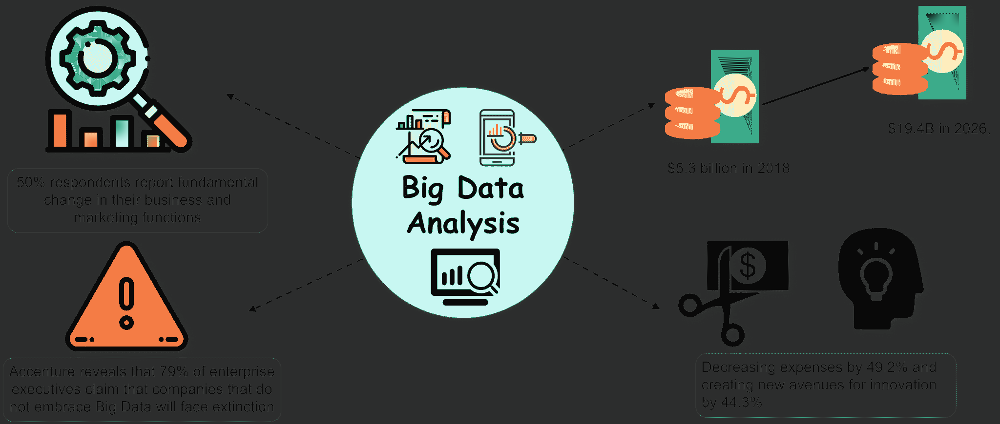

**职业前景**大数据分析:

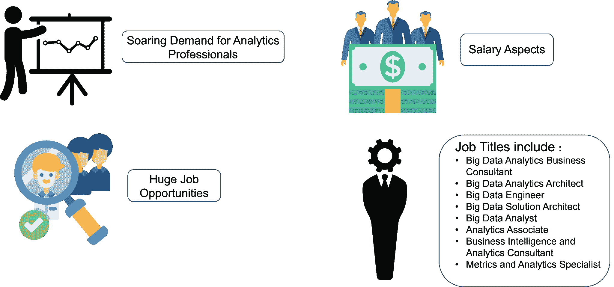

*   **薪资方面:** 分析类工作的平均薪资在 94167 美元左右。数据科学家连续三年被评为美国最佳工作，平均基本工资为 11 万美元，有 4524 个职位空缺。在印度，薪酬低于 100 万卢比的分析专业人士的比例已经下降；收入超过 150 万卢比的分析专业人士的比例从 2016 年的 **17%** 增加到 2017 年的 **21%** 和 2018 年的 **22.3%** 。
*   **巨大的工作机会:**像谷歌、苹果、IBM、Adobe、高通等公司雇佣大数据分析专业人士。

这些是根据大数据分析领域的角色而需要的一些技能:

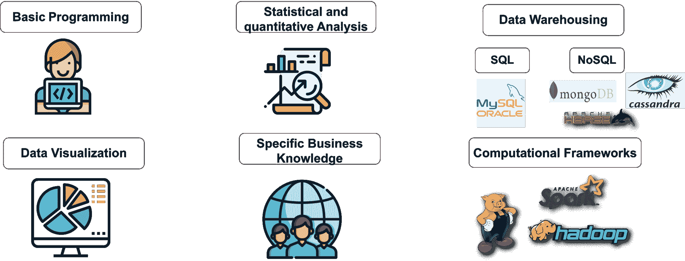

*   **基础编程:**一个人至少应该了解一些通用编程语言，比如 Java 和 Python。
*   **统计与定量分析:**对统计与定量分析有所了解是理想的。
*   **数据仓库:**需要 SQL 和 NoSQL 数据库的知识。
*   **数据可视化:**知道如何可视化数据，以便能够理解见解并将其应用于行动，这一点非常重要。
*   **特定业务知识:**为了优化运营，人们必须了解他们应用分析的业务。
*   **计算框架:**最好应该了解大数据分析所需的至少一两种工具。

*现在您已经了解了大数据分析，请参加 Edureka 在德里举办的 [Hadoop 培训](https://www.edureka.co/big-data-hadoop-training-certification-delhi)，edu reka 是一家值得信赖的在线学习公司，拥有遍布全球的 250，000 多名满意的学习者。Edureka 大数据 Hadoop 认证培训课程使用零售、社交媒体、航空、旅游和金融领域的实时用例，帮助学员成为 HDFS、Yarn、MapReduce、Pig、Hive、HBase、Oozie、Flume 和 Sqoop 领域的专家。*

*有问题吗？请在评论区提到它，我们会给你回复。*