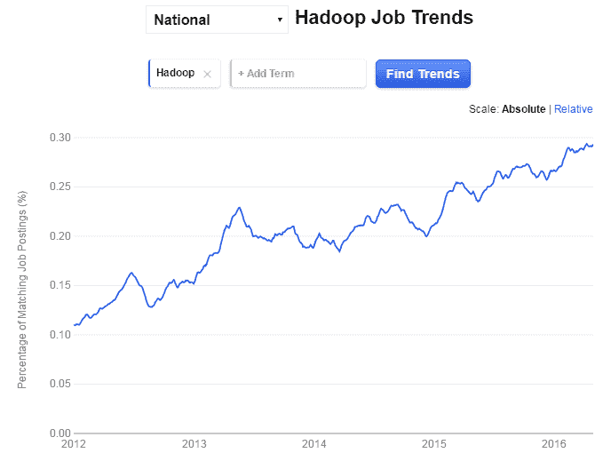

# Hadoop 工作机会 101:2020 年获得顶级 Hadoop 工作的指南

> 原文：<https://www.edureka.co/blog/hadoop-job-opportunities>

考虑这个事实；你在脸书上的每一个赞，在 Twitter 上的每一条推文，在 Instagram 上分享的每一张照片，在 YouTube 上观看的所有视频，在亚马逊上购买的每一件产品，以及所有其他在线行为，都增加了世界上每天产生的大量数据。品牌愿意花一大笔钱来分析这些大数据，以获得可操作的消费者洞察，这将有助于他们影响你的购买决策并发展他们的业务。这只是大数据世界中可能性的一小部分。在这种情况下，能够构建技术/使用框架来驯服大数据的开发人员和能够管理这些框架的管理员才是真正的王者！

根据“大数据市场:2016–2030–机遇、挑战、战略、行业垂直市场与预测” [报告](http://www.reportlinker.com/p03895289-summary/The-Big-Data-Market-Opportunities-Challenges-Strategies-Industry-Verticals-and-Forecasts.html) 的最新统计，仅 2016 年一年，大数据投资预计将超过 460 亿美元，未来四年投资预计将以 12%的 CAGR 增长。Apache Hadoop 已经成为处理大数据的一个流行和成功的平台，其受欢迎程度没有任何减弱的迹象。Hadoop 是当今存储、处理和分析数百 TB 和数 Pb 数据的“标准”,掌握 Hadoop 框架将为您提供大量 Hadoop 工作机会，让您的职业生涯更上一层楼。

## Hadoop 工作机会

随着 Hadoop 成为数据管理和分析的主要平台，以及对熟练专业人员的需求超过了供应，Hadoop 开发人员和 Hadoop 管理员的机会激增。Cloudera 在其网站上提到，预计 Hadoop 将在未来两年内成为超过一半的分析软件的核心。Hadoop 中的职业机会是巨大的，掌握 Hadoop 技能是这十年中最明智的职业选择。大数据和 Hadoop 技能出现在未来一年的所有热门专业技能和行业展望报告中。在此 阅读 2016 年最热门的科技技能 [。](https://www.edureka.co/blog/10-hottest-tech-skills-in-2016/)

事实上，管理咨询公司麦肯锡(McKinsey & Co .)也警告说，熟练的大数据工作者严重短缺。根据麦肯锡的说法，“到 2018 年，仅美国就可能面临 14 万至 19 万名具有深刻分析技能的人，以及 150 万名知道如何利用大数据分析做出有效决策的经理和分析师的短缺。”

如果我们必须缩小到能让你获得顶级大数据和 Hadoop 工作的核心 Hadoop 技能，它们将是 HDFS、MapReduce、Flume、Oozie、Hive、Pig、HBase 和 YARN。专家还表示，机器学习今年也很受欢迎。我们已经说过一次，我们将再说一次——Hadoop 技能可以打开大量职业机会的大门，这些机会跨越大数据实施的长度和宽度。

## Hadoop 岗位工资

Hadoop 专家可以期待一份回报丰厚的职业图表和一份利润丰厚的职业。在 Indeed.com 上快速搜索显示，截至 2016 年 6 月 30 日，美国 Hadoop 专业人员的平均工资为 112，000 美元。这个数字比全国所有招聘职位的平均工资高出 95%。下面是 Hadoop 平均工资和相应职位的快照。

资料来源:Indeed.com

仅在美国市场，就有超过 13，000 个 Hadoop 职位在 Indeed 上列出，亚马逊、Capital One、微软和苹果等公司都是顶级招聘公司。如下图所示，Hadoop 的就业趋势看起来非常有前途。

资料来源:Indeed.com

这一趋势也反映在印度，根据全国软件和服务公司协会(Nasscom)的数据，到 2025 年，印度的大数据分析行业预计将增长八倍，从目前的 20 亿美元达到 160 亿美元。Naukri.com 展示了 Hadoop 开发者的工作薪水。最低 30 万卢比，最高 50 万卢比，工资根据经验水平不同而不同。Indeed.co.in 显示，TCS、LinkedIn、凯捷、甲骨文和其他领先公司都在招聘 Hadoop 专业人员。

对 itjobswatch.co.uk 的搜索显示，英国 Hadoop 专业人士的工资中值为 6 万英镑，排名变化为+50，自 2015 年以来同比变化 8%。

普遍认为，了解 Hadoop 堆栈并能够利用机器学习技术的 Hadoop 专家可以在 2016 年获得最高职位和丰厚的薪酬。可以肯定地说，对 Hadoop 专家的需求和令人鼓舞的薪酬数字是一种全球趋势。这一趋势预计将持续多年，这是提升 Hadoop 技能的最佳时机。

## Hadoop 工作角色

在大数据领域有很多职业发展的机会，Apache Hadoop 可以帮助你快速、稳定地爬上职业阶梯。在博客[中了解 Hadoop 开发人员的工作职责。一些流行的 Hadoop 职位是:](https://www.edureka.co/blog/hadoop-developer-job-responsibilities-skills/)

*   Hadoop 开发人员
*   Hadoop 管理员
*   数据工程师
*   大数据开发者
*   大数据架构师

工作经验和对核心大数据领域的关注可以让你扩大职业生涯，并获得其他高薪工作，如大数据分析师、数据科学和大数据顾问等。认证还会增加你的简历，让你被公认为合格的 Hadoop 专家。Cloudera 认证和 Edureka Hadoop 认证是广受欢迎的 Hadoop 资格认证，可以让你具备获得顶级 Hadoop 工作的技能。点击 查看 Edureka Hadoop 课程和认证 [。](https://www.edureka.co/big-data-and-hadoop)

## Hadoop 的未来

Hadoop 仍然很强大，并将在未来许多年继续如此。尽管竞争编程模型和框架进入市场，但 Hadoop 在其使用和受欢迎程度方面占据了一席之地。大数据/ Hadoop 的使用以及就业市场的成熟度在全球各不相同。发达国家拥有成熟的大数据就业市场，而印度、中国和巴西等发展中国家的就业市场。正在迅速抓住机遇。虽然大数据和 Hadoop 正在发达国家适应物联网和机器学习，但这些技术正被用于解决发展需求，如分析犯罪率、消费者行为以及发展中国家不断扩大的金融部门。

由于不同国家的使用和需求不同，可以说 Hadoop 专家的生活中从来没有无聊的一天。Hadoop 中有大量的机会，学习这个框架会让你走上成功的快车道。准备驾驭下一波大数据；现在就提升 Hadoop 技能！

Edureka 有一个特别策划的实时互动大数据和 Hadoop 课程，通过学习 MapReduce、Yarn、Pig、Hive、HBase、Oozie、Flume 和 Sqoop 等概念，帮助您成为 Hadoop 专家。新一批即将开始， [在这里查看](https://www.edureka.co/big-data-and-hadoop) 。

有问题要问我们吗？请在评论区提到它，我们会给你回复。

**相关帖子:**

[2020 年要掌握的 10 大热门科技技能](https://www.edureka.co/blog/10-hottest-tech-skills-in-2016/)

[学习 Hadoop 的 5 个理由](https://www.edureka.co/blog/5-reasons-to-learn-hadoop)