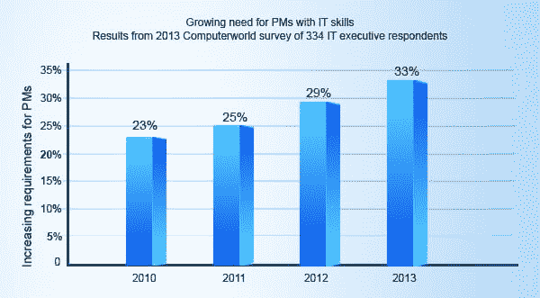
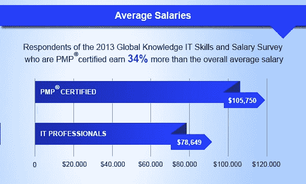
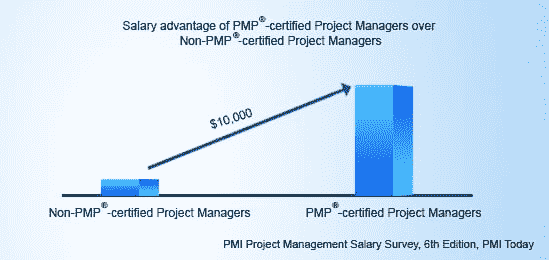
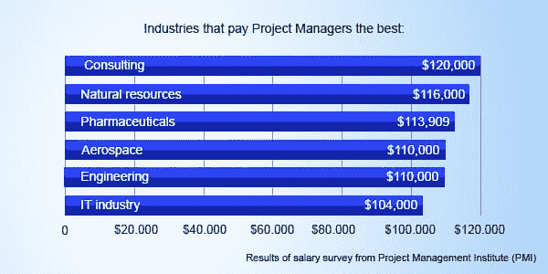

# 拥有 PMP 认证的职业前景

> 原文：<https://www.edureka.co/blog/career-prospects-with-pmp-certification/>

世界正变得日益全球化，随着技术的迅速发展，大大小小的项目正在进行。这就产生了对技术人员的巨大需求，以整合一个项目的不同方面。这就是项目管理专业认证项目经理出现的原因。请继续阅读，了解项目管理专业人员的职业优势、工作机会和收入潜力。你可以通过 [PMP 课程](https://www.edureka.co/pmp-certification-exam-training)详细了解。

## **为什么要去 PMP 认证？**

**1。** **职业优势:**

*   虽然项目管理经验是强制性的，但在做出雇用决定时，对 PMP 认证候选人的需求比非认证候选人有所增加。
*   PMP 认证在项目经理之间建立了一个共同的语言，并帮助彼此在一个共同的框架内工作。
*   Dice 表示，PMP 认证是 2013 年最受欢迎的五大认证之一。

## **2。PMP 认证专业人才需求高:**

根据 PMI 进行的最新预测，不断扩大的就业市场、不断增加的需求和不断提高的 GDP 将刺激项目管理职业的国际增长。随着实施的增加，对具备适当技能的合适专业人员的需求肯定会增加。IT 雇主正在寻找特定的技能来提供企业竞争所需的技能，其中 40%的雇主将在未来 12 个月内雇用项目经理，以跟上不断增加的项目。从 [ITIL 培训](https://www.edureka.co/itil4-foundation-certification-training)中了解更多关于 ITIL 及其框架的信息。

## **3。PMP 认证专家赚大钱:**

*   PMI 报告称，拥有项目管理专业证书的人比没有证书的人多挣大约 16 %。
*   仅在美国，雇主就向拥有 PMP 认证的项目经理支付更高的薪水:那些拥有 PMP 认证 5 年至不到 10 年的人的平均基本工资为 11.3 万美元，而那些拥有 PMP 认证 10 年至不到 20 年的人的平均基本工资为 12 万美元。
*   在美国，项目管理领域的个人平均基本工资为 105，000 美元。如此高的中位数表明公司愿意为项目管理专业知识支付高价。

**4。** **晴天项目管理预测:**

*   安德森经济集团预测，直到 2016 年，每年需要填补 120 万个项目管理职位。

*   到 2020 年，项目管理行业预计将增长 6.61 万亿美元。
*   到 2020 年，全球七个项目密集型行业将新增 1570 万个项目管理职位，分别是商业服务、金融和保险、制造、公用事业、建筑、信息服务、石油&天然气。

综上所述，PMP 认证给你的职业生涯一个坚实的推动。从 [PMP 认证达拉斯](https://www.edureka.co/pmp-certification-exam-training-dallas)获得更好的理解。

有问题要问我们吗？请在评论部分提及它们，我们将会回复您

**相关帖子:**

[**备考 PMP**](https://www.edureka.co/blog/pmp-exam-prep/)

[**破解 PMP 考试用结构化教程，**](https://www.edureka.co/blog/cracking-pmp-exams-with-structured-pmp-tutorials/)

*PMP 是项目管理协会的注册商标。Edureka 是全球 PMI 代表:ID 4021*