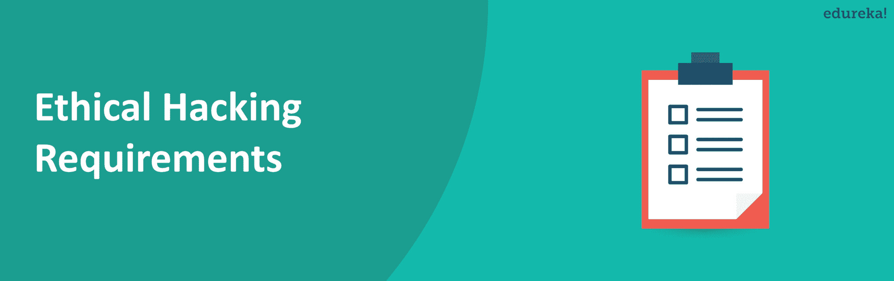
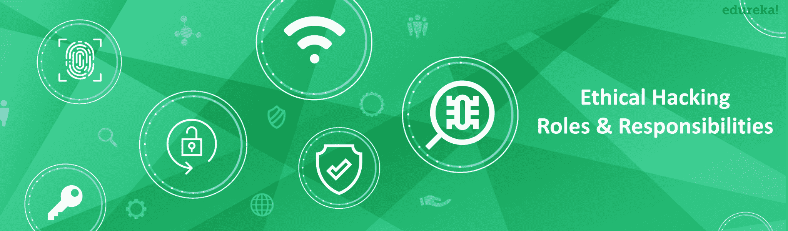
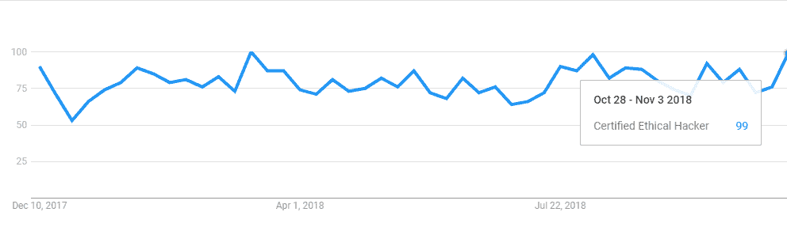

# 职业道德黑客:职业道德黑客指南

> 原文：<https://www.edureka.co/blog/ethical-hacking-career/>

对许多人来说，道德黑客一直是一个有利可图的职业选择，而且不无道理！这是一份富有挑战性的工作，永远不会无聊，薪水很高，还能带来更大的成就感。在这篇“道德黑客生涯”的文章中，我们将回顾各种因素来指引你成为一名道德黑客:-

## **谁是道德黑客？**

“要打败黑客，你必须像黑客一样思考”——道德黑客委员会

黑客攻击是在系统中发现漏洞，并利用这些发现的漏洞获得对系统的未授权访问，以执行从删除系统文件到窃取敏感信息的恶意活动的过程。黑客行为是非法的，如果你当场被抓，可能会导致极端的后果。人们因为黑客行为被判处多年监禁。

尽管如此，如果得到许可，黑客行为可能是合法的。计算机专家经常被公司雇佣来入侵他们的系统，找到漏洞和薄弱的端点，以便修复它们。这样做是为了防范那些怀有恶意的合法黑客。这样的人，在没有任何恶意的情况下，经过许可侵入系统，被称为 e *道德黑客*，这个过程被称为 [e *道德黑客*](https://www.edureka.co/blog/what-is-ethical-hacking) 。

**道德黑客职业|道德黑客工作&薪水|网络安全课程| Edureka**

[https://www.youtube.com/embed/1jGo3-4t568](https://www.youtube.com/embed/1jGo3-4t568)

## **成为道德黑客的要求**

你的道德黑客生涯如何开始取决于你目前的工作领域。如果你不在 IT 领域，你绝对应该尝试进入 IT 领域。尽管大多数工作要求你拥有计算机科学或网络安全相关领域的学士学位，但对操作系统、数据库和网络有良好知识的人除外！此外，直接成为一名道德黑客几乎是不可能的。大多数有道德的黑客都是从技术支持工程师开始他们的职业生涯的，通过获得像 CCNA 和 CISSP 这样的 T2 认证，然后努力获得 CEH 认证。在获得 CEH 认证后，是时候将自己推销为一名道德黑客了！

现在让我们回顾一下道德黑客的角色和职责。

## **角色&一个道德黑客的职责**

似乎有一种普遍的误解，认为有职业道德的黑客只负责系统和应用程序的渗透测试。这不是真的，一个有道德的黑客要对此负责。

*   使用 Nessus 和 NMAP 等侦察工具扫描开放和关闭的端口

*   从事社会工程方法论

*   通过对补丁发布执行严格的漏洞分析来检查补丁发布

*   一个有道德的黑客将会看到他/她是否能够躲避 IDS(入侵检测系统)、IPS(入侵防御系统)、蜜罐和防火墙
*   道德黑客可以采用其他策略，如嗅探网络、绕过并破解无线加密、劫持网络服务器和网络应用程序

一个道德黑客试图通过分析一个组织的防御协议和社会工程方面来复制黑帽黑客的工作。他的工作是确保组织对这些情况做出足够好的反应，如果他们还没有这样做的话。浏览我们的[道德黑客课程](https://www.edureka.co/ceh-ethical-hacking-certification-course)，探索更多关于道德黑客的知识。本课程将向您传授黑客使用的最新黑客技术、工具和方法。

## **道德黑客技能集**

一个有职业道德的黑客职业生涯的人应该精通数据库处理、网络和操作系统，还应该具备出色的软技能，因为他们需要与组织的其他人交流有关安全的问题。除了这些通用的技能，一个有道德的黑客还精通以下技能:

*   网络流量嗅探
*   策划各种网络攻击
*   利用缓冲区溢出漏洞
*   SQL 注入
*   密码猜测和破解
*   会话劫持和欺骗
*   DNS 欺骗

除此之外，一个有道德的黑客必须是一个有创造力的思考者，因为黑帽黑客会不断地想出巧妙的方法来利用系统，而预测和防止这样的破坏是一个有道德的黑客的工作。

## **道德黑客工作趋势**

  来源:谷歌趋势

网络安全已经成为 2017 年，甚至可能是整个十年的一个高增长领域，其发展速度超过了 IT 的所有其他领域。根据劳工统计局的分析，在 2012 年至 2017 年的 5 年间，网络安全工作的清单增长了 75%。这导致了很多职位空缺，所以工作机会很多，薪水也很高。

## **一个道德黑客赚多少钱？**

根据[薪级表](https://www.payscale.com/research/US/Job=Certified_Ethical_Hacker_(CEH)/Salary)，认证的职业黑客平均年收入为**80074 美元**。根据 EC-Council 高级主管 Steven Graham 的说法，认证的道德黑客的平均起薪是 95，000 美元。NoWiresSecurity 的创始人埃里克·盖尔(Eric Geier)估计，根据你的雇主、经验和教育程度，在工作的头几年，一个更保守的数字是每年 5 万到 10 万美元。那些有几年工作经验的人每年可以挣到 12 万美元甚至更多，尤其是那些独立顾问。

## **职业道德黑客:职位简介**

在获得梦寐以求的 CEH v10 后，一个道德黑客可以尝试以下角色:

## **公司雇佣道德黑客**

一个道德黑客会在任何一家面向互联网或与网络有关的公司找到工作。其中包括像麻省理工学院这样的大学机构，甚至从物流服务到数据仓储公司的私营公司。除此之外，你还有机会为军方和绝密情报收集机构工作，比如中情局、摩萨德、国家安全局

好了，伙计们，这个“道德黑客生涯”博客到此结束。我希望这篇博客能给你正确的指引，引导你成为一名有道德的黑客。关于网络安全的更多信息，你可以看看我的其他[博客](https://www.edureka.co/blog/?s=cybersecurity)。如果你对这篇文章有任何疑问，请在下面的评论区留下你的评论！

*您还可以看看我们新推出的关于 [**CompTIA Security+认证**](https://www.edureka.co/comptia-security-plus-certification-training) 的课程，这是 Edureka & CompTIA Security+首次与官方合作。它为您提供了一个获得全球认证的机会，该认证侧重于安全和网络管理员不可或缺的核心网络安全技能。*

如果您希望学习网络安全并在网络安全领域建立一个丰富多彩的职业生涯，那么请查看我们的 [***网络安全认证培训***](https://www.edureka.co/cybersecurity-certification-training) ，它附带有讲师指导的现场培训和真实项目体验。本培训将帮助您深入了解网络安全，并帮助您掌握该主题。

<article class="maincontentblog">Got a question for us? Please mention it in the comments section of “ethical hacking career” and we will get back to you.</article>