# AWS Elastic Beanstalk–简化应用程序部署

> 原文：<https://www.edureka.co/blog/aws-elastic-beanstalk/>

云计算已经不再处于初级阶段。它现在已经很好地建立起来，并且正在作为一个创新平台，允许公司实现在传统基础设施上不可能实现的应用。这一成功伴随着[云计算服务](https://www.edureka.co/blog/cloud-computing-services-types/#sertypes)的指数级增长，PaaS 就是其中之一。亚马逊推出了自己遵循 PaaS 模式的服务，就是 **AWS** **Elastic Beanstalk！**通过 [AWS 在线培训](https://www.edureka.co/aws-certification-training)了解所有关于 AWS 的信息。

让我们来看看这篇 AWS Beanstalk 文章中涉及的主题:

1.  [亚马逊弹性豆茎是什么？](#EB)
2.  [AWS 弹性豆茎的好处](#EBB)
3.  [AWS 弹性豆茎组件](#EBC)
4.  [AWS 弹性豆茎架构](#EBA)
5.  [演示–在 Beanstalk](#EBD) 上部署应用程序

## **亚马逊弹性豆茎是什么？**

云计算正在重塑整个应用程序开发流程。许多云供应商，包括 亚马逊网络服务和微软 Azure，都提供开发工具来帮助使这个过程更加简单和安全。AWS Ela stic Beanstalk 就是这样一个基于 PaaS 模型实现的开发工具。

*AWS Elastic Beanstalk 是* *一个易于使用的服务，用于部署和扩展用 Java 开发的 web 应用程序和服务。NET、PHP、Node.js、Python、Ruby、Go、Docker 在 Apache、Nginx、Passenger、IIS 等熟悉的服务器上。*

使用 AWS Elastic Beanstalk，开发人员可以在不提供底层基础设施的情况下部署应用程序，同时保持高可用性。一定要看看下面的视频，以了解更多关于弹性豆茎。

## **AWS 弹力豆茎教程| Edureka**

[//www.youtube.com/embed/96DJ2Og90hU?rel=0&showinfo=0](//www.youtube.com/embed/96DJ2Og90hU?rel=0&showinfo=0)

但是当我们已经有许多其他平台时，为什么还要选择弹性豆茎呢？所以，我们来讨论一下弹性豆茎的好处。

## **AWS 弹性豆茎的好处**

以下是 AWS Elastic Beanstalk 相对于其他 PaaS 服务的一些优势

**提供更快的部署:** Elastic Beanstalk 为开发人员提供了最快速、最简单的方式来部署他们的应用程序。几分钟之内，应用程序就可以使用，用户无需处理底层基础设施或资源配置。

**支持 M 多租户架构:** AWS Elastic Beanstalk 使用户跨不同设备共享应用成为可能，具有高可扩展性和安全性。它提供了应用程序使用和用户配置文件的详细报告。 

**简化运营:**   Beanstalk 供应和运营基础设施并管理应用堆栈。开发人员必须专注于开发应用程序代码，而不是花时间管理和配置服务器、数据库、防火墙和网络。

**提供完全的资源控制:** Beanstalk 给开发者自由选择 AW S 资源，像 [EC2 实例](https://www.edureka.co/blog/ec2-aws-tutorial-elastic-compute-cloud/)  类型 ，这些资源对他们的应用程序来说是最优的。它允许开发人员保持对 AWS 资源的完全控制，并随时访问它们。

既然我们有充分的理由相信为什么 AWS Elastic Beanstalk 会受到开发者的青睐，那么让我们来看看它的基本概念。

Want To Be A Certified AWS Architect? [<button>Enroll Now</button>](https://www.edureka.co/aws-certification-training)

## **AWS 弹性豆茎组件**

在 Beanstalk 上部署应用程序时，您会经常遇到一些关键概念。让我们看看那些概念:

### **应用:**

*   Elastic Beanstalk 中的应用程序在概念上类似于文件夹
*   应用是包括 ***环境、版本*** 和 ***环境配置*** 的组件的集合

### **应用版本:**

*   一个应用版本是指一个 web 应用的可部署代码的一个特定的、带标签的迭代
*   应用程序版本指向一个亚马逊 S3 对象，该对象包含可部署的代码，例如 Java WAR 文件

### 环境:

*   【Elastic Beanstalk 应用程序中的环境是当前版本的应用程序将被激活的地方
*   每个环境一次只能运行一个应用程序版本。但是有可能在许多环境中同时运行相同或不同版本的应用程序

### **环境层:**

根据需求，beanstalk 提供了两个不同的环境层:Web 服务器环境，工作环境

*   Web 服务器环境 : 处理来自客户端的 HTTP 请求
*   工人环境:处理消耗资源和时间的后台任务

这里有一个图示来说明应用程序、应用程序版本和环境如何相互关联:

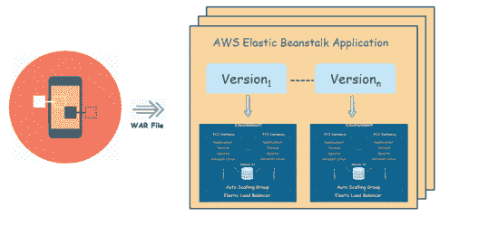 下面是 Beanstalk 环境使用默认容器类型的样子:

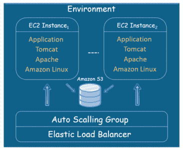  既然你已经了解了关于弹性豆茎的不同关键概念，那么让我们来理解弹性豆茎的架构。

**AWS 弹性豆茎架构**

在进入 AWS 弹性豆茎架构之前，先来回答一下最常被问到的问题，

### **什么是弹性豆茎环境？**

环境是指应用程序的当前版本。当您为您的应用程序启动一个环境时，Beanstalk 会要求您在两个不同的环境层中进行选择，即 Web *服务器* *环境*或 *工作环境*。让我们逐一了解。

**查看我们在顶级城市的 AWS 认证培训**

| 印度 | 美国 | 其他国家 |
| [在海德拉巴的 AWS 培训](https://www.edureka.co/aws-certification-training-hyderabad) | [亚特兰大 AWS 培训](https://www.edureka.co/aws-certification-training-atlanta) | [AWS 伦敦培训](https://www.edureka.co/aws-certification-training-london) |
| [班加罗尔的 AWS 培训](https://www.edureka.co/aws-certification-training-bangalore) | [波士顿 AWS 培训](https://www.edureka.co/aws-certification-training-boston) | [阿德莱德的 AWS 培训](https://www.edureka.co/aws-certification-training-adelaide) |
| [钦奈的 AWS 培训](https://www.edureka.co/aws-certification-training-chennai) | [纽约市的 AWS 培训](https://www.edureka.co/aws-certification-training-new-york-city) | [新加坡 AWS 培训](https://www.edureka.co/aws-certification-training-singapore) |

#### **Web 服务器环境**

安装在 Web 服务器环境中的应用程序版本处理来自客户端的 HTTP 请求。下图说明了一个 Web 服务器环境层的示例 AWS Elastic Beanstalk 体系结构，并显示了该类型环境层中的组件如何协同工作。

**Beanstalk 环境**–环境是应用程序的核心。当您启动一个环境时，Beanstalk 会分配成功运行应用程序所需的各种资源。

**弹性负载均衡器**–当应用程序收到来自客户端的多个请求时，Amazon Route53 会将这些请求转发给弹性负载均衡器。负载平衡器在自动伸缩组的 EC2 实例之间分发请求。

**自动缩放组**–自动缩放组自动启动额外的 Amazon EC2 实例，以适应应用程序不断增加的负载。如果应用程序的负载减少，Amazon EC2 自动伸缩会停止实例，但总是会让至少一个实例运行。

**主机管理器**–它是一个软件组件，运行在分配给你的应用的每个 EC2 实例上。主机经理负责各种事情，比如

*   生成和监控应用程序日志文件
*   生成实例级事件
*   监控应用服务器

**安全组**–安全组就像您实例的防火墙。Elastic Beanstalk 有一个默认的安全组，它允许客户端使用 HTTP 端口 80 访问应用程序。它还为您提供了一个选项，您可以在其中为数据库服务器定义安全组。下图总结了我们对 Web 服务器环境的了解。

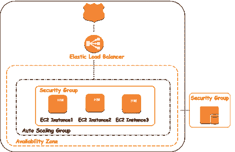

这就是关于 Web 服务器环境的全部内容。但是，如果安装在 Web 服务器层上的应用程序版本因为在处理请求时遇到了时间密集和消耗资源的任务而一直拒绝多个请求，该怎么办呢？嗯，这就是工人层的用武之地。

Want To Take Your 'Cloud' Knowledge To Next Level? [<button>Get Cloud Certified Today!</button>](https://www.edureka.co/masters-program/cloud-architect-training)

#### **工人环境**

工作进程是一个独立的后台进程，通过处理资源密集型或时间密集型操作来协助 Web 服务器层。此外，它还通过电子邮件发送通知、生成报告和清理数据库。这使得应用程序能够保持响应并处理多个请求。

那太好了，但是 Worker process 如何知道在什么时候处理哪些任务呢？这两个环境层如何通信？为此，我们使用 AWS 的消息队列服务，称为亚马逊简单队列服务(SQS)。下图让您大致了解了工作进程如何接收和处理后台任务。

worker 流程的工作流程相当简单。当您启动一个工作环境层时，Elastic Beanstalk 会在 Auto Scaling 组中的每个 EC2 实例上安装一个守护进程。这个守护进程从亚马逊 SQS 队列中提取请求。基于队列的优先级，SQS 将通过一个 `POST` 请求将消息发送到工作环境的 HTTP 路径。收到 消息的工人执行任务，并在操作完成后发送一个 HTTP 响应。SQS 在收到响应消息时删除队列中的消息。如果未能收到响应，它将继续重试发送消息。

现在我们已经从理论上了解了 Elastic Beanstalk，在这篇博客的剩余部分，我们将了解如何在 Elastic Beanstalk 上部署应用程序。

## **在弹性豆茎上部署应用**

在 Elastic Beanstalk 上部署应用程序是一个相当简单的过程。让我们看看如何逐步部署应用程序。

**第一步:**在弹性豆茎控制台上点击*创建新应用*选项。将出现一个对话框，您可以在其中为应用程序提供名称和适当的描述。

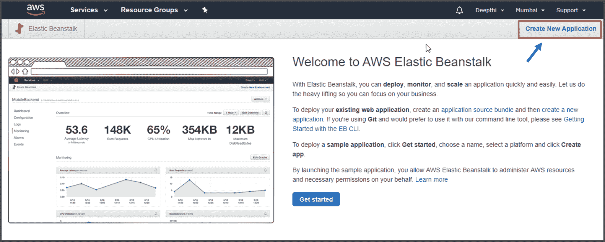

**第二步:**现在应用程序文件夹已经创建好了，你可以点击*动作选项卡*，选择*创建环境*选项。Beanstalk 为您提供了一个选项，您可以在其中为您的应用程序创建多个环境。

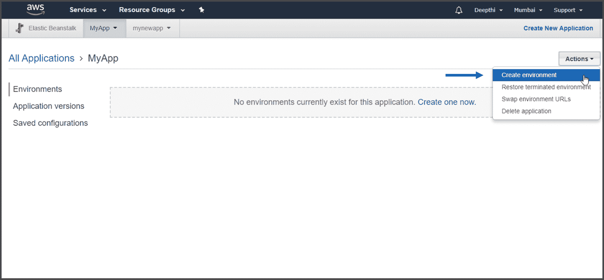

**第三步:**在两个不同的环境层选项中进行选择。如果希望应用程序处理 HTTP 请求，请选择 Web 服务器环境，或者选择 Worker 环境来处理后台任务。

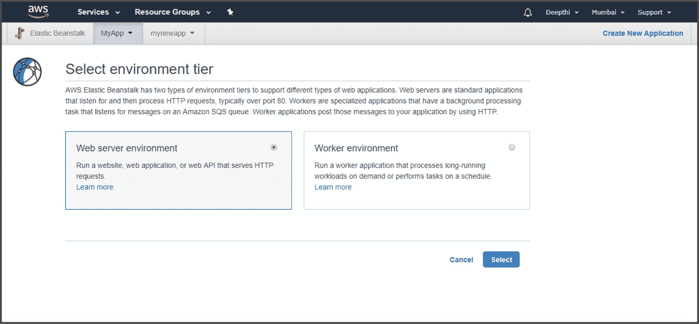

**第四步:**出现另一个对话框，您需要为您的应用程序提供域名和描述。

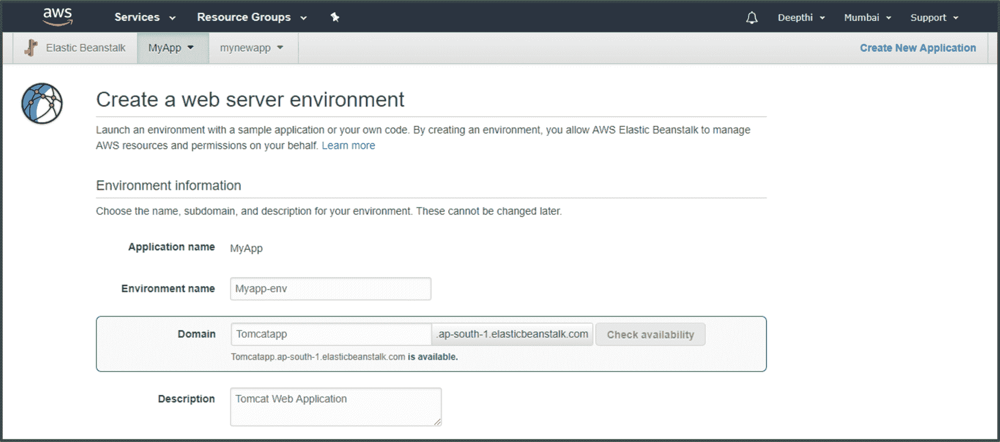

**第五步:**为你的应用选择一个自己喜欢的平台。弹性豆茎将为您提供多种选择。您可以选择 Beanstalk 提供的示例应用程序，或者上传包含应用程序代码的文件。

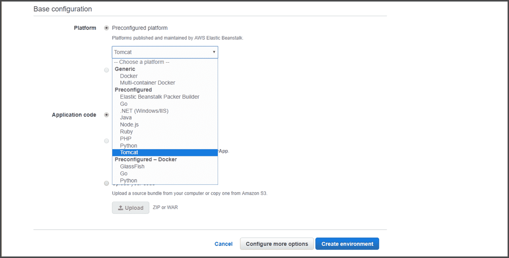

Beanstalk 需要几分钟来启动一个环境。环境启动后，在导航窗格中可以看到多个选项，在这些选项中可以更改应用程序的配置、查看日志文件和事件。因为您已经在环境页面上，所以尝试探索 Beanstalk 提供的不同特性。

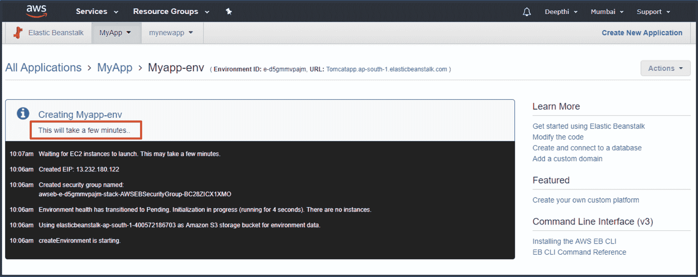

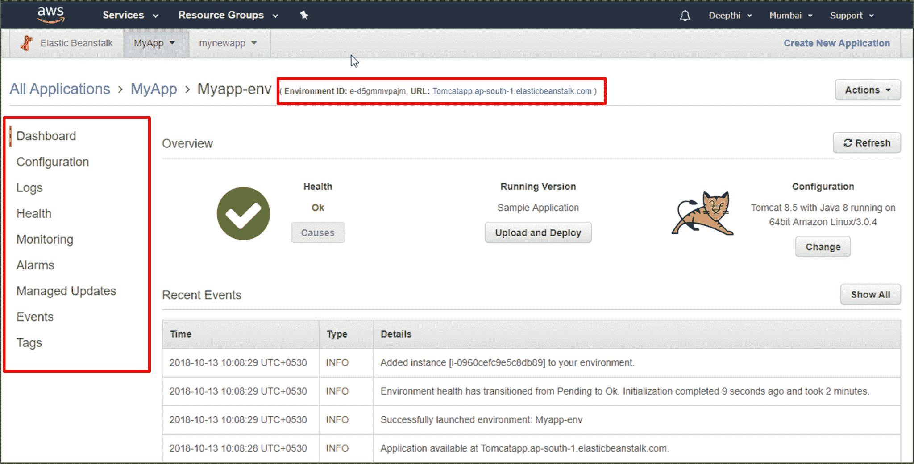

**第六步:**在右上角，你会找到你的应用版本的网址。点击那个网址。您将被带到一个页面，该页面将确认您已经在 Elastic Beanstalk 上成功启动了您的应用程序。

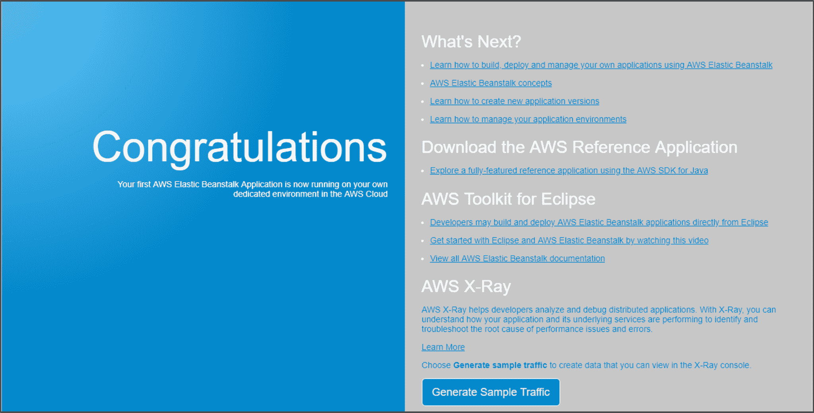

**恭喜恭喜！**您已经在 Elastic Beanstalk 平台上成功部署了一个应用程序。

我希望现在您对 Elastic Beanstalk 以及如何使用 Beanstalk 部署您的应用程序有了一个清晰的了解。