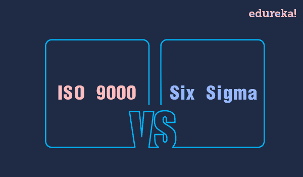
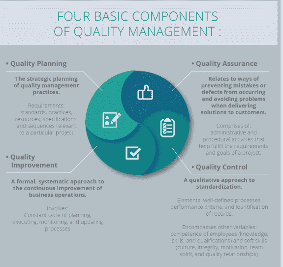
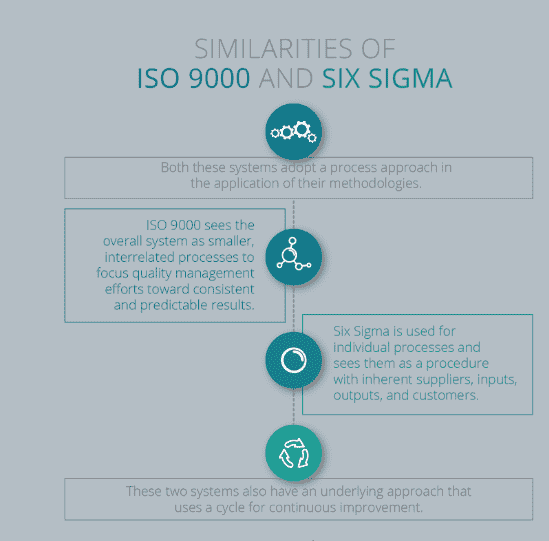
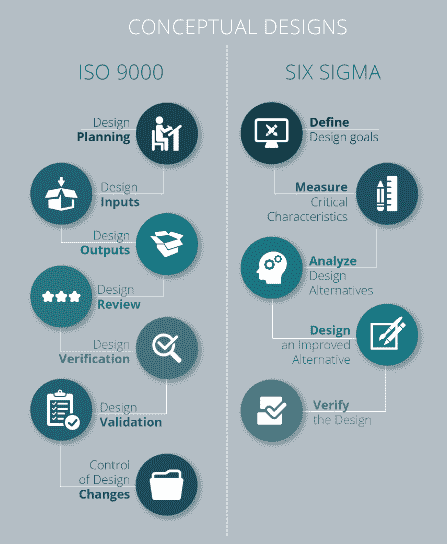

# 六适马对 ISO 9000:视觉指南

> 原文：<https://www.edureka.co/blog/iso-9000-vs-six-sigma-a-visual-guide/>

## 

## 定义质量管理

质量管理是一个被现代企业广泛采用的概念，以满足不断提高运营质量和生产率的需求。质量管理背后的理念是，商品和服务在交付过程中要达到一定的一致性标准。

质量管理有四个基本组成部分:

这些概念已经发展成为国际知名的实践标准。今天最常见的标准是适马和 ISO 9000。

## ISO 9000 基础知识

ISO 9000 是几乎所有行业质量管理体系的公认国际标准。国际标准化组织于 1987 年制定了一套理论要求。从那时起，它已经发展成为一种实用的、面向过程的方法来评估质量管理体系的有效性。

ISO 认证应确保可接受的系统、流程和程序到位，以确保产品和服务质量得到满足。为记录流程知识提供基础是一种基本的培训机制，允许对政策和程序进行有效修订，以确保最可靠的培训标准。

### 六适马基础知识

由摩托罗拉于 1986 年开发的 Six 适马旨在将错误和缺陷减少到每百万个机会 3.4 个的标准比率以下。这是通过识别和消除业务变化的原因来实现的，通过专注于发展对客户需求的清晰理解，使其非常以客户为中心。

六适马为企业带来显著成果的能力在任何公司的一系列流程中都得到了广泛认可。这适用于世界各地的企业，六适马菲也不例外。组织可以获得认证并采用这些质量管理体系。

### 六适马与 ISO 9000 的相似之处

这两个系统也有一个潜在的方法，使用一个持续改进的周期。在进行改进的地方，这个方面允许检查变化并采取行动来纠正问题或巩固已经实现的变化。

### 适马和 ISO 9000 的差异

这两个概念之间的主要区别是，ISO 9000 是一个需求外壳，用作开发整个企业质量管理系统的基础，而六适马只是一套用于改进特定业务流程的工具和方法。

在实施过程中，ISO 9000 没有任何工具可以利用，六适马也没有一套国际公认的标准化要求。这使得 ISO 认证和六适马认证过程不同。

两者在概念设计上也有所不同。六适马使用 DMADV 方法，这不等同于 ISO 9000 的 7 部分设计流程:

### 实现两种制度的协同

由于它们的性质不同，适马六大概念和 ISO 9000 可以用来互补。六种适马方法可用作质量管理体系中的工具，以满足 ISO 9001 要求。

另一方面，可以使用 ISO 9000 框架来评估六适马系统。一个幸运的副作用是，当两种方法集成在一起时，它们可以保持一致——消除了争夺资源的需要。

由于这两个概念的总体目标是相同的，从长期来看，提高质量管理成果的可能性更大。

如果不进行任何整合，同时实施这两个概念将是一种浪费。将两者结合起来有助于提高质量管理体系的可信度和可持续性。结果是节省了大量资源，最终改进了业务管理方式。

这篇博客的完整版本首次发表于[http://apexgloballearning . com/un categorized/iso-9000-and-six-sigma-visual-guide/](http://apexgloballearning.com/uncategorized/iso-9000-and-six-sigma-visual-guide/)

**相关帖子:**

[上手六适马](https://www.edureka.co/six-sigma-green-belt-self-paced)