# 道德黑客教程-初学者指南

> 原文：<https://www.edureka.co/blog/ethical-hacking-tutorial/>

道德黑客是一门被科技行业的大人物广泛遵循的学科，以保护他们的组织免受黑帽黑客即将到来的任何调查。在这篇道德黑客教程中，我将讨论全球正在遵循的这一学科的一些要点。将讨论以下主题:

*   [什么是道德黑客？](#What-is-Ethical-Hacking)
*   [道德黑客角色](#Roles)
*   [为什么道德黑客很重要？](#Importance)
*   [什么是安全威胁？](#Security-Threat)
*   [安全威胁类型](#Types-of-Threats)
*   [安全威胁:防范措施](#Preventive-Measures)
*   [道德黑客技能](#Skills)
*   [为什么要学编程？](#Why-Code)
*   [道德黑客工具](#Tools)
*   [什么是社会工程？](#Social-Engineering)
*   [社会工程技术](#Techniques-Social-Engineering)
*   [密码术](#Cryptography)
*   [标准密码算法](#Cryptographic-Algorithms)
*   [RC4 解密演示](#Demo)

如果你喜欢看而不是读，这里有这个道德黑客教程的视频版本。

## 道德黑客新手教程|道德黑客培训| Edureka

[//www.youtube.com/embed/YkZBsiQj5lc?rel=0&showinfo=0](//www.youtube.com/embed/YkZBsiQj5lc?rel=0&showinfo=0)

这段 Edureka“道德黑客教程”视频将为你介绍道德黑客。这个视频会给你一个详尽的视频，为初学者讲述道德黑客的关键话题！

## **什么是道德黑客？**

黑客行为被定义为在目标系统中发现一组漏洞并系统地利用它们的过程。道德黑客作为一门学科，通过在过程中添加一个重要元素——“同意”，将自己与黑客区分开来。在该流程中增加“同意”有两个目的—

*   流程成为合法活动
*   因为道德黑客在侵入系统之前会获得许可，所以从法律上确保他没有恶意。这通常是通过让有道德的黑客签署合同来实现的，这些合同在法律上约束他努力提高公司的安全性

*因此*一个道德黑客是一个计算机安全专家，他在拥有者的同意或允许下侵入一个系统，披露系统安全中的漏洞，以便改进它。现在，让我们在这篇道德黑客教程中回顾一下道德黑客的角色。

## **道德黑客角色**

道德黑客在他们工作的组织中有各种[角色。考虑到公共和私人组织都采用道德黑客的事实，目标可能会多种多样，但它们可以归结为几个关键点——](https://www.edureka.co/blog/ethical-hacking-career/#ethical-hacker-responsibilities)

## **为什么道德黑客很重要？**

数据已经成为一种无价的资源。因此，保护隐私和数据的完整性也变得越来越重要。本质上，这使得道德黑客在今天变得极其重要！这主要是因为几乎每个企业都有面向互联网的一面。无论是公共关系、内容营销还是销售，互联网都被用作一种媒介。这使得用于服务媒体的任何端点都成为可能的漏洞。

此外，当代的黑客已经证明了他们在侵入系统方面是有创造力的天才。以毒攻毒在现实世界中可能行不通，但要击退如此聪明的黑客，一个组织需要有相同思路的人。最近的黑客入侵已经导致了数百万美元的损失。这些事件给全球企业敲响了警钟，让它们重新思考自己在道德黑客和网络安全的重要性上的立场。 在详细说明了道德黑客的角色及其对组织的重要性之后，让我们继续前进，在本道德黑客教程中讨论道德黑客的一些关键要素。如果你想开始职业道德黑客生涯，参加[职业道德黑客认证](https://www.edureka.co/ceh-ethical-hacking-certification-course)培训并获得认证。

## **什么是安全威胁？**

作为一名[道德黑客](https://www.edureka.co/blog/how-to-become-an-ethical-hacker/)，你的日常工作将包括处理一堆安全威胁。

*任何有可能危害系统或组织整体的风险都是安全威胁。让我们回顾一下安全威胁的类型。*

### **安全威胁类型**

威胁有两种类型:

身体威胁

身体威胁进一步分为三类。

*   **内部**，如硬件起火、电源故障、内部硬件故障等
*   **外部**，如洪水、火灾、地震等
*   **人为**如故意破坏、纵火、意外失误等

非物理威胁

非物质威胁包括每一种没有物质表现的威胁。它们也被称为逻辑威胁。下面是最常见的非物理威胁的图片:

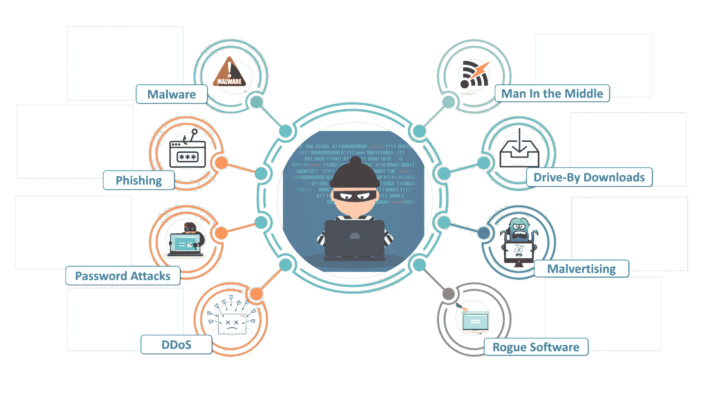一个有道德的黑客一般每天都要处理非物理威胁，他的责任就是想出针对这些威胁的防范措施。

## **安全威胁:防范措施**

在讨论了道德黑客经常应对的威胁类型之后，让我们在这篇道德黑客教程中回顾一下应对所讨论的威胁所需的技能。

## **道德黑客技能**

职业黑客是一名计算机专家，专门从事网络和渗透测试。这通常需要以下技能组合—

*   各种操作系统的专业知识，主要是 Linux 及其各种发行版。这是因为漏洞测试的很大一部分包括入侵目标系统和筛选他们的系统。如果对操作系统没有很好的理解，这是不可能的。
*   深入的网络知识也是成功的[道德黑客生涯](https://www.edureka.co/blog/ethical-hacking-career/)的关键。这包括数据包跟踪，数据包嗅探，入侵检测&预防，扫描子网等。
*   编程:现在编程是一个庞大的话题，每种语言都有细微差别。作为一个有道德的黑客，我们不期望你是一个编程高手，而是一个多面手。

下面是主要/常用编程语言的表格。了解这些对你这个有道德的黑客肯定有帮助:

| **语言** | **描述** | **理学** |
| HTML | 用于创建网页 | HTML 表单被用来在互联网上输入数据。能够构建自己的表单来分析漏洞有助于找出代码中的安全问题 |
| Javascript | 客户端脚本语言。也用于编写后端服务 | JavaScript 代码在客户端浏览器上执行。JS 的知识可以用来读取保存的 cookies，执行跨站脚本等。 |
| SQL | 用于与数据库交互 | 使用 SQL 注入，绕过脆弱的 web 应用程序登录算法，从数据库中删除数据等。 |
| PHP/Ruby | 服务器端脚本。 | PHP 是最常用的网络编程语言之一。它用于处理 HTML 表单并执行其他自定义任务。您可以用 PHP 编写一个定制的应用程序，修改 web 服务器上的设置，使服务器容易受到攻击。 |
| 痛击 | 创建小批量文件和方便的脚本 | 当你需要编写自己的外壳代码、漏洞、rootkitss 或者理解和扩展现有的外壳代码、漏洞、rootkit 时，它们就派上了用场。 |

### **为什么要学编程？**

每当我提到编程是合乎道德的黑客本质时，总有人问我*为什么*。这主要是因为人们对一个道德黑客的角色和责任没有丝毫的了解。以下是一些让编程知识对职业黑客生涯至关重要的原因:

谈到道德黑客使用的工具，让我们来看看其中的一些。

## **道德黑客工具**

不可能在一篇文章中介绍所有的道德黑客工具，因此，我将在这一部分介绍一些真正著名的工具:

### **Nmap**

Nmap 是网络映射器(Network Mapper)的缩写，是一种侦察工具，被有道德的黑客广泛用于收集目标系统的信息。这些信息是决定攻击目标系统的后续步骤的关键。Nmap 是跨平台的，可以在 Mac、Linux 和 Windows 上工作。由于其易用性和强大的搜索&扫描能力，它在黑客社区获得了巨大的欢迎。

### **Netsparker**

 Netsparker 是一款 web 应用安全测试工具。Netsparker 可以发现并报告所有类型的 web 应用程序中的 web 应用程序漏洞，如 SQL 注入和跨站点脚本(XSS ),而不管它们是用什么平台和技术构建的。Netsparker 独特而精确的基于证据的扫描技术不仅可以报告漏洞，还可以生成概念证明，以确认它们不是误报。使您不必仔细检查已识别的漏洞。

### 

Burp Suite 是一个基于 Java 的网络渗透测试框架。它已经成为信息安全专业人员使用的行业标准工具套件。Burp Suite 帮助您识别漏洞并验证影响 web 应用程序的攻击媒介。打嗝套装毋庸置疑的接受度和名气可以归功于奇妙的网络应用爬虫。它可以—

*   准确映射内容和功能
*   自动处理会话
*   处理各种状态变化、易变内容和应用程序登录

### **Metasploit**

Metasploit 是一个用 Ruby 编写的开源笔测试框架。它作为研究安全漏洞和开发代码的公共资源，允许网络管理员闯入自己的网络以识别安全风险并记录需要首先解决的漏洞。它也是初级黑客用来练习技能的少数工具之一。它还允许您复制网站，用于网络钓鱼和其他社会工程目的。 谈到社会工程，让我们花一点时间来讨论一下。

## **什么是社会工程？**

在其他恶意活动中，社会工程已被证明是一种非常有效的黑客模式。该术语概括了通过人类互动完成的各种恶意活动。它使用心理操纵来欺骗用户犯安全错误或泄露敏感信息。

社会工程是一个多步骤的过程。犯罪者首先调查预期的受害者，以收集必要的背景信息，如进行攻击所需的潜在进入点和薄弱的安全协议。然后，攻击者采取行动来获得受害者的信任，并为违反安全惯例的后续行动提供刺激，如泄露敏感信息或授予访问关键资源的权限。

下图描绘了社会工程攻击的各个阶段: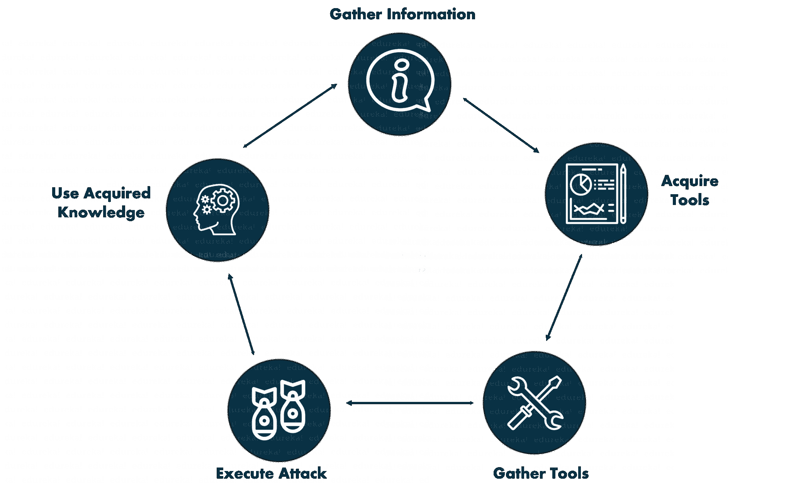

## **社会工程技术**

在这篇道德黑客教程中，让我们继续讨论用于社会工程的各种方法。

###  **熟稔利用** 

你总是相信你熟悉的人，不是吗？这正是社会工程布道者所利用的！犯罪者可能会让自己熟悉所选择的目标，用日复一日的方法，这些方法都涂有友好的外表。这些活动包括和某人一起抽烟、出去喝酒、玩电子游戏等。

###  **钓鱼** 

网络钓鱼已经被证明是一种绝妙的社交工程方法。网络钓鱼包括创建外观和感觉都像合法网站的假冒网站。访问该网站的人被诱骗输入他们的凭证，然后这些凭证被存储并重定向到黑客的系统。

### **利用人类的情感**

 利用人类的情感可能是社会工程中最简单的手艺。像贪婪和怜悯这样的感情很容易被触发。社会工程师可能故意将感染了病毒的闪存盘放在用户容易拿起的地方。用户很可能会将闪存盘插入计算机。该驱动器可能受到各种非物理威胁的侵扰，这些威胁实际上可能是受感染的文件。有道德的黑客的工作就是在他/她工作的组织中传播关于这种技术的意识。现在让我们花一点时间来讨论一下这个道德黑客教程中的密码学和密码分析。

## **密码术**

[密码术](https://www.edureka.co/blog/what-is-cryptography/)是将文本加密成不可读格式的艺术。万一你的数据落入坏人之手，只要加密得好，你就可以放心了。只有拥有解密密钥的人才能看到数据。一个有道德的黑客更感兴趣的是让他不用钥匙就能破译数据的算法。这被称为密码分析。

### 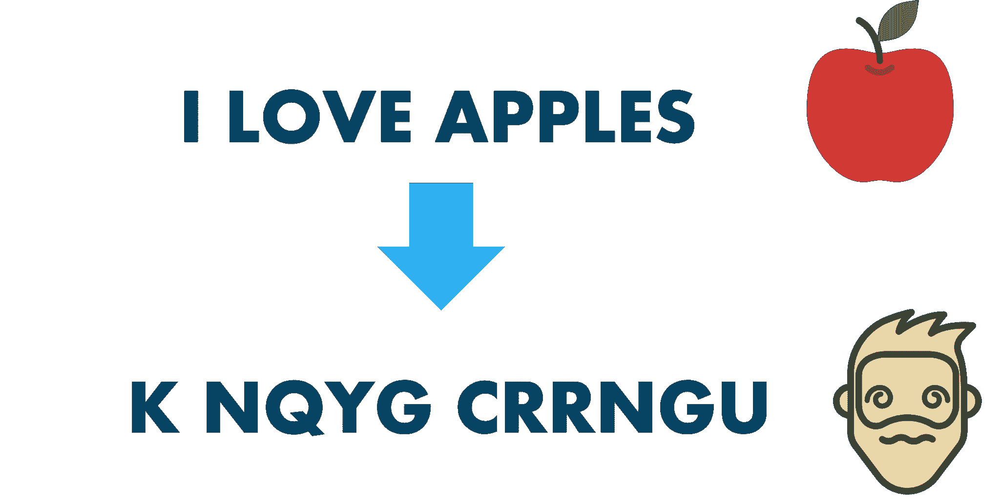

密码分析是对信息系统进行分析的研究，目的是研究系统隐藏的方面。密码分析用于破坏密码安全系统，并获得对加密消息内容的访问，即使密钥是未知的。暴力破解、字典攻击、彩虹表攻击等方法都源于密码分析。密码分析的成功取决于一个人拥有的时间、可用的计算能力以及存储量。

## **标准密码算法**

让我们讨论一些迄今为止最常用的加密算法:

**MD5**–这是消息摘要 5 的首字母缩写。它用于创建 128 位哈希值。理论上，散列不能被还原成原始的纯文本。MD5 用于加密密码以及检查数据完整性。MD5 不是抗冲突的。抗冲突性是发现产生相同散列值的两个值的困难。

**SHA**——这是安全哈希算法的首字母缩写。SHA 算法用于生成消息的压缩表示(消息摘要)。它有各种版本，如:

*   **SHA-0** :产生 120 位哈希值。由于存在重大缺陷，它被停止使用，由 SHA-1 取代。
*   **SHA-1** :产生 160 位哈希值。它类似于 MD5 的早期版本。它有加密弱点，从 2010 年开始不推荐使用。
*   **SHA-2** :它有两个哈希函数，分别是 SHA-256 和 SHA-512。SHA-256 使用 32 位字，而 SHA-512 使用 64 位字。
*   **SHA-3** :这个算法以前被称为 Keccak。

**RC4**–该算法用于创建流密码。它主要用于加密互联网通信的**安全套接字层(SSL)** 和保护无线网络安全的**有线等效保密(WEP)** 等协议中。【T8

## **黑客活动——RC4 解密演示**

在这个解密的实际应用中，我们将尝试使用一个叫做 [Cryptool](https://www.cryptool.org/en/ct1-downloads) 的工具来解密 RC4 加密文本。我们将使用 RC4 加密一段文本，然后尝试解密它。

步骤 1:安装 Cryptool 后，在您的系统上启动它。应该会弹出一个相同的窗口。

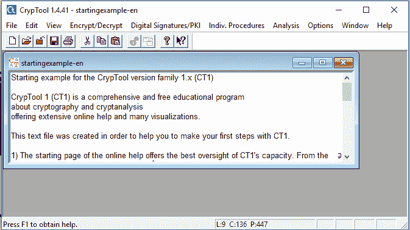

第二步:用你想要的替换你在窗口中看到的文本。对于这个特殊的例子，我将使用短语:

*‘ The quick brown fox jumped over the lazy dog ‘*
**

第三步:选择 RC4 加密算法来加密你的文本。

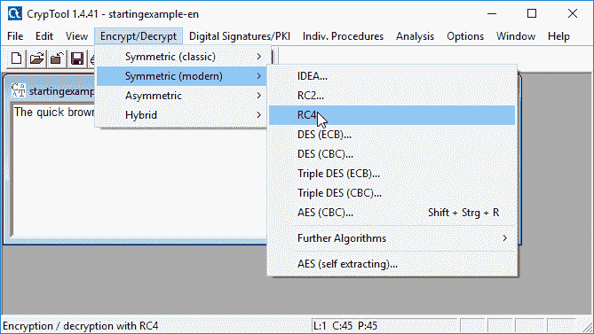

第四步:设置密钥长度为 24 位，值为‘00 00 00’。

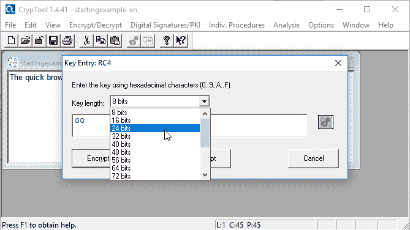

第五步:加密！

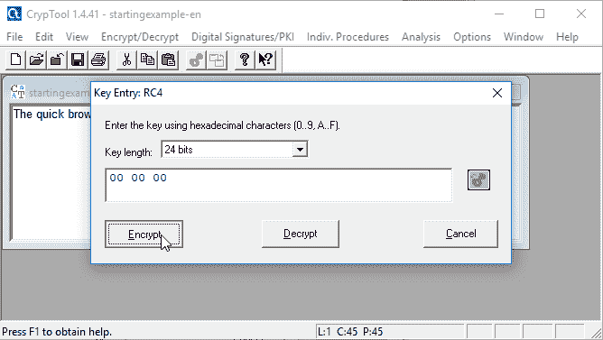

您应该得到这样的输出。这是您输入的纯文本的密文。

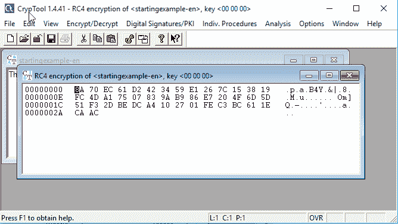

第六步:在分析选项卡上选择 RC4。

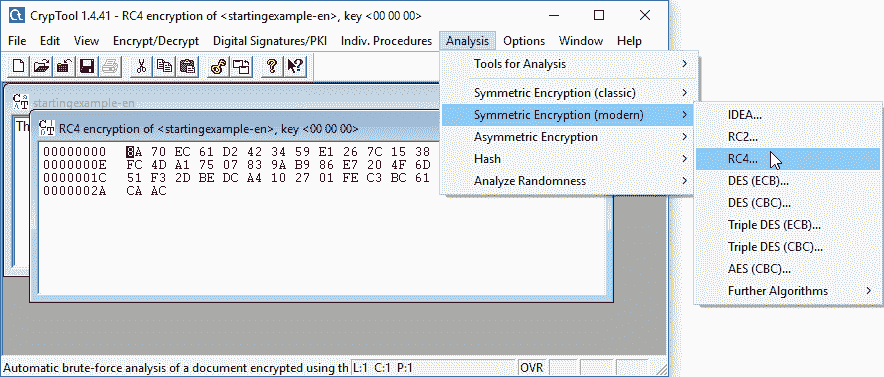

第七步:设置密钥长度为 24 位。

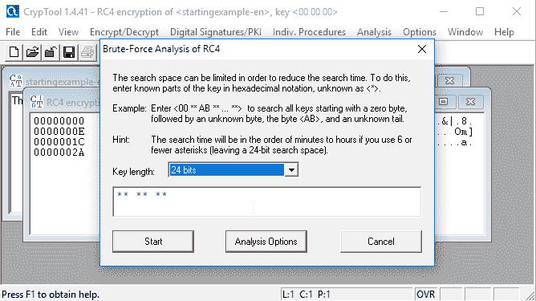

第八步:等待它解密！

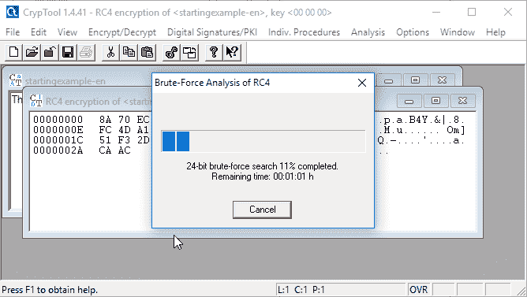

第九步:熵最小的值应该是原明文。

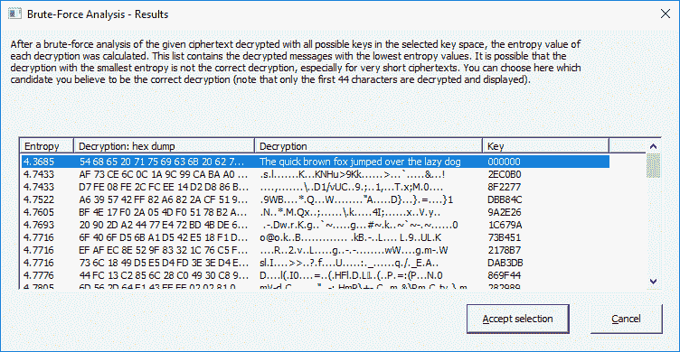

这个道德黑客教程到此结束。关于网络安全的更多信息，你可以看看我的其他[博客](https://www.edureka.co/blog/?s=cybersecurity)。如果您希望学习网络安全并在这一领域建立丰富多彩的职业生涯，那么请查看我们的 [***网络安全认证培训***](https://www.edureka.co/cybersecurity-certification-training) ，它附带有讲师指导的现场培训和真实项目经验。本培训将帮助您深入了解网络安全，并帮助您掌握该主题。

*您还可以看看我们新推出的关于 [**CompTIA Security 认证**](https://www.edureka.co/comptia-security-plus-certification-training) 培训的课程，这是 Edureka & CompTIA Security+之间首次正式合作。它为您提供了一个获得全球认证的机会，该认证侧重于安全和网络管理员不可或缺的核心网络安全技能。*

通过 Edureka 的[网络安全大师](https://www.edureka.co/masters-program/cybersecurity-training)项目 以正确的方式学习网络安全，保护世界上最大的公司免受网络钓鱼者、黑客和网络攻击。

<article class="maincontentblog">Got a question for us? Please mention it in the comments section of the “Ethical Hacking Tutorial” blog and we will get back to you.</article>**