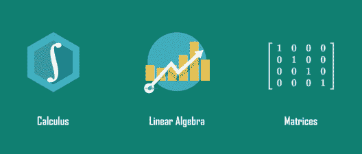
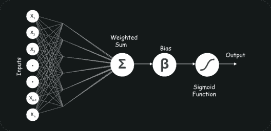
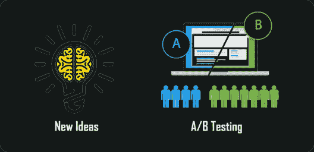
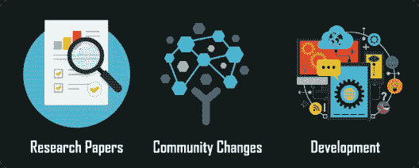
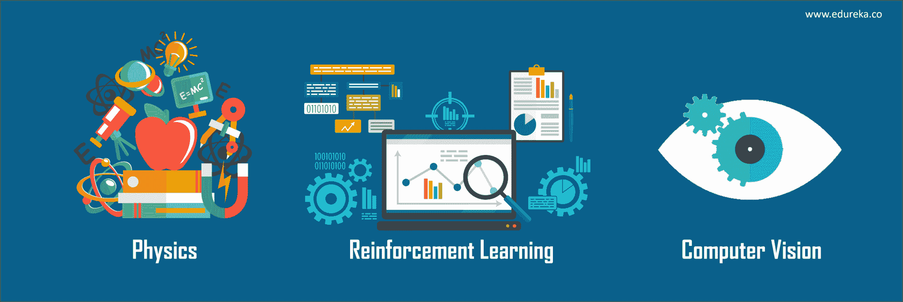

# 成为机器学习工程师的 10 大技能

> 原文：<https://www.edureka.co/blog/machine-learning-engineer-skills/>

我们生活在人类和机器的世界里。数百万年来，人类一直在进化，并从他们过去的经历中学习。另一方面，机器和机器人的时代才刚刚开始。机器的未来是巨大的，超出了我们的想象范围。我们把这个重大的责任放在一个特殊的人身上，即机器学习工程师 T2。那么，让我们来看看成为一名成功的 ML 工程师所需的一些[机器学习](https://www.edureka.co/blog/what-is-machine-learning/)工程师技能。

在本文中，我将讨论以下主题:

所以在我们熟悉机器学习工程师技能之前，让我们先了解一下到底谁是 ML 工程师。

## 谁是机器学习工程师？

机器学习工程师是复杂的程序员，他们开发可以学习和应用知识而无需特定方向的机器和系统。

[人工智能](https://www.edureka.co/blog/what-is-artificial-intelligence)是一个机器学习工程师的目标。他们是计算机程序员，但他们的重点不仅仅是为机器编写特定的程序来执行特定的任务。他们创造程序，使机器能够采取行动，而不需要特别指导去执行那些任务。

通过 [人工智能课程](https://www.edureka.co/executive-programs/machine-learning-and-ai) 将自己转变为高技能专业人士，并获得高薪工作。也可以看看 Edureka 的这个 [**NLP 训练**](https://www.edureka.co/python-natural-language-processing-course) 把你的 AI 技能提升到下一个层次

现在我们知道了，谁是 ML 工程师，让我们一个一个地向前推进机器学习工程师技能。

## 机器学习工程师技能

## 编程语言(R/Java/Python/C++)

首要的要求是掌握一门编程语言，最好是 python，因为它简单易学，应用范围比任何其他语言都广。 [Python](https://www.edureka.co/blog/videos/python-programming/) 是机器学习的通用语言。

很好地理解像数据结构、内存管理和类这样的主题是很重要的。虽然 Python 是一门非常好的语言，但它本身并不能帮助你。你可能需要学习所有这些语言，比如 C++、R、Python、Java，并且在某些时候还需要使用 MapReduce。

## [统计数据](https://www.edureka.co/blog/statistical-modeling-in-business-analytics-with-r/)

要求熟悉矩阵、向量和矩阵乘法。很好地理解导数和积分是必要的，因为即使像梯度下降这样简单的概念也可能会难住你。

均值、标准差和高斯分布等统计概念需要与概率理论一起用于算法，如**朴素贝叶斯**、高斯混合模型和隐马尔可夫模型。

## 信号处理技术

少数机器学习工程师技能之一也是对信号处理的理解，并且具有使用信号处理技术作为特征提取来解决不同问题的能力是机器学习最重要的部分之一。

时频分析知识和先进的信号处理算法，如小波、剪切波、曲波和小波，将帮助你解决复杂的情况。

## 应用数学

很多机器学习技术都只是一些奇特的函数逼近。对算法理论有扎实的理解，了解[梯度下降](https://www.edureka.co/blog/tensorflow-tutorial/)，凸优化，二次规划，偏导数等科目会有很大帮助。

## 神经网络架构

[神经网络](https://www.edureka.co/blog/neural-network-tutorial/)是一般机器学习文献中的一类模型。神经网络是一套特定的算法，它彻底改变了机器学习。

对于人类无法直接编码的复杂任务，我们需要机器学习，即复杂到不切实际的任务。神经网络本身是一般的函数近似，这就是为什么它们可以应用于几乎任何关于学习从输入到输出空间的复杂映射的机器学习问题。

神经网络是迄今为止处理许多问题最准确的方法，如翻译、语音识别和图像分类。

## 语言、音频和视频处理

因为自然语言处理结合了两个主要的工作领域。语言学和计算机科学，在某些时候，你可能会用到文本、音频或视频。因此，有必要很好地控制像 Gensim、NLTK 这样的库，以及像 word2vec、情感分析和摘要这样的技术。

语音和音频分析包括从音频信号本身提取有用的信息。精通数学和傅立叶变换的概念会让你在这方面走得更远。

既然我们已经看到了**技术性的**机器学习工程师技能，那么让我们来看看**非技术性的**机器学习工程师技能

## 行业知识

最成功的机器学习项目将是那些解决真正痛点的项目。无论你在哪个行业工作。你应该知道这个行业是如何运作的，以及什么对企业有利。

如果机器学习工程师没有商业头脑，也不知道构成成功商业模式的要素，那么所有这些技术技能都无法得到有效利用。你将无法辨别出需要解决的问题和潜在的挑战，以维持和发展业务。你将无法真正帮助你的组织探索新的商业机会。

## 有效沟通

你需要向在这个领域没有专业知识的人解释 ML 的概念。你可能需要和一个工程师团队以及许多其他团队一起工作。交流将使这一切变得更加容易。

寻找优秀 ML 工程师的公司正在寻找能够清晰流利地将他们的技术发现翻译给非技术团队的人，例如营销或销售部门。

## 快速原型

尽可能快地重复想法对于找到一个可行的想法是强制性的。在机器学习中，这适用于从选择正确的模型到从事 A/B 测试等项目的所有事情。

您需要使用一组技术，使用三维计算机辅助设计(CAD)数据快速制作物理零件或组件的比例模型。

## 保持更新

你必须跟上任何即将到来的变化。每个月都有新的神经网络模型问世，其性能优于以前的架构。

这也意味着通过研究论文、博客、会议视频等了解关于工具理论和算法发展的新闻。在线社区变化很快。

## 额外的机器学习工程师技能

您可能处于这样一种情况，您希望将机器学习技术应用于将与现实世界交互的系统。掌握一些物理知识会让你走得更远。

**强化学习**一直是 2017 年深度学习和人工智能领域许多最令人兴奋的发展背后的驱动力。如果你想进入机器人、自动驾驶汽车或任何其他人工智能相关领域，这将是理解的关键。

计算机视觉和机器学习是计算机科学的两个核心分支，可以为完全依赖 CV 和 ML 算法的非常复杂的系统提供功能和动力，但当你将两者结合起来时，你可以实现更多。

就这样，我们结束了这篇文章。我希望你理解了成为一名成功的机器学习工程师所需要的各种技术和非技术的机器学习工程师技能。

*Edureka 的 [**机器学习工程师硕士项目**](https://www.edureka.co/masters-program/machine-learning-engineer-training) 让你精通监督学习、非监督学习、*和*自然语言处理等技术。它包括人工智能&机器学习方面的最新进展和技术方法的培训，如深度学习、图形模型和强化学习。*

有问题要问我们吗？请在“机器学习工程师技能”文章的评论部分提到它，我们会回复你