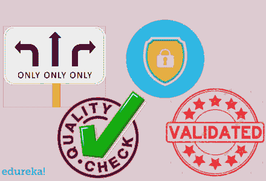
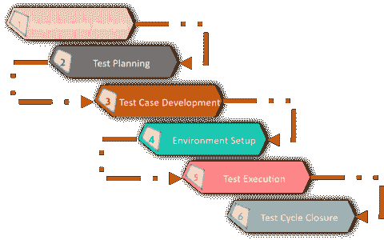
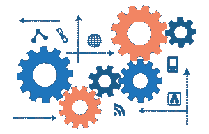
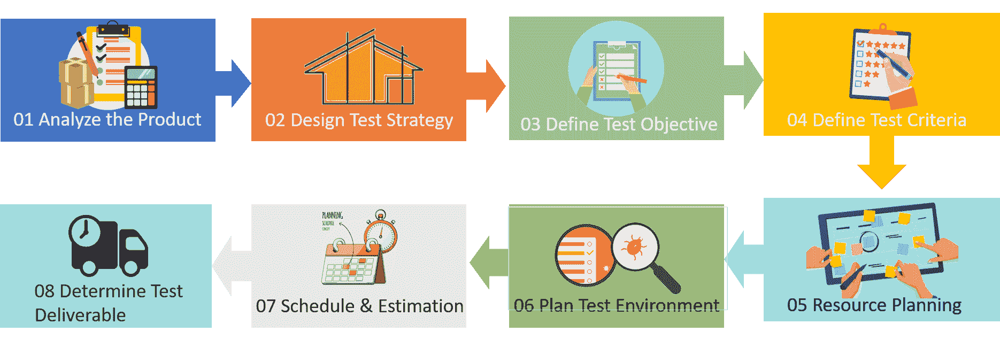
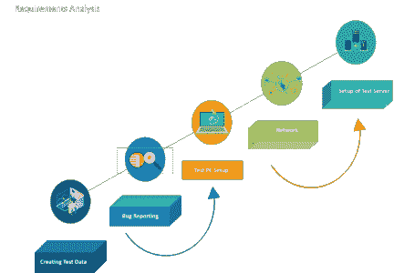
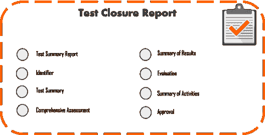

# 软件测试生命周期——测试的不同阶段

> 原文：<https://www.edureka.co/blog/software-testing-life-cycle/>

在过去的十年里，软件测试行业行业 发生了翻天覆地的变化，让位给了更好的前景。确保软件应用程序的有效性能非常重要，需要进行软件测试以确保应用程序无故障运行。这个关于软件测试生命周期的博客将按以下顺序提供关于测试中所有步骤的详细知识:

*   [什么是软件测试？](#softwaretesting)
*   为什么测试很重要？
*   什么是软件测试生命周期？
    *   软件测试生命周期的不同阶段是什么？
*   [什么是软件测试中的 SDLC 和 STLC？](#sdlcvsstlc)

## **什么是软件测试？**

软件测试是评估软件应用程序的功能以发现任何软件缺陷的过程。它检查开发的软件是否满足指定的要求，并识别软件中的任何缺陷，以便生产出高质量的产品。

它也被称为验证和确认软件产品的过程。它检查软件产品是否:

*   满足指导其设计和开发的业务和技术需求
*   按照要求工作
*   可以用相同的特征来实现

现在我们知道了什么是软件测试，让我们继续我们的软件测试生命周期博客，看看我们为什么需要测试。

## **为什么测试很重要？**

软件测试的重要性是势在必行的。软件测试很重要，原因如下:

1.  软件测试指出在开发阶段出现的缺陷和错误。它寻找程序员在软件实现阶段所犯的任何错误。
2.  它确保客户认为组织是可靠的，并保持他们对应用程序的满意度。有时，合同会包含与产品的时间表和质量相关的罚款，软件测试会防止金钱损失。【T2
3.  这也保证了产品的质量。交付给客户的优质产品有助于赢得他们的信任。它确保软件应用需要更低的维护成本，并产生更准确、一致和可靠的结果。
4.  用户不倾向于使用有缺陷的软件。如果他们对应用程序的稳定性不满意，他们可能不会采用软件。测试对于产品在商业中的生存是很重要的。
5.  确保应用程序不会导致任何失败 是很重要的，因为在未来或开发的后期，这可能会非常昂贵。

现在我们知道了什么是软件测试以及为什么它很重要，让我们进入软件测试生命周期的细节，并了解更多关于测试的不同阶段。

## 什么是软件测试生命周期？

软件测试生命周期(STLC)定义了一系列执行软件测试的活动。它确定了要执行的测试活动以及何时完成这些测试活动。在 STLC 流程中，每项活动都是以有计划、有系统的方式进行的，每个阶段都有不同的目标和可交付成果。

### 软件测试生命周期的不同阶段是什么？

软件测试生命周期的不同阶段有:

*   [需求分析](#requirementanalysis)
*   [测试计划](#testplanning)
*   [测试用例开发](#testcasedevelopment)
*   [环境设置](#environmentsetup)
*   [测试执行](#testexecution)
*   [测试周期结束](#testcycleclosure)

现在让我们继续，详细看看软件测试生命周期的不同阶段。

### **需求分析**

需求分析是软件测试生命周期的第一步。在这一步，质量保证(QA)团队理解我们将要测试的需求&找出可测试的需求。在这个阶段，测试团队从测试的角度研究需求，以确定可测试的需求。QA 团队可能与各种利益相关者互动，例如客户、业务分析师、技术领导、系统架构师等。详细了解需求。

不同类型的要求包括:

****

业务需求–它们是从项目的业务案例中提取出来的高层次需求。

****

**架构&设计需求**–这些需求比业务需求更加详细。它决定了实施业务需求所需的总体设计。

****

**系统&集成需求**–是每一项需求的详细描述。它可以是真实描述日常商业语言的用户故事的形式。这些需求非常详细，因此开发人员可以开始编码。

| **参赛标准** | **可交付物** |
| 需要以下文件:

*   需求规格。
*   应用架构

 | 

*   List of questions that solve all answers from testable requirements
*   Automated feasibility report

 |

| **活动** |
| 

*   Prepare a list of problems or questions and get solutions from business analysts, system architecture, customers, technical managers/leaders, etc.
*   List all types of tests, such as function, security and performance.
*   Define the focus and priority of the test.
*   List the details of the test environment where the test activities will be performed.
*   If necessary, check automation feasibility & prepare automation feasibility report.

 |

## **测试计划**

测试计划是软件测试生命周期中最重要的阶段，在这里定义了所有的测试策略。这个阶段也被称为 **测试策略** 阶段。在这个阶段，测试经理参与确定整个项目的工作量和成本估计。它定义了项目的目标&范围。

常用的测试类型有:

*   单元测试
*   API 测试
*   整合测试
*   系统测试
*   安装/卸载测试
*   敏捷测试

测试计划是软件测试生命周期中最重要的步骤之一。编写测试计划的步骤包括:

1.  分析产品
2.  设计测试策略
3.  定义测试目标
4.  定义测试标准
5.  资源规划
6.  计划测试环境
7.  进度和评估
8.  确定测试可交付成果

## ****

## **测试用例开发**

一旦测试计划阶段完成，测试用例开发就开始了。这是 STLC 的阶段，测试团队记录详细的测试用例。除了测试用例，测试团队还为测试准备测试数据。一旦测试用例准备好了，这些测试用例就由同行成员或 QA 领导评审。

一个  好的测试用例  能够有效地发现缺陷，并且覆盖了被测系统的大部分场景。下面是如何开发一个好的测试用例的逐步指南:

*   测试用例需要简单和透明
*   以最终用户为中心创建测试用例
*   避免测试用例重复
*   不要假设您的软件应用的功能和特性
*   确保 100%覆盖软件需求
*   命名测试用例 id，以便在跟踪缺陷时容易识别它们
*   实施测试技术
*   您创建的测试用例必须将测试环境返回到测试前的状态
*   测试用例每次都应该生成相同的结果
*   你的同行应该能够发现你的测试用例设计中的缺陷

## **测试环境设置**

建立测试环境是软件测试生命周期的重要部分。测试环境是测试团队执行测试用例的软件和硬件的设置。它支持硬件、软件和网络配置的测试执行。

测试环境包括设置不同的区域，如:

*   **测试服务器的设置**–并非每个测试都在本地机器上执行。可能需要建立一个测试服务器来支持应用程序。
*   **网络**–我们需要根据需求建立网络。
*   测试 PC 设置–我们需要为不同的测试人员设置不同的浏览器。
*   错误报告–应该向测试人员提供错误报告工具。
*   **为测试环境创建测试数据**–许多公司使用单独的测试环境来测试软件产品。常用的方法是复制生产数据进行测试。

## **测试执行**

软件测试生命周期的下一个阶段是测试执行。测试执行是执行代码并比较预期和实际结果的过程。当测试执行开始时，测试分析师根据项目中允许的测试策略开始执行测试脚本。

| **参赛标准** | **可交付物** |
| 

*   Test plan or test strategy document.
*   Test cases.
*   Test data.

 | 

*   Test case execution report.
*   Report defects.

 |

| **活动** |
| 

*   Mark the status of test cases, such as pass, fail, block, not run, etc.
*   Assign Bug Id to all failed and blocked test cases.
*   Test again after fixing the defect.
*   Track defects for closure.

 |

## **测试周期结束**

软件测试生命周期的最后阶段是测试周期结束。它包括召集测试团队成员参加&会议，评估基于测试覆盖、质量、成本、时间、关键业务目标和软件的周期完成标准。

在达到退出标准并完成测试阶段后，测试主管会发布一份测试结束报告。它遵循标准格式，例如:

*   测试总结报告
*   标识符
*   测试总结
*   差异
*   全面性评估
*   结果摘要
*   估价
*   活动摘要
*   同意

****

**测试结束的阶段:**

测试结束流程在六个重要阶段的帮助下实施，例如

1.  **检查计划的可交付成果**–团队检查并分析将要交给项目干系人的计划的可交付成果。
2.  **关闭事件报告**–团队检查计划的交付件是否已交付，并验证所有事件是否在流程结束前得到解决。
3.  **移交给维护人员**–在解决事件并关闭事件报告后，测试件被移交给维护团队。
4.  **最终确定&归档测试件/环境**–它包括最终确定和归档测试件和软件，如测试脚本、测试环境、测试基础设施等。
5.  **记录系统验收**–它包括根据概述的策略进行系统验证和确认。
6.  **分析最佳实践**–它确定类似项目及其未来发布所需的各种变更。

现在让我们继续阅读本文，理解 SDLC 和 STLC 之间的区别。

## **什么是软件测试中的 SDLC 和 STLC？**

| **SDLC** | **STLC** |
| 代表软件开发生命周期 | 代表软件测试生命周期 |
| 它指的是在软件开发过程中执行的一系列不同的活动 | 它指的是在软件测试过程中执行的一系列不同的活动 |
| 目标是成功完成软件的开发，包括测试和其他阶段 | 旨在评估软件应用程序的功能，以发现任何软件缺陷 |
| 在 SDLC 中，软件代码是基于设计文档构建的 | 在 STLC 中，创建测试环境，并在软件上进行各种测试 |

至此，我们结束了这个“软件测试生命周期”的博客。我希望你们喜欢这篇文章，并且理解什么是软件测试和不同类型的软件测试。

*既然你已经了解了测试的类型，那就来看看 Edureka 的 [**软件测试基础课程**](https://www.edureka.co/software-testing-fundamentals-training) ，这是一家值得信赖的在线学习公司，在全球拥有超过 250，000 名满意的学习者。本课程旨在向您介绍完整的软件测试生命周期。您将学习不同级别的测试、测试环境设置、测试用例设计技术、测试数据创建、测试执行、错误报告、DevOps 中的 CI/CD 管道以及软件测试的其他基本概念。有问题要问我们吗？请在“软件测试生命周期”的评论部分提到它，我们会给你回复。*