# 关于 Kali Linux 你需要知道的一切

> 原文：<https://www.edureka.co/blog/ethical-hacking-using-kali-linux/>

## **使用 Kali Linux 的道德黑客**

通常，特定的操作系统会被绑定到特定的任务上。任何与图形或内容创作相关的东西都会让我们想起 macOS。类似地，任何黑客行为或只是一般地摆弄网络实用程序也映射到一个特定的操作系统，那就是 **Kali Linux** 。在这篇文章中，我将写一篇关于 Kali Linux 的概述，以及它如何被用于[道德黑客](https://www.edureka.co/blog/ethical-hacking-tutorial/)。在这篇关于“使用 Kali Linux 的道德黑客”的文章中，讨论了以下主题:

*   [什么是 Kali Linux？](#what-is-kali)
*   [Kali Linux 的开发](#development)
*   [为什么要用 Kali Linux？](#why-use-kali)
*   【Kali Linux 的系统要求
*   [工具清单](#tools)
*   [演示动力-空气裂解和压缩](#demo)

## **什么是 Kali Linux？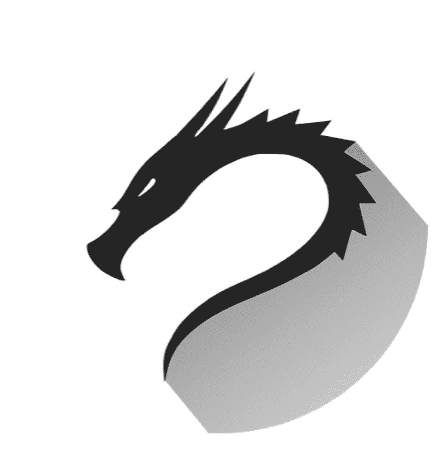** 

Kali Linux 是基于 Debian 的 Linux 发行版。这是一个精心制作的操作系统，专门迎合网络分析师和渗透测试人员的喜好。Kali 预装的大量工具的存在将它变成了道德黑客的瑞士刀。

### **黑客为什么用 Kali Linux？**

Kali Linux 以前被称为 Backtrack，它标榜自己是一个更加完美的继任者，拥有更多以测试为中心的工具，不像 Backtrack 有多个工具可以达到相同的目的，这反过来又使它塞满了不必要的实用程序。这使得使用 Kali Linux 进行道德黑客攻击成为一项简单的任务。

**什么是 Kali Linux？| Kali Linux 教程|网络安全培训| Edureka**

[https://www.youtube.com/embed/J36yzsCLPNg](https://www.youtube.com/embed/J36yzsCLPNg)

### **Kali Linux 是用来做什么的？**

Kali Linux 主要用于高级渗透测试和安全审计。Kali 包含数百个工具，这些工具适用于各种信息安全任务，如渗透测试、安全研究、计算机取证和逆向工程。

### **Kali Linux 非法吗？**

Kali Linux 本身并不违法。毕竟只是一个 OS。然而，它也是一个黑客工具，当有人使用它进行黑客攻击时，它就是非法的。如果你安装它是为了有用的目的，比如学习、教学，或者用它来加强你的软件或网络，这是合法的，因为安装任何许可的和可供下载的操作系统都是合法的。

## **卡莉 Linux 是谁开发的？**(Kali Linux 的开发)

马体·阿哈罗尼和迪冯·科恩斯是 Kali Linux 的核心开发人员。这是对回溯 Linux 的重写，回溯 Linux 是另一个以渗透测试为中心的 Linux 发行版。Kali 的开发是根据 Debian 标准设定的，因为它从 Debian 库导入了大部分代码。开发始于 2012 年 3 月初，由一小组开发人员完成。只有极少数的开发者被允许提交包，这也是在一个受保护的环境中。Kali Linux 在 2013 年发布了第一个版本。从那以后，Kali Linux 经历了许多重大更新。这些更新的开发由攻击性安全部门负责。

## **为什么要用 Kali Linux？**

关于为什么应该使用 Kali Linux，有很多原因。让我列出其中的一些:

1.  **尽可能的免费**–Kali Linux 已经并将永远免费使用。
2.  **比您能想到的更多的工具**–Kali Linux 附带了 600 多种不同的渗透测试和安全分析相关工具。
3.  **开源**–作为 Linux 家族的一员，Kali 遵循广受好评的开源模式。他们的开发树在 Git 上是公开可见的，所有代码都可以用于您的调整目的。
4.  **多语言支持—**虽然渗透工具倾向于用英语编写，但已经确保 Kali 包括真正的多语言支持，允许更多用户用他们的母语操作并找到他们工作所需的工具。
5.  **完全可定制**–进攻安全公司的开发人员明白，并不是每个人都会同意他们的设计模型，所以他们尽可能地让更喜欢冒险的用户能够根据自己的喜好定制 Kali Linux ，一直到内核。

## **Kali Linux 的系统要求——(Kali Linux 需要多少 RAM？)**

安装 Kali 是小菜一碟。你所要做的就是确保你有兼容的硬件。在 i386、amd64 和 ARMEL 和 ARMHF)平台上支持 Kali。下面列出了最低的硬件要求，尽管更好的硬件自然会提供更好的性能。

*   Kali Linux 安装至少需要 20 GB 的磁盘空间。
*   适用于 i386 和 amd64 架构的 RAM，最低 1GB，建议 2GB 或更高。
*   CD-DVD 驱动器/ USB 启动支持/ VirtualBox

## **Kali Linux 自带什么工具？**(工具列表)

下面是使用 Kali Linux 预装的道德黑客工具列表。这个列表绝不是扩展的，因为 Kali 有太多的工具，所有这些都不能在一篇文章中列出和解释。

### **1。T2**

aircrack-n<abbr title="Next generation"><acronym title="Next generation">g</acronym></abbr>是一套用于评估 WiFi 网络安全的工具。它侧重于 WiFi 安全的关键领域:

*   **监控**:数据包捕获和数据导出到文本文件，供第三方工具进一步处理
*   **攻击**:通过数据包注入的重放攻击、去认证、假冒接入点等
*   **测试**:检查 WiFi 卡和驱动能力(捕获和注入)
*   **开裂** : WEP 和 WPA PSK (WPA 1 和 2)

所有的工具都是命令行，允许繁重的脚本。很多图形用户界面都利用了这个特性。它主要运行于 Linux，但也运行于 Windows、OS X、FreeBSD、OpenBSD、NetBSD 以及 Solaris。

### **2。Nmap**

### ****

网络映射器，也就是俗称的 [Nmap](https://www.edureka.co/blog/ethical-hacking-tools/#nmap) ，是一款免费开源的 网络发现和安全审计实用程序。Nmap 以隐蔽的方式使用原始 IP 数据包来确定网络上有哪些主机可用，这些主机提供哪些服务(应用程序名称和版本)，它们运行什么操作系统，使用什么类型的数据包过滤器/防火墙，以及许多其他特征。

许多系统和网络管理员也发现它对以下任务很有用:

*   网络盘点
*   管理服务升级计划
*   监控主机或服务的正常运行时间

### **3。九头蛇** 

当您需要强力破解远程认证服务时，Hydra 通常是首选工具。它可以对 50 多种协议进行快速字典攻击，包括 telnet、FTP、HTTP、HTTPs、SMB、几个数据库等等。它可以被用来破解网页扫描器、无线网络、数据包制造者等等。

### **4。奈瑟斯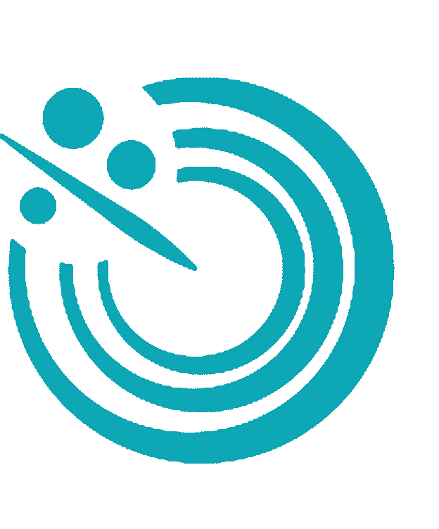**

Nessus 是一个远程扫描工具，可以用来检查计算机的安全漏洞。它不会主动阻止您的计算机存在的任何漏洞，但它能够通过快速运行 **1200+** 漏洞检查来嗅出漏洞，并在需要修补任何安全补丁时发出警报。

### **5。WireShark** 

WireShark 是一款开源的数据包分析器，您可以免费使用。有了它，您可以从微观层面查看网络上的活动，同时还可以访问 pcap 文件、定制报告、高级触发器、警报等。据报道，它是世界上使用最广泛的 Linux 网络协议分析器。

## **力量展示:空气破裂和嘎吱嘎吱**

**步骤 1** :检查您的无线接口名称，并将其置于监控模式。

```
ifconfig wlo1 down
iwconfig wlo1 mode monitor
ifconfig wlo1 up
```

[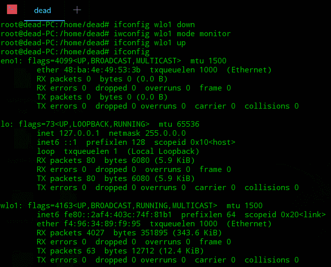](/blog/wp-content/uploads/2019/01/Step-2-Ethical-Hacking-using-Kali-Linux-Edureka-1.png)

**步骤 2** :终止任何可能干扰扫描进程的进程。总是先干掉网络管理员。您可能需要多次运行所示命令。

```
airmon-ng check kill
```

[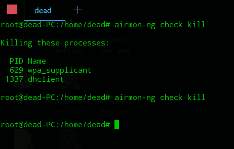](/blog/wp-content/uploads/2019/01/Step-3-Ethical-Hacking-using-Kali-Linux-Edureka-1.png)

**第三步**:成功杀死所有进程后，运行命令——**airodump-ng<interface-name>**。它应该会生成一个接入点列表，如下所示:

```
airodump-ng wlo1
```

[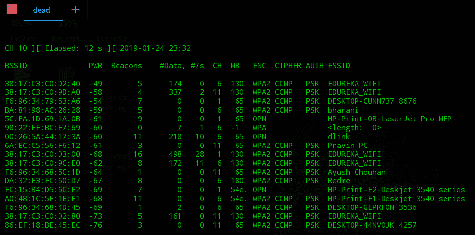](/blog/wp-content/uploads/2019/01/Step-4-Ethical-Hacking-using-Kali-Linux-Edureka-1.png)

**第 4 步**:选择接入点，并使用-w 标志运行它，将结果写入一个文件。我们的文件叫做捕获。

```
airodump-ng -w capture -c 11 --bssid [mac-addr]
```

[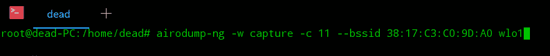](/blog/wp-content/uploads/2019/01/Step-5-Ethical-Hacking-using-Kali-Linux-Edureka-1.png)

**步骤 5** :运行上面的命令应该会在*的“站”下显示连接到该接入点的设备的 MAC 地址。*

[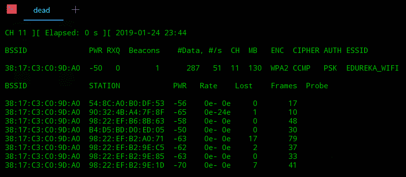](/blog/wp-content/uploads/2019/01/Step-6-Ethical-Hacking-using-Kali-Linux-Edureka-1.png)

**第 6 步**–这是使用 Kali Linux 进行道德黑客活动的最重要的一步。这里，我们将向我们选择攻击的接入点广播一个取消认证信号。这将断开连接到接入点的设备。因为这些设备很可能存储了密码，所以它们会尝试自动重新连接。这将启动设备和接入点之间的 4 次握手，并将在从步骤 4 开始的扫描中被捕获(是的，该扫描仍在后台运行)。

```
aireplay-ng -0 0 -a [mac] wlo1
```

[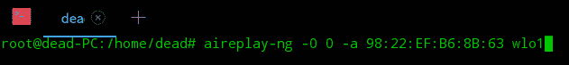](/blog/wp-content/uploads/2019/01/Step-7-Ethical-Hacking-using-Kali-Linux-Edureka-1.png)

第 7 步:现在我们将 crunch 和 air cracking 一起使用。Crunch 是一个单词列表生成器。这个破解密码的过程假设你对密码有一点了解，例如，长度，一些特定的字符等。知道的越多，过程越快。在这里，我尝试生成一个以“sweetship”开头的单词列表，因为我知道 password 包含这个短语。结果被传送到 aircrack 命令，该命令获取捕获文件并比较键值。

```
crunch 12 12 -t sweetship@@@ | aircrack-ng -w - capture-01.cap -e Nestaway_C105
```

[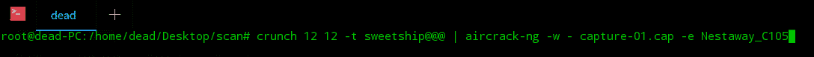](/blog/wp-content/uploads/2019/01/Step-8-Ethical-Hacking-using-Kali-Linux-Edureka-1.png)

**步骤 8:** 根据您输入的参数，扫描结果应该是这样的。

[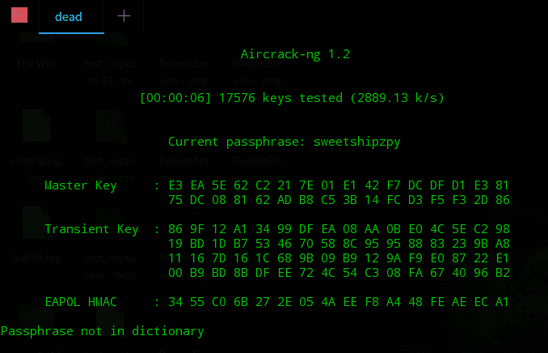](/blog/wp-content/uploads/2019/01/Step-9-Ethical-Hacking-using-Kali-Linux-Edureka-1.png)

**第九步**:密码匹配时。它显示在*“找到钥匙”后面的括号中。*

[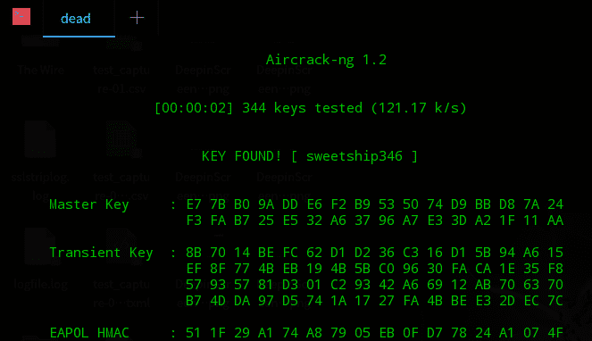](/blog/wp-content/uploads/2019/01/Step-10-Ethical-Hacking-using-Kali-Linux-Edureka-1.png)

好了，伙计们，这篇“使用 Kali Linux 的道德黑客”文章到此结束。这是我发表的一长串道德黑客博客中的一个。关于网络安全的更多信息，你可以看看我的其他[博客](https://www.edureka.co/blog/?s=cybersecurity)。如果你对这篇文章有任何疑问，请在下面的评论区留下你的评论！

如果您希望学习网络安全，并在网络安全领域建立丰富多彩的职业生涯，那么请查看我们的 [***网络安全认证培训***](https://www.edureka.co/cybersecurity-certification-training) ，该培训带有讲师指导的现场培训和真实项目体验。本培训将帮助您深入了解网络安全，并帮助您掌握该主题。

*您还可以看看我们新推出的关于 [**CompTIA Security+认证**](https://www.edureka.co/comptia-security-plus-certification-training) 的课程，这是 Edureka & CompTIA Security+首次与官方合作。它为您提供了一个获得全球认证的机会，该认证侧重于安全和网络管理员不可或缺的核心网络安全技能。*

通过 Edureka 的 [**研究生项目** 和 **NIT Rourkela**](https://www.edureka.co/post-graduate/cybersecurity) 以正确的方式学习网络安全，保护世界上最大的公司免受网络钓鱼者、黑客和网络攻击。

<article class="maincontentblog">*Got a question for us? Please mention it in the comments section of “Ethical Hacking using Kali Linux” and we will get back to you.*</article>