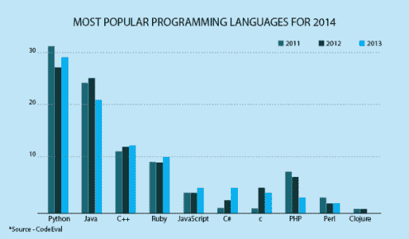
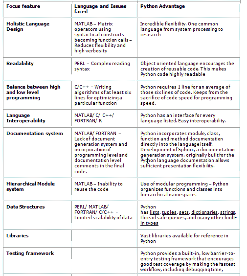

# 选择 Python 的 3 个令人信服的理由

> 原文：<https://www.edureka.co/blog/3-compelling-to-choose-python/>

几年来，从 大数据时代，开始，就有编程语言争相成为大数据解决方案的完美平台。组织需要大量能够快速部署到大数据解决方案中的人力。人们正在加速寻找一种简单易用、可以快速学习的编程语言。然而，大数据只是我们将在本文中讨论的选择 Python 的 3 个令人信服的原因之一。

Python 是网站和移动应用程序首选的高级服务器端编程语言。对于新老开发人员来说，Python 已经轻松地成为了首选语言。由于其可读性和密集的语法，开发人员可以比使用其他语言更容易地表达一个概念。它通过其相关的网络框架 Django 为 Instagram、Pinterest 和 Rdio 的网络应用程序提供支持，也被谷歌、雅虎和美国宇航局使用。

根据 RedMonk 编程语言排名，Python 排名第五。与 2013 年发布的排名相比，它上升了两个百分点。

以下是选择 Python 的 3 个令人信服的理由中的第一个理由:

## **原因#1 : Python +大数据**

学习 Python 进行大数据认证的最大好处之一是在不同的应用程序中使用一种编程语言可以提高效率。Python 可以跨函数使用，使数据专家能够熟练处理任何与数据相关的查询。作为一名大数据架构师，多才多艺很重要。设计的平台应该兼容多个平台，如 Python、Hadoop、Storm、NoSQL 和 Map Reduce。大数据架构师不能孤立工作。

Python 正在以一种非常重要的方式慢慢涉足大数据。Dice 方面的专家表示，用于大数据认证的 Python 肯定是这种组合，这是人们正在寻求的。Python 和大数据特性是财富 500 强公司所需的技能之一。博彩业就是这样一个例子。游戏行业的软件工程师必须了解编程语言，以及数据筛选专业知识。在各行各业，大数据专业人员同时也是编程专家变得势在必行。企业对分析数据以评估消费者行为和预测购买模式的兴趣也在增加。不仅仅是预测分析，大数据正在慢慢进入各种渠道，无论是通信还是性能指标。

这是选择 Python 的三个令人信服的理由中的第二个理由

## **原因#2:工作前景**

随着大数据专业人员招聘的增加，对 Python 专业人员的需求也在增加。组织正在寻找能够理解最简单语言(即 Python)的大型人才库，以应对大数据挑战

目前，就业趋势处于历史最高水平:在以下专业人员的招聘信息中注意到了上升趋势(来源:[【www.indeed.com】](http://www.indeed.com/)和 LinkedIn)。

*   NoSQL (54%)
*   大数据(46%)
*   Hadoop (43%)
*   Python (16%)

Python 与大数据的融合是一个多功能性的问题，支持跨平台工作的灵活性。Python 的敏捷性和用户体验极具魅力。所以 Python 和大数据当然成为不可抗拒的组合。

这是选择 Python 的三个令人信服的理由中的第三个理由

## **原因#3 : Python vs 其他:编码差异**

Python 对于分析师来说很容易学习和使用，但是功能强大到足以解决几乎任何领域中最困难的问题。它与现有的 It 基础设施集成良好，并且独立于平台。随着如此多的现代语言的出现，基于 Python 的解决方案在性能方面具有传奇色彩。TIOBE index 指出 Python 是世界上最受欢迎的语言之一，远远超过 Perl、Ruby 和 JavaScript。

使 python 战胜大多数其他可用编程语言的特性如下

现在你知道了，学习 Python 的 3 个令人信服的理由可以启动你的 it 职业生涯。开始你的 [Python 课程吧！](https://www.edureka.co/python)

有问题要问我们吗？在评论区提到它们，我们会给你回复。

**相关帖子:**

[Python 进行大数据分析](https://www.edureka.co/blog/videos/python-for-big-data-analytics-2/)

[Python 中的字符串](https://www.edureka.co/blog/strings_in_python/)

[开始学习 Python 课程吧！](https://www.edureka.co/python)