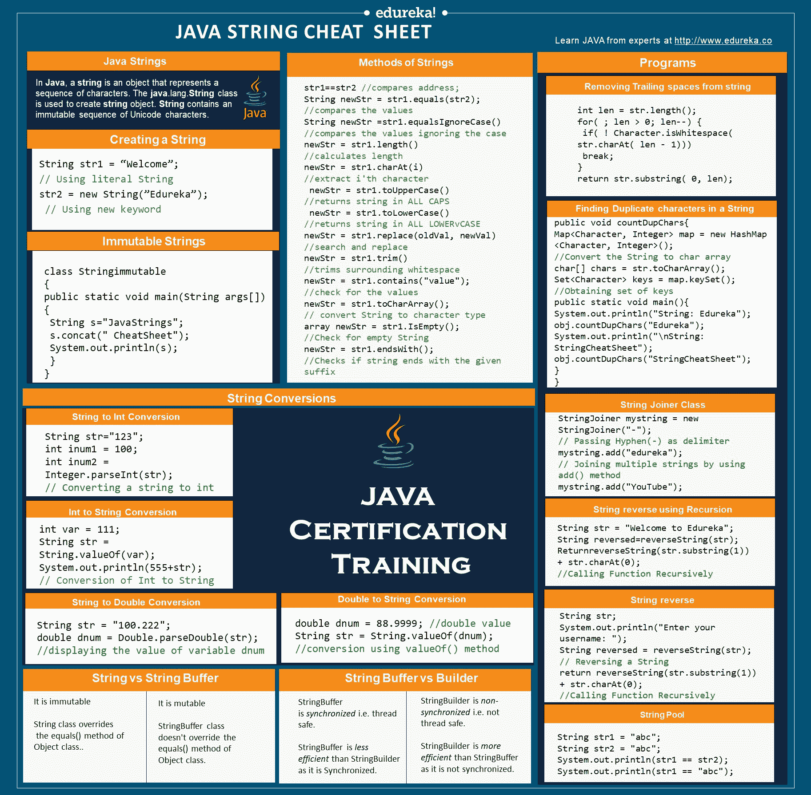

# Java 字符串备忘单

> 原文：<https://www.edureka.co/blog/cheatsheets/java-string-cheat-sheet/>

你是一个正在寻找关于 [**Java 概念**](https://www.edureka.co/blog/java-tutorial/) 的快速指南的 Java 程序员吗？如果是，那么你必须考虑字符串。这篇 **[Java 字符串](https://www.edureka.co/blog/java-string/)** 小抄是为已经踏上学习 Java 之旅的Java 有志者设计的。所以，让我们快速开始使用这个 Java 字符串备忘单。

## Java 字符串备忘单

StringT5是一个字符序列。但是在 Java 中，字符串是表示一系列字符的对象。 *java.lang.String* 类用于创建 String 对象。

<figure class="wpb_wrapper vc_figure"></figure>

<figure class="wpb_wrapper vc_figure">[](https://bit.ly/2R4rKad)</figure>

## 创建字符串

Java 中的 [**字符串**](https://www.edureka.co/blog/java-string/) 是表示一系列 char 值的对象。一个字符串可以通过两种方式创建:

1.  使用文字
2.  使用‘新’关键字

```
String str1 = “Welcome”; // Using literal

String str2 = new String(”Edureka”); // Using new keyword 
```

## 字符串池

Java 字符串池指的是存储在堆内存中的字符串集合。在这种情况下，每当创建一个新对象时，String pool 首先检查该对象是否已经存在于池中。

```
 String str1 = "abc";
     String str2 = "abc";

   System.out.println(str1 == str2);
   System.out.println(str1 == "abc"); 
```

## 字符串转换

## 字符串到整数的转换

```
  String str="123";  int inum1 =  100;  int inum2 =  Integer.parseInt(str);// Converting a string to int  
```

## 字符串到双精度转换

```
  String str =  "100.222";  double dnum =  Double.parseDouble(str); //displaying the value of variable dnum  
```

## Int 到 String 转换

```
  int var =  111;  String str =  String.valueOf(var);   System.out.println(555+str); // Conversion of Int to String  
```

## 双精度到字符串转换

```
double dnum = 88.9999; //double value  String str =  String.valueOf(dnum); //conversion using valueOf() method  
```

## 重要程序

## 在字符串中查找重复字符

这个程序帮助你找出字符串中的重复字符。

## 删除字符串的尾随空格

这个程序告诉你如何从字符串中删除尾随空格，但不删除前导空格。

```
public void countDupChars(String str)
{ //Create a HashMap  Map<Character,  Integer> map =  new  HashMap<Character,  Integer>();  //Convert the String to char array  char[] chars = str.toCharArray(); for(Character ch:chars){  if(map.containsKey(ch)){ map.put(ch, map.get(ch)+1);  }  else  { map.put(ch,  1);  }  } Set<Character> keys = map.keySet(); //Obtaining set of keys  public  static  void main(String a[]){  Details obj =  new  Details(); System.out.println("String: Edureka"); obj.countDupChars("Edureka");  System.out.println("
String: StringCheatSheet"); obj.countDupChars("StringCheatSheet");   }
} 
```

```
int len = str.length();  for(  ; len >  0; len--)  {  if(  !  Character.isWhitespace( str.charAt( len -  1)))  break;  }  return str.substring(  0, len);  
```

## StringJoiner 类

```
StringJoiner mystring =  new  StringJoiner("-"); 
// Passing Hyphen(-) as delimiter  
mystring.add("edureka"); // Joining multiple strings by using add() method 
mystring.add("YouTube");   
```

## 使用递归进行字符串反转

```
class StringReverse 
{ 
 /* Function to print reverse of the passed string */
    void reverse(String str) 
    { 
        if ((str==null)||(str.length() <= 1)) 
           System.out.println(str); 
        else
        { 
            System.out.print(str.charAt(str.length()-1)); 
            reverse(str.substring(0,str.length()-1)); 
        } 
    } 
    /* Driver program to test above function */
    public static void main(String[] args){ 
        String str = "Edureka for Java"; 
        StringReverse obj = new StringReverse(); 
        obj.reverse(str); 
    }     
}
```

## 反转用户输入的字符串

```
String str = "Welcome To Edureka";
String[] strArray = str.split(" ");

for (String temp: strArray)
{
System.out.println(temp);
  for(int i=0; i<3; i++)
  {
char[] s1 = strArray[i].toCharArray();
for (int j = s1.length-1; j>=0; j--) 
{
System.out.print(s1[j]);
} 
```

## 字符串类和接口

## 字符串与字符串缓冲区

| **弦** | **【字符串缓冲】** |
| 它是不可改变的。 | 它是可变的。 |
| 当你连接太多的字符串时，字符串会变慢并消耗更多的内存。 | 连接字符串时，StringBuffer 速度快，占用的内存少。 |
| String 类覆盖 Object 类的 equals()方法。 | StringBuffer 类不重写 Object 类的 equals()方法。 |

## 字符串缓冲区与字符串生成器

| **【字符串缓冲】** | **【string builder】** |
| StringBuffer 是 *synchronized* 即线程安全。 | StringBuilder 是 *非同步* 的，即不是线程安全的。 |
| 由于是同步的，StringBuffer 的效率不如 StringBuilder。 | StringBuilder*比 string buffer*更高效，因为它不是同步的。 |

现在，由 String、StringBuffer 和 StringBuilder 实现的接口显示在下面的代码中。

```
//String implements all the 3 interfaces
public final class String extends Object
implements *Serializable, Comparable<String>, CharSequence*

//StringBuffer implements Serializable & CharSequence interfaces
public final class StringBuffer extends Object
implements *Serializable, CharSequence*

//StringBuilder implements Serializable & CharSequence interfaces
public final class StringBuilder extends Object
implements *Serializable, CharSequence*
```

## string vs string buffer vs StringBuilder

在下面的代码中，我们将对 3 个不同的类执行连接操作。但是，连接只会发生在字符串缓冲区和生成器中。

```
class Edureka{ 
    // Concatenates to String 
    public static void concat1(String s1) 
    { 
        s1 = s1 + "edurekablog"; 
    } 
    // Concatenates to StringBuilder 
    public static void concat2(StringBuilder s2) 
    { 
        s2.append("edurekablog"); 
    } 
    // Concatenates to StringBuffer 
    public static void concat3(StringBuffer s3) 
    { 
        s3.append("edurekablog"); 
    } 
   public static void main(String[] args) 
    { 
        String s1 = "Andvideos"; 
        concat1(s1);  // s1 is not changed 
        System.out.println("String: " + s1); 
        StringBuilder s2 = new StringBuilder("Andvideos"); 
        concat2(s2); // s2 is changed 
        System.out.println("StringBuilder: " + s2); 
        StringBuffer s3 = new StringBuffer("Andvideos"); 
        concat3(s3); // s3 is changed 
        System.out.println("StringBuffer: " + s3); 
    } 
}
```

因此，在输出中，s1 将保持不变，s2 和 s3 将发生变化，并发生级联。

## 字符串方法

下面列出了一些最重要和最常用的[字符串](https://www.edureka.co/blog/java-string/)方法:

```
str1==str2 //compares address;
String newStr = str1.equals(str2); //compares the values
String newStr = str1.equalsIgnoreCase() //compares the values ignoring the case
newStr = str1.length() //calculates length
newStr = str1.charAt(i) //extract i'th character
newStr = str1.toUpperCase() //returns string in ALL CAPS
newStr = str1.toLowerCase() //returns string in ALL LOWERCASE
newStr = str1.replace(oldVal, newVal) //search and replace
newStr = str1.trim() //trims surrounding whitespace
newStr = str1.contains("value"); //check for the values
newStr = str1.toCharArray(); // convert String to character type array
newStr = str1.IsEmpty(); //Check for empty String
newStr = str1.endsWith(); //Checks if string ends with the given suffix
```

## 不可变字符串

在 Java 中，  **字符串对象是不可变的**。不可变仅仅意味着不可修改或不可改变。

```
class Stringimmutable{ 
public static void main(String args[]){ 
   String s="JavaStrings";  
   s.concat(" CheatSheet"); System.out.println(s);

}
}
```

输出将是 JavaStrings，因为字符串是不可变的，值不会改变。

[下载](https://bit.ly/2R4rKad) [Java 字符串 CheatSheet-Edureka](http://bit.ly/2xIBJpJ)

到此， **Java 字符串小抄** 就告一段落了。查看 [**Java 培训**](https://www.edureka.co/java-j2ee-training-course)byedu reka，一家值得信赖的在线学习公司，拥有遍布全球的 250，000 多名满意的学习者。Edureka 的 [***Java 课程***](https://www.edureka.co/java-j2ee-training-course)是为想成为 Java 开发者的学生和专业人士设计的。本课程旨在让您对 Java 编程有一个初步的了解，包括接口、异常处理和 JDBC 项目。