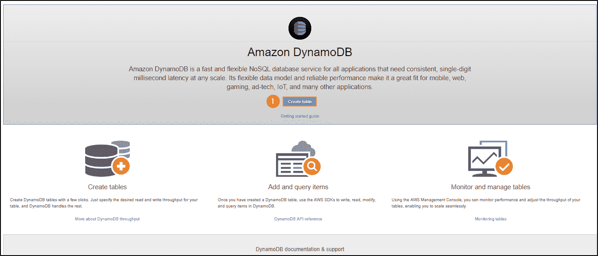
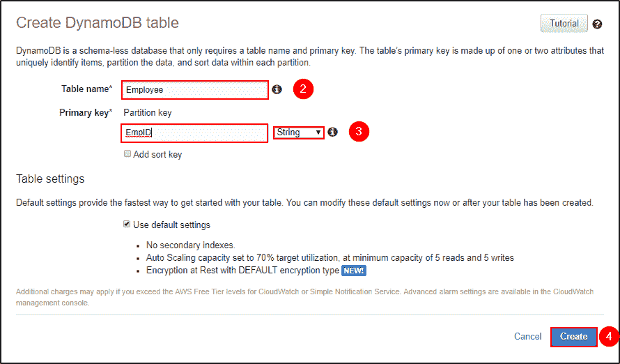
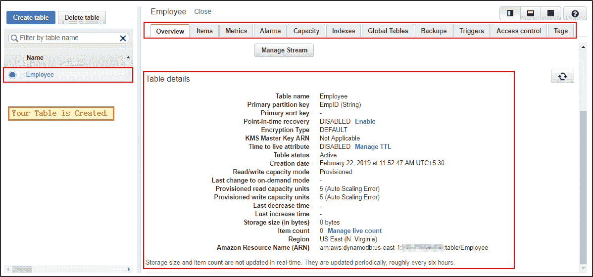
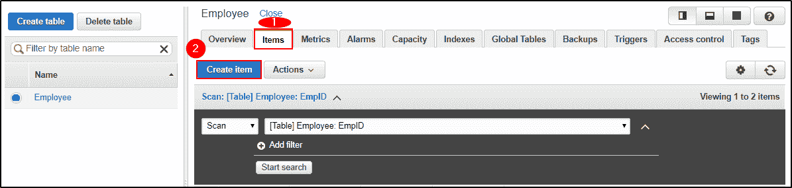
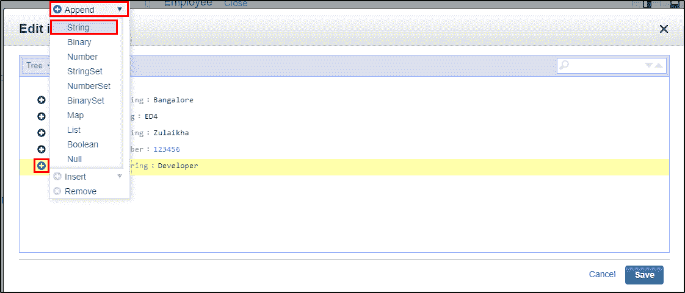
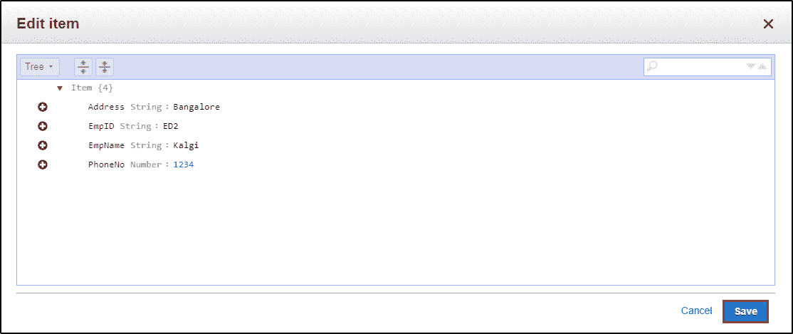
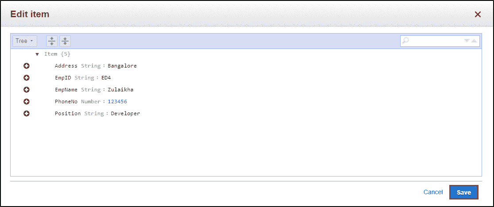
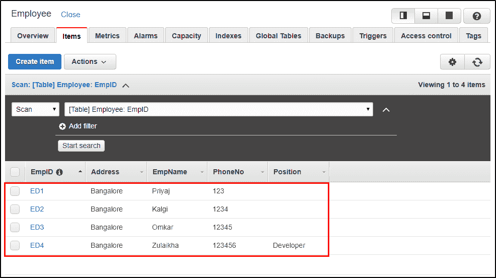
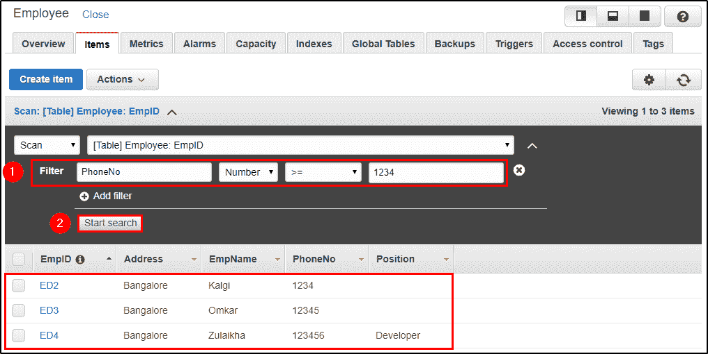
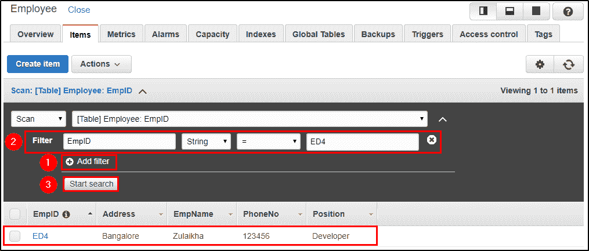

# 亚马逊 DynamoDB 教程-完整指南

> 原文：<https://www.edureka.co/blog/amazon-dynamodb-tutorial>

DynamoDB 是由亚马逊提供的完全托管的 NoSQL 数据库服务。如今，数据库已经成为任何公司的支柱，不管它们有多大。最初使用的传统数据库系统，由于需求和所获取数据类型的动态变化，已不再是当今的首选解决方案。在这篇 Amazon DynamoDB 教程中，我将讨论使用 DynamoDB 存储和检索数据的新的快速方法。

*如果你希望在云计算领域成就一番事业，探索 AWS 提供的不同服务，可以看看 Edureka 提供的[直播课程。](https://www.edureka.co/cloud-computing-certification-courses)*

在这篇亚马逊 DynamoDB 教程中，我将讨论以下主题:

*   [**什么是 DynamoDB？**](#What-Is-DynamoDB?)
*   [**与 DynamoDB 相关的术语**](#Terminologies-Associated-With-DynamoDB)
*   [**访问亚马逊 DynamoDB**](#Accessing-DynamoDB)
*   [**DynamoDB 的特性**](#Features-Of-DynamoDB)
*   **[DynamoDB API](#DynamoDB-API)**
*   **[DynamoDB:案例分析](#DynamoDB-Case-Studies)**
*   [**演示:在 DynamoDB**](#Creating-Inserting-And-Querying-A-Table-In-DynamoDB) 中创建、插入和查询表格

## **什么是 DynamoDB？**

亚马逊 DynamoDB 是一个完全托管的 NoSQL 服务，它处理亚马逊提供的键值对和其他数据结构文档。它只需要一个主键，不需要模式来创建表。它可以存储任意数量的数据和服务任意数量的流量。使用 DyanmoDB，即使在它扩展时，您也可以期待良好的性能。这是一个非常简单的小 API，遵循键值方法来存储、访问和执行高级数据检索。

DynamoDB 由三个基本单元组成，即表、属性和项目。一个表包含一组项目，一个属性是存储数据的最简单的元素，没有任何进一步的划分，项目包含一组属性 。

现在你知道了什么是 DynamoDB，让我们在这篇亚马逊 DynamoDB 教程中继续深入，向你介绍这里使用的术语。

## **与 DynamoDB 相关的术语**

在 DynamoDB 中，一切都很简单，DynamoDB 使用的术语很容易理解，这使得它与其他数据库服务不同。使用的术语如下:

*   ### **Tables, items and attributes**

    1.  一个**表格**可以被可视化为一组项目。以雇员记录为例，你将拥有雇员姓名、雇员 ID、地址和电话号码，所有这些项目都将存储在一个表中。
    2.  一个**项**是表格中的一组属性。您也可以将项目理解为一组属性，它们可以唯一地定义表中的条目。例如，雇员记录中的一项将标识单个雇员。
    3.  一个**属性**是附加到一个项目的单个字段。例如员工姓名。
*   ### **主键**

    主键是创建表时必需的唯一属性，在任何给定点都不能为空。因此，在向表中插入项目时，主键属性是必需的。例如，雇员 ID 是雇员记录表的主键。两个项目不能有相似的主键。DynamoDB 支持两种类型的主键。

    1.  #### **简单主键**

        简单主键也称为分区键，这基本上是单一属性。DynamoDB 使用分区键值来区分表中的项目。例如，员工记录表中的员工 ID。

    2.  #### **复合主键**

        复合主键也称为分区键和排序键。这种类型的钥匙通常由两部分组成。主要组件是分区键，次要组件是排序键。例如，以品牌名称和型号作为复合主键的汽车详细信息表。

*   ### **二级指标**

    二级索引可以理解为让你在有或没有主键的帮助下查询数据的属性。DynamoDB 有这些辅助索引来帮助您实现这种额外的访问。

*   这是 DynamoDB 提供的一个附加/可选特性，用于跟踪表中的数据修改事件。在这里，每个事件由一个流记录表示，如果启用了该服务，那么每次创建新项目、更新项目或删除项目时，您都会获得一个新事件。

这些是使用的不同术语，不要再拖延了，让我们继续学习 DynamoDB 教程，看看如何访问表。

## **访问亚马逊 DynamoDB**

访问 DynamoDB 非常简单，可以使用以下方法完成:

*   **控制台** 只需点击 [这里](https://console.aws.amazon.com/dynamodb/home) 即可访问 DynamoDB。
*   **CLI(命令行界面)** 使用 CLI，您只需打开您的命令提示符，键入相关命令并访问表格即可。更多详情，点击[此处](https://docs.aws.amazon.com/amazondynamodb/latest/developerguide/Tools.CLI.html)。
*   **使用 API** 使用 AWS SDKs 你可以充分利用 DynamoDB。 AWS SDK 支持 Java、JavaScript 等多种语言。NET、Python、PHP 等。更多详情，点击 [这里](https://docs.aws.amazon.com/amazondynamodb/latest/developerguide/Using.API.html) 。

**DynamoDB 的特性**

DynamoDB 是一项 NoSQL 数据库服务。DynamoDB 的设计方式使得用户可以获得高性能、运行可伸缩的应用程序，而这在传统的数据库系统中是不可能的。DynamoDB 的这些附加特性可以在以下类别中看到:

1.  **按需容量模式**:使用按需服务的应用，DynamoDB 自动伸缩以适应流量。
2.  **对 ACID 事务的内置支持** : DynamoDB 提供了对事务的本机/服务器端支持。
3.  **按需备份**:此功能允许您在任何给定时间点创建工作的完整备份。
4.  :此功能有助于在发生意外读/写操作时保护您的数据。
5.  **静态加密**:即使表不在使用中，它也保持数据加密。这借助于加密密钥增强了安全性。

## **DynamoDB API**

DynamoDB 是一个数据库工具，要与应用程序交互，它需要 API。DynamoDB 中的 API 有:

### **控制平面**

控制平面由负责“*创建*”和“*管理*DynamoDB 表的操作组成。可以使用的 API 操作如下:

*   **创建表格**:创建一个新表格。
*   **可描述的**:提供关于表格的信息。
*   **ListTable** :返回列表中所有的表格名称。
*   **DeleteTable** :从 DynamoDB 中删除表及其所有依赖项。

### **数据平面**

数据平面由 **CRUD** 操作组成，即*创建*、*读取*、*更新*、*删除*选项，在你的表上执行不同的动作。这里在数据平面中，有多个操作可以在一个表上完成。这里的操作如下:

*   #### **Create data**

    1.  **PutItem** :你可以借助主键将单个数据项写入你的表中。
    2.  **BatchWriteItem** :它是 PutItem 的一个更好的版本，用它你可以在你的表上写到 25 个项目。
*   #### **Read data**

    1.  **GetItem** :在主键的帮助下，从表中检索单个项目。
    2.  **BatchGetItem**:GetItem 的更好版本，它可以从多个表中检索到 100 个条目。
    3.  **查询**:这基本上是一个检索具有特定分区键的项目的命令。
    4.  **扫描**:工作方式与查询类似，但不需要分区键，因为它在特定的表上工作。
*   #### **Update data**

    1.  **UpdateItem** :借助主键修改表中的单个或多个数据项。
*   #### **Delete data**

    1.  **DeleteItem** :在主键的帮助下，从表中删除一个单项。
    2.  **BatchWriteItem**:delete item 的更好版本它可以在一个表中删除多达 25 项。

### **DynamoDB 流**

DynamoDB Stream 只不过是一种服务，用于跟踪加载到表中并从表中检索的数据流。要修改流，用户可以使用以下命令:

*   **ListStream** :给出所有流的列表。
*   **DescribeStream** :它给出了关于流和所用资源的细节。
*   **GetShardIterator** :它给出了一个 Shard 迭代器，这是一个存储流信息的数据结构。
*   **GetRecords** :使用分片迭代器 GetRecords 检索关于流的信息。

现在，您已经对 DynamoDB 支持的不同 API 有了一个大致的了解。让我们来看看客户从 DynamoDB 中获益的不同案例研究。

## **DynamoDB:案例分析**

我已经列出了一些大公司和初创公司的案例研究，关于他们如何从使用 DynamoDB 中获益。

1.  **MLB Advanced Media**MLBAM 在一篇关于亚马逊 DynamoDB 的评论中说，它帮助他们在一天内扩大了对游戏的支持，DynamoDB 还帮助他们支持查询和快速数据检索。
2.  **Expedia** Expedia 的实时分析应用为测试&学习实验收集数据。该实验每天处理近 2 亿条消息，他们表示 DynamoDB 易于设置，监控更容易，扩展更顺畅，这就是他们转向使用 DynamoDB 的原因。
3.  **Nexon** Nexon 表示，他们使用亚马逊 DynamoDB 作为他们轰动一时的手机游戏 **HIT 的主要数据库。**他们表示，Nexon 的成功利用 DynamoDB 提供了稳定的延迟，从而提供了出色的移动游戏体验。

这就是 NoSQL 趋势数据库"*亚马逊 DynamoDB* "如何帮助公司达到用户体验的顶峰。让我们在 Amazon DynamoDB 教程中继续深入，看看如何实现不同的查询。

## **De** **mo:在 DynamoDB** 中创建、插入和查询表格

让我们看看如何在 DynamoDB 中创建表格。

**第一步:** 导航到 AWS 中的 DynamoDB 部分或者点击 [此处](https://console.aws.amazon.com/dynamodb)。选择*创建表格*。

***创建表格——亚马逊 DynamoDB 教程***

**第二步:** 填写必要的细节，点击 *创建*。

***创建表格——亚马逊 DynamoDB 教程***

**第三步:** 可以查看自己正在创建的表格。点击 *概览*了解你的表格，点击*条目*对表格进行编辑、插入和查询。您可以使用更多选项来更好地理解您的表。

***表格描述——亚马逊 DynamoDB 教程***

现在你已经创建了一个表格，让我们继续插入一些项目，并了解 NoSQL 是如何工作的。

**第一步:** 导航到 *项*，点击*创建项*。

***创建物品——亚马逊 DynamoDB 教程***

**第二步:** 它会打开一个 JSON 文件，你可以在里面添加不同的项目。点击“+”符号，选择“ *追加*”，选择您想要输入的数据类型。

***插入物品——亚马逊 DynamoDB 教程***

**第三步:** 这是在你的表中添加多列后的样子。点击 *保存*。

***插入物品——亚马逊 DynamoDB 教程***

**第四步:** 既然是 NoSQL 架构，就可以随便摆弄你加到桌子上的柱子。如 *位置*。

***插入物品——亚马逊 DynamoDB 教程***

**第五步:** 这是你插入数据后表格的样子。

***显示表格内容——亚马逊 DynamoDB 教程***

现在我们已经准备好了一个表，让我们来看看一些基本的查询。

**第一步:** 在这里你可以框定你的查询，点击 *开始搜索*得到想要的结果。

例如，我正在搜索所有大于或等于“ *1234* ”的手机号码。

***搜索表格——亚马逊 DynamoDB 教程***

**第二步:** 在这里，我搜索的是 *EmpId* 为“ *ED4* ”的记录。

***搜索表格——亚马逊 DynamoDB 教程***

这是一个关于如何使用 DynamoDB 来满足你的需求的小教程。我希望你发现这个亚马逊 DynamoDB 教程信息丰富。

*如果您希望了解更多关于云计算的知识，并在云计算领域建立自己的事业，请查看我们的[云计算课程](https://www.edureka.co/cloud-computing-certification-courses)，该课程提供有讲师指导的现场培训和真实项目体验。本培训将帮助您深入了解云计算，并帮助您掌握这门学科。*

*有问题吗？请在评论区提及，我们会回复您**或**在[**edu reka | Community**](https://www.edureka.co/community)发布您的问题。在 Edureka 社区，我们有超过 100，000 名技术狂热分子随时准备提供帮助。*