# 数据科学 R 综合指南

> 原文：<https://www.edureka.co/blog/r-for-data-science/>

## **R 为数据科学:**

大约 70%的地球表面被水覆盖着。但我为什么要告诉你这些？产生的数据量不亚于我们拥有的水量。两者之间的唯一区别是，我们正在耗尽水，而另一方面，数据正从我们每天使用的几十个联网设备中涌出，而且没有减缓的迹象。 在这个 R for Data Science 博客结束时，你将能够理解数据科学的重要性及其使用 [R 语言](https://www.edureka.co/blog/r-programming-language)的实现。

要获得深入的数据科学知识，您可以报名参加 Edureka 提供的实时 [***数据科学培训***](https://www.edureka.co/masters-program/data-scientist-certification) ，该培训提供全天候支持和终身访问。

在这篇关于数据科学的博客中，我将讨论以下主题:

1.  [数据科学的力量](#Power%20of%20data%20science)
2.  [什么是数据科学？](#What%20is%20Data%20Science)
3.  [数据生命周期](#Data%20Life%20Cycle)
4.  [机器学习简介](#Introduction%20To%20Machine%20Learning)
    1.  [机器学习的类型](#Types%20of%20Machine%20Learning)
        1.  [监督学习](#Supervised%20Learning)
        2.  [无监督学习](#Unsupervised%20Learning)
        3.  [强化学习](#Reinforcement%20Learning)
5.  [R](#Introduction%20to%20R)简介
    1.  [什么是数据科学的 R 编程？](#What%20is%20R)
    2.  [为什么用 R？](#Why%20use%20R)
6.  [R 为数据科学实际实现](#R%20for%20Data%20Science%20Demo)

根据最近的一项调查，当今 90%的数据是在过去两年中创建的，也就是说每天有 *2.5 万亿*字节的数据！很难想象这么大的数据量。把你的思想放在处理、分析和管理这么多数据上只会导致偏头痛。


*R 为数据科学*

自从技术接管了世界，一切都在数据上运行！我们的手机、汽车、微波炉、空调等都与互联网相连，它们不断产生数据。就连我们人类也是靠数据跑的！我们收集信息，分析它，[做出重要决策](https://www.talentlms.com/blog/how-employee-analytics-improve-talent-retention/)。这正是数据科学。

[数据科学](https://www.edureka.co/blog/data-science-tutorial/)是从数据中提取有用见解，以做出更好决策的过程。

公司利用数据为他们的日常业务增加价值。数据科学的基本目标是帮助公司做出更快、更好的决策，从而将他们带到市场的顶端。这使得数据科学成为最有前途的职业机会之一。

查看此博客，了解更多关于 **[数据科学职业机会](https://www.edureka.co/blog/data-science-career-opportunities-your-guide-to-top-data-scientist-jobs)** 的信息。

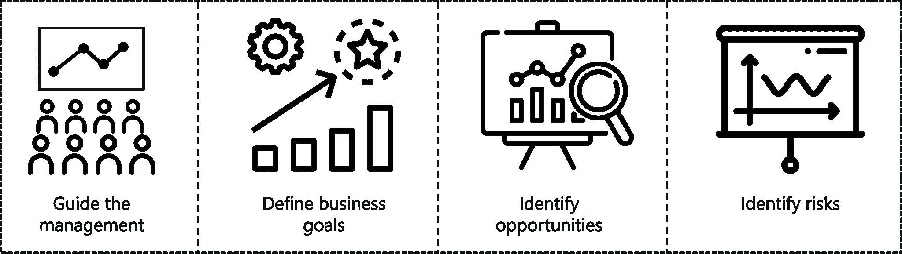

*R 为数据科学*

以下是中数据科学可以帮助企业发展的 4 种方式:

1.  引导管理层做出更好的决策
2.  根据趋势定义业务目标
3.  发现机会
4.  识别风险

在您的企业中实施数据科学还有许多优点，如果您想要发展业务，您必须考虑报名参加数据科学培训。

这里有一个博客专门介绍数据科学培训 的 [**优势。**](https://www.edureka.co/blog/advantages-of-data-science-training/)

现在，让我们通过一个真实的使用案例来了解数据科学的重要性。

### **沃尔玛如何运用数据科学？**

沃尔玛是世界上最大的零售商，在 28 个国家拥有 20，000 多家店铺。它目前正在建设世界上最大的私有云，每小时处理 2.5 千兆字节的数据。沃尔玛成功背后的原因是他们如何利用客户数据获得关于客户购物模式的有用见解。

沃尔玛的数据分析师和数据科学家了解他们客户的每一个细节。他们知道，如果顾客购买了商品 A，他们可能也会购买商品 b。

他们是怎么知道这一切的？嗯，他们使用从所有客户那里获得的数据，并对这些数据进行分析，以了解特定客户的需求。

让我们考虑万圣节和饼干销售的例子。

*沃尔玛数据科学用例–R*

万圣节期间，销售沃尔玛的分析师实时分析了的数据，发现尽管一种特定的饼干在所有沃尔玛商店都很受欢迎，但有两家商店根本没有销售。

立即对情况进行了检查，发现一个简单的库存疏忽导致饼干没有上架销售。这个问题立即得到了纠正，防止了进一步的销售损失。 

*沃尔玛数据科学用例–R*

另一个这样的例子是，通过关联规则挖掘，沃尔玛发现草莓馅饼的销售额在飓风前增长了 7 倍。

沃尔玛的一名数据分析师通过数据挖掘发现了飓风和草莓馅饼之间的联系，他们在飓风来临前将所有的草莓馅饼放在收银台。

*沃尔玛数据科学用例–R*

不仅如此，沃尔玛还利用社交媒体数据来寻找流行产品，以便将其介绍给世界各地的沃尔玛商店。

例如，沃尔玛分析了社交媒体数据，发现用户对“棒棒糖蛋糕”很着迷。沃尔玛对这一数据分析做出了快速反应，蛋糕爆米花冲击了沃尔玛商店。沃尔玛手边有大量数据，也有资源继续收集更多数据。

通过将这一点与根据实时输入数据快速做出决策和实施变革的能力相结合，沃尔玛显然将数据视为保持领先地位的关键。

就像沃尔玛如何使用数据科学来发展他们的业务一样，数据科学还有其他几个应用，使其成为当今世界如此重要的领域。

这里有一个关于 **[十大数据科学应用](https://www.edureka.co/blog/data-science-applications/)** 的博客，它会让你更好地了解数据科学对各个领域的影响。

好了，现在你知道了如果你用有效的算法和工具正确地分析数据，数据会有多么强大，让我们来讨论一下数据科学到底是什么，以及数据生命周期的各个阶段。

## **什么是数据科学？**

根据维基百科， *[数据科学](https://www.edureka.co/blog/what-is-data-science/)是一个跨学科领域，它使用科学的方法、流程、算法和系统从各种形式的数据中提取知识和见解，包括结构化和非结构化。*如果你想了解更多关于数据科学的知识，请观看我们的数据科学专家制作的视频。

## **什么是数据科学？|数据科学使用 R | edu reka**


[//www.youtube.com/embed/1TNQVMO0aO4?rel=0&showinfo=0](//www.youtube.com/embed/1TNQVMO0aO4?rel=0&showinfo=0)

本视频将帮助您了解数据科学的各个方面。

尽管过去几年计算能力和数据访问能力有所提高，但我们在决策过程中使用数据的能力却丧失了。当一个组织面临问题时，他们应该能够正确地应用数据来解决问题。这就是数据科学的工作方式。

## **数据生命周期**

现在让我们了解一下数据科学的生命周期。这个循环有 6 个步骤:

1.  业务需求
2.  数据采集
3.  数据处理
4.  数据探索
5.  数据建模
6.  部署

**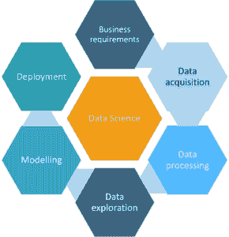**

*R 为数据科学*

## **步骤一:业务需求**

在你开始一个数据科学项目之前，了解你试图解决的问题是至关重要的。在这一阶段，您还应该通过确定需要预测的变量来确定项目的中心目标。

## **第二步:数据采集**

既然你已经定义了项目的目标，是时候开始收集数据了。数据挖掘是从不同来源收集数据的过程。在这个阶段，一些值得考虑的问题是——我的项目需要什么数据？它住在哪里？我如何能获得它？存储和访问所有信息的最有效方式是什么？

## **第三步:数据角力(清理)**

一般来说，找到正确的数据既费时又费力。如果所需的数据存储在数据库中，那你就走运了。但是，如果您的数据不存在于数据库中，您将需要抓取它。

在这里，您可以将数据转换成所需的格式，以便读取数据。导入所有数据后，我们进入最耗时的步骤——清理和准备数据。根据对数据科学家的采访，这个过程通常会占用他们 50%到 80%的时间。

数据清洗是指去除不相关、不一致的数据的过程。这些不一致必须在这个阶段被识别和修正。

## **第四步:数据探索**

在数据探索阶段，您需要理解数据中的模式，并从数据中检索所有有用的见解。你发现了隐藏的模式，并开始对你的数据形成假设。您可以在 R 中实现各种数据可视化包，如 ggplot2，以便更清楚地了解数据。

## **第五步:数据建模**

在这个阶段，你需要进行模型训练。模型训练包括将数据集分成两组，一组用于训练，另一组用于测试。之后，您必须使用训练数据集来构建模型。这些模型利用了各种机器学习算法，如 K 近邻、支持向量机、线性回归等。

最后一步是评估这些模型的效率，并检查它们预测结果的准确性。

## **第六步:部署**

此阶段的目标是将模型部署到生产或类似生产的环境中，以供最终用户接受。这是您检查您的模型是否适合生产的地方。用户必须验证模型的性能，如果模型有任何问题，则必须在此阶段进行修复。

## **机器学习简介**

机器学习是一门通过向计算机输入数据并让它们自己学习一些技巧来让它们行动的科学，而无需明确的编程。这听起来非常像一个人类的孩子。

让我们考虑一个小场景来理解机器学习。 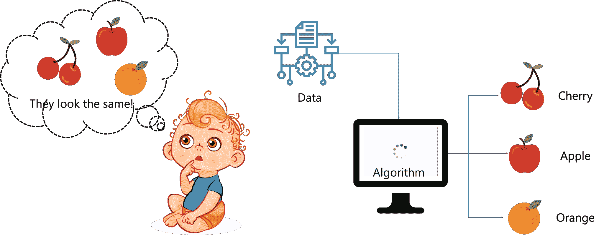

*R 为数据科学*

*   作为一个孩子，如果你必须区分樱桃、苹果和橘子等水果，你甚至不知道从哪里开始，因为你不熟悉这些水果的外观。
*   随着我们的成长，我们收集了更多的信息，并开始发展辨别不同水果的能力。我们能够做出这种区分的唯一原因是，因为我们观察了我们的周围，收集了更多的数据，并从过去的经验中学习。这是因为我们的大脑有足够的能力思考和做出决定，因为我们一直在给它提供大量的数据。
*   这正是机器学习的工作方式。它涉及不断向机器提供数据，以便它能够解释这些数据，理解有用的见解，检测模式并识别关键特征来解决问题。这和我们大脑的工作方式非常相似！

如果你有兴趣了解更多关于机器学习的知识，可以看看这个视频。

## **什么是机器学习？|爱德华卡**


[//www.youtube.com/embed/Pj0neYUp9Tc?rel=0&showinfo=0](//www.youtube.com/embed/Pj0neYUp9Tc?rel=0&showinfo=0)

这段视频介绍了机器学习及其各种类型。

现在，在我们了解不同类型的机器学习之前，让我们先了解一下机器学习的过程。这一切都始于一个算法。假设你想把宠物的图片输入到你的电脑里，你想让你的电脑把它们分成两类。一个类包含猫的图像，另一个包含狗的图像。 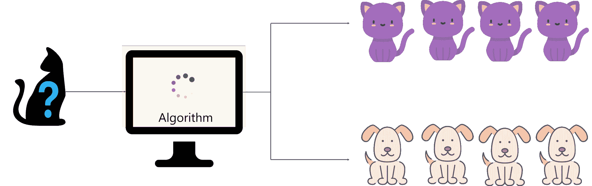

*R 为数据科学*

你的第一步是开发一种算法或逻辑，将输入图像分为两类。然后，使用训练数据集来训练该算法以创建模型。然后通过使用测试数据集来测试该模型，以检查算法是否能够正确区分猫和狗。

如果该算法能够准确地将图像分类为 2 类，则部署该算法。否则，算法被进一步训练，直到它达到一定的准确度。

## **机器学习的类型**

有 3 种不同的方法来训练或示教机器:

1.  监督学习
2.  无监督学习
3.  强化学习

### **监督学习**

被监督的意思是监督或指导某项活动，并确保它正确完成。在监督学习中，您向模型提供一组称为训练数据的数据，其中包含输入数据和相应的预期输出。训练数据就像一个老师，教授模型特定输入的正确输出，以便它在以后出现新数据时可以做出准确的决策。 

*R 为数据科学*

一旦机器训练完毕，你给它另一组数据，叫做测试数据。测试数据只包括输入数据，不包括相应的预期输出。因此，这一次模型必须根据它在训练阶段学到的知识来预测输出。

监督学习用于可以标记的数据。像在关于将数据集分类为猫或狗的例子中一样，训练数据集被标记。因此，如果给算法输入一张猫的图像，那么这张图像就会被标记为猫，同样，对于狗也是如此。模型就是这样被教授的，通过给它贴标签告诉它“这是一只猫”。在算法被教授后，它将被测试。

### **无监督学习**

无监督的意思是在没有任何人的监督或指导下行动。当一个孩子成长为一个成年人，他不再需要有人来指导他的每一步。他在没有任何帮助的情况下观察和学习。这就是无监督学习的工作方式。

  * R 为数据科学*

在无监督学习中，给模型一个既没有标记也没有分类的数据集。该模型探索数据并从数据集中进行推断，以从未标记的数据中定义隐藏结构。但它不能添加标签集群，就像它不能说这是一群猫或狗，但它会把所有的猫和狗分开。

### **强化学习**

强化意味着建立或鼓励一种行为模式。如果你被丢在一个孤岛上会发生什么？

最初，你会感到恐慌，不知道该做什么，从哪里获得食物，如何生活等等。但是过一段时间后你将不得不适应，你必须学会如何在岛上生活，适应变化的气候，学会吃什么和不吃什么。

你之所以遵循“尝试与追踪”的概念，是因为你对这个环境不熟悉，而学习的唯一途径是体验，然后从你的体验中学习。

  * R 为数据科学*

这就是强化学习。这是一种学习方法，其中一个代理(你，被困在一个孤岛上)通过产生动作与其环境(孤岛)进行交互，并发现错误或奖励。一旦它得到训练，它就准备好预测呈现给它的新数据。

现在，您已经对机器学习和数据科学有了很好的理解，让我们看看如何使用名为 r 的统计编程语言来实现数据生命周期。

## **R**简介

## **什么是数据科学的 R 编程？**

很多人心里都有这个疑问，***R 中的数据科学是什么？***

也有人问我，***R 编程中 R 代表什么？***

答案是，R 基本上是一种开放的源码编程和统计语言，用于数据分析、数据操作和数据可视化。它是一种多用途编程语言，广泛用于数据科学领域。

你们大多数人都知道用于数据科学的两种主要语言是 [Python](https://www.edureka.co/blog/python-tutorial/) 和 r。但是你应该选择哪一种呢？

### **这就是为什么你要选择 R:**

  R 有更多的统计支持 R 作为一种统计语言被建立起来，并且它显示。这是一件好事，因为统计学是数据科学的关键部分。Python 中的**状态模型**包为统计方法提供了不错的覆盖，但是 R 生态系统要大得多。

数据操纵

使用 R，您可以轻松地将数据集设计成一种格式，通过对大型多元数据集进行切片，可以轻松地对其进行访问和分析。


R 内置数据分析功能

在 R 中，我们可以使用 summary 内置函数来分析汇总统计数据。而在 Python 中，你需要导入诸如 statsmodels 之类的包来做这件事

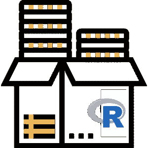

8000 多个包裹

R 拥有超过 8000 个软件包，可用于实现与假设检验、模型拟合、聚类技术和机器学习相关的各种统计分析工具

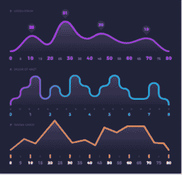数据可视化

为了理解数据集和各种变量之间的关系，将数据可视化是很重要的。

大规模社区支持

R 是最受欢迎的技术，因为它的独创性和社区支持。超过 250 万用户正在使用 TechCrunch、谷歌、脸书、Mozilla 等公司都在使用 r

如果你仍然困惑，看看[这个](https://www.edureka.co/blog/r-vs-python/)博客，在这里我们已经深入讨论了 R 和 Python。如果你想学习 R 编程语言，参考下面的视频。

## **R 初学者教程|爱德华卡**


[//www.youtube.com/embed/eDrhZb2onWY?rel=0&showinfo=0](//www.youtube.com/embed/eDrhZb2onWY?rel=0&showinfo=0)

本视频将帮助您理解 R 工具的基本原理，并帮助您在 R 领域打下坚实的基础。

Now that you have a basic understanding of R, let’s run a demo that will show each data life cycle stage practically.

## **R 为数据科学实际实现**

在本博客的前面，我们已经讨论了数据生命周期，它始于数据采集，止于预测期望的输出。在本节中，我们将运行一个演示，让您深入了解这些数据生命周期的每个阶段。 我们总是通过*定义问题陈述*来开始数据周期。

### **问题陈述:**

研究印度房价指数(HPI)的变化。HPI 以某个特定起始日期的百分比变化来衡量住宅价格的变化。HPI 可以用来预测以后的房价。

### **数据集描述:**

我们在这个演示中使用了 HPI 数据集。该数据集包含 2011 年至 2013 年期间印度各城市每个季度的 HPI 信息。

### **逻辑:**

在本次演示中，我们将执行数据生命周期的每一步。我们将从数据采集开始，然后是数据清理和探索、数据操作，最后是数据可视化。

现在您已经清楚地了解了演示背后的逻辑，让我们开始导入数据。有多种方法可以将数据导入 RStudio。数据可以通过网络、数据库或使用本地文件导入。我的数据集存储在/Users/zulaikha/Desktop/ path 中，我使用 read.csv()方法从 housing_index.csv 文件中读取数据。

```
 house <- read.csv('/Users/zulaikha/Desktop/housing_index.csv') 
```

数据集被读取并存储在一个名为 house 的变量中。现在，您可以使用 R. 中的 view()方法来查看数据集

```
 View(house) 
```

**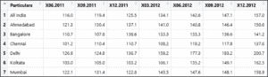 **  *查看数据集——R 为数据科学*

接下来，让我们清理数据集。

```
 house <- read.table(file = 'housing_index.csv', sep = ',', header = TRUE, na.strings = 'NA') 
house <-na.omit(house) 
```

read . table()函数具有以下属性:

*   文件:你要读取的文件的路径
*   sep:你的数据是如何分隔的，在我们的例子中，它是一个 CSV 文件(用逗号分隔)
*   表头:默认为假，表示数据是否包含表头
*   na.strings:代表缺失值的字符串
*   na . omit()方法用于删除数据集中的不适用值。

在我们的例子中，数据集中有一个 N/A 值被删除，因为数据集中的不一致会带来麻烦，我们不希望这样。

**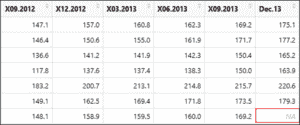 **  *省略 N/A 元素——R 为数据科学*

一旦你有了一个干净的数据集，下一个任务就是寻找数据类型，例如，我们希望住房指数有数字数据类型，但如果不是这样，我们就必须进行转换。这可以通过在数据集上使用 class()函数来实现。

```
 sapply(house, class) 
```

输出显示变量是数字格式的，我们不用转换。但是您的变量不是数字格式的，那么您可以使用 as.numeric()函数将变量从字符数据类型转换为数值。

```
 summary(house) 
```

R 中的 summary()函数查看数据集内不同变量的五点汇总。这是我们数据的样子:

**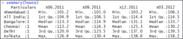 **  *数据集汇总——R 为数据科学*

我们的下一步是处理数据，这包括创建新变量、转换数据、仅过滤数据集中的必需字段等等。

让我们试着操作数据集。我们将从仅过滤掉 2012 年以后的 HPI 开始，下面的命令显示了如何做到这一点:

```
 housing_2012 <- house[,c(1,5:11)] 
```

要查看过滤后的数据集，请执行以下命令:

```
 housing_2012 
```

**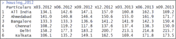 **  *数据操纵——R 为数据科学*

现在，让我们通过转置我们的数据来执行更多的数据操作，这可以通过使用 r 中的 t()函数来完成。下面几行代码将执行转置:

```
 col_names <-housing_2012$Particulars
row_names<-colnames(housing_2012)
housing_data_transpose <-as.data.frame(t(housing_2012[,1]),row.names= F) 
colnames(housing_data_transpose) <- col_names 
housing_data_transpose$quarter<-row_names[-1] 
housing_data_transpose<-housing_data_transpose[,c(7,1:7)] 
```

在我们的下一步中，让我们创建一个名为 hpi_150 的变量，该变量显示一个季度内跨越 150 住房指数的记录。按照下面的命令来做:

```
 housing_data_transpose$hpi_150 <- apply(housing_data_transpose, MARGIN=1, FUN=function(x)length(which(x[c(-1,-2)]>150))) 
```

接下来，如果我们试图显示 HPI 超过 150 的记录的计数，我们得到这个:

```
 housing_data_transpose 
```

**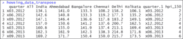**

*转置输出–R 用于数据科学*

我们的最后一步是可视化数据。说到数据可视化，R 有 ggplot，ggvis 等几个包。

让我们从使用箱线图开始。箱线图会给你一个数字数据的概观。这个箱线图将显示各个季度的住房指数是如何变化的。

```
 boxplot(housing_2012[-1]) 
```

**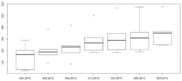***box plot–R for Data Science*

现在，让我们绘制一张图表，显示整个印度各个季度的住房指数价格走势。这个图表显示了各个季度的数值。

```
 plot(housing_data_transpose$`All India`) 
```

** **  *线性图–R 为数据科学*  

现在让我们使用线条格式来查看同一个图形:

```
 plot(housing_data_transpose$`All India`, type = 'l') 
```

type 属性设置为‘L’，表示线图。

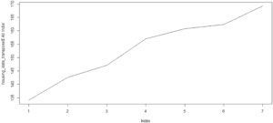

*线图–R 为数据科学*

如果我们想查看某个州的 HPI 的变化，我们也可以这样做。为此，让我们使用 R 提供的数据可视化包，名为 ggplot2。

```
 require(ggplot2)

ggplot(housing_data_transpose, aes(quarter, Bangalore, fill = Bangalore)) +geom_bar(stat='identity', position='dodge') 
```

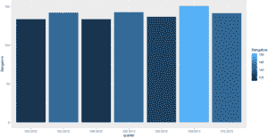

*gg plot 2–R 为数据科学*

上图显示了班加罗尔不同季度的价格。

我们的演示到此结束。给自己一个鼓励，因为您刚刚使用 r 执行了一个完整的数据生命周期

说到这里，我们的数据科学博客到此结束。我希望你觉得这篇博客内容丰富，如果你有任何疑问，请留下评论，我们会尽快回复你。

请继续关注更多关于趋势技术的博客。

*如果你正在寻找数据科学的在线结构化培训，edureka！有一个特别策划的  [**数据科学与 Python 课程**](https://www.edureka.co/data-science-python-certification-course) ，帮助您获得统计学、数据争论、探索性数据分析、机器学习算法(如 K-Means 聚类、决策树、随机森林、朴素贝叶斯)方面的专业知识。您将学习时间序列的概念、文本挖掘以及深度学习的介绍。本课程的新批次即将开始！！*