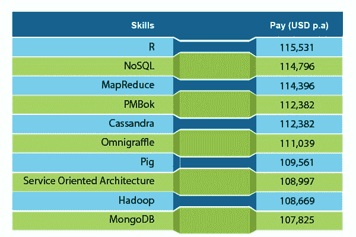
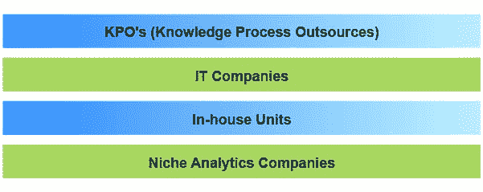
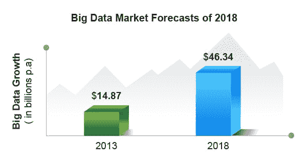
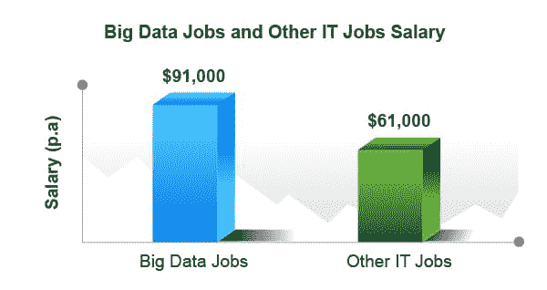

# 大数据专家赚大钱:炒作还是希望？

> 原文：<https://www.edureka.co/blog/big-bucks-for-big-data/>

掌握大数据技能可能是你获得更高薪水的敲门砖！根据 **Dice Tech 薪资调查** , *拥有面向大数据的语言、数据库和技能的 IT 专业人士在 2013 年获得了最高的薪水。*

是的，你没听错！

## **大数据顶级领薪技能**

这是由 **Dice** 编辑的 10 大技能列表，在薪酬方面很受欢迎。这些技能大多是大数据特有的。

## 关于大数据专业人士赚大钱的见解

Dice 总裁 Shravan Goli 说,*“公司正在下大赌注，利用数据可以在他们的竞争计划中发挥重要作用，这导致关键技能的高薪”。*他还说，*“技术专业人员应该志愿参与大数据项目，这使他们对当前雇主更有价值，对其他雇主更有市场。”*

## **大数据专业人才巨大需求背后的秘密**

好吧，所有行业的公司都知道他们需要大量的数据集，包括计算机日志文件、社交网络订阅源、数字视频/音频以及所有我们能想到的东西。这导致了对精通数学和统计、具有艺术天赋以有效呈现统计数据和数字的大数据专业人员的需求。

## **大数据薪资拆分**

大数据薪酬分为两部分——经验水平和组织类型。

*   **历练等级**

*   **组织类型**

## **加薪趋势分析**

在 2000 年的最初几年，印度组织在分析领域提供的入门级年薪为**18-24 万卢比**。今天，大多数分析公司给初级职位的候选人一个适中的年薪**40-70 万卢比**。

## **大数据晴天预报**

根据 Research and Markets 发布的 2018 年大数据市场预测报告，大数据市场总额预计将从 2013 年的 148.7 亿美元增长到 2018 年的 463.4 亿美元。

最近的 O'Reilly strata 调查表明，精通开源和商业大数据工具的 IT 专业人员可以赚很多钱。他们预计年收入可达 15 万美元。

**Indeed.com**表示，全国大数据职位的平均薪资比其他 IT 职位的平均薪资高出 **48%** 。

*   快速浏览—比较大数据工作和其他 IT 工作

因此，大数据在许多方面都很大，而且它正在获得大量关注；it 专业人员发现大数据机遇将是明智之举。正如 Info group 总裁 David McRae 在一次采访中所说的那样，“*没有人力，大数据就没有意义”*，IT 专业人员应该尽快掌握大数据技能。

*那么，我们是否相信大数据专业人员的高薪是“对美好希望的炒作”？！*

有问题要问我们吗？在评论区提到它们，我们会给你回复。

**相关帖子:**

[利用大数据提升电信](https://www.edureka.co/blog/big-data-to-boost-telecoms-marketing-capabilities/)

[大数据和 Hadoop 入门](https://www.edureka.co/big-data-and-hadoop)