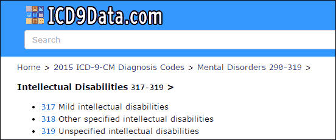
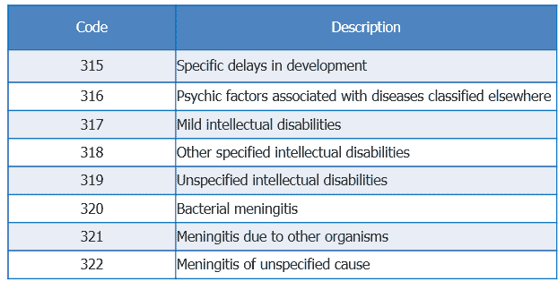
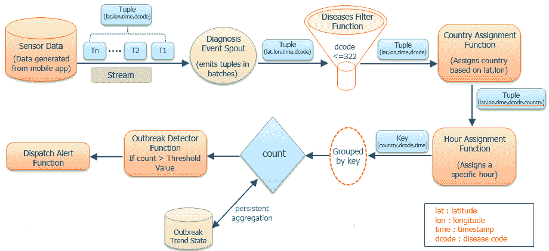
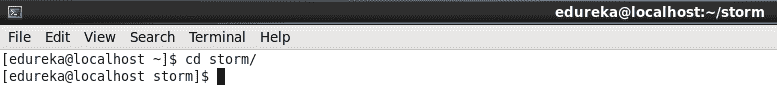
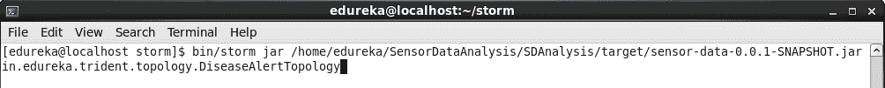
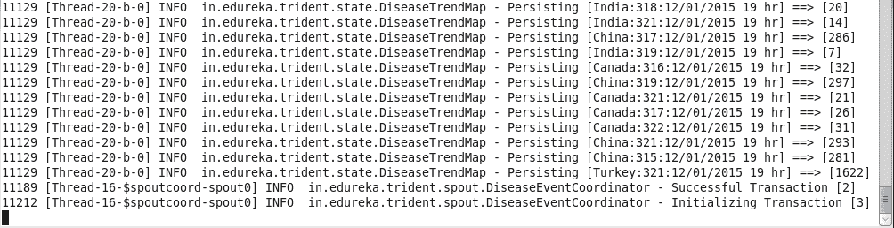
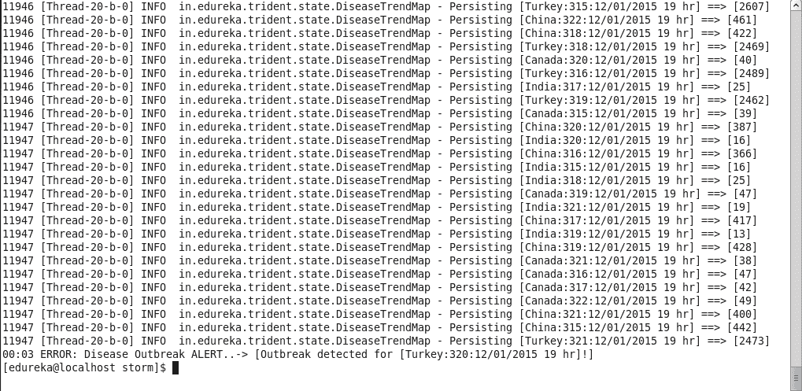

# 实时风暴项目

> 原文：<https://www.edureka.co/blog/storm-real-time-project/>

在这篇博客中，我们将执行一个实时风暴项目。

ICD9Data.com 提供的疾病代码范围从 000-999。这些代码被唯一地分配给不同的疾病。它也可以作为移动应用程序使用。

让我们考虑医生使用的任何移动应用程序都在生成传感器数据。该传感器数据具有诸如设备 id、设备网络、用户、纬度、经度、时间、疾病代码等信息。对于我们的场景，我们将只考虑纬度、经度、时间和疾病代码。

这些数据使用 storm 和 trident 拓扑进行处理，以检测特定时间疾病代码小于或等于 322 的任何地理位置内的疾病爆发。如果特定疾病的计数增加了阈值，在本例中为 2000，那么系统将发送一条带有国家名称、疾病代码和时间的警报消息。为了简化这个场景，我们将每个诊断事件映射到最近的国家。

在这个场景中，我们将使用 315 和 322 之间的疾病代码。有关疾病及其代码，请参考下表。

下面是项目的流程，这是非常自明的。

步骤 1:传感器数据通过 spout 从移动应用程序中流出。

第二步:Spout 只发送纬度、经度、时间和疾病代码作为元组。

第三步:过滤小于或等于 322 的疾病代码，并转发。

第四步:根据经纬度，分配一个国家。

步骤 5:将小时分配给每个元组。

步骤 6: **GroupBy** key 完成，其中 key 为**国家，dcode，time。**在处理每个元组后计算计数。

步骤 7:爆发趋势状态确保处理过一次的内容不会被处理第二次。

第 8 步:我们保持阈值为 2，000，如果计数超过阈值，我们认为这是一次爆发，并发送警报消息，其中包含爆发的详细信息。

下载风暴工程。

首先，启动 storm 集群，然后使用下面的命令运行 storm 项目。

命令: **cd 风暴/**

命令:**bin/storm jar/home/edu reka/sensordata analysis/SD analysis/target/sensor-data-0 . 0 . 1-snapshot . jar in . edu reka . trident . topology . disease alerttopology**

在土耳其，疾病代码 320 超过了 2，000 的阈值，发出了疾病爆发警报。

这个项目只是给你一个风暴的三叉戟拓扑概念的实际看法。这里我们随机选取了所有的输入。你可以根据你的数据把你的业务逻辑放到代码里，测试一下。

有问题要问我们吗？在评论区提到它们，我们会给你回复。

**相关帖子:**

[阿帕奇风暴](https://www.edureka.co/blog/introduction-to-real-time-analytics-with-apache-storm/ "Introduction to Real-Time Analytics with Apache Storm") 实时分析简介

[λ架构](https://www.edureka.co/blog/introduction-to-lambda-architecture/ "Introduction to Lambda Architecture")

[阿帕奇风暴用例](https://www.edureka.co/blog/apache-storm-use-cases/ "Apache Storm Use Cases")

[阿帕奇风暴到底是怎么回事？](https://www.edureka.co/blog/videos/aboutapachestorm/ "What is Apache Storm all about?")