# 创建 Rails 应用程序并将其部署到 Heroku

> 原文：<https://www.edureka.co/blog/creating-and-deploying-rails-application-to-heroku/>

在本帖中，我们将使用 rails 创建一个个人网站，并将其部署到 Heroku。Heroku 是一个云应用平台——一种构建和部署 web 应用的新方式。Heroku 最好的一点是，你不必为托管基本的网络应用付费，因为 Heroku 已经将它们归类为免费的。我们将建立一个单一的页面铁路应用程序，这将是一个静态的网站，可以作为一个投资组合。

下面是 rails 应用程序的快照(部署在 Heroku [这里](https://railtoheroku.herokuapp.com) )

[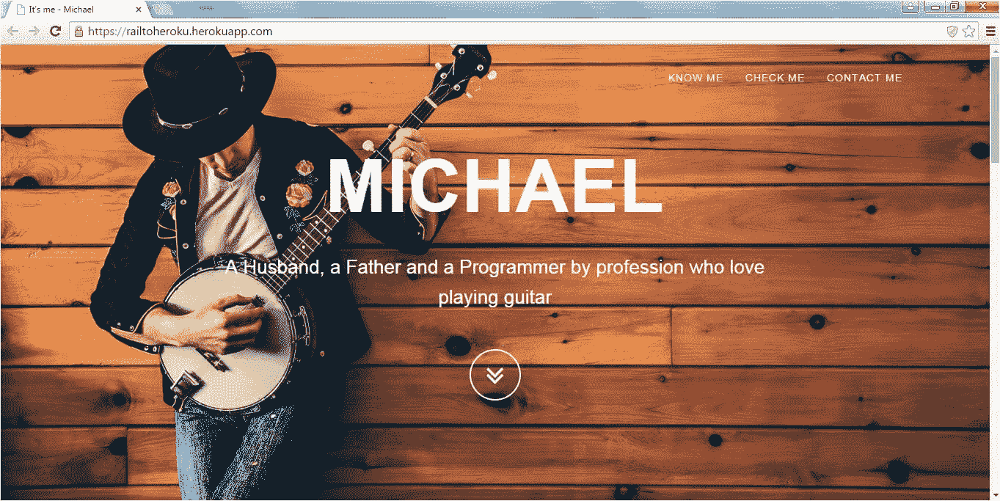](https://www.edureka.co/blog/wp-content/uploads/2015/07/live.jpg)

让我们开始创建这个 Rails 应用程序。我假设您已经安装了 Ruby 和 Rails。确保你有 Ruby 2.0 和 Rails 4.2.2。您可以从命令提示符检查版本。

[](https://www.edureka.co/blog/wp-content/uploads/2015/07/version_check.jpg)

注意:我们将使用 Ruby 2.0 和 Rails 4.2.2。如果你有一些不同版本的 Ruby 和 Rails，这篇文章中的一些步骤可能不适合你。

**创建项目:**

我们将我们的项目命名为网站。要创建项目，请使用命令 Rails new website

[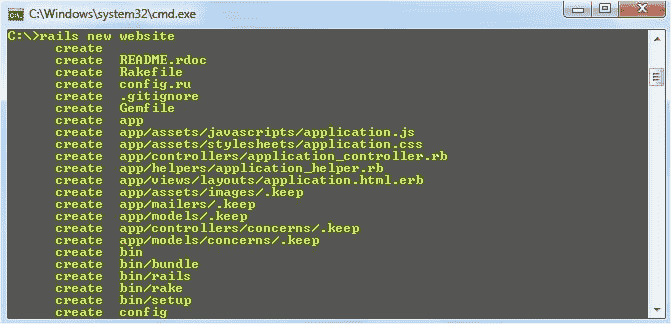](https://www.edureka.co/blog/wp-content/uploads/2015/07/new_project.jpg)

Rails 将自动生成所有的文件，并且还将通过执行自动安装的运行包来安装所有需要的 gem，如下所示

[](https://www.edureka.co/blog/wp-content/uploads/2015/07/bundle_install.jpg)

现在，您将在 C: drive(我们执行 Rails new website 命令的位置)下看到一个网站文件夹。让我们在某个 IDE 中打开网站文件夹。我有 Adobe 的支架 IDE。你可以使用任何其他的，因为没关系。

**项目结构:**

生成的项目结构将如下所示

[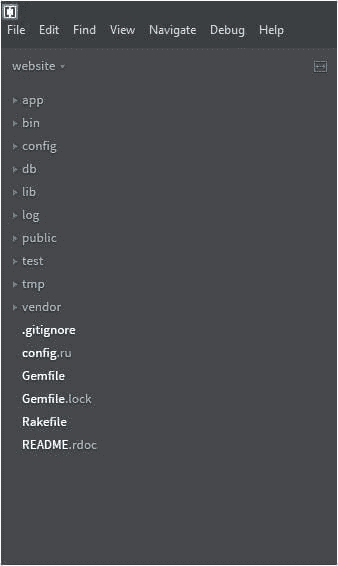](https://www.edureka.co/blog/wp-content/uploads/2015/07/project_structure.jpg)

即使我们还没有编写任何代码，你现在就可以运行网站应用程序。要运行网站应用程序，从网站文件夹执行 Rails 的命令，如下所示

[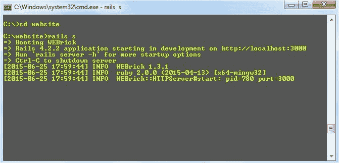](https://www.edureka.co/blog/wp-content/uploads/2015/07/run_at_start.jpg)

正如你在上面的快照中看到的，我们的网站应用已经在 部署 http://localhost:3000

在访问网址http://localhost:3000时，您将能够看到下面的屏幕

[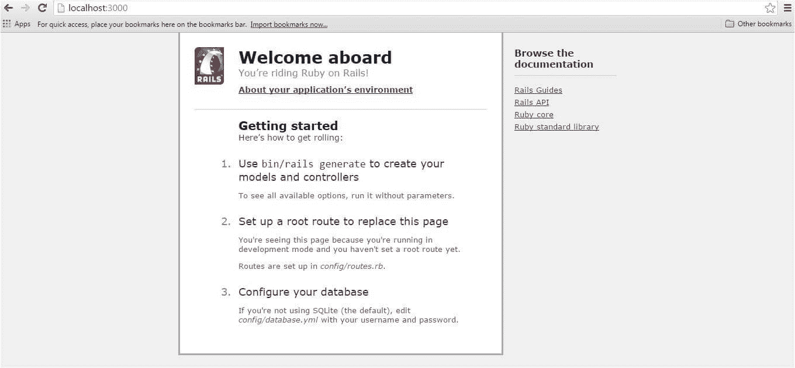](https://www.edureka.co/blog/wp-content/uploads/2015/07/first_page.jpg)

但是我们想在访问 URLhttp://localhost:3000/时显示我们的应用程序主页。为此，让我们在我们网站项目的公共文件夹下创建一个 index.html 页面。

注意:Rails 会自动为访问根 URLhttp://localhost:3000的 index.html 页面提供服务

目前我们在 index.html 只有一条线。

[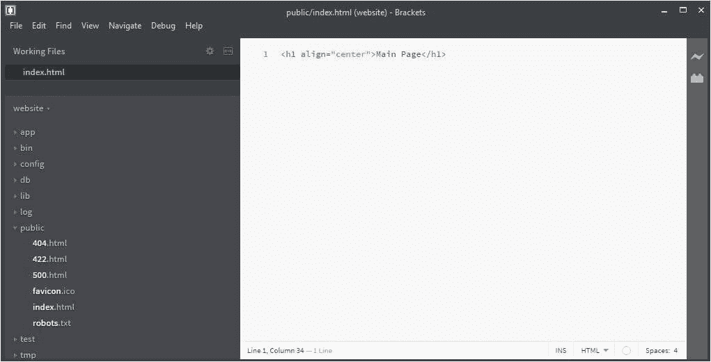](https://www.edureka.co/blog/wp-content/uploads/2015/07/index_page.jpg)

我们来访问根 URLhttp://localhost:3000

[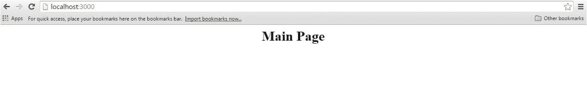](https://www.edureka.co/blog/wp-content/uploads/2015/07/main_page_output.jpg)

现在，让我们通过添加一些图片——JS 和很酷的 CSS——来给我们的 index.html 页面注入一些活力。我们将从启动引导使用灰度主题。

**灰度启动自举主题**--

下面是我们将使用的灰度启动引导主题的快照。我们将定制这个主题，以满足我们的要求。

[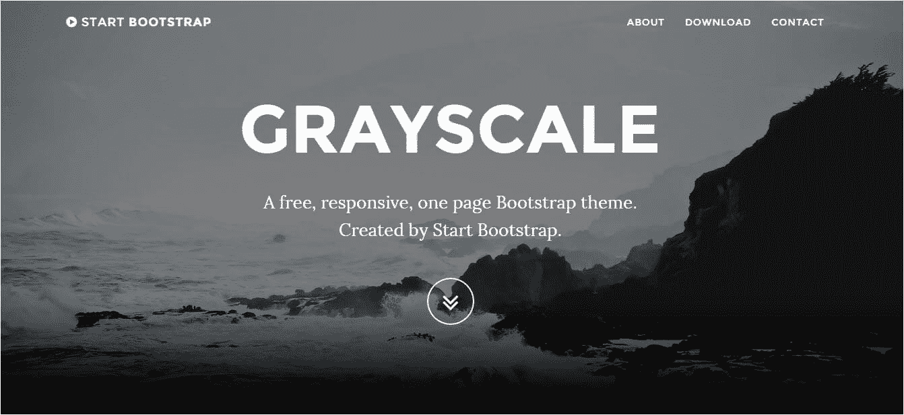](https://www.edureka.co/blog/wp-content/uploads/2015/07/start_bootstrap_theme.jpg)

你可以从[【http://startbootstrap.com/template-overviews/grayscale/】](http://startbootstrap.com/template-overviews/grayscale/)下载这个主题

下载灰度主题，将 CSS，font-awesome，fonts，img，JS 和 index.html 复制到网站项目的公共目录中。下面是在网站项目的公共目录下添加 CSS、JS、字体、图片文件夹和 index.html 页面后的项目快照。

[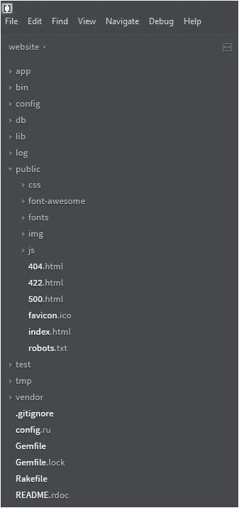](https://www.edureka.co/blog/wp-content/uploads/2015/07/project_structure_2.jpg)

让我们现在运行我们的网站项目:

[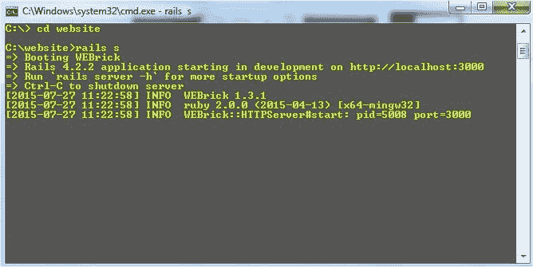](https://www.edureka.co/blog/wp-content/uploads/2015/07/second-rails-s.jpg)

在运行项目时，你会看到一个好看的灰度主题页面。

[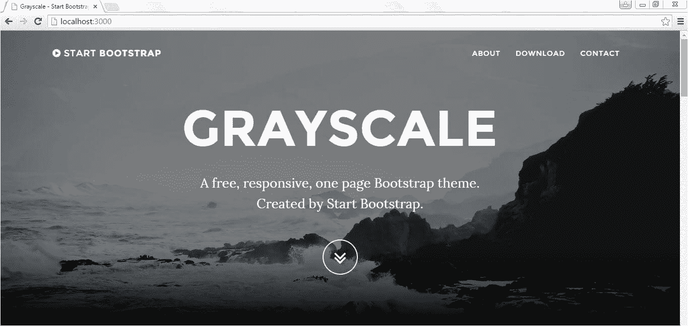](https://www.edureka.co/blog/wp-content/uploads/2015/07/first_run.jpg)

我们将修改 index.html 页面(在网站项目的公共目录下)，使其看起来更专业。

下面是在 index.html 页面中进行更改后网站项目的快照。我们刚刚改变了图片，并编辑了一些文字，使其针对个人。

[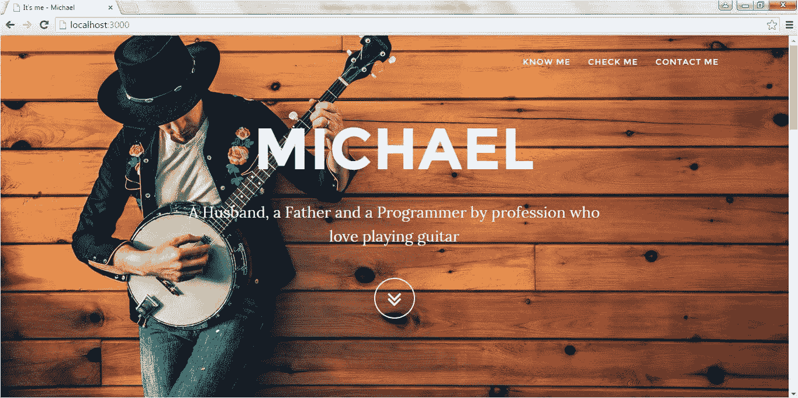](https://www.edureka.co/blog/wp-content/uploads/2015/07/all-changes.jpg)

您可以修改 index.html 和灰度。随心所欲的 CSS。现在，我们准备将我们的网站应用程序部署到 Heroku。

**将代码推送到 Github :**

在将应用程序部署到 Heroku 之前，我们需要将代码推送到远程 Github 存储库。为此你需要一个 Github 账户。如果你没有 Github 账户，去 www.github.com 的 [创建一个。](http://www.github.com/)

你还需要在你的 Windows 上安装 Github。从[【https://windows.github.com/】](https://windows.github.com/)下载 windows 版 Github。

下载 Github 并安装到您的机器上后，打开 Github 应用程序并配置您的 Github 凭证，选择 Git Bash shell 作为您的默认 shell(您也可以选择任何其他选项),然后保存更改。

您需要在 Github 上创建一个存储库，我们将在那里远程保存我们的网站项目。要创建一个资源库，请登录 Github 并点击绿色按钮中显示的新建资源库选项。

命名您的存储库(在本例中，我们将其命名为 railtoheroku ),并单击 create repository 链接，如下所示。

[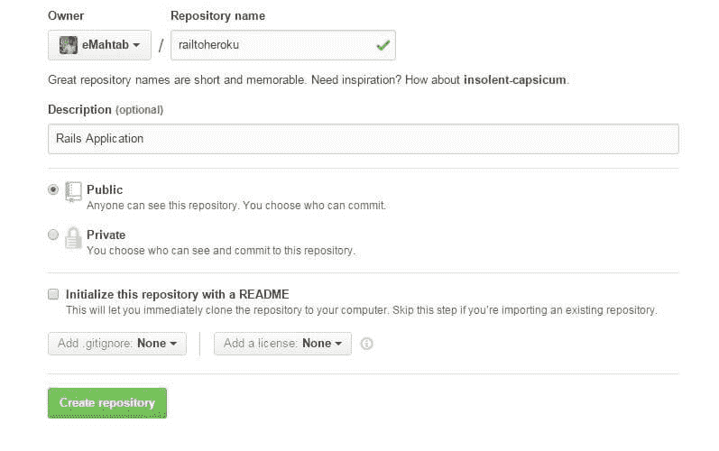](https://www.edureka.co/blog/wp-content/uploads/2015/07/rep1.jpg)

Github 将为 railtoheroku 存储库提供远程 URL([【https://github.com/eMahtab/railtoheroku.git】](https://github.com/eMahtab/railtoheroku.git))，在将代码从本地机器推送到 Github 时将需要这个 URL。

现在，我们准备将我们的网站项目代码推送到 Github。按照下面的步骤将代码推送到 Github。

打开 Git shell，使用 Git init 命令初始化网站目录，如下所示:

[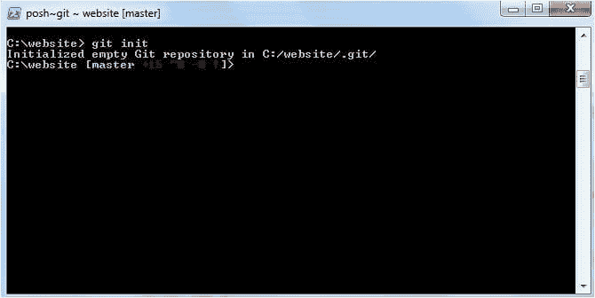](https://www.edureka.co/blog/wp-content/uploads/2015/07/git-init.jpg)

现在，通过执行 Git add，在版本控制下添加网站目录中的所有文件。

[](https://www.edureka.co/blog/wp-content/uploads/2015/07/git-add.jpg)

通过执行 Git Commit–m“最终提交”来提交所有文件

[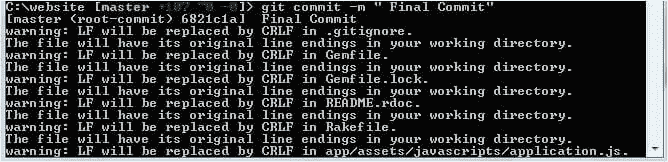](https://www.edureka.co/blog/wp-content/uploads/2015/07/git-commit.jpg)

添加远程存储库，如下所示:

[](https://www.edureka.co/blog/wp-content/uploads/2015/07/git-remote.jpg)

现在，最后一步是将代码推送到 Github 库:

[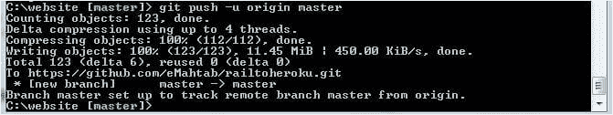](https://www.edureka.co/blog/wp-content/uploads/2015/07/git-push-master.jpg)

我们已经和 Github 玩完了。下一部分是将应用程序实际部署到 Heroku。

**将应用程序部署到 Heroku :**

在[【https://www.heroku.com/】](https://www.heroku.com/)创建一个英雄账号

**注意:**我们必须对 Heroku 的应用程序部署进行一些更改。Heroku 不支持 SqLite 3，而是有 PostgreSQL 数据库。所以我们必须从 gemfile 中删除 sqlite3 依赖项。Heroku 需要 rails_12factor gem，Heroku 使用它来服务静态资产，如图像和样式表。Gemfile 中需要的两项更改总结如下:

从 gem 文件中删除行 gem 'sqlite3 '

将以下几行添加到 Gemfile 中

```
group :development, :test do # <<<< not in production

gem 'sqlite3'

end

group :production do

gem 'pg',             '0.17.1'

gem 'rails_12factor',  '0.0.2'

end
```

让我们检查一下在对 Gemfile 进行修改之后，是否一切都正常。保存 gem 文件并使用特殊标志(–无生产)运行 **bundle install** 以防止本地安装任何生产 gem。

[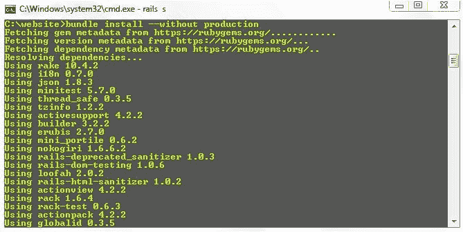](https://www.edureka.co/blog/wp-content/uploads/2015/07/without-production.jpg)

让我们将 Gemfile 中所做的更改提交到 Github 的远程存储库中:

[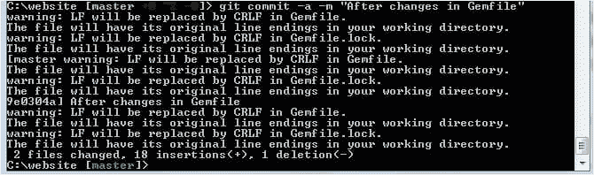](https://www.edureka.co/blog/wp-content/uploads/2015/07/after-changes-in-gemfile.jpg)

将更改推送到远程 Github 存储库:

[](https://www.edureka.co/blog/wp-content/uploads/2015/07/git-push-master.jpg)

**在 Heroku 创建新应用:**

登录 Heroku，创建一个新的应用程序。我把我的应用程序命名为 railtoheroku。你可以随便给它起什么名字。单击“创建应用程序”以创建指定的应用程序。

[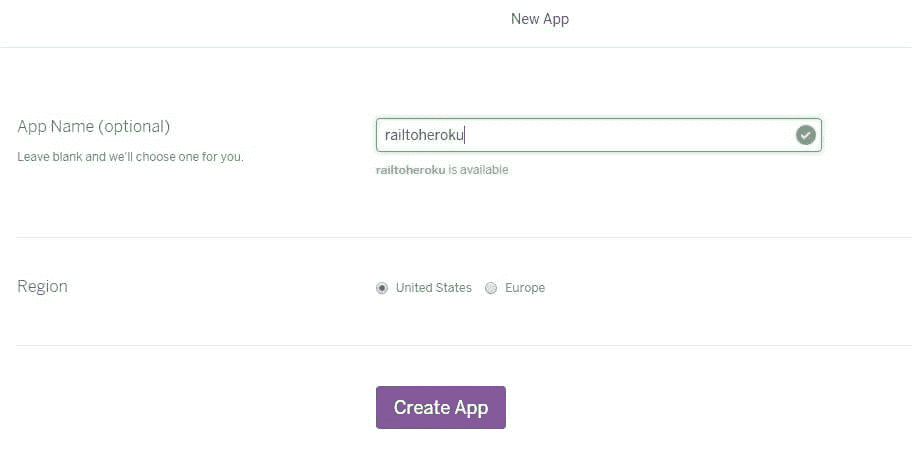](https://www.edureka.co/blog/wp-content/uploads/2015/07/heroku-new-app.jpg)

**将 Github 存储库连接到 Heroku 应用:**

下一步是将 Github 库链接到 Heroku。

下面我们连接了我们的 Github 库 railtoheroku

[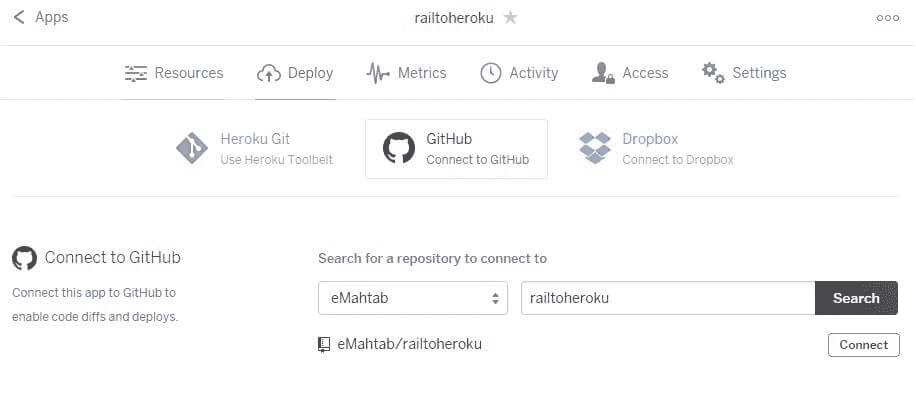](https://www.edureka.co/blog/wp-content/uploads/2015/07/connect.jpg)

一旦我们将 Github 存储库连接到 Heroku，我们就可以部署我们的应用程序了。要部署应用程序，向下滚动到手动部署选项，然后单击部署分支选项。

[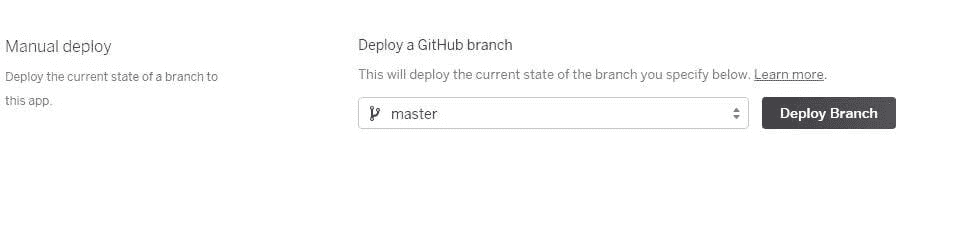](https://www.edureka.co/blog/wp-content/uploads/2015/07/deploy.jpg)

**部署应用程序:**

单击 Deploy Branch 后，Heroku 将开始在生产环境中安装 Gemfile 中的 gem:

[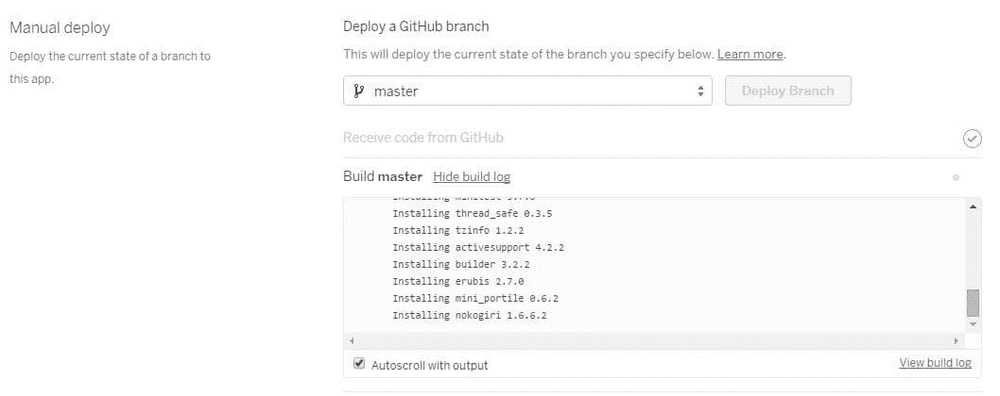](https://www.edureka.co/blog/wp-content/uploads/2015/07/installing.jpg)

一旦所有的 gem 被安装并且应用程序被部署，你将会看到来自 Heroku 的祝贺信息说，“你的应用程序被成功部署。”

[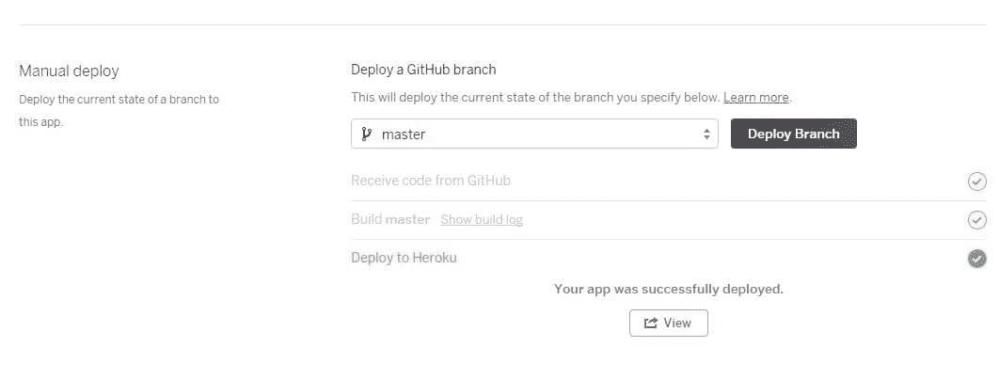](https://www.edureka.co/blog/wp-content/uploads/2015/07/view.jpg)

要查看您部署的应用程序，只需点击查看按钮，您将能够看到您的应用程序部署成功。

[](https://www.edureka.co/blog/wp-content/uploads/2015/07/live.jpg)

如果您在执行上述任何步骤时遇到任何问题，请在下面评论。希望你喜欢这篇文章。

有问题要问我们吗？请在评论区提到它，我们会给你回复。

**相关帖子:**

[Ruby On Rails](https://www.edureka.co/ruby-on-rails-sp)

[使用 JSP Servlet 创建在线测验应用程序](https://www.edureka.co/blog/creating-an-online-quiz-application-using-jsp-servlet/)

[使用 SAX 解析器解析 XML 文件](https://www.edureka.co/blog/parsing-xml-file-using-sax-parser/)

[用 JAX-WS](https://www.edureka.co/blog/how-to-write-restful-web-services-with-jax-ws/) 编写 RESTful Web 服务