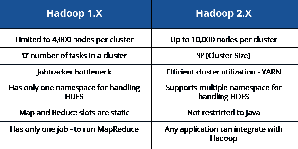
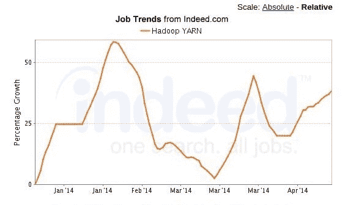
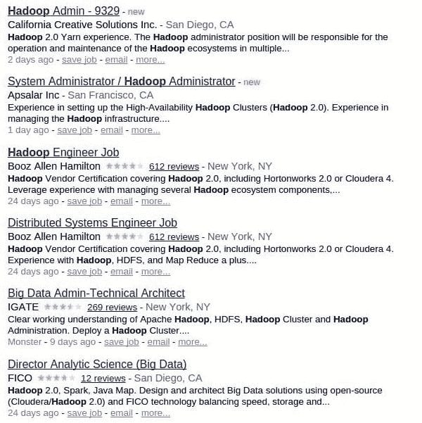

# 学习 Hadoop 2.0 的 4 个实用理由

> 原文：<https://www.edureka.co/blog/4-practical-reasons-to-upgrade-to-hadoop-2>

我年轻的时候喜欢《星球大战》系列电影。我太喜欢了，所以我有他们每一个人的录像带。我过去常常一遍又一遍地看它们。然后是 DVD 播放器的时代，我不得不再次获得这些电影的 DVD。我毫不犹豫地再次购买整套 DVD，因为我想体验新技术，并继续享受我最喜欢的电影。在另一项新技术蓝光出现之前，一切都很顺利。这些电影已经买了两次了，我不想再买了。有一段时间，我没有努力“更新”自己，认为没有这项技术我也可以做得很好。我做得很好。反正也没影响我的生活。但是我可以看到趋势的变化，我不能和我的朋友分享我的电影，就像他们在一起做的那样。我真的觉得被冷落了。

我终于出去买了这部电影的蓝光版。我记得它不是因为我喜欢这部电影，而是因为视频的质量令人震惊。最重要的是，我在一张蓝光光盘上获得了整套电影。

当涉及到我们的职业时，保持更新的需要或冲动是最强烈的，因为风险更大。在游戏中保持领先变得至关重要。

## **学习 Hadoop 2.0 的 4 个实用理由:**

尽管这是不可避免的，但在我们的职业中保持与时俱进已经成为我们生活中重要的一部分。尽管听起来令人生畏，但没有必要惊慌，因为技术不会真的变化得那么快或剧烈。但是关于这些技术和我们可以用它们做的事情的讨论和信息越来越多。以下是一些你应该保持与时俱进的理由:

**#1:不要被抓出来**

不关注技术的最新发展会让你看起来像一头被车灯困住的鹿。不完全是你专业能力的光辉写照。紧跟时代潮流会让你的专业技能得到同行的尊重。也许没有必要去实现你学到的每一个新东西，但是意识到更新是必须的。

*例如，当有一个关于 Hadoop 的讲座时，您可以让您的同行知道 Hadoop 2.5.0 在使用 HTTP 代理服务器时有身份验证改进。在 Hadoop 的同一个版本中，也提供了直接写入 Graphite 的功能。*

当组织考虑迁移到 Hadoop 时，掌握最新的更新变得至关重要。“知道”会对你的职业生涯产生巨大的影响。

**#2:拥有竞争优势**

在各自领域熟练的专业人士受到尊重。与时俱进是领先的最佳方式。你需要保持更新，这反映了你对工作的热情。通过在工作和行业中发展专业技能，你会赢得周围人的信任和尊重。从领导的角度来看，这是无价的！

即使您的组织仍在使用 Hadoop 1.0，了解 Hadoop 2 的所有最新功能也会让您跟上进度，因为它相对较新，而且肯定更好。成为第一个学会这一点的人会让你比同龄人更有优势。

**#3:新机遇**

可悲的是，我们现在的角色一直在变。随着时间的推移，会有更多的责任和机会去完成新的任务。通过了解最新的行业趋势，您将处于抓住这些机会的最佳位置。

梅西百货、洛克希德·马丁公司、加州创意解决方案公司、Capital One、CSpring、CACI 国际公司、甲骨文公司、雅虎、美国运通、蓝鹰、Aetna、劳伦斯利弗莫尔国家实验室和许多其他公司都在寻找熟悉 Hadoop 2 最新特性的人，比如 YARN。

**#4:做出更好的决策**

额外的信息将让你做出明智的选择和更好的决定。它将帮助您识别机会，并为您组织的战略增加价值。

Hadoop 2 具有提高速度和降低成本的特性。提出改进性能和提高速度的建议无疑可以提高组织的生产力。以下是 Hadoop 2 的一些特性，这些特性将使组织受益，建议它们也将促进您的职业发展。

*   支持在 Microsoft Windows 上运行 Hadoop

*   通过 YARN 分布式缓存中的 HDFS 简化 MapReduce 二进制文件的分发。

*   通过应用历史服务器和应用时间线服务器增强了对 YARN 上新应用的支持

*   在 HDFS 完成 HTTPS 支持

*   为 YARN 的时间线商店集成 Kerberos。

*   支持 HDFS 的异构存储层次结构。

*   用于集中管理 HDFS 数据的内存缓存。

*   通过 YARN 分布式缓存中的 HDFS 简化 MapReduce 二进制文件的分发。

保持更新不仅仅有实际的原因；还有技术上的原因。Hadoop 有许多对组织有利的特性。深入了解它们会让你清楚地了解什么是优势。

## **Hadoop 有什么最新更新？**

每个产品都会经历不同的发布阶段，并会出现不同的版本。Hadoop 也不例外，推出了 Hadoop 2.0。Apache foundation 已经推出了 Hadoop 的后续版本，如 Hadoop 2.1.0、Hadoop 2.4.0，并已达到 Hadoop 2.5.1，这是 2014 年 9 月发布的最新版本。

## **为什么发布 Hadoop 2？**

随着新版本的到来，新的功能和固定的错误。因此，每当你使用 Hadoop 的某个特定版本，并认为可以添加某个功能或需要修复某些 bug 时，你都会让 Apache foundation 的人知道这一点。这些家伙反过来工作，并在下一个版本中给你一个更好的产品。

## **Hadoop 2——不只是一个数字**

Hadoop 2 不仅仅是 Hadoop 的最新版本。总的来说，它是第二代架构。Hadoop 分销商 Hortonworks 的创始人兼架构师 Arun Murthy 坚持认为，这种区别非常重要，因为将 Hadoop 从批处理转移到实时分析领域所需的重新设计工作量非常大。

让我们来讨论一下 Hadoop 2.0 和它的前身 Hadoop 1.0 有什么不同。显然，后来发布的版本将优于早期版本。以下是 Hadoop 2.0 相对于 Hadoop 1.x 的四大改进:

*   HDFS 联盟 NameNode 的横向可扩展性

*   NameNode 高可用性–NameNode 不再是单点故障

*   YARN——能够使用非 MapReduce 应用程序(如 MPI、GIRAPH)处理 HDFS 可用的数 TB 和数 Pb 的数据

*   资源管理器——将负担过重的 JobTracker 的两个主要功能(资源管理和作业调度/监控)分成两个独立的守护进程:全局资源管理器和每个应用程序的 ApplicationMaster

还有额外的功能，如容量调度程序(在 Hadoop 中启用多租户支持)、数据快照、对 Windows 的支持、NFS 访问，从而提高 Hadoop 在行业中的采用率，以解决大数据问题。

## **Hadoop 2。X Vs Hadoop 1。x**

我们来做个小对比，看看 Hadoop 2.0 在哪些方面比 Hadoop 1.0 更好，有哪些不同

## **为什么 Hadoop 2 优先于 Hadoop 1.0？**

Hadoop 2.0 提供了性能改进，有利于 Hadoop 生态系统中的相关技术。除了 HDFS 和第二代体系结构(YARN)的突破性功能之外，相比 Hadoop 1.0，还有更多更好的理由来支持 Hadoop 2:

*   Hadoop 2 不再有语言限制。也就是说，现在很多专业人士都可以使用 Hadoop。

*   有了 Hadoop 2，像 MapReduce 编码人员短缺这样的障碍就被克服了。

*   比 Hadoop 1.0 快 2 倍

*   投资回报率是现有硬件的 2 倍。

*   有了 YARN，应用编程接口更加开放和灵活。

*   Hadoop 2 扩展了在大数据项目中使用 Hadoop 的可能性。

*   有了 Hadoop 2，开发人员现在可以执行各种各样的数据处理任务，超出了 Hadoop 以前的批处理范围。

*   为信息管理人员提供了新的机会，并解决了以前版本中的缺点。

*   这个新版本具有在同一个 Hadoop 集群上运行多个工作负载的独特功能。

*   Hadoop 不再局限于一个特性。它的应用现在已经超越了 HDFS 和 MapReduce。

## 纱线的主要优势

我们知道 YARN 是第二代架构，让我们看看是什么让它如此伟大。

*   规模

*   新的编程模型和服务

*   增强的集群使用

*   灵活

*   比 Java 多得多

*   还有更多

## **需求 Hadoop 2 技能**

组织现在正在推出或试验 Hadoop 2。因此，需要精通 Hadoop 2 的专业人员。许多组织已经开始在内部寻找使用 Hadoop 的人员。有明显的迹象表明，纱线正在上升，最终将取代对 MapReduce 技能的需求。

以下是对 Hadoop 技能的当前和预计需求的一些看法:

*   据 Gartner 的分析师称，Hadoop 2 是一项至关重要的发展，因为全球的大企业都发现 Hadoop 是其大数据管理的变革者。

*   根据 Bloor group 的埃里克·卡瓦纳格的说法，Hadoop 2.0 已经在寻求大数据的信息工作者中获得了牵引力。

*   Hadoop 2.0 的采用率持续上升，现已进入成熟期。

*   组织意识到了纱线的好处，并对此感到兴奋。

这是 Hadoop 2.0/YARN 在[Indeed.com](http://www.indeed.com/jobs?q=%22Hadoop+2.0%22&l=)的职位空缺快照

## **谁正在迁移到 Hadoop 2 或已经迁移到 Hadoop 2？**

 

**雅虎:**

雅虎！，全方面的领头羊 Hadoop 已经实现了 YARN (0.23.x)。根据 Murthy 的说法，雅虎的 35，000 节点集群现在每天处理 130-150 个作业，而在 YARN 之前每天处理 50-60 个作业。

在谈到卓越的性能时，Murthy 引用了这样一句话:“当您拥有超过 35，000 到 40，000 个节点的 2 倍时，这是惊人的”。他还补充说，“这是一个非常有说服力的故事，告诉首席信息官，如果您只是将软件从 Hadoop 1 升级到 Hadoop 2，您将看到您的工作吞吐量提高了 2 倍。”

**易贝:**

易贝拥有业内最大的 Hadoop 集群之一，其中的数据以 Pb 为单位。他们还将其集群迁移到了 Hadoop 2。

**结论:**

随着 Hadoop 2 的成熟和更容易实现，他们甚至说服了怀疑论者，越来越多的组织正在迁移到 Hadoop 2.0。有充分的理由避免使用 1.x 版本。但是对于 Hadoop 2，即使是不相信的人也在考虑它，因为它可以有广泛的用途。学习 Hadoop 2.0 并实施它来执行大数据计算，您将打开通往技术先进和经济回报丰厚的职业生涯的大门。

有问题要问我们吗？请在评论区提及它们，我们将会回复您。

**相关帖子:**

[大数据与 Hadoop 入门培训](https://www.edureka.co/big-data-and-hadoop)

[学习 Hadoop 的 5 个理由](https://www.edureka.co/blog/5-reasons-to-learn-hadoop "5 Reasons to Learn Hadoop")

[Hadoop 培训有多重要？](https://www.edureka.co/blog/how-essential-is-hadoop-training/ "How essential is Hadoop Training")