# AWS Fargate——ECS 的计算引擎

> 原文：<https://www.edureka.co/blog/aws-fargate/>

[容器化](https://www.edureka.co/blog/what-is-docker-container)在过去几年中改变了云架构，使企业能够以更快的速度构建、部署&和管理应用。集装箱背后的势头肯定没有显示出任何放缓的迹象。如今有太多的容器&容器编排服务可用。然而，它们中的大多数仍然需要您为容器的运行配置和管理虚拟机集群。这就是 AWS Fargate 的用武之地。通过 [AWS 培训](https://www.edureka.co/aws-certification-training)了解更多关于亚马逊网络服务的信息。

在本文中，我们将学习 AWS Fargate，一个用于容器的无服务器计算平台。我们将在本文中涉及的主题如下:

1.  [对 AWS Fargate](#NFG) 的需求
2.  [什么是 AWS Fargate？](#FG)
3.  [法盖特](#WFG)的工作
4.  [演示:法盖特在行动](#DFG)

我们开始吧！

## **对 AWS Fargate** 的需求

当容器服务还不存在的时候，用户通常在虚拟机上启动他们的应用程序。在 AWS cloud 中，他们在 EC2 实例上部署应用程序。他们将他们的应用和操作系统打包成我们所说的亚马逊机器映像(AMI)，然后在 [AWS EC2 实例](https://www.edureka.co/blog/ec2-aws-tutorial-elastic-compute-cloud/)上运行。

然后 docker 推出了容器，人们开始在这些容器上部署他们的应用程序。容器类似于 VM。一个主要的区别是，与 VM 不同，容器与其他容器共享主机系统的内核。下面的图表将使它更加清晰。

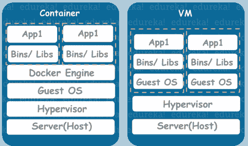

因此，随着这些容器开始变得越来越受欢迎，人们开始大规模使用它们。EC2 实例中的容器数量增加了，这反过来又增加了实例的数量。AWS 随后推出了**亚马逊弹性容器服务(ECS)** 。

但是什么是 ECS 服务呢？亚马逊弹性容器服务(Amazon ECS)是一种高可伸缩、高性能的容器[和](https://www.edureka.co/blog/what-is-docker-container)容器编排服务。 **亚马逊 ECS** 减少了一些用户必须管理的开销。然而，用户仍然必须管理托管容器应用程序的底层实例。

这给了 AWS 一个想法，即提供一种可以处理底层虚拟机的服务，同时用户可以专注于构建他们的应用程序。所述服务是 **AWS Fargate。**

**AWS Fargate 教程| Edureka**

[https://www.youtube.com/embed/fmFlAWtKnGA?rel=0&showinfo=0](https://www.youtube.com/embed/fmFlAWtKnGA?rel=0&showinfo=0)

这篇关于 AWS Fargate 的 Edureka 教程将帮助您了解如何在 Amazon ECS 上运行容器，而无需配置和管理底层虚拟机。

## **什么是 AWS Fargate？**

*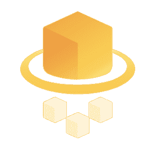AWS**Fargate**是一个计算引擎，用于* *亚马逊* *弹性* *容器* *服务* * (ECS) * *让您可以运行* *容器* *而不必* *调配、配置&规模* *托管容器应用程序的虚拟机集群*

AWS Fargate 消除了用户自行管理 EC2 实例的需要。实际上，用户根本不需要使用 EC2 实例。Fargate 本身将充当计算引擎。它让您专注于设计和构建应用程序等元素，而不是管理运行它们的基础架构。有了 **Fargate launch type** ，你需要做的就是把你的应用打包到容器中，指定内存和 CPU 需求，定义 IAM 策略&启动你的应用。

AWS Fargate 还可以轻松扩展您的应用程序。一旦定义了所有的应用程序需求，AWS Fargate 就会以高可用性的方式管理运行容器所需的所有伸缩和基础设施。它与亚马逊 EKS ECS&无缝集成，为您启动和管理您的集装箱。

现在，在不维护底层服务器的情况下，启动容器的整个过程是如何进行的呢？

想成为认证 AWS 架构师？ [<button>现在报名</button>](https://www.edureka.co/aws-certification-training)

**查看我们在顶级城市的 AWS 认证培训**

| 印度 | 美国 | 其他国家 |
| [在海德拉巴的 AWS 培训](https://www.edureka.co/aws-certification-training-hyderabad) | [亚特兰大 AWS 培训](https://www.edureka.co/aws-certification-training-atlanta) | [AWS 伦敦培训](https://www.edureka.co/aws-certification-training-london) |
| [班加罗尔的 AWS 培训](https://www.edureka.co/aws-certification-training-bangalore) | [波士顿 AWS 培训](https://www.edureka.co/aws-certification-training-boston) | [阿德莱德的 AWS 培训](https://www.edureka.co/aws-certification-training-adelaide) |
| [钦奈的 AWS 培训](https://www.edureka.co/aws-certification-training-chennai) | [纽约市的 AWS 培训](https://www.edureka.co/aws-certification-training-new-york-city) | [新加坡 AWS 培训](https://www.edureka.co/aws-certification-training-singapore) |

## **AWS Fargate**的工作

在我们看到 AWS Fargate 的工作原理之前，我们先来看看一些你在处理 AWS Fargate 时经常遇到的通用术语。

**容器:** A [Docker 容器](https://www.edureka.co/blog/docker-tutorial)是软件开发的标准化单元，包含了你的软件应用运行代码、运行时、系统工具、系统库等所需的一切。这些容器是从名为容器映像的只读模板创建的。

**容器图像:**图像通常是从 docker-file 构建的，docker-file 是一个纯文本文件，它指定了容器中包含的所有组件。这些图像存储在一个注册表中，可以从这个注册表中下载&在容器中运行。

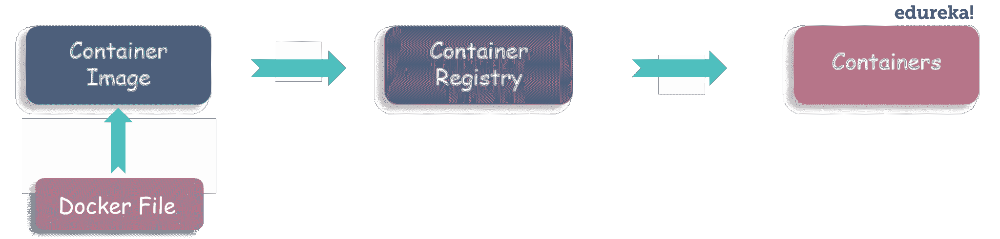

**任务定义:**任务定义是一个 JSON 格式的文本文件，它描述了组成应用程序的一个或多个容器。您可以将它视为您的应用程序的蓝图。

**任务:**任务是集群内任务定义的实例化。您可以选择指定将在集群上运行的任务数量。

**集群:**集群基本上就是你的应用需要的资源的逻辑分组。如果您使用 **Fargate launch type** 处理集群中的任务，那么 Amazon ECS 会管理您的集群资源。如果您使用 **EC2 启动类型**，那么您的集群将是您管理的一组 Amazon EC2 容器实例。

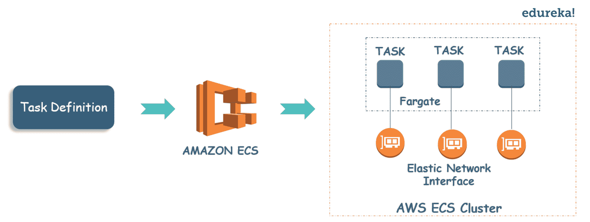

现在我们准备冒险前进。下图让您大致了解了如何使用 AWS Fargate 在 ECS 上部署应用程序。

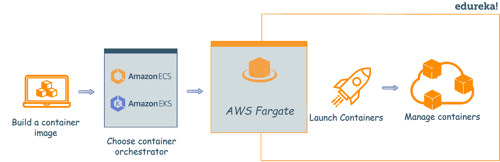

让我们试着理解上图的内容。首先，您需要构建一个适合您的应用程序的容器映像，然后将它存储在注册表中。然后选择一个容器编排服务，Amazon ECS 或 Amazon EKS，并为应用程序分配资源。完成后，您需要创建一个集群来对所有这些分配的资源进行分组。这是您选择 AWS Fargate 启动类型的时候。现在 AWS Fargate 将推出&运行你所有的容器。它为您管理所有底层基础架构和集群。它还可以无缝扩展您的应用程序需求，而无需您操心。

那不是很简单吗？

想让你的‘云’知识更上一层楼？ [<button>今天获得云认证！</button>](https://www.edureka.co/masters-program/cloud-architect-training)

现在，让我们使用 AWS Fargaet 启动类型在 Amazon ECS 上部署一个简单的 web 应用程序。

**AWS Fargate 正在运行**

遵循以下步骤，使用 AWS Fargate 启动类型在 Amazon ECS 上部署一个简单的 web 应用程序。

**注意**:确保你在 AWS Fargate 可用的 AWS 地区(可以选择 N.Virginia)。

**第一步:**在亚马逊弹性容器服务控制台上点击‘开始’选项。

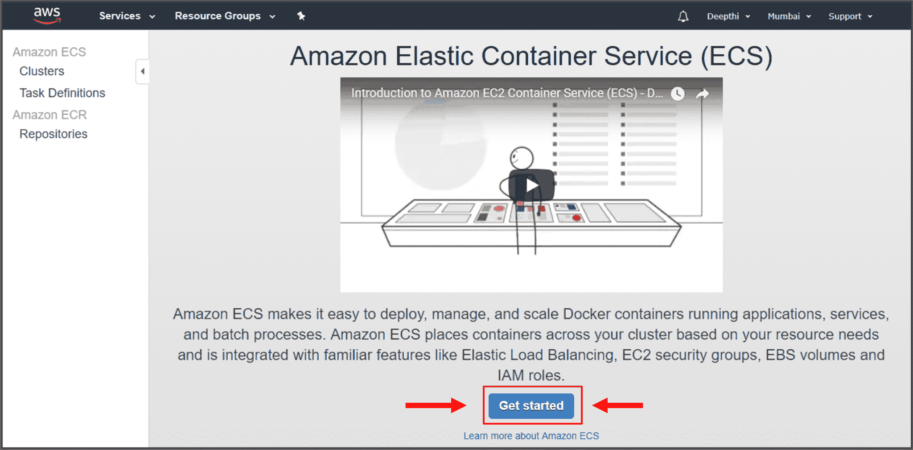

你将被带到一个页面，上面写着“ ***”使用 Fargate“***开始使用亚马逊弹性容器服务(亚马逊 ECS)。

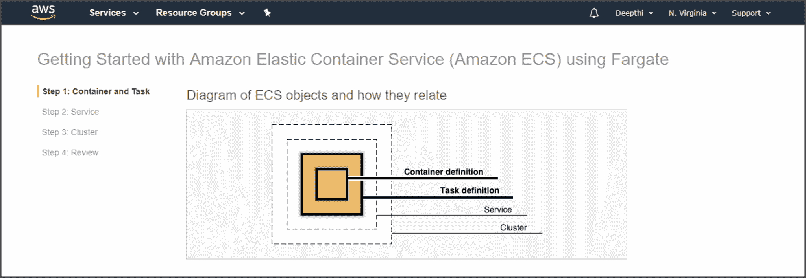

**步骤 2:** 创建一个容器定义。如果你刚刚开始使用 AWS Fargate，你可以选择预装的。

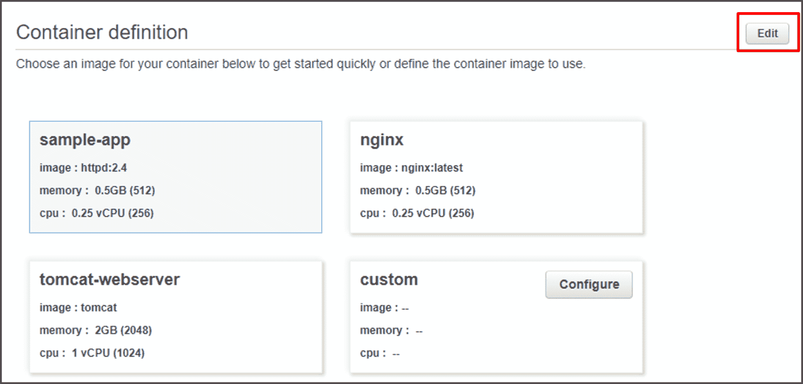

**第三步:**创建任务定义。您可以使用示例任务定义，或者可选地重命名任务定义，并通过选择**编辑来编辑任务所使用的资源(例如**任务内存**和**任务 CPU** 值)。**

**步骤 4:** 配置一个服务，该服务在您的集群中启动并维护指定数量的任务定义副本。您可以使用预加载的服务定义，或者选择重命名服务，或者通过选择 **Edit 查看和编辑详细信息。**

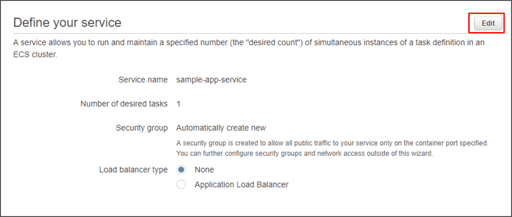

**步骤 5:** 作为最后一步，您需要配置集群。命名您的集群，然后 Amazon ECS 会为您处理网络和 IAM 配置。然后回顾到目前为止你做了什么，点击**创建**完成。

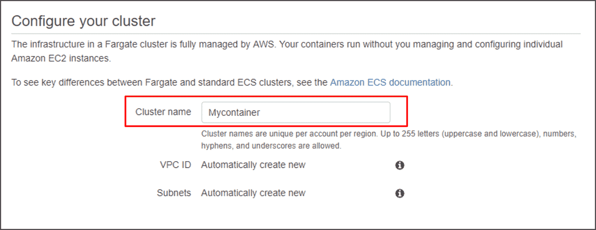

***就是这样！您的简单 web 应用程序应该已经启动并运行了。***

现在，如果你的服务是一个基于网络的应用程序，就像我们刚刚推出的那个，你可以用网络浏览器查看它的内容。

**第六步**(可选):在你的服务的网络部分寻找 **IPv4 公共 IP** 地址&在你的网络浏览器中输入。您应该会看到一个显示您刚刚启动的 web 应用程序的网页。

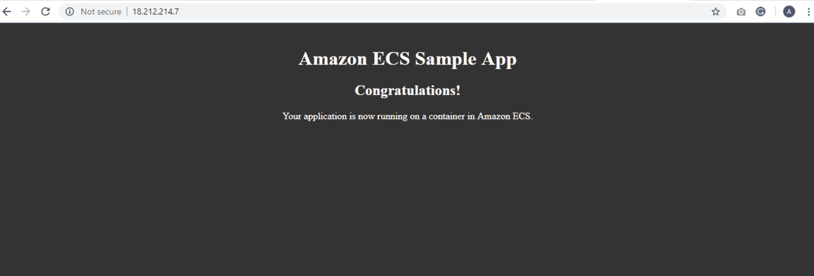

现在你知道如何使用 **AWS Fargate launch type** 在亚马逊弹性容器服务上启动容器。去探索吧。

*有问题吗？请在“AWS Fargate”的评论部分提到它，我们将尽快回复您。*