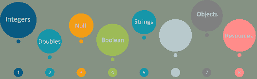
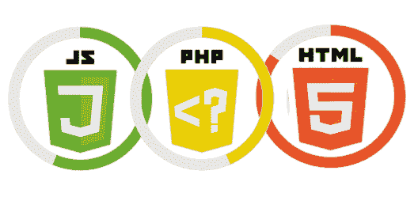

# 2023 年你必须准备的 50 个 PHP 面试问题

> 原文：<https://www.edureka.co/blog/interview-questions/php-interview-questions/>

[PHP](https://www.edureka.co/blog/php-tutorial-for-beginners/) 是 **PHP 超文本预处理器**的递归首字母缩写。它是一种广泛使用的开源编程语言，特别适合创建动态网站和移动 API。因此，如果你正计划开始你的 PHP 职业生涯，并且你希望了解与之相关的技能，现在是时候投入进去了。这些 **PHP 面试问答** 是向 **[PHP 认证培训](https://www.edureka.co/php-mysql-self-paced)** 专家咨询后收集的。

PHP 面试问题分为 2 个部分:

*   [基础级 PHP 面试题](#basic)
*   [高级水平 PHP 面试题](#advance)

我们从第一节 PHP 面试问题开始。

## **基础级 PHP 面试题**

### **Q1。PHP 的常用方法有哪些？**

| **PHP 的用途** |
| 

*   It performs system functions, that is, it can create, open, read, write and close files on the system.

 |
| 

*   It can process forms, that is, collect data from files, save data to files, send data by email, and return data to users.

 |
| 

*   You can add, delete and modify elements in your database with the help of PHP.

 |
| 

*   Access cookie variables and set cookies.

 |
| 

*   With PHP, you can restrict users' access to certain pages of your website and encrypt data.

 |

### **Q2。PHP 中的 PEAR 是什么？**

PEAR 是一个可重用 PHP 组件的框架和仓库。PEAR 代表 **PHP 扩展和应用库**。它包含所有类型的 PHP 代码片段和库。它还提供了一个命令行界面来自动安装“包”。

### ** Q3。静态网站和动态网站有什么区别？**

| **静态网站** | **动态网站** |
| 在静态网站中，运行脚本后不能更改内容。您不能更改站点中的任何内容，因为它是预定义的。 | 在动态网站中，脚本的内容可以在运行时改变。每次用户访问或重新加载时，它的内容都会重新生成。 |

### **Q4。如何从命令行执行 PHP 脚本？**

要执行一个 PHP 脚本，使用 **PHP 命令行界面(CLI)** 并以如下方式指定脚本的文件名:

```

php script.php

```

### **Q5。PHP 是区分大小写的语言吗？**

PHP 部分区分大小写。变量名区分大小写，但函数名不区分大小写。如果用小写定义函数名，用大写调用它们，它仍然可以工作。用户定义的函数不区分大小写，但是语言的其余部分是区分大小写的。

### **Q6。‘逃到 PHP’是什么意思？**

PHP 解析引擎需要一种方法来**区分** PHP 代码和页面中的其他元素。这样做的机制被称为“逃到 PHP”。对字符串进行转义意味着减少该字符串所用引号中的**歧义**。

### **Q7。PHP 变量有什么特点？**

PHP 变量的一些重要特征包括:

*   PHP 中的所有变量都用一个前导的**美元符号** ($)来表示。
*   变量值是最近一次赋值的值。
*   变量通过=运算符被**赋值**，变量在左边，待计算的表达式在右边。
*   变量可以，但不需要，在赋值前被**声明为**。
*   PHP 中的变量没有**内在类型**——一个变量事先不知道它将被用来存储一个数字还是一串字符。
*   变量在赋值前使用的是默认的值**。**

### **Q8。PHP 变量有哪些不同的类型？**



PHP 中有 8 种**数据类型**用于构造变量:

1.  **整数**——是整数，没有小数点，像 4195。
2.  **双精度值**——是浮点数，如 3.14159 或 49.1。
3.  **布尔型**——只有两个可能的值，不是真就是假。
4.  **NULL** 是一种特殊类型，只有一个值:NULL。
5.  **字符串**——是字符序列，比如“PHP 支持字符串操作”
6.  **数组**—是其他值的命名和索引集合。
7.  **对象**——是程序员定义的类的实例，它们可以打包特定于该类的其他类型的值和函数。
8.  **资源**——是保存对 PHP 外部资源的引用的特殊变量。

### **Q9。PHP 变量的命名规则是什么？**

命名 **PHP 变量** : 需要遵循以下规则

*   变量名必须以**字母**或**下划线**字符开头。
*   变量名可以由数字、字母、下划线组成，但不能使用**字符**，如+、–、、(、)。&等。

### **Q10。确定任何不属于布尔类型的值的“真”的规则是什么？**

确定不属于**布尔**类型的任何值的“真”的规则是:

*   如果值是一个数字，如果正好等于**零**则为**假**，否则为真。
*   如果值是一个字符串，如果该字符串为**空**(有零个字符)或者是字符串“0”则为假，否则为真。
*   NULL 类型的值总是假的。
*   如果值是一个**数组**，如果不包含其他值则为假，否则为真。对于一个对象，包含一个值意味着拥有一个已经赋值的成员变量。
*   有效资源为真(虽然有些成功时返回资源的函数不成功时会返回假)。
*   不要用 **double** 作为布尔值。

### **Q11。什么是 NULL？**

NULL 是一种特殊的数据类型，它只能有**个值**。数据类型为 NULL 的变量是没有赋值的变量。可以分配如下:

```

$var = NULL;

```

按照惯例，特殊常量 NULL 是大写的，但实际上它是不区分大小写的。所以，你也可以写成:

```

$var = null;

```

一个被赋予空值的变量，由以下**属性** : 组成

*   在一个**布尔**上下文中，它被评估为假。
*   用 **IsSet()** 函数测试时返回 FALSE。

### **Q12。在 PHP 中如何定义一个常数？**

要定义一个常数你必须使用 **define()** 函数并且要检索一个常数的值，你必须简单地指定它的名字。如果你已经定义了一个常量，它就永远不能被改变或定义。不需要有一个带$的常数。有效的常量名称以字母或下划线开头。

### **Q13。constant()函数的用途是什么？**

constant()函数将返回常量的值。当您想要**检索常量的**值，但您不知道它的名称，即它存储在变量中或由函数返回时，这很有用。例如——

```

<?php define("MINSIZE", 50); echo MINSIZE; echo constant("MINSIZE"); // same thing as the previous line ?>

```

### **Q14。PHP 常量和变量有什么区别？**

| **常数** | **变量** |
| 不需要在常量前写美元符号 | 变量必须用美元符号书写 |
| 常量只能使用 define()函数来定义 | 变量可以通过简单赋值来定义 |
| 常量可以在任何地方定义和访问，而不用考虑变量的作用域规则。 | 在 PHP 中，函数默认只能在自己的作用域内创建和访问变量。 |
| 常量不能重新定义或未定义。 | 变量可以为每个路径单独重新定义。 |

### **Q15。说出 PHP 中的一些常量及其用途。**

1.  **_ LINE _**–表示文件的当前行号。
2.  **_ FILE _**–表示文件的完整路径和文件名。如果在包含中使用，则返回包含文件的名称。
3.  **_ FUNCTION _**–代表函数名。
4.  **_ CLASS _**–返回声明时的类名。
5.  **_ METHOD _**–表示类方法名。

### **Q16。中断并继续语句的目的是什么？**

**Break**–终止 **for 循环**或 **switch** 语句，并将执行转移到紧跟在 for 循环或 switch 之后的语句。

**继续**–它使**回路**跳过其身体的剩余部分，并在重复之前立即重新测试其状态。

### **Q17。开始和结束 PHP 代码块的两种最常见的方法是什么？**

开始和结束一段 PHP 代码最常见的两种方式是:

```

<?php [ --- PHP code---- ] ?>

```

```

<? [--- PHP code ---] ?>

```

### **Q18。PHP4 和 PHP5 有什么区别？**

| **PHP4** | **PHP5** |
| 

*   The constructor has the same name as the class name.

 | 

*   The constructor is named _construct and the destructor is named _ destroy ().

 |
| 

*   Everything is delivered by value.

 | 

*   All objects are passed by reference.

 |
| 

*   php4 does not declare a class as abstract

 | 

*   PHP 5 allows you to declare a class as abstract

 |
| 

*   It has no static methods and properties in the class.

 | 

*   It allows you to have static methods and properties in a class

 |

### **Q19。final 类和 final 方法是什么意思？**

方法声明中的 **final** 关键字表示该方法不能被子类覆盖。被声明为最终**的**类**不能被子类化。这在我们创建像 String 类这样的不可变类时特别有用。属性不能被声明为 final，只有**类**和**方法**可以被声明为 final。**

### **Q20。如何在 PHP 中比较对象？**

我们使用操作符“==”来测试两个对象是否是来自同一个类的**实例**，并且具有相同的属性和相等的值。我们还可以通过使用标识运算符“===”来测试两个对象是否引用同一个类的同一个实例。

### **Q21。PHP 和 Javascript 如何交互？**

PHP 和 Javascript 不能直接交互，因为 **PHP** 是一种**服务器端**语言，而 **Javascript** 是一种**客户端**语言。然而，我们可以交换变量，因为 PHP 可以生成由浏览器执行的 Javascript 代码，并且可以通过 **URL 将特定变量传回 PHP。**

### ** Q22。PHP 和 HTML 如何交互？**

可以通过 PHP 脚本生成 HTML，也可以将来自 **HTML** 的**信息**传递给 PHP。PHP 是一种服务器端语言，而 HTML 是一种客户端语言，所以 PHP 在服务器端执行，并以字符串、数组、对象的形式获取结果，然后我们用它们在 HTML 中显示它的值。

### **Q23。列举一些 PHP 中流行的框架。**

PHP 中比较流行的**框架**有:

*   **CakePHP**
*   **CodeIgniter**
*   **Yii 2**
*   **symphony**
*   **Zend 框架**

### **Q24。PHP 中的数据类型有哪些？**

PHP 支持 9 种**原始数据类型** :

| **标量类型** | **复合类型** | **特殊类型** |
| 

*   integer
*   Boolean
*   floating point
*   string

 | 

*   array
*   Object
*   can call

 | 

*   Null

 |

### **Q25。PHP 中的构造函数和析构函数是什么？**

PHP 构造函数和析构函数是特殊类型的函数，当一个 PHP **类对象**被**创建**和**被**销毁时会自动调用。构造函数是两者中最有用的，因为它允许您在创建新对象时发送参数，然后这些参数可用于初始化对象上的变量。

下面是一个 PHP 中构造函数和析构函数的例子:

```

<?php class Foo { private $name; private $link; public function __construct($name) { $this->;name = $name;
}

public function setLink(Foo $link){
$this->;link = $link;
}

public function __destruct() {
echo 'Destroying: ', $this->name, PHP_EOL;
}
}
?>

```

### **Q26。什么是 include()和 require()函数？**

**Include()**函数用于将一个 PHP 文件的数据放入另一个 PHP 文件。如果出现错误，那么 include()函数会产生一个警告，但不会**停止**脚本的执行，它会继续执行。

**Require()**函数也用于将一个 PHP 文件的数据放到另一个 PHP 文件中。如果有任何错误，require()函数会产生一个**警告**和一个致命错误，并停止脚本的执行。

### **Q27。require()和 require_once()的主要区别是什么？**

require()包含并评估一个特定的文件，而 require_once()只在它以前没有被包含时才这样做。当您可能需要多次包含被调用的文件时，可以使用 **require_once()** 语句将一个 **php** 文件包含在另一个文件中。所以，当你想包含一个有很多函数的文件时，推荐使用 require_once()。

### **Q28。Php 中有哪些不同类型的错误？**

PHP 中**错误**的不同类型有:

*   **E _ ERROR**–导致脚本终止的致命错误。
*   **E _ WARNING**–不会导致脚本终止的运行时警告。
*   **E _ PARSE**–编译时解析错误。
*   **E _ NOTICE**–因代码错误导致的运行时间通知。
*   **E _ CORE _ ERROR**–PHP 初始启动时发生的致命错误。
*   **E _ CORE _ WARNING**–PHP 初始启动时出现的警告。
*   **E _ COMPILE _ ERROR**–脚本的致命编译时错误指示问题。
*   **E _ USER _ ERROR**–用户生成的错误信息。
*   **E _ USER _ WARNING**–用户生成的警告信息。
*   **E _ 用户 _ 通知-** 用户生成的通知消息。
*   **E _ STRICT**–运行时通知。
*   **E _ RECOVERABLE _ ERROR**–指示危险错误的可捕捉致命错误
*   **E _ ALL**–捕捉所有错误和警告。

### **Q29。举例解释“foreach”循环的语法。**

foreach 语句用于**循环**到**数组**。对于每一次传递，当前数组元素的值被赋给$value，数组指针移动一位，在下一次传递中，将处理下一个元素。

**语法-**

foreach(数组为值) { 要执行的代码；T8}

**举例-**

```

<?php
$colors = array("blue", "white", "black");

foreach ($colors as $value) {
echo "$value 
";
}
?>

```

### **Q30。PHP 中有哪些不同类型的数组？**

PHP 中有 3 种**类型的数组**:

1.  **索引数组**–带有数字索引的数组称为索引数组。以线性方式存储和访问值。
2.  **关联数组**–以字符串为索引的数组称为关联数组。这将存储与键值相关联的元素值，而不是按照严格的线性索引顺序。
3.  **多维数组**——包含一个或多个数组的数组称为多维数组。使用多个索引来访问这些值。

### **Q31。单引号字符串和双引号字符串有什么区别？**

单引号中的字符串几乎是按字面意思处理的，而双引号中的字符串用它们的值替换变量，并专门解释某些字符序列。例如——

```

<?php
$variable = "name";
$statement = 'My $variable will not print!n';
print($statement);
print "
;"
$statement = "My $variable will print!n"
print($statement);
?>

```

将给出以下**输出**–

```
My $variable will not print! 
My name will print
```

### **Q32。如何在 PHP 中连接两个字符串？**

为了将两个字符串变量连接在一起，我们使用了**点(。)**符。

```

<?php $string1="Hello edureka"; $string2="123"; echo $string1 . " " . $string2; ?>

```

这将产生以下**结果**—

```
Hello edureka 123
```

### **Q33。PHP 脚本设置无限执行时间怎么可能？**

在脚本开始处添加的 set_time_limit(0)设置为 **infinite** 执行时间，以避免 PHP 错误“超过最大执行时间”也可以在 php.ini 文件中指定。

### **Q34。PHP 中的“echo”和“print”有什么区别？**

*   PHP **echo** 输出一个或多个字符串。它是一种语言结构，而不是一种功能。因此不需要使用括号。但是如果您想要向 echo 传递多个参数，就需要使用括号。反之，PHP **print** 输出一个字符串。它是一种语言结构，而不是一种功能。所以参数列表中不需要使用括号。与 echo 不同，它总是返回 1。
*   **Echo** 可以输出一个或多个字符串，而 **print** 只能输出一个字符串并且总是返回 1。
*   **Echo** 比 print 快，因为它不返回值。

### **Q35。说出 PHP 中的一些函数。**

PHP 中的一些函数包括:

*   **ereg()**–ereg()函数在由 string 指定的字符串中搜索由 pattern 指定的字符串，如果找到该模式，则返回 true，否则返回 false。
*   **ereg()**–ereg()函数在由 string 指定的字符串中搜索由 pattern 指定的字符串，如果找到该模式，则返回 true，否则返回 false。
*   **【split()】**–split()函数将一个字符串分成各种元素，每个元素的边界基于字符串中出现的模式。
*   **preg _ match()**–preg _ match()函数在字符串中搜索模式，如果模式存在则返回 true，否则返回 false。
*   **preg _ split()**–preg _ split()函数的操作与 split()完全一样，只是正则表达式被接受为模式的输入参数。

这些是一些最常见的初级 PHP 面试问题。让我们继续下一部分的高级 PHP 面试问题。

## **高级水平 PHP 面试题**

### **Q36。asp net 和 PHP 的主要区别是什么？**

**PHP** 是一种**编程语言**，而**ASP.NET**是一种编程**框架**。ASP.NET 开发的网站可能使用 C#，但也可能使用其他语言，如 J#。ASP.NET 是编译的，而 PHP 是解释的。ASP.NET 是为 windows 机器设计的，而 PHP 是不受平台限制的，通常运行在 Linux 服务器上。

### **Q37。PHP 中的 session 和 cookies 有什么用？**

会话是存储在服务器上的全局变量。每个会话被分配一个唯一的 id，用于检索存储的值。与 cookies 相比，会话能够存储相对较大的数据。当浏览器关闭时，会自动删除会话值。

下面的例子展示了如何在 PHP- 中**创建一个 cookie**

```

<?php $cookie_value = "edureka"; setcookie("edureka", $cookie_value, time()+3600, "/your_usename/", "edureka.co", 1, 1); if (isset($_COOKIE['cookie'])) echo $_COOKIE["edureka"]; ?>

```

下面的例子展示了如何在 PHP- 中**启动一个会话**

```

<?php session_start(); if( isset( $_SESSION['counter'] ) ) { $_SESSION['counter'] += 1; }else { $_SESSION['counter'] = 1; } $msg = "You have visited this page". $_SESSION['counter']; $msg .= "in this session."; ?>

```

### **Q38。PHP 中什么是重载和重写？**

重载定义了具有**相似签名**，但具有**不同参数**的函数。覆盖只与派生类相关，其中父类定义了一个**方法**，派生类希望**覆盖**该方法。在 PHP 中，只能使用神奇的 method __call 重载方法。

## **Q40。PHP 中$message 和$$message 有什么区别？**

它们都是变量。但是$message 是一个具有固定名称的变量。$$message 是一个名为**的变量，存储在$message 的**中。例如，如果$message 包含“var”，则$$message 与$var 相同。

### **Q41。如何用 PHP 和 MySQL 创建数据库？**

使用 PHP 创建 MySQL 数据库的基本步骤是:

*   从你的 PHP 脚本建立一个**连接**到 MySQL 服务器。
*   如果连接成功，编写一个 SQL 查询来创建一个**数据库**，并将其存储在一个字符串变量中。
*   **执行**查询。

### **Q42。PHP 中的 GET 和 POST 方法是什么？**

GET 方法发送附加到页面请求的**编码的**用户信息。页面和编码信息由**分隔？人物**。例如——

```

http://www.test.com/index.htm?name1=value1&name2=value2

```

POST 方法通过 **HTTP** 头传输信息。信息按照 GET 方法中的描述进行编码，并放入一个名为 **QUERY_STRING** 的头中。

### **Q43。GET 和 POST 方法有什么区别？**

| **得到** | **岗位** |
| 

*    GET method can only send 1024 characters at most.

 | 

*    POST method has no limit on the size of data to be sent.

 |
| 

*   GET cannot be used to send binary data, such as images or word documents, to the server.

 | 

*   [ POST method can be used to send ASCII codes as well as binary data.

 |
| 

*   The data sent by  GET method can be accessed by using the QUERY_STRING environment variable.

 | 

*   The data sent by  POST method passes through the HTTP header, and the security depends on the HTTP protocol.

 |
| 

*   [ PHP provides $_GET associative array, and uses GET method to access all the sent information.

 | 

*   [ PHP provides the $_POST associative array, and uses the POST method to access all the sent information.

 |

### **Q44。PHP 中回调有什么用？**

PHP 回调是 PHP 可以动态调用的函数。它们由本机函数使用，如 **array_map、usort、preg_replace_callback** 等。回调函数是您自己创建的函数，然后作为参数传递给另一个函数。一旦它可以访问您的回调函数，接收函数就可以在需要的时候调用它。

下面是回调函数的一个基本例子——

```

<?php

function thisFuncTakesACallback($callbackFunc)
{
echo "I'm going to call $callbackFunc!
";
$callbackFunc();
}
function thisFuncGetsCalled()
{
echo "I'm a callback function!
";
}

thisFuncTakesACallback( 'thisFuncGetsCalled' );
?>

```

### **Q45。PHP 中的 lambda 函数是什么？**

lambda 函数是一个**匿名** PHP 函数，可以存储在变量中，并作为参数传递给其他函数或方法。闭包是一个 lambda 函数，它知道周围的上下文。例如——

```

$input = array(1, 2, 3, 4, 5);
$output = array_filter($input, function ($v) { return $v > 2; });

```

**函数$ v){ return $ v>2；}** 是λ函数的定义。我们可以将它存储在一个变量中，以便可以重复使用。

### **Q46。PHP 神奇的方法/函数有哪些？**

PHP 中所有以 __ 名开头的函数都是神奇的函数/方法。这些**方法**，由两个下划线前缀(__)标识，**函数**作为拦截器，在满足特定条件时被自动调用。 **PHP** 提供了许多'**魔法** ' **方法**，允许你在面向对象编程中做一些漂亮的技巧。

这里是 PHP 中可用的**神奇函数**列表

| _ _ 销毁() | _ _ 睡眠() |
| _ _ 构造() | _ _ 唤醒() |
| _ _ 调用() | __toString() |
| __get() | __invoke() |
| _ _ 集() | __set_state() |
| __isset() | _ _ 克隆() |
| _ _ 未设置() | __debugInfo() |

### **Q47。** **如何用 PHP 加密密码？**


crypt()函数用于创建单向**加密**。它接受一个输入字符串和一个可选参数。该函数定义为:crypt (input_string，salt)，其中 input_string 由必须加密的字符串组成，salt 是可选参数。PHP 使用 **DES** 进行加密。格式如下:

```

<?php $password = crypt('edureka'); print $password. "is the encrypted version of edureka"; ?>

```

### **Q48。如何在 PHP 中连接一个 URL？**

PHP 提供了一个名为 **cURL** 的库，这个库可能已经默认包含在 PHP 的安装中了。cURL 代表客户端 URL，它允许您连接到一个 URL 并从该页面检索信息，例如页面的 HTML 内容、HTTP 头及其相关数据。

### **Q49。PHP 中什么是类型提示？**

类型提示用于指定函数声明中参数的**预期数据**类型。当您调用该函数时，PHP 将检查参数是否是指定的类型。否则，运行时将引发一个错误，执行将被暂停。

这里有一个**类型暗示**–的例子

```

<?php function sendEmail (Email $email) { $email->send();
}
?>

```

这个例子展示了如何发送 email 函数参数$email Type 暗示的 Email 类。这意味着要调用这个函数，你必须传递一个 email 对象，否则会产生一个错误。

### **Q50。运行时异常和编译时异常有什么区别？**

在**编译时间**发生的异常被称为检查异常。这个异常不能被忽略，必须小心处理。例如，如果您使用 **FileReader** 类来**从文件中读取**数据，而在类构造函数中指定的文件不存在，那么就会发生一个 FileNotFoundException，您必须管理这个异常。为此，您必须在 try-catch 块中编写代码并处理异常。另一方面，运行时发生的异常称为未检查异常。

至此，PHP 面试问题博客到此结束。我希望这些 **PHP 面试问题**能对你的面试有所帮助。如果你最近参加过 PHP 面试，请把这些面试问题贴在评论区，我们会回答。如果你在 PHP 面试中有任何问题，你也可以在下面评论。

*如果您希望学习 JavaScript 并构建自己的应用程序，那么请查看我们的 **[PHP & MySQL 认证培训](https://www.edureka.co/php-mysql-self-paced)** ，它附带有讲师指导的现场培训和真实项目体验。这个培训将帮助你成为 Edureka 认证的 PHP & MySQL 专家。一门在线课程，旨在让你成为使用 PHP & MySQL 的专家，并学习使用 PHP & MySQL 创建真实世界的 web 应用程序所需的所有知识。*

*有问题吗？请在“PHP 面试问题”博客的评论部分提到它，我们会给你回复。*