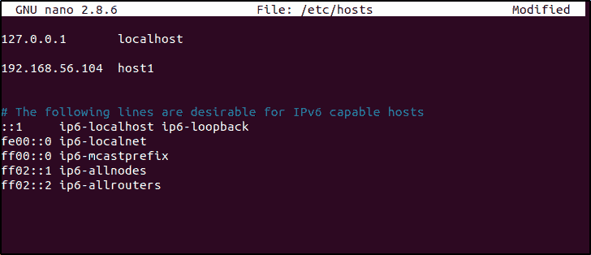
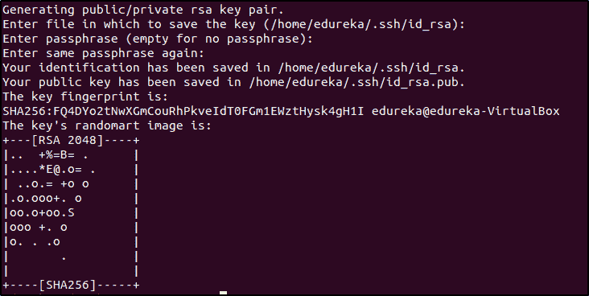
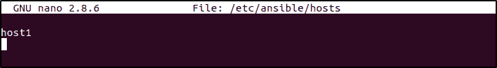
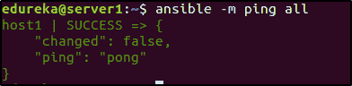
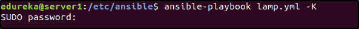
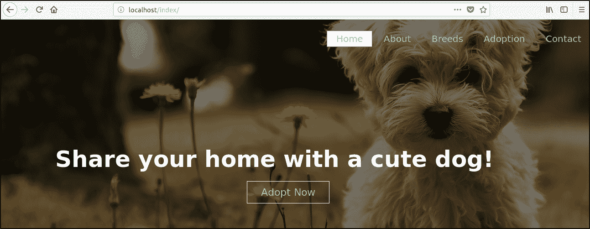

# 可行的供应:更智能、更轻松的供应方式

> 原文：<https://www.edureka.co/blog/ansible-provisioning-setting-up-lamp-stack>

自动化应用程序的任何运营生命周期的第一步是自动化基础架构的供应。供应是一个设置配置、分配内存、磁盘空间等烦人的过程。，在实际使用它们之前。让我们看看 Ansible Provisioning 如何让这变得更简单、更快速。

大多数大规模部署都要求您在多个系统上拥有相同的环境设置。 那么，你是怎么做到的呢？在一百个系统上手动执行相同的命令集？？Nahh..那太老派了。这是机器擅长的，而不是人类。如果我告诉你这个漫长而无聊的过程可以通过执行一个简单可行的剧本来完成呢？ 这就是我们在这篇博客中要讨论的内容——可行的供应。

涵盖的主题有:

*   [什么是 Ansible](#whatisansible)
*   [ansi ble 能自动化什么？【T2](#Ansibleusecases)
*   [](#needforprovisioning)
*   [演示:如何配置部署网站的环境](#Demo)

*如果你想掌握 DevOps，[这门](https://www.edureka.co/devops?qId=15528fae0b7b58fb1a3c599f1cbe9c02&index_name=prod_search_results_courses&objId=776&objPos=1)课程应该是你的首选。*

## **什么是 Ansible？**

DevOps 是一种高度重视自动化的文化。如果有工具可以自动化部署和测试过程，为什么没有工具来进行配置管理和供应呢？变得更聪明的方法有一百万种，使用 Ansible 是其中之一。它是使用最广泛的工具之一。

Ansible 使用基于 YAML 的剧本，初学者也能理解。它使用无代理体系结构与其客户端通信，不需要在客户端机器上安装任何第三方工具，而是使用基于 SSH 的连接。Ansible 是一个自动化工具，让我们看看它能自动化什么。

## **ansi ble 能自动化什么？**

指定开发周期中的一个阶段，Ansible 将帮助您完成，无论是配置管理、供应、流程编排、持续交付、安全还是应用程序部署。Ansible 将开发周期工作流程整合到一个单一的无代理自动化平台中。

1.  **供应:**为应用程序/软件创建合适的生存环境是必要的。Ansible 提供了一种方法来自动化为应用程序的存在而创建的环境。
2.  **配置管理:**执行各种各样的配置任务，如启动/停止服务，改变系统、设备或应用程序的配置等。
3.  **应用部署:**用 Ansible 自动定义部署，用 [Ansible tower](https://www.edureka.co/blog/ansible-tower/) 管理部署。这使得从生产到部署的整个应用程序周期高效且易于管理。
4.  **持续交付:**创建和管理持续集成/持续交付管道会变得很麻烦。这就是 Ansible 介入并使开发人员的生活变得更容易的地方。
5.  **安全与合规:**与项目合作，总是设定界限，并与公司的安全政策相结合。将安全策略自动集成到部署中可以使遵守策略变得更加容易。
6.  **编排:**一个完整的项目是许多具有不同配置的不同实例的集合。Ansible 将这些不同的实例作为一个整体进行合并和管理。

## 需要进行可预见的准备

如前所述，自动化应用运营生命周期的第一步是准备好环境，即供应。大型部署要求多台主机具有完全相同的配置。在调配一台主机后，如果手动完成，您让接下来的 10 台主机具有完全相同的配置的可能性有多大？同样，你会花多少时间做同样的重复性工作？这就是 Ansible 为我们服务的地方。只需执行一个行动手册，您就可以调配数百台主机。魔法？哈哈！不，只是自动化的进化。

**演示:创建灯栈，部署网页**

假设你试图在 30 个系统上部署一个网站，每个网站部署都需要一个基础操作系统、网络服务器、数据库和 PHP。我们使用 ansible playbook 一次在所有 30 个系统上安装这些先决条件。

在这个 Ansible 供应演示中，我将向您展示如何使用 Ansible 供应网站托管环境。我们安装 LAMP (Linux、Apache、MySQL 和 PHP)栈，然后部署一个网站。

为了这个演示，我使用了一个装有 Ubuntu 版本的 Linux VirtualBox。我使用了两个虚拟机，一个作为我的安装 Ansible 的服务器，另一个作为我的远程主机。让我们从在服务器上设置 Ansible 开始。

我创建了一个简单的静态网页，保存在文件夹 **index** 中，其中有两个文件，index.html 和 style . CSS。

### **index . html:**

```
<html>
<head>
<title>Website using HTML and CSS</title>
<link href="style.css" rel="stylesheet" type="text/css">
</head>
<body>
<header>
<div class="top">
<ul class="nav-menu">
<li class="homebtn"> <a href="">Home</a></li>
<li> <a href="">About</a></li>
<li> <a href="">Breeds</a></li>
<li> <a href="">Adoption</a></li>
<li> <a href="">Contact</a></li>
</ul>
</div>
<div class="tagline">
<h1>Share your home with a cute dog!</h1>
<div class="adopt">
<a href="" class="bttn">Adopt Now</a>
</div>
</div>
</header>
</body>
</html>
```

### **style . CSS**

```
*
{
margin:0;
padding:0;
}

header {
background-image: linear-gradient(rgba(0,0,0,0.5), rgba(0,0,0,0.5)),url('puppie.jpg');
height:100vh;
background-size:cover;
background-position:center;
}

.nav-menu {
float: right;
list-style:none;
margin-top:30px;
}

.nav-menu li {
display: inline-block;
}

.nav-menu li a {
color:turquoise;
text-decoration: none;
padding:5px 20px;
font-family:"Verdana", "sans-serif";
font-size:20px;
}

.homebtn a {
border: 1px solid grey;
background-color:white;
}

.nav-menu li a:hover {
border:1px solid grey;
background-color: white;
}

.tagline {
position: absolute;
width:1200px; 
margin-left:0;
margin-top:0;
}

h1 {
color:white;
font-size:50px;
font-family:"Verdana", "sans-serif";
text-align:center;
margin-top:275px;
}

.adopt {
margin-top:30px;
margin-left:540px;
}

.bttn {
border: 1px solid white;
padding:10px 30px;
color:yellow;
font-family:"Verdana", "sans-serif";
font-size: 22px;
text-decoration:none;
}
 .adopt a:hover {
background-color: burlywood;
}
```

**第一步:**执行以下命令来更新存储库，添加所需的存储库，并在您的机器上配置 PPA 以便进行 Ansible 安装:

```
$ sudo apt-get update
$ sudo apt-get install software-properties-common
$ sudo apt-add-repository ppa:ansible/ansible
```

按回车键接受 PPA 的添加，然后在更新库之后安装 Ansible。

```
$ sudo apt-get update
$ sudo apt-get install ansible
```

**第二步:**转到服务器的/etc/hosts 文件，添加主机名和主机的 IP 地址。

** 图 1–将远程主机添加到/etc/hosts 文件–可行的供应** 

**第三步:**ansi ble 在使用 ssh 与其主机通信的无代理架构上工作，设置 SSH 密钥。基本上，我们有一台服务器和一台主机。我们用服务器控制主机，因此我们在服务器上创建一个公共 ssh-key，并将其复制到主机上。在服务器上执行以下命令:

```
$ ssh-keygen 
```

你将被提示输入你想要保存你的密钥的文件名，并且提示你创建一个密码来访问生成的密钥，这是可选的。默认情况下，公钥保存在。ssh/id_rsa.pub 文件，私钥保存在。ssh/id_rsa。

 **图 2–创建 ssh 密钥–可行供应** 

现在，这个生成的密钥需要存在于您的主机中。可以通过两种方式将密钥复制到主机中，要么手动复制到主机中，要么使用 ssh-copy-id 命令。在本例中，我将使用 ssh-copy-id root@IP_of_host 命令来复制它。

```
$ ssh-copy-id root@192.168.56.104
```

注意——在执行该命令之前，确保您能够 ssh 到您的主机。

**第四步:**配置主机。转到/etc/ansible/hosts 文件并添加主机名。这将根据您拥有的主机和服务器的数量而有所不同。在这里你也可以拥有不止一个服务器。

 **图 3–在清单文件中添加远程主机–可行资源调配** 

第五步:检查你的主机是否准备好了。执行这个命令应该会得到类似的输出。

```
$ ansible -m ping all
```

 ** 图 4–检查远程主机的状态–可行的供应**

**第六步:**现在我们的 Ansible 已经准备好了，让我们准备好部署网站的环境。我们将使用一个简单的脚本来安装 Apache、MySql 和 PHP。让我们来看看。

注意:如果你是初学者，可以看看[这个](https://www.edureka.co/blog/ansible-tutorial/)博客，它解释了如何写剧本。

```
---
# Setup LAMP Stack
-  hosts: host1
   tasks:

      -  name: Add ppa repository
         become: yes
         apt_repository: repo=ppa:ondrej/php

      -  name: Install lamp stack
         become: yes
         apt:
            pkg:
              - apache2   
              - mysql-server
              - php7.0
              - php7.0-mysql   
            state: present
            update cache: yes

      -  name: start apache server
          become: yes
          service: 
              name: apache2
               state: started
                enabled: yes

      -  name: start mysql service
          become: yes
          services:
             name: mysql
             state: started
             enabled: yes

      -  name:  create target directory
          file: path=/var/www/html state=directory mode=0755

      - name:  deploy index.html
         became: yes
          copy: 
              src: /etc/ansible/index/index.html
              dest: var/www/html/index/index.html
```

在这里你可以看到，我们有 6 个任务，每个任务执行一个特定的功能。

*   第一个任务是添加安装 MySQL 和 PHP 所需的存储库。
*   第二个任务安装 apache2、MySQL-server、PHP 和 PHP-MySQL。
*   第三和第四个任务启动 Apache 和 MySQL 服务。
*   第五个任务在主机中创建一个目标目录，并且
*   最后，第六个任务执行 index.html 文件，它从服务器上获取文件并将其复制到主机上。

使用以下命令执行该剧本:

```
$ ansible-playbook lamp.yml -K
```

剧本中的行**变成:是**告诉它需要以 root 身份执行，因此当你执行命令时，它会提示输入 sudo 密码。

 **图 5–执行可行剧本–可行供应** 

现在你可以进入主机，检查网站是否已经托管。

 **图 6–在 Localhost 上托管网站–可扩展供应** 

现在，这是一个将部署在所有与服务器交互的主机上的网页(在我们的例子中，我们只有一台主机),但即使对于 100 台远程主机也是如此。

这就把我们带到了 Ansible Provisioning 博客的结尾。如果你觉得这篇文章有帮助，去看看由 Edureka 提供的 [DevOps 课程](https://www.edureka.co/devops?qId=15528fae0b7b58fb1a3c599f1cbe9c02&index_name=prod_search_results_courses&objId=776&objPos=1)。它涵盖了让 It 行业变得更加智能的所有工具。

*有问题吗？请将它发布在 [Edureka 社区](https://edureka.co/community)上，我们将会回复您。*