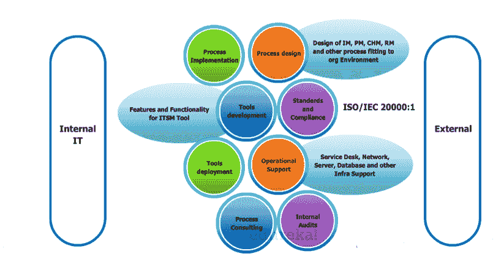
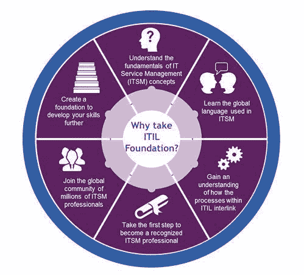
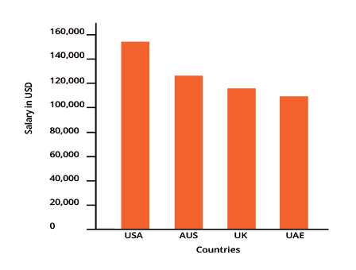
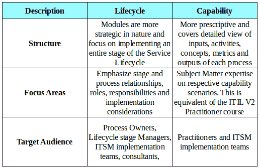
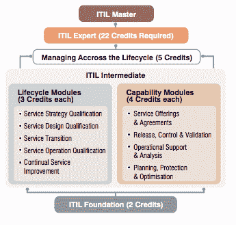

# 作为一名 ITSM 专业人士，你有什么好处？

> 原文：<https://www.edureka.co/blog/what-is-in-for-you-as-an-itsm-professional>

这篇博文由陶博解决方案公司的主题专家 Suresh GP 撰写。你可以点击查看他的完整资料[。](https://in.linkedin.com/in/sureshgp)

作为一名 ITSM 专业人士，你会得到什么？ 我经常在同事、朋友和社区中遇到这个问题，用简单的话来说明人们在 IT 服务管理领域可以期待什么？

这个博客试图澄清一些神话，并给出 IT 服务管理世界的实际见解。在回答问题之前，我想问一下，你们中有多少人是做服务客户这一行的？这可能是面向客户的外部客户，也可能是您自己的内部 IT/业务。

大约 95 %的人认为，尽管他们直接或间接参与了产品和服务的交付，但他们从事的是客户服务行业。

## **那么服务的定义是什么呢？**

ITIL (IT 基础设施库)对服务的定义如下:

服务是一种向客户传递价值的方式，它通过促进客户想要实现的结果，而无需承担特定的成本和风险。"

ITIL V3 2011 基于服务生命周期方法，从概念化开始设计服务，从客户获得需求，直到服务交付给客户。ITIL 定义了最佳实践流程，以帮助和提供无缝和一致的服务，以满足客户的期望。

对 ITSM 有几个误解。让我澄清一下关于他们的误会。

## **误区 1:人们认为他们实现了 ITIL，并把它与 ITSM**互换使用

请记住，ITIL 是一个最佳实践框架，它定义了 5 个核心卷下的流程

1.服务策略

2.服务设计

3.服务转型

4.服务运营和

5.持续服务改进

IT 服务管理(ITSM)是指由策略指导、在流程和支持程序中组织和构建的全部活动，由组织或组织的一部分执行，以计划、交付、运营和控制向客户提供的 IT 服务。

因此，您不能实施 itIL，而是要使用 ITIL 的原则，在使用流程、产品、人员和合作伙伴向客户提供服务的组织环境中，将其作为 IT 服务管理来实施。

## 误解 2: ITSM 只适合从事基础设施管理的人。

尽管术语“ITIL 作为最佳实践框架”最初针对基础设施管理中的人员、流程、产品和合作伙伴，但 ITIL V3 2011 版的当前版本具有更广泛的范围，涵盖了应用程序开发、维护(包括非 IT 服务)等领域。事实上，ITSM 标准为设施、制造、建筑、医疗保健等非 IT 服务行业提供了获得认证的机会。你甚至可以通过 [ITIL 课程](https://www.edureka.co/itil4-foundation-certification-training)了解 ITIL 的细节。

## **误区三:ITSM 人只做辅助性工作，职业拓展范围有限**

每当人们听到 ITSM，他们就会联想到服务台和支持团队，如生产支持、wintel 支持、数据库支持等。范围从支持领域扩展到各种类别

这些可能是为内部 IT 或外部客户提供的服务，如下图所示。

有关启动您的 ITSM 之旅的更多信息，请参考下面的网络研讨会视频:

[https://www.youtube.com/embed/BZ-fJGkkwRc](https://www.youtube.com/embed/BZ-fJGkkwRc)

## **为什么有人要带走 ITIL？获得认证有什么好处？**

了解 ITIL 概况的基础对于开始你的 ITSM 之旅至关重要。下图来自 ITIL 知识产权所有者协会(AXELOS ),该图总结了为什么您需要借助 ITIL 基金会来启动您的 IT 服务管理(ITSM)之旅

<figure style="width: 499px" class="wp-caption aligncenter">

<figcaption class="wp-caption-text">Source: AXELOS</figcaption>

</figure>

根据职业搜索门户网站 PayScale，ITIL 专家认证专家的最高平均工资在美国约为 158，000 美元，在澳大利亚约为 125，000 美元，在英国约为 117，000 美元，在阿联酋约为 110，000 美元(截至 2015 年 6 月 27 日)。全球公认的 ITIL 认证将为你的职业发展提供一个跳板，让你的职业生涯更上一层楼。

## 单单证书并不重要，我如何获得经验？

第一步也是最重要的一步是让自己接受 IT 基础架构库知识的培训和认证(ITIL)。许多获得 ITIL 认证的人都没有在 ITSM 的正式工作经验。然而，他们利用现有的角色和机会来实现最佳实践框架，并为业务带来价值。他们将概念和知识应用到现有的工作场所，从而获得巨大的优势和能见度，以适应即将到来的 ITSM 角色。另一方面，你可以参加社区论坛，如 itSMF，Back2ITSM (facebook ),在那里你可以见到练习 ITSM 的行业同事，分享他们宝贵的见解、知识和经验，为你准备好迎接激动人心的角色。通过这种方式来补充你的 ITIL 认证与实践它的人的经验。

## 那么，你将如何成为 ITIL V3 专家呢？

#### **ITIL 基金会**

这是迈向 ITIL 认证的第一步。此级别适合需要基本了解 itIL 框架以及如何使用它来提高组织内 IT 服务管理质量的个人。

**模式:**选择题

**总计:** 40 次通过:26%百分比:65 %持续时间:1 小时

**先决条件:**无

#### **ITIL 中级**

通过 itIL 基础考试后，该级别适合需要更深入了解 ITIL 服务管理实践以及如何实施该实践来提高组织内 IT 服务管理质量的人员。

**模式:**基于情景的多项选择题，分数梯度

*   每份试卷 8 个问题，每个问题 5 分，总共 40 分
*   5 分:最正确的答案
*   3 分:回答部分正确
*   1 分:最不正确的答案

**及格分数:** 28 分~70 %

**总时数:** 1.5 小时

**先决条件:** ITIL 基金会

它还有两个选项 a)生命周期模块和 b)功能模块。

#### **ITIL 专家**

通过该计划的前两个级别(ITIL 基金会+ ITIL 中级)累积 22 个学分即可达到这一级别。你可以选择一个完整的能力/生命周期路线，或者选择两者的混合来累积 17 个学分。跨生命周期管理(MALC)是所有人必须完成的，不管你是通过能力还是生命周期途径。

<figure style="width: 345px" class="wp-caption aligncenter">

<figcaption class="wp-caption-text">Source: peoplecert.org</figcaption>

</figure>

希望你现在对 ITIL 和 ITSM 的神话有了更好的理解，以及如何成为 ITSM 的专业人士。

有问题要问我们吗？请在评论区提及它们，我们将会回复您。

**相关帖子:**

[ITIL 职业生涯入门](https://www.edureka.co/search/itil)

[掌握实施 IT 服务管理的艺术](https://www.edureka.co/blog/videos/itil-foundation-master-the-art-of-implementing-it-service-management/ "ITIL Foundation : Master the Art of Implementing IT Service Management")