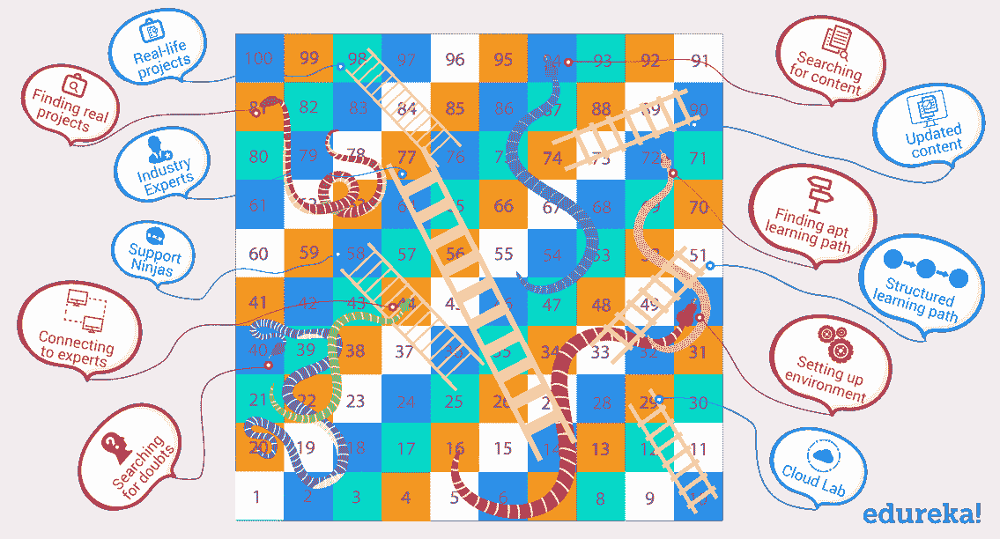
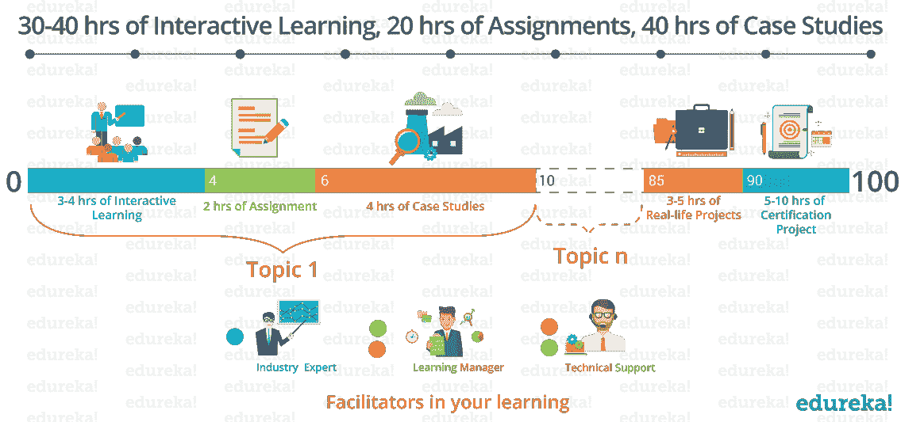

# 为什么前 100 个小时的学习至关重要？

> 原文：<https://www.edureka.co/blog/first-100-hours-of-learning/>

你知道马尔科姆·格拉德威尔给出的**一万小时法则**吗？它指出，要成为任何领域的世界级人物，都需要 10，000 小时的“T3”刻意练习。

******

虽然 10000 小时法则是绝对的知识，需要大量的灵感和奉献，但像 T2 这样的专家也提出了 100 小时法则。它说，

*“For most disciplines, it only takes one hundred hours of active learning to become much more competent than an absolute beginner.”*

**如果你尝试过学习生活中的新事物，你一定会注意到，100 个小时会让你足够胜任。打 100 个小时的板球让你好到可以体面地打球，或者 100 个小时的驾驶好到可以让你一辈子当司机。编码的前 100 个小时，是学习曲线所在。不是吗？**

**此外，如果计划不当，这 100 个小时可能会被浪费掉。让我来说明你如何计划它以获得最大的利益，但是首先让我们在这 100 个小时里了解我们的敌人。**

****前 100 个小时有哪些挑战？****

**你学习的第一个 100 小时就像是玩蛇、T4、梯子和 T2 的游戏。每条蛇都描绘了你在自学时将会面临的障碍，这将会重新开始你的学习过程。而每一个阶梯都是帮助，让你从问题中解脱出来&加速你的学习过程。**

****

**你可能会问，什么梯子？嗯，我相信你们大多数人已经计划加入或者已经加入了健身房，但是有多少人还在继续呢？**

**根据一项研究，80%购买年度健身房会员资格的人会在 6 周内退出！**

**原因是，学习任何东西所需要的纪律是相当严格的。我们大多数人要么早早放弃，要么根本不开始。**

**话虽如此，有纪律地练习&奉献不会带来结果，你的练习也应该集中在正确的方向上。**

**例如，如果一个吹小号的人只专注于吹小号而不专注于如何正确呼吸，他/她就不会成为专家。**

***Practice does not make perfect. Only perfect practice makes perfect. – Vince Lombardi***

****对于发展工艺来说，专家的初步指导对于找出正确的技术非常重要&消除任何可能成为瓶颈的疑虑。****

****为了更好地理解这些挑战，我们采访了一些自学者。我们遇到的第一个挑战是在不浪费太多时间的情况下搜索正确的&更新内容。****

****他们大多使用 Youtube 视频、博客和电子书来学习。他们发现 10 个视频中有 2 个是有用的，10 个博客中有 3 个是独特的。在今天的互联网世界中，以这种速度，完全结构化地学习一项技能就像大海捞针一样。****

## ************

****下一个最大的障碍是在万维网迷宫中找到正确的路径。主题是海洋，有多条河流(主题/工具)流入其中。最初，了解你需要潜水的深度是很重要的，因为你要覆盖许多河流。同样，在不同的领域有太多的工具，要找出最好的开始是很有挑战性的。****

****大多数学习 Hadoop & DevOps 等设置过程复杂的技术的人，实际上并不知道配置和设置这些环境的难度。如果没有适当的指导，这个过程所花费的时间和精力会阻碍他们推进和执行程序。****

****他们中的一些人在黑暗中找到了自己的路，并取得了一些积极的成果，但他们仍然觉得自己与行业需求不一致。这是因为他们从来没有解决过现实生活中的行业问题。****

****让我们快速回顾一下初学者在学习的前 100 个小时所面临的障碍:****

*****   缺乏纪律性*   找到适合你学习的道路*   搜索正确和更新的内容*   设置环境*   寻找你的疑惑*   寻找真实项目*   尝试联系行业专家****

## ******在爱德华卡** 的第一个 100 小时旅程****

****在培训了 5+lac 满意的学习者后&自 2011 年成立以来，我们不断改进我们的模型，找出主要问题并在我们的学习模型中解决它们。****

****从鸟瞰图来看，我们有 *30-40 小时的讲师指导课程*， *20 小时的作业*和 *40 小时的真实案例研究*。****

****似乎令人生畏？不要害怕。这不是我们交付的方式。****

**** [Edureka](https://www.edureka.co/) 遵循结构化的学习路径，每个主题后都包含里程碑。你将从 3-4 个小时的现场会议开始，在那里你将理解概念&澄清你的疑问。****

****然后你将会从事属于不同领域的真实项目。它会让你接触到现实生活中的行业问题。****

****一旦你完成了第一个里程碑，你就会向下一个里程碑前进，以此类推。****

*****Edureka 让你有足够的能力进行你的 10000 小时的旅程，加入那个领域的非凡绅士联盟，大概是 5%。*****

## **********

****让我们了解一下 Edureka 是如何应对学习者所面临的挑战的。****

****Edureka has the Highest Course Completion Rate in the E-learning Industry. [<button>Browse Through Edureka Online Courses</button>](https://www.edureka.co/all-courses)****

### ******缺乏纪律******

*****Discipline is the bridge between goal & accomplishment. – Jim Rohn*****

******由于缺乏纪律性，90%的人在学习初期摇摆不定。你开始时有很多动力&热情梦想着你的目标，但慢慢地你的目标开始消失，你失去了灵感。接下来的时间里，你只剩下沮丧，拖着你先前做出的承诺的负担。******

******你在周末开始学习一些东西。下个周末，你和你的朋友有计划，或者有家庭聚会，或者想喝点啤酒。还是那句话，当你 14 天后再回到这个话题时，你又回到了起点。******

******我们的第一个目标是帮助你在学习过程中保持一致并不断强化动力&灵感。当你开始用 Edureka 学习时，你就有了一个上课日历，它将你与时间表绑定在一起。我们知道你很忙！所以，我们会在你上课前给你一个温和的提醒电话。从讲师到技术专家，他们每个人都在让您按计划进行中扮演着重要的角色。******

### ********找到适合自己学习的路径********

*******“Setting goals is the first step in turning the invisible into the visible.” – Tony Robbins*******

******对于梦想征服珠穆朗玛峰的外国登山者来说，尼泊尔政府已经强制雇佣一名导游。你知道为什么吗？因为他们知道瓶颈&登山者在每个检查站面临的问题，这就是在这样的高度上的生与死的区别。******

******Edureka 的结构化培训也设计了里程碑。完成每个里程碑后，你将获得一系列特定的技能。******

*******这些里程碑是怎么做成的？他们会带我去珠穆朗玛峰吗？*******

******里程碑是在对多个招聘信息进行深入研究后制定的&咨询主题专家。Edureka 确保您的学习符合行业要求，因此您可以到达珠穆朗玛峰。******

******同样，为了强化你的学习，我们会在每个里程碑之后给你布置任务&案例研究。******

******Confused about Your First 100 Hours? Follow a Structured Learning Path. [<button>Know More!</button>](https://www.edureka.co/)******

### ********搜索合适并更新内容********

******在当今这个互联网时代寻找合适的内容就像翻遍国会图书馆的每一本书一样困难。与收藏高质量书籍的图书馆不同，互联网上充斥着低质量的内容。有了 [Edureka](https://www.edureka.co/) ，你就不用担心找出最好的学习材料。我们让它触手可及。我们为您提供更新的课程内容，涵盖技术的每一个细微之处。******

*******Yesterday’s syllabus won’t prepare our kids for tomorrow’s job market.*******

******这适用于所有类型的学习。我们知道，变化是唯一不变的&这就是为什么我们根据最新版本的软件不断修改我们的课程。******

*******Edureka 的大数据& Hadoop 课程更新了 6 次。*******

******你的 LMS(学习管理系统)是所有问题的一站式解决方案。它包含课程材料，包括课堂录音、专题和与每堂课相匹配的额外阅读材料。Edureka 还提供终身访问课程内容&参考资料。******

### ********设置环境********

*******“By failing to prepare, you are preparing to fail.” ― Benjamin Franklin*******

******为了备战，你需要射击场。设置环境是最大的挫折之一。对于一个初学者来说，设置&配置完整的环境需要花费大量的时间。硬件要求也增加了障碍。******

******为了变得足够胜任，你需要让自己符合行业要求。Edureka 让您从所有的努力中解脱出来&让您的行业做好提供云实验室的准备。******

*******什么是云实验室？*******

******云实验室是一个预先配置的环境，任何人都可以通过浏览器进行访问，只需进行最少的系统配置。云实验室基于真实环境，遵循行业标准。你可以在云实验室上执行真实世界的案例研究，而不用担心设置&的硬件要求。******

### ********寻找你的疑惑********

*******“If you don’t have doubts, you haven’t been paying attention“.*******

******根据麦肯锡的一份报告，员工每天花 1.8 小时——平均每周 9.3 小时——搜索和收集信息。想象一下一个初学者搜索一个答案需要多少时间。大多数学习者浪费了最初的 30-40 个小时来寻找一些一般性挑战的答案。******

******但是不要担心，我们有一个合格的专家团队，他们会解决你所有的疑问、错误和问题。他们 24*7 全天候为您提供帮助，并确保您有一个平稳的&不间断的学习体验。******

*******平均每天收到 500 个查询，而在高峰日，我们会收到多达 1000 个查询。*******

******Got a Question? Get a Call from an Expert. [<button>Master Your Learning!</button>](https://www.edureka.co/)******

### ********试图连接一位行业专家********

*******A highly developed values system is like a compass. It serves as a guide to point you in the right direction when you are lost.*******

******学习有两种方式，要么从自己的经验中学习，要么从别人的经验中学习。你自己的经历会耗费你的时间&精力。从某人那里得到指导变得很重要，他正在解决该技术中的现实世界的挑战。******

******Edureka 为您提供讲师指导的互动课程，该领域的行业专家将教您概念&，帮助您解决现实世界的案例研究。他们帮助您按照行业标准&最佳实践开展工作。******

******我们有 300 名教师，教授 100 多门课程。他们平均回答 300 多个问题。******

### ********寻找真实项目********

*******“For the things we have to learn before we can do them, we learn by doing them.”  ― Aristotle*******

******填补你所学的知识和&行业所寻求的知识之间的空白，是一个迫切的需求。我们知道你学习的一个重要部分是，与现实生活中的项目一起工作。 [Edureka](https://www.edureka.co/) 为您提供属于多个领域的真实项目。我们可笑地致力于弥合您所学到的知识与行业对您的期望之间的差距。******

******在 100 多门课程中，我们有 300 多个真实项目。******

******我希望通过上面的例子，我已经能够说明你如何最好地利用你的第一个 100 小时的学习。总而言之，要使你的学习有效&高效，并与行业要求保持一致，你需要以下几点:******

*******   纪律&承诺*   具有 apt 里程碑的结构化学习路径*   快速帮助您解决疑问，查询&错误*   基于行业标准的预配置环境*   行业专家的指导*   真实案例研究******

******正如一位智者所言——“时间不等人，T4 不等人，T2 不等人”。所以，现在是你做决定的时候了，你是想自己开始旅程并试图逃离不可避免的蛇，还是想拿起梯子并领先一步。******

******Edureka 荒谬地致力于让你学习的前 100 个小时变得平稳&从容不迫。不要只是学习它，**掌握它！********

******Climb the Ladder which you Dreamt [<button>Let's Get Started</button>](https://www.edureka.co)******