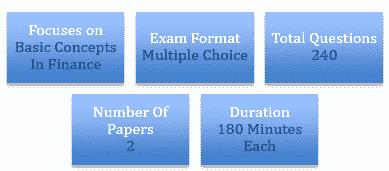

# 你破解 CFA 一级考试的指南

> 原文：<https://www.edureka.co/blog/your-guide-to-cracking-the-cfa-level-1-examination>

成为一名特许金融分析师(CFA)绝非易事。过去几年的统计数据告诉我们，准备考试并通过考试需要相当大的奉献和努力。然而，这并不意味着破解 CFA 一级考试是不可能的。毅力和策略的正确组合可以让你领先于你的同龄人。

CFA 一级考试是你通往精英 CFA 世界的钥匙。它有助于建立一个强大的金融基础，对于具有会计知识的候选人(金融毕业生)来说相对容易。它涵盖了道德、量化、FRA、公司金融、经济学、股票、固定收益、衍生品和投资组合管理等领域，权重约为这些主题的 5%-15%。CFA 项目由 CFA 协会管理，提供研究生水平的课程。

下图总结了 CFA 一级考试最重要的特点:

## CFA 一级考试提示

这里有一些简单的提示，可以帮助你轻松通过 CFA 一级考试:

**1。创建学习计划**

在准备 CFA 一级考试的同时，制定一个学习计划。无论如何都要努力坚持，以确保在关键时刻减少压力。在准备任何考试时，时间管理是必不可少的。CFA 协会估计，通过每项考试至少需要 250 小时的独立学习。因此，一个简单的数学计算表明，如果你打算在考试前六个月开始准备，你需要每周投入至少 10 个小时的学习时间。

**2。**记笔记

你还记得小时候妈妈会叫你写笔记背题目吗？金玉良言对于这次考试来说意义非凡。它将帮助你记忆，克服困难，并在你的脑海中留下一个主题。

**3。专心做试卷**

模拟测试和解决往年的试卷是让你的信心水平飙升的最好方法之一。请记住，在这一点上，你必须专注于实践，而不是你的模拟分数。各种各样的试卷会让你充分接触到考试中可能会遇到的各种问题。

**4。了解最新的测试方法**

每次考试都有不同的政策和程序。最好通过阅读所有指南来熟悉这些政策。这将确保在检查过程中不会出现意外。

**5。CFA 注意的题目:**

在准备 CFA 一级考试时，专注于某些关键领域是很重要的。这些是:

*   道德和专业标准
*   财务报告和分析
*   固定收益和股票
*   企业融资
*   定量方法
*   派生物
*   另类投资
*   投资组合管理
*   经济学

**6。制定自己的考试策略**

CFA 一级考试由概念和数字两部分组成。明智的做法是设计出你自己的策略来尝试这些问题。这一级有两份文件你需要清除-上午和下午。围绕各种主题学习的一种方法是:

*   从 FRA 和经济学开始，因为它们是主要科目，占 30%的权重
*   接下来，学习股票、固定收益、投资组合管理和企业融资，它们将占教学大纲的 35%
*   衍生产品和道德规范会随之而来，让你的盘子再降 20%

**7。练习提升你的速度等级**

破解 CFA 一级考试，速度是关键。普鲁登斯说，一个人不能在一个问题上浪费太多时间。如果你第一次回答不出来，继续下一个问题，稍后再来回答。练习使用你的商业计算器，否则会严重影响速度。要在 180 分钟内完成 120 个问题，时间绝对是一个制约因素。

**8。利用网上资源**

专门从事金融服务教学的全球培训公司在网上有很多学习材料。利用这些资源做好准备。

**9。修改公式**

公式备忘单是复习的好工具。你可以随身携带，每天至少复习几次。自制卡片是掌握学习材料的另一个好方法。在上下班途中、午休时把它们拿出来，最大限度地利用你的时间。

CFA 章程在前进的道路上带来了一定的挑战，这取决于每个候选人如何应对这些挑战。与现有的 CFA 证书持有人会面和交谈是了解如何以正确的方式为考试学习的一种方式。保持动力和保持健康的生活方式是确保你在 CFA 一级考试道路上一切顺利的其他方法！

由 ivyclique 驱动

有问题要问我们吗？请在评论区提及它们，我们将会回复您。