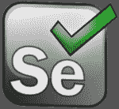
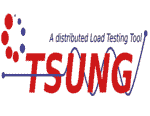
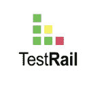

# 软件测试工具:关于顶级测试工具你需要知道的一切

> 原文：<https://www.edureka.co/blog/software-testing-tools/>

技术上无与伦比的指数变化影响着组织开发、验证、交付和操作软件的方式。因此，组织必须不断地寻找新的方法来交付高质量的软件。[软件测试](https://www.edureka.co/blog/what-is-software-testing/)为开发团队提供了确定软件质量的方法和工具。

现在，有大量的软件测试工具可供使用。很难跟踪 100 多种软件测试工具。考虑到这一点，本文列出了各种类别中流行的&知名软件测试工具的精选，如下所述:

*   [***自动化测试工具***](#AutomationTestingTools)
*   
*   [***手机测试工具***](#MobileTestingTools)
*   [***负载测试工具***](#LoadTestingTools)
*   **[*跨浏览器测试工具*](#browsertesting)**
*   [***考试管理工具***](#TestManagementTools)

开始了。

## **自动化测试工具**

如今，自动化测试对于大多数软件项目来说是必须的，以确保关键功能的自动验证。还可以帮助团队在短时间内高效地运行大量测试。下面列出了一些帮助软件团队构建和执行自动化测试的工具:

### **硒**

 [Selenium](https://www.edureka.co/blog/what-is-selenium/) 是一个流行的测试框架，用于跨各种浏览器和平台(如 Windows、Mac 和 Linux)执行 web 应用程序测试。使用 [selenium](https://www.edureka.co/blog/selenium-tutorial) ，您可以开发出非常强大的、以浏览器为中心的自动化测试脚本，这些脚本可以跨不同的环境进行扩展。它兼容多种编程语言&自动化测试框架。

### **瓦特**

Watir，发音为 water，是一个由 Ruby 库组成的开源测试工具，用于自动化 web 应用测试。加载了 Ruby 库，它还支持用其他语言编写的应用程序。您可以将它与数据库链接，导出 XML 文件，读取文件、电子表格，并将代码同步为可重用的库。它是一个非常轻量级的开源工具。

### 雷诺克斯

Ranorex 是一款灵活的一体式 GUI 测试工具，使用它您可以在所有环境和设备中完美地执行自动化测试。与其他 GUI 测试工具相比，Ranorex 提供了超级智能的对象识别功能，可以自动检测用户界面中的任何变化，并保持测试继续进行。其他特性包括可重用的代码模块、早期缺陷发现以及与其他工具的集成。

### **【HPE 统一功能测试(UFT)**

 HPE 统一功能测试(UFT)软件，原名 *惠普快速测试专业版*  (QTP)是一款自动化功能 GUI 测试工具，允许用户在基于客户端的计算机应用上自动执行操作。它提供了对象识别、错误处理机制和自动化文档等功能。它还使用脚本语言来操纵被测应用程序的对象和控件。

Tricentis Tosca 是一款非常流行的软件测试工具，用于自动化软件应用的端到端测试。这个工具为所有功能测试工件提供了一个单一的存储库，包括需求、用户故事、测试数据、虚拟化资产。Tosca 具备 t est 数据供应、服务虚拟化网络、测试移动应用和风险覆盖等功能。

## **敏捷测试工具**

公司在他们的项目中采用敏捷软件开发方法，如 Scrum、极限编程(XP)。敏捷测试伴随着许多挑战，需要试验和尝试新的想法。下面列出了一些有益于从事敏捷项目的测试人员和开发人员的敏捷测试工具:

### **【jira】**

JIRA 是一个流行的敏捷测试和项目管理工具，由 Atlassian 软件公司开发，该公司为项目经理、软件开发人员等开发产品。这个工具可以用来跟踪缺陷，计划，创建报告，以及管理所有敏捷软件开发项目。它支持敏捷方法，如 Scrum、看板。

### **肥皂泡**

它是一个敏捷测试工具，是 SmartBear 开发的最先进的 REST 和面向服务的架构。SoapUI 主要用于 web 服务的功能测试，包括 web 服务开发、web 服务调用等。它是一个免费的开源工具，它允许你创建和执行功能、回归和负载测试。允许你使用拖放界面创建测试测试用例。

### **硒网驱动**

[Selenium web driver](https://www.edureka.co/blog/selenium-webdriver-tutorial)是另一个流行的敏捷自动化工具，广泛应用于整个软件行业。它仅用于自动化基于浏览器的应用程序，不支持基于桌面的应用程序。用户可以用多种编程语言编写自动化脚本，如 [JAVA](https://www.edureka.co/blog/java-tutorial/) ，C#， [Python](https://www.edureka.co/blog/python-tutorial/) ，Ruby， [PHP](https://www.edureka.co/blog/php-tutorial-for-beginners/) 。

## **移动测试工具**

移动应用对企业来说已经变得越来越重要。因此，测试团队需要适应并准备好验证和评估移动应用，作为他们项目的一部分。有各种工具和在线资源可以帮助测试人员为您的移动设备构建测试，为移动应用和代码库记录和运行自动化 UI 和单元测试。下面列出了一些这样的工具:

### **茄子**

茄子是由 TestPlant 开发的授权工具，主要用于移动设备中的应用程序测试和 GUI 测试。它是茄子功能和 eggOn 的结合，eggOn 是一个移动代理，可以在 iOS、Android、Windows Phone、BlackBerry 和任何其他移动设备上全面测试移动应用程序。与大多数测试自动化工具**，**中基于对象的方法不同，茄子采用基于图像的方法。

### **参见测试**

 SeeTest 是 Experitest Ltd 开发的一款移动应用测试工具，适用于 iOS、 [Android](https://www.edureka.co/blog/android-tutorial/) 、黑莓和 Windows Phone。它提供了可视化测试、功能测试，用于仿真器和真实设备。它利用自学算法和模块化的自我增强图像识别技术。其他一些可用的移动相关工具包括 SeeTest Cloud、SeeTest Network Virtualization 和 UFT 移动附加软件。

### **丝考**

 Silk Test 是 Microfocus 的授权产品，提供功能和回归测试。您可以使用这个工具 对所有移动应用类型进行回归、跨平台和本地化测试，比如移动 web、本地和混合应用。它具有跨浏览器的支持，并能实现高效、快速和高质量的自动化测试。Silk Test 也使得在 [CI/CD 管道](https://www.edureka.co/blog/ci-cd-pipeline/)中集成功能测试变得容易。

## **负载测试工具**

近来，网站、网络应用程序和 API 的使用变得越来越重要，重要的是高效地设计和构建它们，以便它们能够处理大量的请求。因此，为了实际测试和验证服务在负载下的性能，开发人员可以执行负载和压力测试。下面列出了负载测试人员使用的一些工具:

### **阿帕奇 JMeter**

它是一款开源的 Java 桌面应用，专为负载测试而设计。它的架构实际上是以插件为中心的，在插件的帮助下，JMeter 提供了许多开箱即用的特性。它支持不同类型的应用程序、服务器和协议，如 Web、SOAP、FTP、TCP、LDAP、SOAP、MOM、邮件协议、shell 脚本和 Java 对象。JMeter 的其他特性包括强大的测试 IDE、动态报告、命令行模式、可移植性和多线程。

### **宗**

 Tsung 是一款流行的开源多协议分布式负载测试工具。该工具的主要目的是帮助用户测试基于 IP 的客户机/服务器应用程序的可伸缩性和性能。它还可以用于在服务器上执行负载和压力测试。它可以用来检查 HTTP、WebDAV、SOAP、PostgreSQL、MySQL、LDAP、MQTT 和 Jabber/XMPP 服务器上的负载。

### **WAPT**

WAPT 是一个负载和压力测试工具，它允许你通过一个图形用户界面来构建、生成和监控负载测试。它提供了一种简单且经济高效的方法来专门测试业务应用程序网站、移动网站、门户网站等。它基于 AJAX 和 RIA 技术。WAPT 在数据驱动模式下从事安全 HTTPS 网站、动态内容和 RIA 应用的工作。

## **跨浏览器测试工具**

在多种浏览器中测试一个网站或应用程序，并确保它按照预期一致地工作，没有任何依赖性或质量上的妥协，这一过程称为跨浏览器测试。软件测试市场上有很多跨浏览器的测试工具。

### **LambdaTest**

是一款流行且非常易于使用的跨浏览器测试工具，它可以让你在几秒钟内对 2000 多种现代移动和桌面浏览器和设备进行实时测试。[**LambdaTest**](https://www.lambdatest.com/)工具拥有真正干净的用户界面，并提供了许多令人印象深刻的功能，如自动截图测试、本地测试功能以及与最流行的 bug 跟踪和项目管理工具(如吉拉、Asana、Trello 等)的集成。

### **浏览器堆栈**

 BrowserStack 是一款基于云的跨浏览器测试工具，不需要下载或安装任何软件，可以对各种浏览器和各种大小和分辨率的真实设备进行测试。它是 在这个领域最老的玩家之一，拥有巨大的市场份额。其中一个关键特性是，除了 模拟器和仿真器，BrowserStack 还提供了与远程机器上真实浏览器的交互。

### **苏斯实验室**

作为跨浏览器市场的领导者之一，酱实验室 让你测试你的网站与各种浏览器、设备和操作系统的兼容性。 它提供 web 和移动应用的自动和手动测试。它与其他跨浏览器测试工具的区别在于它为自动化移动测试提供了非常干净的 UI。

## **测试管理工具**

软件开发团队可以从测试用例管理工具中获益。他们可以使用基于 web 的管理工具来管理他们的项目、测试资源、记录测试结果并生成报告，以帮助优化所有测试活动。有各种各样的测试管理工具可以满足不同的需求，下面列出了最流行的工具:

### **泽法**

泽法是一个测试管理软件，它为公司提供了执行手动和自动测试的能力。它提供了与其他流行测试平台的集成，如 JIRA、【Confluence】、[、詹金斯](https://www.edureka.co/blog/jenkins-tutorial/)、竹子。借助泽法，您可以获得更快发布更好软件所需的灵活性、可见性和洞察力。这个产品通常有两个版本。

QMetry 是最全面的测试管理工具，专为敏捷测试和 [DevOps](https://www.edureka.co/blog/devops-tutorial) 团队设计，让他们更快、更有信心地构建、管理和部署高质量的软件。借助该工具，测试管理、自动化和预测分析涵盖在单个平台中。与 JIRA、 [Selenium](https://www.edureka.co/blog/10-reasons-to-learn-selenium/) 、Appium、Bamboo、 [Jenkins](https://www.edureka.co/blog/what-is-jenkins/) 、HP ALM、Rally 等平台进行了集成。

### **TestRail**

 TestRail 是一款现代测试管理工具 ，既可用于您自己的服务器，也可用于云版本。这是唯一一款与 JIRA 插件完全集成的工具，包括 JIRA 云。TestRail 是管理、跟踪和协调测试工作的有用工具。这个工具帮助你在同一个地方管理、组织和跟踪所有的测试工作。It 测试报告&度量自动化。

有很多针对不同类型测试的软件测试工具。这些工具有些是开源的，有些是许可的。但是，工具的选择总是取决于需求。这就把我们带到了这篇关于软件测试工具的文章的结尾。我希望你发现它信息丰富，并有助于增加你的知识价值。

*如果您找到了这篇“软件测试工具* *”的相关文章，* *请查看 Edureka 提供的在线直播培训**[【Selenium 认证培训】](https://www.edureka.co/selenium-certification-training)****，edu reka 是一家值得信赖的在线学习公司，拥有遍布全球的 250，000 多名满意的学习者。*

*有问题吗？请在这个“软件测试工具”博客的评论部分提到它，我们会给你回复。*