# 随处自动化控制室——随处自动化大脑的一站式解决方案

> 原文：<https://www.edureka.co/blog/automation-anywhere-control-room/>

自从自动化出现以来，市场上出现了各种各样的工具。随处自动化就是这样一个受欢迎的 [RPA 工具](https://www.edureka.co/blog/rpa-tools-list-and-comparison/)，被业界用来自动化各种任务。现在，这显然让我们意识到需要增强我们的 [RPA 技能](https://www.edureka.co/automation-anywhere-certification-training)并理解这个工具的架构。在这篇关于自动化随处控制室的文章中，我将讨论以下主题:

*   什么是随处自动化？
*   [自动化随处架构](#AutomationAnywhereArchitecture)
    *   [机器人创造者](#BotCreators)
    *   机器人赛跑者
    *   [控制室](#ControlRoom)
*   [控制室组件](#ControlRoomComponents)
    *   [仪表板](#Dashboard)
    *   [活动](#Activity)
    *   [机器人](#Bots)
    *   [设备](#Devices)
    *   [工作量](#Workload)
    *   [审计日志](#AuditLog)
    *   [管理](#Administration)
*   [动手](#HandsOn) 动手

**自动化随处控制室|控制室管理|爱德华卡**

[https://www.youtube.com/embed/m7r2TRT2ESc?rel=0&showinfo=0](https://www.youtube.com/embed/m7r2TRT2ESc?rel=0&showinfo=0)

本课程将涵盖控制室自动化的基础知识。

## **什么是自动化无处不在？【T2**

Automation Anywhere 是一款 RPA 工具，旨在为用户提供由软件机器人组成的数字化劳动力。这些机器人负责通过同时提供可伸缩性和安全性来完成端到端的过程。

该工具最近推出了社区版，将帮助您首次探索该工具并自动执行任务。一旦你对这个工具足够熟练，它还提供了一个 30 天免费试用的企业版。

现在，你已经知道什么是随处自动化，让我们看看随处自动化的架构。

## **自动化随处架构**

自动化无处不在的架构是一个 ***分布式架构*** 。这个架构主要有 3 个组件，它们一起工作来帮助用户完成他的任务。那就是 ***机器人创造者*** ， ***控制室*** ， ***机器人运行者*** 。机器人创造者和机器人运行者与控制室相连，控制室是任何地方自动化的大脑。

现在，让我们逐一了解这些组件。

### **Bot 创造者**

机器人创建者只是用来创建机器人的。这些是基于桌面的应用程序，其唯一的作用是上传或下载机器人，并将它们连接到控制室。此外，多个用户可以创建为控制室创建和配置的机器人。

### **Bot Runners**

机器人运行者负责运行或执行预定的机器人。多个机器人可以并行执行，但机器人运行者不能更新或创建自动化。自动化 Anywhere 的这个组件也连接到控制室，并且能够向控制室报告执行日志状态。

### **控制室**

控制室是建筑中最重要的组成部分。它是一个 web 服务器，基本上控制由机器人创建者创建的机器人，也处理由机器人运行者执行的自动化。控制室通过提供集中用户管理、自动化部署、源代码控制等功能来确保集中管理。您可以参考下图了解控制室的概况。

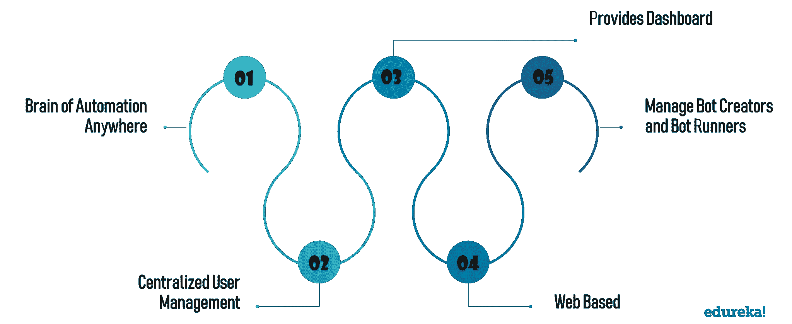

现在，一旦您下载了社区版或企业版，您必须使用凭证登录控制室。您可以在您的电子邮件收件箱中找到这些凭据。参考下面截图:

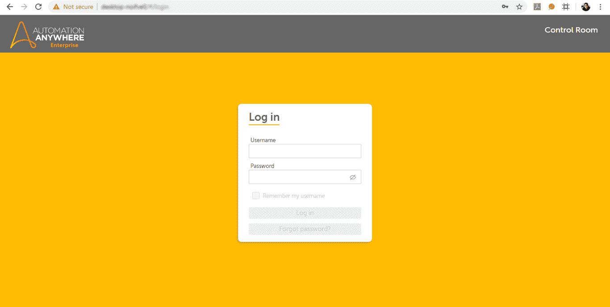

登录后，您将被重定向至控制室的仪表板。参考下面截图:

****

**注意:**在上面的仪表板中，请记住，如果您没有企业版，您将无法在左侧找到管理选项。

从上图可以看出，使用控制室仪表板时，您需要了解仪表板的几个组件。因此，接下来在这篇文章中，让我们看看控制室的组成部分。

## **控制室组件**

控制室的组成如下:

### **仪表盘:**

控制室的仪表盘功能主要提供各种参数的统计。它有以下 5 个选项:

*   **主页**–主页仪表盘向用户显示机器人运行状态、总队列、总机器人时间表、总用户、机器人速度以及机器人与机器人运行者的能力。
*   **机器人**——机器人仪表盘向用户显示机器人心跳、MVP 机器人、机器人状态、失败原因以及机器人即将到来的时间表。
*   **设备**–设备仪表板关注硬件利用率，如 CPU 利用率、内存利用率、硬盘利用率、即将到来的设备利用率和故障分析。
*   **审计—**审计选项卡跟踪各种用户执行的所有活动或操作。
*   **工作量**–工作量仪表板有两个选项卡:执行仪表板和运营经理仪表板。执行控制面板提供队列状态、平均排队时间、按积压排列的设备池和按完成时间排列的队列的可视化显示。同样，Operation Manager 的控制面板提供了按 FTE 划分的设备池、按降低错误率划分的池、按平均时间划分的队列、按积压工作划分的设备池的可视化。
*   **洞察**——Bot Insight 专注于提供实时业务洞察和数字劳动力。

### **活动:**

控制室仪表盘的活动功能主要用于查看计划活动的历史和进度。它有以下三个选项:

*   **进行中:**进行中活动页签用于查看当前正在执行的活动的状态。它给出了与活动相关的所有细节，如用户名、机器人名称、项目名称、进度等。
*   **已安排:**已安排活动页签用于查看计划稍后执行的活动的详细信息。它给出了与活动相关的所有细节，如用户名、机器人名称、项目名称、进度等。
*   **历史:**历史活动页签用于查看可能已经完成、结束、停止或超时的活动详情。它给出了与设备名称、自动化名称、机器人名称、用户、启动时间等相关的详细信息。

### **僵尸程序:**

控制室仪表盘的机器人功能，查看已创建任务的详细信息。它给出了任务名称、凭证、客户端名称等详细信息。它有以下三个选项:

*   **我的机器人:**“机器人”选项卡列出了任务及其详细信息，如名称、客户端名称、上次修改日期。
*   **凭证:**凭证选项卡显示凭证、储物柜和凭证请求。

### **设备:**

设备功能显示用户是否登录到设备上的客户端 UI。此外，如果用户名被禁用，则设备显示为“离线”,如果用户名被删除，则设备名称将不再显示。

### **工作量:**

控制室仪表板的工作负载功能通过显示队列名称、自动化名称、自动化状态、机器人名称和设备池等详细信息来显示队列的负载。

### **审计日志:**

审计日志功能用于跟踪各种用户执行的所有操作。

各位，这些是控制室的各种组件。

现在，如果您在任何地方都有自动化的企业版，那么您将获得一个称为管理的附加功能。因此，在本文中，让我们来看看这个特性的各种选项。

### **管理**

管理功能用于配置控制室。它基本上有 5 个选项:

*   **设置:**设置选项卡提供控制室的配置设置，如数据库配置、僵尸工具配置、客户端应用程序设置、凭证和电子邮件通知。
*   **用户:**“用户”页签用于创建各种角色的用户。
*   **角色:**角色选项卡显示预定义角色的列表，或者您可以创建一个角色。
*   **许可证:**显示产品和设备许可证列表。它还显示购买了哪些许可证以及它们是否被使用。
*   **迁移:**迁移选项卡用于从旧版本的控制室中迁移信息。

现在，您已经了解了控制室的各种组件，让我们开始动手操作吧。

## **动手**

在接下来的实践中，我将向您展示如何在控制室上传机器人。

### ***解:***

*上传机器人必须遵循以下步骤:*

1.  创建用户
2.  为用户分配角色
3.  向用户分配许可证
4.  使用用户详细信息登录 Automation Anywhere 客户端
5.  选择需要上传的任务

### **创建用户**

**第一步:**登录控制室，进入**管理- >用户。**然后，选择右侧的**选项，创建一个用户**。

**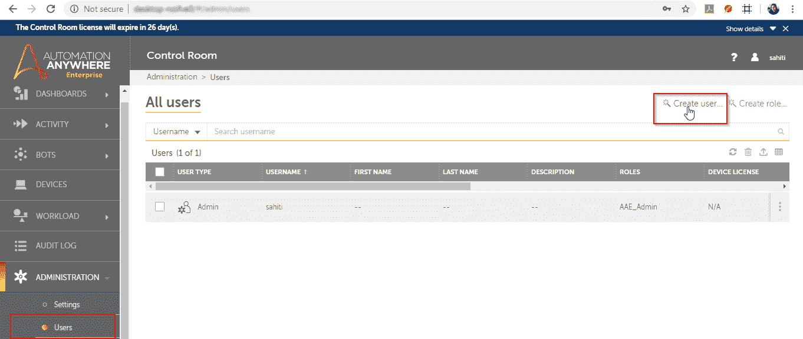**

**步骤 2:** 选择创建用户选项后，您将被重定向至以下屏幕，在此您必须填写如下所示的一般详细信息:

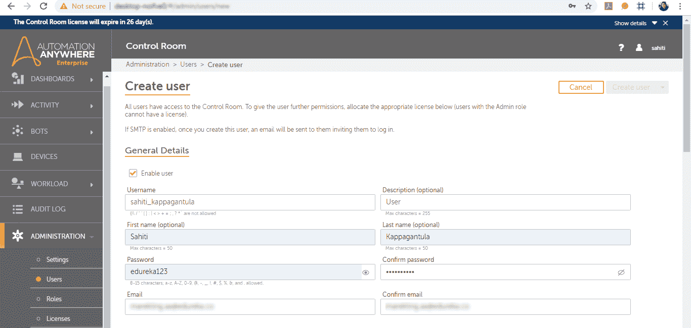

### **给用户分配角色**

**步骤 1:** 在提到一般细节之后，接下来您必须为用户分配一个角色。因此，向下滚动页面，选择您希望赋予用户的角色。之后，单击列表旁边的向右箭头，将角色分配给用户。参考下文。

**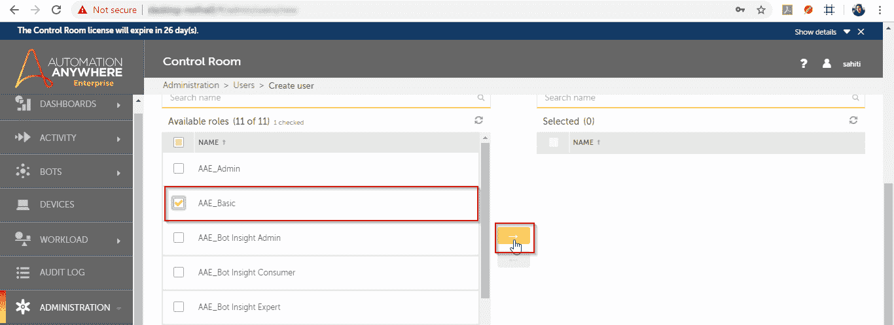**

**注意:**在这里，我将把**AAE _ 基本**角色分配给用户。您可以为用户分配多个角色。

### **向用户分配许可证**

**步骤 1:** 现在，再次向下滚动，选择您希望分配给用户的许可证。参考下文。

**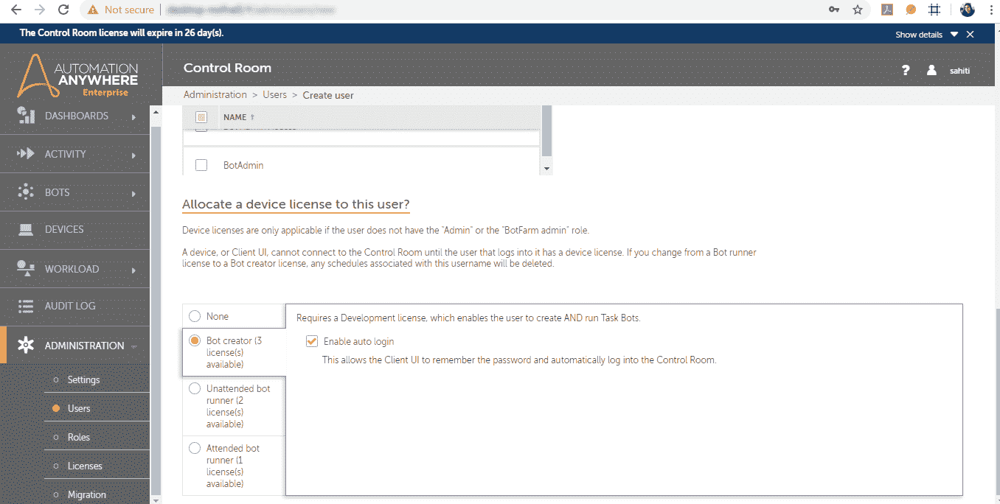**

**第二步:**最后，向上滚动页面，点击**创建用户**，如下图。

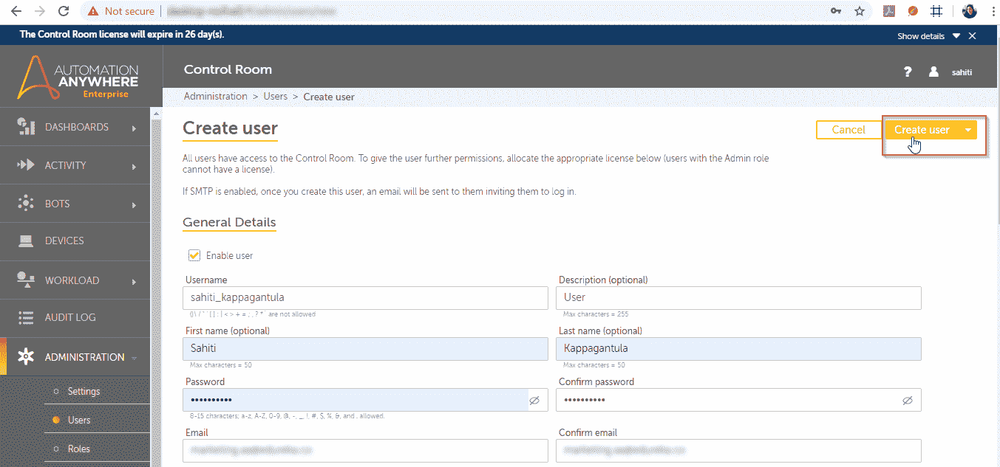

一旦您点击**创建用户**，一个用户将被自动创建，您可以在用户选项卡上看到该用户，如下所示:

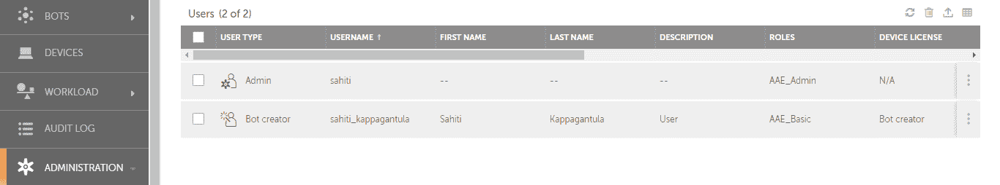

### **使用用户详细信息登录 Automation Anywhere 客户端**

现在，一旦创建了用户，您就必须使用上面创建用户时提到的相同用户名和密码登录到 Automation Anywhere Enterprise 客户端。还有，要知道控制室网址，可以去**管理- >设置- >通用。**

现在，运行客户端应用程序，并提及如下详细信息:

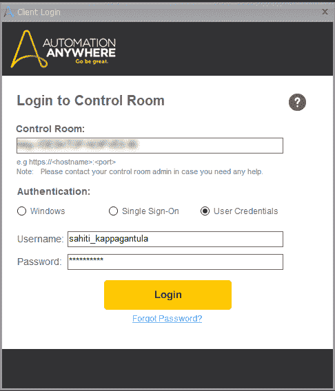

### **选择需要上传的任务**

一旦客户端打开，选择您希望上传的任务，并点击右侧的**上传**选项。

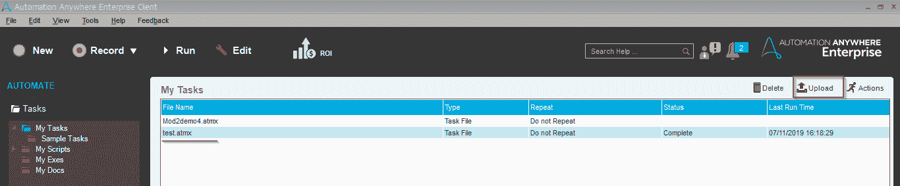

只要您单击 Upload 选项，您就会看到下面的输出。

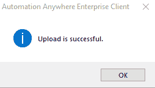

最后，您可以通过进入如下所示的**我的机器人**部分来检查机器人是否上传。

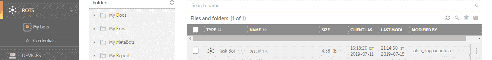

所以乡亲们！这篇关于自动化随处控制室的文章到此结束。我希望你明白什么是控制室，控制室的仪表板有哪些不同的组成部分。现在，如果你希望作为一名 [RPA 开发人员](https://www.edureka.co/blog/rpa-developer-roles-and-responsibilities/)开始你的职业生涯，那么开始学习 RPA 及其各种工具。

我们在 Edureka，提供面授 ***[自动化随处培训](https://www.edureka.co/automation-anywhere-certification-training)*** 。Edureka 是一家值得信赖的在线学习公司，在全球拥有超过 250，000 名满意的学习者。本培训将帮助您获得 [***机器人过程自动化***](https://www.edureka.co/blog/robotic-process-automation/) 方面的深入知识，以及任何地方的自动化实践经验。

*有问题吗？请在这篇**自动化无处不在控制室**的文章的评论部分提到它，我们会给你回复。*