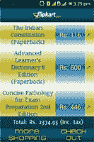

# 一名 ISRO 科学家接受了 Android 在线培训！

> 原文：<https://www.edureka.co/blog/personlized-android-project-online-training/>

通常，我们误以为科学家总是忙于发明新事物。然而，像任何其他人一样，科学家每天也学到一些新东西。事实上，他们工作的本质使得他们在生活中的每一刻都充满了学习的热情！为了学习最新技术和探索更多，印度空间研究组织的科学家 Ramprasad Chakraborty 在 ***Edureka*** 接受了 [***Android 在线培训***](https://www.edureka.co/android-development-certification-course) ，并最终在 ***在线购书*** 上开发了一款动态 Android 应用！

#### 简要背景:

教育:计算机科学理学士(荣誉)，计算机科学与工程技术学士

**工作于:**印度空间研究组织

**职务:**科学家工程师 SC

***这是他在 Edureka 对安卓在线培训的感受……***

*“Learning with Edureka was a great experience for me! Being a professional, the most important part was flexibility of timing for studies. I think Edureka is best in that. Initially I was a bit skeptical about the effectiveness of the course. I attended the demo class on Android out of my interest for the topic and it was really a ‘Eureka’ moment for me and I needed no time to decide that I am going to opt for the course. Now I can proudly say that I have successfully completed my Android course from Edureka. Thanks Edureka!”*

### 让我们窥视一下他的安卓应用吧！

众所周知，在过去几年中，Android 覆盖了一个巨大的移动平台市场，Ramprasad 的 Android 项目展示了如何为 Android 平台开发一个'*在线图书购物*'应用程序。

#### Ramprasad 的 Android 项目的主要活动:

  **活动 1(登录):**

这个 Android 应用程序的第一个活动是 ***登录屏幕*** ，用于验证收到电子邮件地址和密码的注册用户。登录屏幕检查 *SqLite 数据库*，用于在用户每次尝试登录 POS 时验证有效用户的凭证。如果用户输入不正确的 ***电子邮件 id 或密码，*** 显示“*登录失败…* ”错误信息。新用户还可以选择在登录系统之前向 POS 机注册。成功登录后，屏幕将用户带到 ***图书列表活动(活动 3)*** 。

****

**活动二(注册):**

应用程序的第二个活动是新用户注册。用户在 ***登录页面点击 ***注册*** 按钮进入该活动(活动 1)*** 。该活动要求新用户提供*电子邮件 id* 、*用户名*和*密码*信息，执行输入验证，然后接受注册。注册成功后，会显示一条消息“*注册成功…* ”，并引导用户进入 ***图书列表活动(活动 3)*** 。

** 活动三(书单):**

这是这个 Android 应用程序中的第三个也是主要活动之一。它显示了一个默认类别的所有书籍的列表，包括 ***学术类*** ，以及*书名、书价*和*缩略图*信息。可以从微调器中选择一个新的类别，如“漫画”,列表会相应地更新。从列表中选择一本书后，用户确认后，应用程序将用户带到 ***购物车活动(活动 4)*** 。

**活动四(推车):**

购物车活动显示了用户选择购买的图书列表。它还显示所选图书的总金额，包括税金。从这里，用户可以选择' ***【更多购物】*** '以转到 ***书单活动*** 再次获得更多图书，或者可以' ***结帐*** '如果用户不需要更多图书，则进入 ***汇总活动(活动 5)*** 。

**活动五(总结):**

这是这个 Android 应用程序的最后一个活动。所有选中的图书、价格、小计、含税合计和用户信息都显示在屏幕上。用户点击“ ***完成*** 按钮确认购买。确认后，购买数据存储在日志文件中，应用程序从 ***登录活动(活动 1)重新启动。***

*“I would like to thank the whole Edureka team for their constant support. A special thanks to Parul Sharma for her good co-ordination of the batch and timely reminder about the classes. My extended thanks to Mr. Amit Sharma for sharing his valuable knowledge with us. Last but not least, I would like to convey my sincere gratitude for Mr. Vineet Chaturvedi for his thorough evaluation and suggestions for my project work which helped to bring it to the form as it is now.”*

最重要的不是最终的 Android 项目，值得注意的是，不同行业的人都选择通过寻找 Android 在线培训来学习 Android，并从中获得巨大的乐趣！Edureka 不断努力通过我们独特的 [**学习方法**](https://www.edureka.co/blog/edurekas-learning-methodology-on-online-learning/) 为其学习者提供丰富的互动学习体验。

你也可以成为这种 Android 快感的一部分！只需点击下面的链接，了解更多！