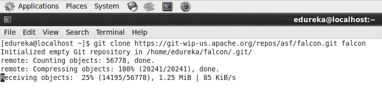
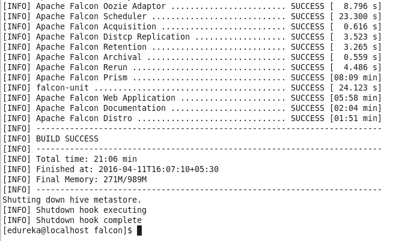
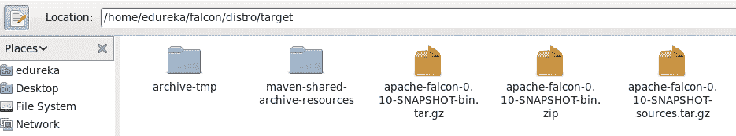
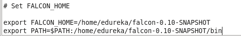
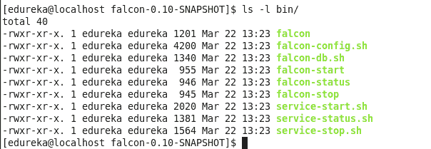
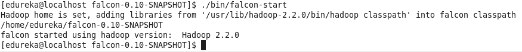
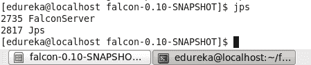
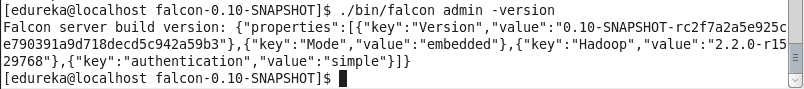
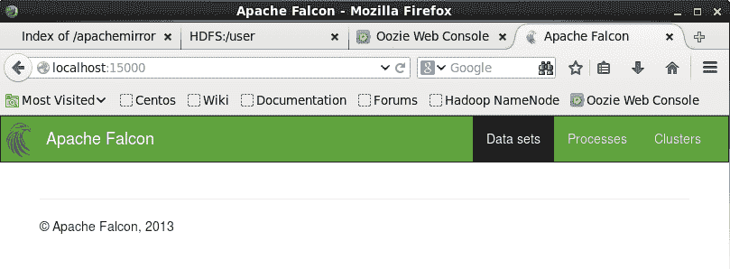

# Apache Falcon:Hadoop 生态系统的新数据管理平台

> 原文：<https://www.edureka.co/blog/apache-falcon-new-data-management-platform-for-hadoop-ecoystem>

Apache Falcon 是一个在 Hadoop 集群中管理数据生命周期的框架。它在 Hadoop 环境中的各种数据和处理元素之间建立关系，还提供 feed 管理服务，如 feed 保留、跨集群复制、归档等。

让我们首先讨论如何设置 Apache Falcon。运行以下命令下载 Falcon 的 git 存储库:

**命令:** git 克隆 https://git-WIP-us . Apache . org/repos/ASF/falcon . git falcon

要运行 falcon，首先需要构建它。

**命令:** cd 猎鹰

**命令:**导出 MAVEN _ OPTS = "-xmx 1024m-XX:MaxPermSize = 256m-no verify "&&mvn 全新安装-DskipTests

**命令:**mvn clean assembly:assembly-dskiptest-DskipITs

一旦你构建了 falcon，你会在/falcon/distro/target/目录中找到一个 falcon 包。

构建 falcon 的命令看起来非常简单，但是在看到构建成功消息之前，您将面临许多问题。在为 Hadoop-2.2.0 构建时，我遇到了很多问题

所以为了跳过构建 falcon 的痛苦，我给你一个成功构建的 Falcon 包，你可以使用下面的链接下载。

[https://edureka.wistia.com/medias/xw5cfzqmho/download?media_file_id=124642564](https://edureka.wistia.com/medias/xw5cfzqmho/download?media_file_id=124642564)

解压文件得到 falcon-0.10 目录。

**命令:**解压猎鹰-0.10-SNAPSHOT.zip

在中设置 flacon 环境变量。bashrc 文件。

**命令:** sudo gedit。bashrc

**命令:**来源。bashrc

你可以去猎鹰目录，看看里面的文件和目录。

**命令:** cd 猎鹰-0.10-快照/

**命令:** ls

你可以在 bin 目录下找到 falcon 脚本。

运行以下命令启动 Falcon。

**命令:**。/bin/猎鹰-开始

你会看到一个新的守护鹰服务器正在运行。

命令:jps

**命令:**。/bin/falcon 管理版本

打开你的浏览器，进入 **localhost:15000** 。可以看到 Falcon web ui。

有问题要问我们吗？在评论区提到它们，我们会回复你。

**相关帖子:**

[大数据和 Hadoop 入门](https://www.edureka.co/big-data-and-hadoop "Get started with Big Data & Hadoop")

[在阿帕奇上向下钻](https://www.edureka.co/blog/drilling-down-on-apache-drill-the-new-age-query-engine)