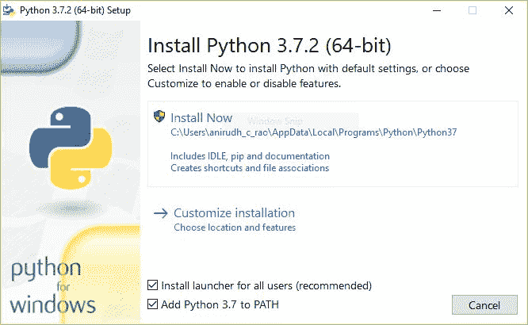
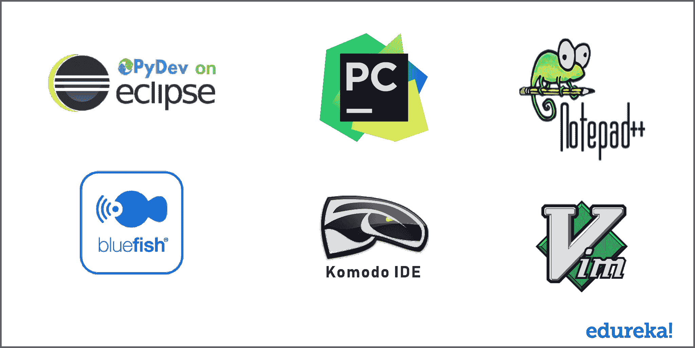

# 在 Windows 上安装 Python–Python 3。x 安装指南

> 原文：<https://www.edureka.co/blog/install-python-on-windows/>

## **在 Windows 上安装 Python**

在这篇在 Windows 上安装 Python 的博客中，我们将看看在 Windows 上设置和安装 **[Python](https://www.edureka.co/blog/python-tutorial/)** 有多简单。它包括几个简单的步骤，让您快速开始使用 Python for Windows。

我们将在这篇关于在 Windows 上安装 Python 的博客中探讨以下主题:

*   [Python 简介](#z1)
*   [Python 为什么这么受欢迎？](#z2)
*   [为什么要学习 Python？](#z3)
*   [在 Windows 上安装 Python](#z4)
*   [Python 开发环境](#z5)

## 在 Windows 上安装 Python 的 5 个简单步骤|安装 Python 3.7 | Python 培训| Edureka

[https://www.youtube.com/embed/QMbnSoB1CRU?rel=0&&showinfo=0](https://www.youtube.com/embed/QMbnSoB1CRU?rel=0&&showinfo=0)

这个关于在 Windows 上安装 Python 的 Edureka 视频教程涵盖了安装和设置 Python 以编写代码的所有方面。

让我们从快速介绍 Python 开始这篇“在 Windows 上安装 Python”的博客。

## **Python 简介**

[**Python**](https://www.edureka.co/blog/python-tutorial/) 是一种非常通用的语言。它有成千上万的库和模块可以使用。

就个人而言，我认为[**Python**](https://www.edureka.co/blog/python-tutorial/)与所有其他语言相比，使用起来非常有趣。这是非常友好的初学者，这是非常重要的，语法很容易理解。作为初学者，我认为这在开始学习一门语言时非常重要。

最好的是，没有分号，对吧？

自从[**Python**](https://www.edureka.co/blog/python-tutorial/)和它的大多数库都是开源的以来，它已经在创业公司和行业中获得了很大的吸引力。这无疑会给全球带来数百万快乐的学习者。

所以你可能会疑惑为什么要考虑学习[**Python**](https://www.edureka.co/blog/python-tutorial/)对吗？

伙计们，它的应用范围如此之广，我无法在一张图片中全部体现出来！

使用 Django 和 bottle 进行 web 开发。使用 Numpy 进行数学计算，使用 Tkinter 设计自己的 GUI，使用 Pygame 制作自己的游戏等等。

接下来，在这篇关于在 Windows 上安装 Python 的博客中，我们将看看为什么 Python 如此受欢迎。

## **Python 为什么这么受欢迎？**

如果你还记得几年前，人们告诉 python 是下一个大事件。嗯，他们是真的。在今天的情况下，这是一件大事！

首先，当我们开始学习新语言时，我们都会感到有些失望或滞后，不管你是初学者还是专业人士，对吗？这可能是因为纯粹的概念或某些东西使你困惑或没有给你一个好的画面。

嗯，在我个人看来，python 解决了我所学语言的所有难题，如果我必须从头开始学习一门语言，我会毫不犹豫地选择 python。

它对初学者非常友好，语法非常容易阅读和理解。

这无疑让我们所有人都很高兴，是的，python 在全球有数百万快乐的学习者！

我无法告诉你使用 python 有多有趣，我相信在这篇“在 Windows 上安装 Python”的博客结束时，你也会有同样的看法。

在这篇“在 Windows 上安装 Python”的博客中，我们将看看为什么你应该考虑学习 Python 。

## **为什么要学 Python？**

Python 是一种通用语言。它的应用范围很广，从 Web 开发(像 Django 和 Bottle)、科学和数学计算(Orange、SymPy、NumPy)到桌面图形用户界面(Pygame、Panda3D)。

该语言的语法清晰，代码长度相对较短。用 Python 工作很有趣，因为它允许你思考问题，而不是关注语法。

今天存在的每一家财富 500 强公司都以这样或那样的方式使用 Python。你甚至不需要做任何挖掘就能知道这个事实。同样，正如我所说的，Python 在初创公司和成熟的行业巨头中都非常受欢迎。

用 Python 编程很有趣。更容易理解和编写 Python 代码。**为什么？**语法感觉很自然。

在这篇“在 Windows 上安装 Python”的博客中，我们将看看如何安装 Python。

## **在 Windows 上安装 Python**

与在 Linux 上安装 Python 相比，在 Windows 上安装 Python 的过程稍长。在 Linux 中，这就像运行一个命令并设置它一样简单。对于 Windows，它采取了稍微不同的路线。

要开始使用 Python 3，你需要访问 Python 解释器。有几种常见的方法可以实现这一点:

*   Python 可以在[python.org](https://www.python.org/)的 **Python 软件基金会**网站获得。通常，这包括下载适合你的操作系统的**安装程序**并在你的机器上运行。
*   一些操作系统，特别是 Linux，提供了一个**包管理器**，可以运行它来安装 Python。
*   在 macOS 上，安装 Python 3 的最好方法是安装一个名为 **Homebrew** 的包管理器。您将在本教程的相关章节中看到如何做到这一点。
*   在 Android 和 iOS 等移动操作系统上，你可以安装提供 Python 编程环境的应用。这是在旅途中练习编码技能的好方法。

或者，有几个网站允许你在线访问 Python 解释器，而无需在你的电脑上安装任何东西。

**注意:**Python 有可能已经随您的操作系统一起发货并且已经安装了。即使是这种情况，也可能是安装的版本已经过时，在这种情况下，您无论如何都要获得最新版本。

您的 Windows 系统不太可能已经安装了 Python。Windows 系统通常不会。幸运的是，安装只需要从 python.org 网站下载并运行 Python 安装程序。我们来看看如何在 Windows 上安装 Python 3:

### **第一步:下载 Python 3 安装程序**

1.  打开浏览器窗口，导航至位于[python.org](https://www.python.org/)的[Windows](https://www.python.org/downloads/windows/)下载页面。
2.  在顶部标题 **Python 面向 Windows** 发布的下方，点击**最新 Python 3 发布——Python 3 . x . x**的链接。(截至本文撰写时，最新版本是 Python 3.7.2。)
3.  滚动到底部，选择 64 位的 **Windows x86-64 可执行安装程序**或 32 位的 **Windows x86 可执行安装程序**。

但是我们应该选择 32 位还是 64 位的安装程序呢？

对于 Windows，您可以选择 32 位或 64 位安装程序。这两者之间的区别归结为:

*   如果您的系统有 32 位处理器，那么您应该选择 32 位安装程序。
*   在 64 位系统上，这两个安装程序实际上都可以满足大多数需求。32 位版本通常使用较少的内存，但 64 位版本对于计算密集型应用程序来说性能更好。
*   如果你不确定选择哪个版本，就选择 64 位版本。

**注意:**记住，如果你选择“错误”并想切换到另一个版本的 Python，你可以卸载 Python，然后从[python.org](https://python.org/)下载另一个安装程序重新安装。

### **步骤二:运行安装程序**

选择并下载安装程序后，双击下载的文件即可运行。应该会出现一个类似这样的对话框:

**重要提示:** 你要确保勾选如图所示的  **将 Python 3.x 添加到路径** 的复选框，以确保解释器将被放置在你的执行路径中。

然后只需点击  **立即安装**。这应该就是全部了。几分钟后，您的系统上应该已经安装了 Python 3。

## **Windows Linux 子系统(WSL)**

如果你运行的是 Windows 10 Creators 或者周年更新，其实你还有另外一个安装 Python 的选择。这些版本的 Windows 10 包括一个名为**Linux 的 Windows 子系统、** 的功能，允许您直接在 Windows 中运行 Linux 环境，无需修改，也没有虚拟机的开销。

*   有关如何在 Windows 10 中启用子系统并安装 Linux 发行版的说明，请参见  [Windows 10 安装指南](https://docs.microsoft.com/en-us/windows/wsl/install-win10)。

一旦安装了您选择的 Linux 发行版，就可以从 Bash 控制台窗口安装 Python 3，就像在本地运行该 Linux 发行版一样。

## **Python 开发环境**

有许多很好的 ide 可以用 Python 编码并在日常生活中使用。

我们为你的 mac 用户准备了用于 eclipse 的 Pydev、Pycharm、notepad++和 bluefish。我们还有科莫多和维姆。

看看下面的图片:

这些是你可以用来开发代码的 IDE 中的一些。嗯，我建议你用你觉得舒服的东西，然后从那里开始。

选择 IDE 就像选择冰淇淋口味一样。你首先需要实际尝试一下，看看它是否完全符合你的需要。如果是这样的话，你可以继续前进，并利用它。

就我个人而言，这是一个漫长的 Python 之旅。我尝试了多种 ide，我个人喜欢 PyCharm。它真的很简单，使用起来很神奇。当我说 PyCharm 是 Python 的首选 IDE 时，我确信整个社区的大多数人都同意我的观点。

我收到了很多你们的请求，要我推出一个 **[PyCharm 教程](https://www.edureka.co/blog/pycharm-tutorial)** 视频和博客，所以一定要看看。

## 结论

我希望这篇在 Windows 上安装 Python 的教程能帮助你学习如何在你的 Windows 机器上安装和设置 Python。

当你开始用 Python 编写代码，并且正在建立所有需要的工具和软件时，这将非常方便。现在，在 Windows 中借助 Python，您也应该能够使用这些概念轻松地开发应用程序。

看完这篇关于在 Windows 上安装 Python 教程的博客后，我很确定你想了解更多关于 Python 的知识。想要了解更多关于 Python 的知识，你可以参考下面的博客:

1.  **[Python 教程——Python 编程初学者](https://www.edureka.co/blog/python-tutorial/)**
2.  **[用于数据科学的 Python](https://www.edureka.co/blog/learn-python-for-data-science/)**
3.  [**你应该学习 Python 的 10 大理由**](https://www.edureka.co/blog/10-reasons-why-you-should-learn-python)
4.  [**Python 请求教程**](https://www.edureka.co/blog/python-requests-tutorial/)
5.  [**Python Tkinter 教程**](https://www.edureka.co/blog/tkinter-tutorial/)

*要深入了解 Python 及其各种应用，您可以立即注册参加实时 [Python 在线课程认证](https://www.edureka.co/python-programming-certification-training)培训，该培训提供全天候支持和终身访问。*

有问题吗？请在这篇“在 Windows 上安装 Python 教程”博客的评论部分提到它，我会尽快回复你。