# UiPath 录制教程–关于在 UiPath 中录制的综合指南

> 原文：<https://www.edureka.co/blog/uipath-recording/>

***ui path 中记录的是什么？UiPath 中可以记录哪种类型的动作？录音的各种类型有哪些？***

我相信你一定想知道这些问题的答案是什么。嗯，在这篇关于 UiPath 录制的文章中，我将回答你所有的问题，关于你如何使用 [UiPath 的](https://www.edureka.co/blog/uipath-tutorial/)的录制功能来录制各种动作，并在[掌握工具](https://www.edureka.co/robotic-process-automation-training)中获得实践经验。

本文将涵盖以下主题:

*   [ui path 中记录的是什么？【T2](#What%20is%20Recording%20in%20UiPath?)
*   [手动录制](#Manual%20Recording)
*   [自动记录仪及其类型](#Automatic%20Recorder%20and%20its%20Types)
*   [基本录制和桌面录制的区别](#Difference%20between%20Basic%20and%20Desktop%20Recording)
*   [自动录制示例](#Example%20of%20Automatic%20Recording)

所以，让我们开始吧，伙计们！

## **ui path 中记录的是什么？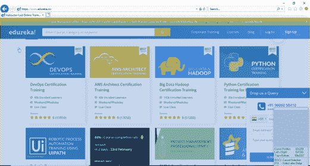**

在自动化业务时，您可能经常需要保存一些可以自动执行的操作，对吗？

嗯，记录是 UiPath 中的一个这样的功能，它将使你能够捕捉用户在屏幕上的动作，然后最终将它们转换成序列。录制的项目可以根据用户的需要进行修改，并可以根据用户的需要多次重复使用。

在记录任何操作的过程中，所有用户界面元素都会突出显示，以确保您选择了正确的字段。参考右边的图像。

现在，要在 UiPath 中记录动作，您必须使用 UiPath 中的 Recording 选项。在我告诉你录音的类型(自动录音机)之前，让我们看看手动录音，以及它的工具栏的各种功能。

## **手动录制**

手动记录主要用于在单个动作中实现自动化。这些动作不能被自动录音记录下来。让我们来看看单一行动的类型。

### **启动和停止一个应用程序**

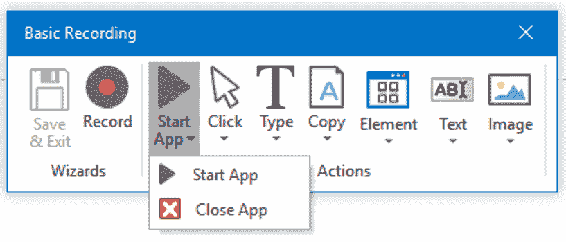该选项使您能够通过点击**打开或关闭应用程序**。

当你选择一个应用程序时，你必须在弹出的对话框中提到参数。之后，选择选项 **Yes** 保存记录的输出，您将被重定向到**生成的序列**。

### **点击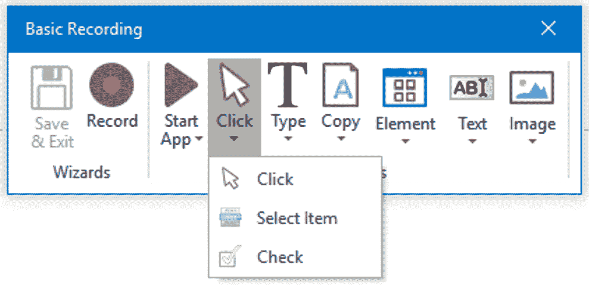** 

单击类型的单个动作将使您能够**记录您机器上的点击**。它可以是从下拉列表中选择一个选项，或者选择一个复选框或单选按钮，甚至是单击一个正在运行的应用程序。 当您选择此功能后，点击工具栏中的**选项‘点击’**。之后，选择 **Yes** 保存记录的输出，您将被重定向到**生成的序列。**

### **式**

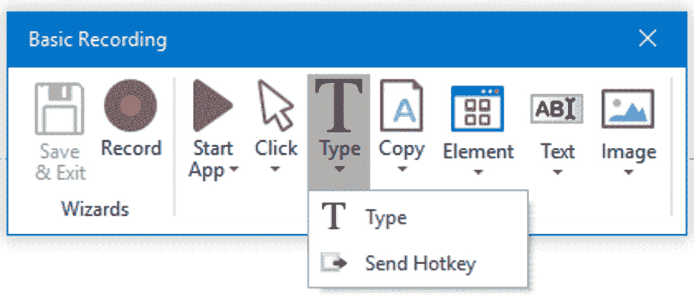

这种类型的单个动作是那些**需要从键盘**输入的动作类型(快捷键和按键)。

当您选择此选项时，您将**选择您想要使用此功能的区域**，然后您将获得基于您选择的选项的弹出窗口。如果您**选择类型**，那么**弹出窗口将要求您键入所需的值**，然后按下**进入**。如果你选择第二个选项**发送热键**，那么弹出窗口会要求你**选择热键**。

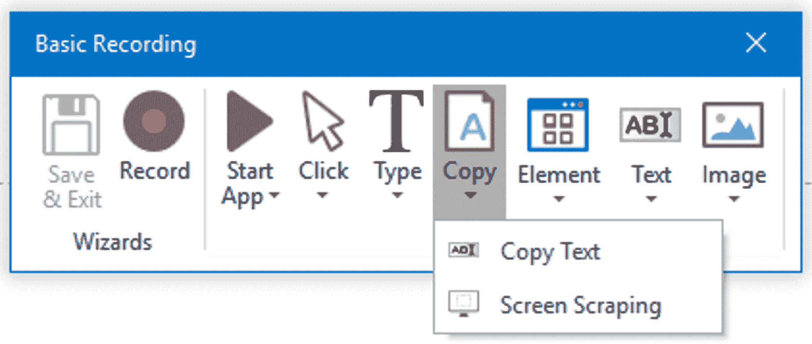

### **复制**

这种类型的操作让您**从网络浏览器或应用程序中复制选定的文本**。在该菜单中，您可以使用**复制文本选项仅复制文本**，或者您可以使用**屏幕抓取**选项**提取文本和图像**。

### **鼠标元素**

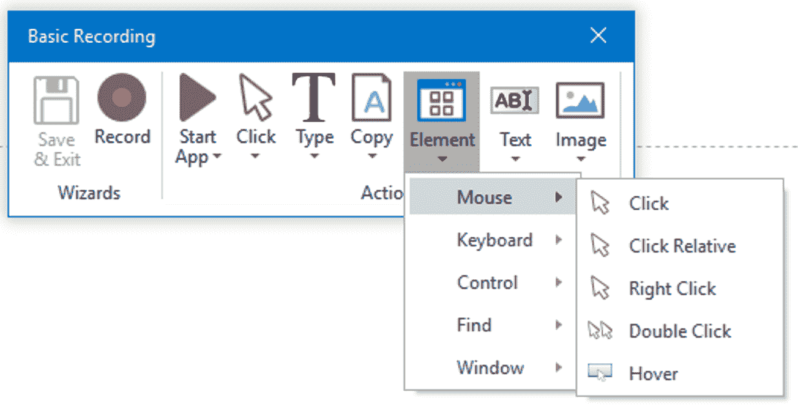鼠标元素动作使您能够**控制鼠标移动**，例如右击、双击和将鼠标悬停在元素上。

当你从菜单中选择一个选项时，例如点击，你必须在下一个**在屏幕**上通过**拖动你的鼠标到区域**来指示你想要执行点击操作的地方。之后，选择**是**保存记录的输出，您将被重定向到**生成的序列**。

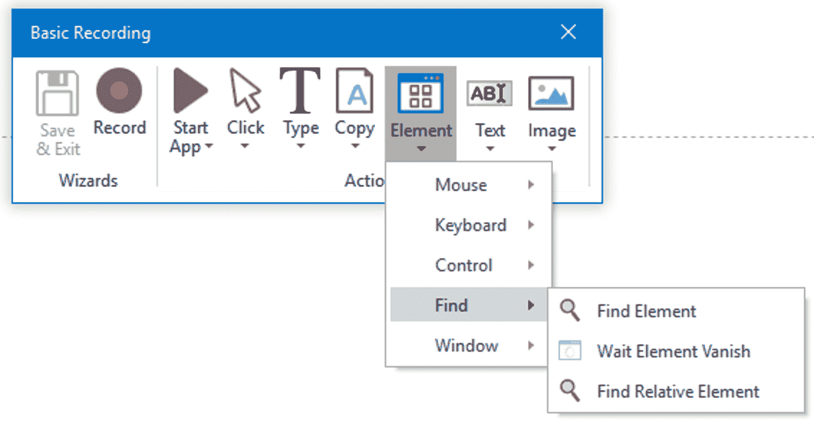

### **找元素**

这种类型的单个动作可以帮助你识别特定的 UI 元素，找到相关的元素，暂停自动化直到 UI 元素消失或者窗口关闭。

当你从菜单中选择一个选项时，例如，查找元素，然后你必须在屏幕上**指示你想要查找的元素。之后，选择**是**保存记录的输出，您将被重定向到**生成的序列**。**

### **窗口元素**

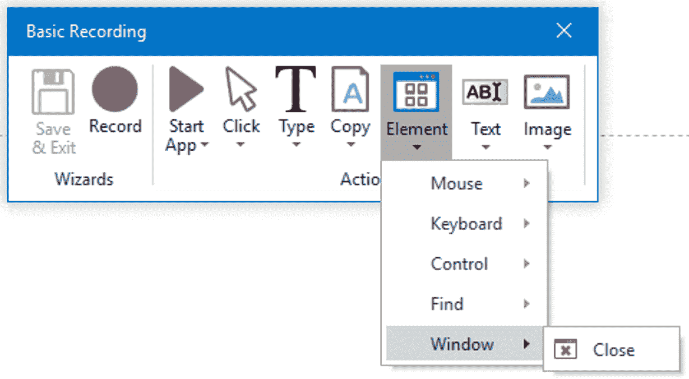这个动作**可以让你关闭一个特定的窗口**。UiPath Studio 在操作系统中完成这项工作。这确保了应用程序是关闭的。

当您从菜单中选择**关闭**选项时，您必须用**指示关闭窗口的屏幕**上的元素。之后，选择**是**保存记录的输出，您将被重定向到**生成的序列**。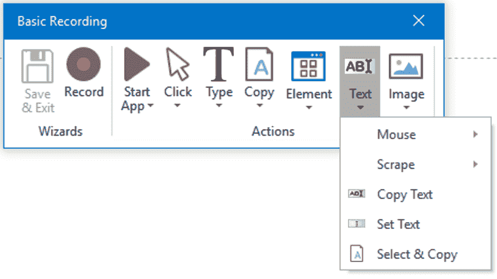

### **正文**

这种类型的单个动作让你**选择或悬停在文本上来抓取数据**。文本单个操作还允许您复制和粘贴文本，设置文本和控制鼠标控制的各种选项。

当你从文本菜单中选择任何选项时，你必须在屏幕上用**指示出你想要执行动作的元素**。之后，选择**是**保存记录的输出，您将被重定向到**生成的序列**。

### **图像**

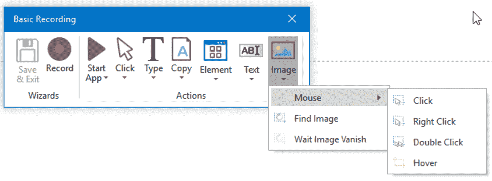

图像类型的单个动作使您能够悬停在特定图像上，在应用程序或网络浏览器中找到图像，或者等待图像消失。这种类型的手动记录对于不能突出显示为正常字段或文本的元素非常有用。

当你从菜单中选择任何选项时，你必须指示屏幕上的元素,从那里你可以找到一个图像，等待一个图像消失或者悬停在一个图像上。

现在，您已经知道了工具栏中的所有选项，让我们深入了解各种类型的自动录制。

## **自动记录仪及其类型**

UiPath Studio 中有四种类型的录像:

*   **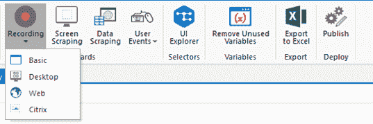基本**–这种类型的记录器为每个活动生成一个完整的选择器。此活动主要对单个活动有用。
*   **桌面**–桌面记录器适用于所有类型的桌面应用程序和多种操作。这种类型的记录器为每个活动生成部分选择器。
*   **Web** -Web Recorder 是为记录 Web 应用程序和浏览器中的动作而设计的。默认情况下，该记录器使用键入/点击输入法。
*   **Citrix**–这种类型的记录器用于记录虚拟化环境的操作。这种类型的记录器只允许图像、文本和键盘自动化。

基本、桌面和网络录制的工具栏提供了非常相似的选项，但是网络录制器有一个额外的选项来打开浏览器。工具栏上的选项使您能够执行以下操作:

*   自动记录多个动作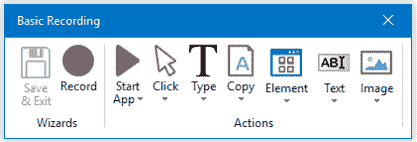
*   手动记录单个动作，例如:
    *   选择复选框
    *   打开或关闭应用程序
    *   从下拉菜单中选择选项
    *   控制键盘快捷键的模拟
    *   寻找图像

与其他三个记录器的工具栏相比，Citrix 的工具栏略有不同。工具栏上的选项可让您执行以下操作: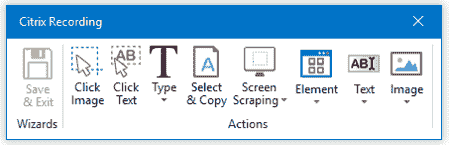

*   单击图像或文本
*   抓取 UI 元素
*   寻找元素或等待它们消失
*   从窗口中选择并复制文本
*   控制键盘快捷键的模拟
*   激活 windows

So, just in case if you are confused when to use the automatic or manual recording in your project, then you should know the differences between both. Refer to the below table to understand the same.

| **手动记录仪** | **自动记录仪** |
| 手动记录器用于键盘快捷键、悬停鼠标、提取文本、查找图像和元素、复制并粘贴到剪贴板。 | 自动记录器用于激活窗口、键入文本、点击按钮、在复选框和下拉列表中选择一个选项。 |

现在，除了上述混淆，人们往往容易混淆基本和桌面录音这两个术语。因此，在这篇关于 UiPath 记录的文章中，让我澄清一下。

## **基本和桌面录音的区别**

为了向您解释基本录音和桌面录音之间的区别，让我们考虑一个场景。

考虑一个场景，您必须记录在 Google 表单中填写细节的动作。现在，让我们首先使用基本记录器，然后使用桌面记录器来记录这个动作。

### **使用基本记录器** 记录动作

当您使用基本记录器记录动作时，您将会看到为每个活动生成了**完整的选择器。请参考下面的快照，了解为活动类型生成的样本序列和选择器。**

### **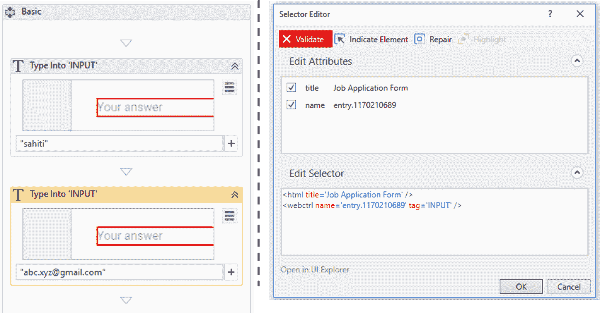使用桌面记录仪记录动作**

类似地，当您使用桌面记录器记录在 google 表单中填写详细信息的操作时，您会发现工作流将包含一个 **附加窗口活动。** 这个活动会有一个**选择器的顶层窗口**。有关示例序列和连接窗口活动，请参考下面的快照。

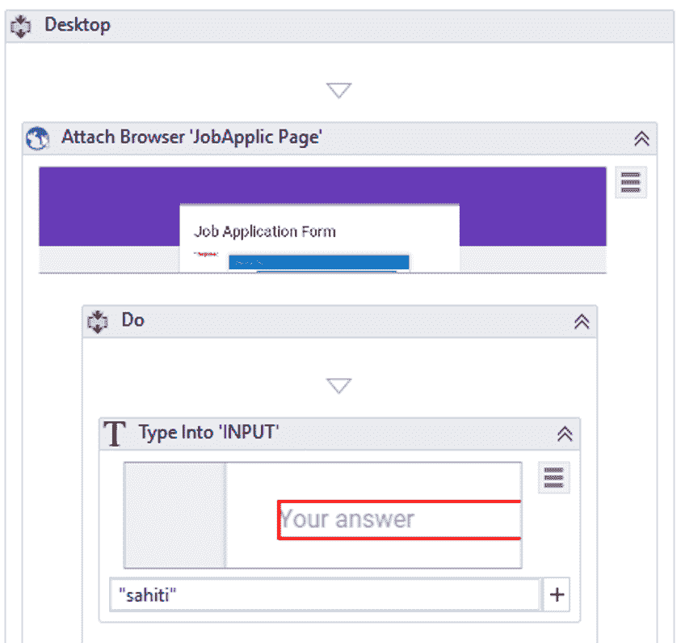现在，在附加窗口活动的 **Do 块中，所有的活动都将**呈现给部分选择器**。这些部分选择器将不包含顶层窗口。因此，UI 层次结构中的顶层窗口元素在开始时只被标识一次，然后它被用于每个元素。**

因此，基本记录器和桌面记录器之间的差异如下:

| **基本记录器** | **桌面录像机** |
| 当你只需要做一个动作时使用。 | 当你必须做不止一个动作时使用。 |
| 较慢，因为它从父窗口开始识别元素。 | 与基本记录器相比，速度更快 |

现在，在这篇关于 UiPath 记录的文章中，让我们看一个自动记录的简单例子。

## **自动录音的例子**

**任务:**我们的任务是记录你登录 edureka 账户的动作。为了完成这项任务，我们必须使用网络记录器的录音选项。因此，在功能区中，转到录制选项并选择 Web。

## **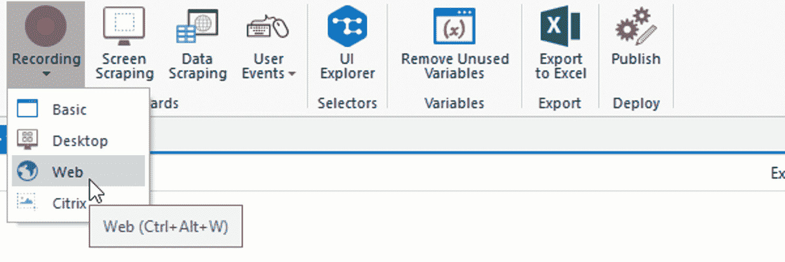**

### **实现自动化的步骤**

**第一步:**打开网络浏览器(Internet Explorer)并提及网址:【https://www.edureka.co 

**第二步:**现在，在 **UiPath 工作室**中选择**网络记录器**，然后你会看到下面的工具栏。

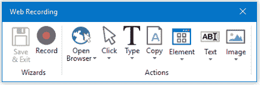

**第三步:**现在，从上面的工具栏中选择**点击选项**，在菜单中再次选择**点击选项**。之后**高亮显示你想要点击的元素**。这里我要点击**登录选项**。参考下文。

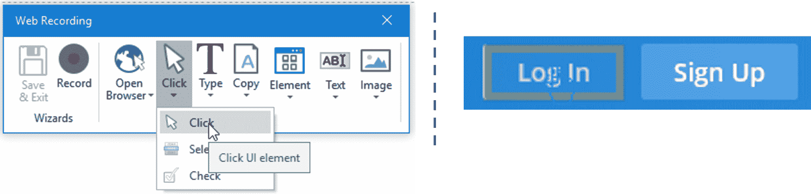

**第四步:**现在，从工具栏中选择**类型选项**，从菜单中选择**类型选项。然后突出显示要填充文本的元素。在这里，我想输入电子邮件地址，所以我突出显示了该部分。参考下文。**

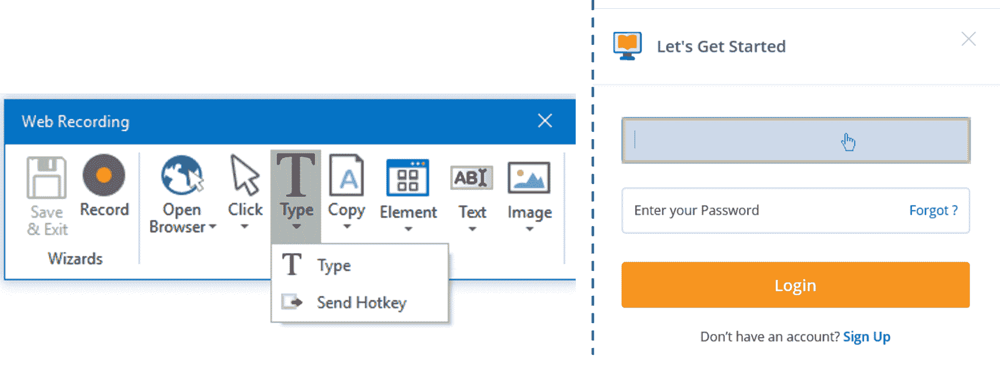

**步骤 4.1** 只要你**点击高亮显示的部分**，就会看到如下弹出，其中你要**提及所需文本**。一旦您提到所需的文本，按下**键，输入**。

**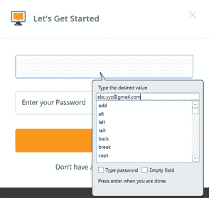步骤 4.2:** 同理重复以上步骤输入密码。但是，在  **中输入** 弹出显示为您的密码，请确保您选择了 **输入密码** 复选框，以使您显示的密码是加密的。参考下文。

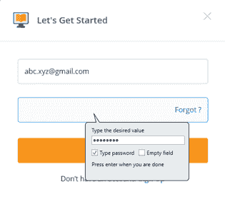

**第五步:**现在从工具栏中选择**点击选项**，然后从菜单中选择**点击选项**。之后**高亮显示你想要点击的元素**。这里我要点击**登录选项**。参考下文。

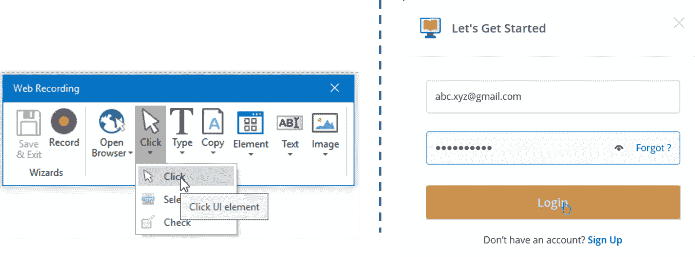

**第六步:**现在点击工具栏中的**保存&退出**选项，以**保存**和**生成的录像序列。**之后，点击**运行**，执行自动化以查看结果。

您将看到登录详细信息被自动填充，并且用户已经登录。

所以，伙计们，关于 UiPath 记录的这篇文章到此结束。我希望你喜欢阅读这篇关于 UiPath 录音的文章，并学会如何使用 [UiPath](https://www.edureka.co/blog/uipath-tutorial/) 的录音功能。如果您希望进一步了解[机器人流程自动化](https://www.edureka.co/blog/robotic-process-automation/)，并作为  [RPA 开发人员](https://www.edureka.co/blog/rpa-developer-roles-and-responsibilities/)建立您的职业生涯，那么您可以使用 UiPath 查看我们关于  ***[机器人流程自动化的课程。](https://www.edureka.co/robotic-process-automation-training)*** 本课程将帮助您增强 RPA 方面的知识，并为您提供大量 UiPath 实践经验。

有问题要问我们吗？请在这篇  **UiPath 录音**文章的评论部分提到它，我们会给你回复。