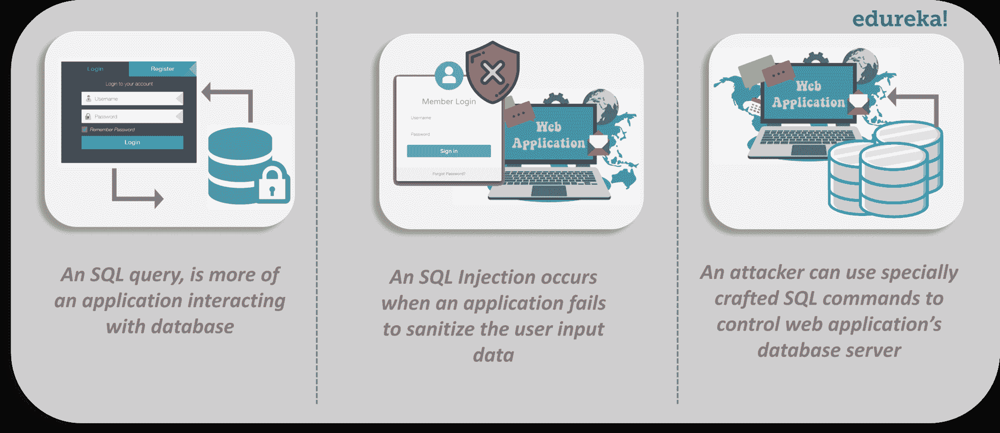

# 什么是 SQL 注入攻击，如何防范？

> 原文：<https://www.edureka.co/blog/sql-injection-attack>

随着技术的进步，现代社会已经实现了许多不可想象的目标。然而，随着技术的发展，使用技术的风险也在增加。web 应用程序也是如此。今天的应用程序充满了漏洞。自 2003 年以来，SQL 注入一直是 OWASP 十大应用安全风险之一，许多公司都在努力应对这些风险。在本文中，我们将探讨 SQL 注入攻击以及防范方法。让我们来看看这篇文章涉及的话题:

1.  [什么是 SQL 注入攻击？](#SQLInjection)
2.  SQL 注入能做什么？
3.  [SQL 注入攻击是如何工作的？](#SQLInjectionWorking)
4.  [SQL 注入攻击有哪些不同类型？](#TypesOfSQLInjection)
5.  [如何防范 SQL 注入攻击？](#PreventingSQLInjection)

你可以观看这个网络安全视频讲座，我们的 [培训专家](https://www.edureka.co/cybersecurity-certification-training) 正在讨论这项技术的每一个细节。

## **应用安全|应用安全教程|网络安全认证课程| edu reka**


[https://www.youtube.com/embed/gfFKuiZ9Y7s?rel=0&controls=0&showinfo=0](https://www.youtube.com/embed/gfFKuiZ9Y7s?rel=0&controls=0&showinfo=0)*This Edureka video on “Application Security” will help you understand what application security is and measures taken to improve the security of an application often by finding, fixing and preventing security vulnerabilities.**Anonymity is just a simple thing in Ethical Hacking & CyberSecurity. If you are interested in this domain, check the live [CompTIA Security+ Training](https://www.edureka.co/comptia-security-plus-certification-training).*

## **什么是 SQL 注入攻击？**

*SQL 注入(SQLi)是一种注入攻击，攻击者通过执行恶意的 SQL 语句来控制 web 应用的数据库服务器，从而访问、修改和删除未经授权的数据。*

在互联网的早期，建立网站是一个简单的过程:没有 JavaScript，没有 T2 CSS 和一些图片。但随着网站越来越受欢迎，对更先进的技术和动态网站的需求也在增长。这导致了服务器端脚本语言的发展，如 [JSP 和 PHP](https://www.edureka.co/blog/php-tutorial-for-beginners/) 。网站开始在数据库中存储用户输入和内容。MySQL 成为访问和操作数据库的最流行和标准化的语言。然而，黑客们找到了利用 SQL 技术中存在的漏洞的新方法。SQL 注入攻击是针对数据库的流行方法之一。SQL 注入使用特制的 SQL 语句来欺骗系统，使其做意想不到的事情。

查看我们新的 [CEH 认证](https://www.edureka.co/ceh-ethical-hacking-certification-course),深入了解道德黑客的概念并获得技能。

## **SQL 注入可以做什么？**

攻击者在易受攻击的网站上利用 SQL 注入时可以做很多事情。通过利用 SQL 注入漏洞，在适当的情况下，攻击者可以做以下事情:

*   绕过 web 应用程序的授权机制并提取敏感信息
*   轻松控制基于数据库中数据的应用程序行为
*   当用户访问应用程序时，注入更多要执行的恶意代码
*   添加、修改和删除数据，损坏数据库，并使应用程序或不可用
*   列举在网站上注册的用户的身份验证详细信息，并使用这些数据攻击其他网站

这完全取决于攻击者的能力，但有时 SQL 注入攻击可以导致完全接管数据库和 web 应用程序。现在，攻击者是如何做到这一点的？



## **SQL 注入攻击是如何工作的？**

开发人员通常定义一个 SQL 查询来执行应用程序运行所必需的一些数据库操作。该查询有一个或两个参数，因此当用户提供该参数的值时，只返回所需的记录。

SQL 注入攻击分两个阶段进行:

1.  **研究**:攻击者为参数给出一些随机的意外值，观察应用程序如何响应，并决定要尝试的攻击。
2.  **攻击**:攻击者为参数提供精心制作的值。应用程序将解释 SQL 命令的值部分，而不仅仅是数据，然后数据库执行攻击者修改的 SQL 命令。

考虑下面的例子，其中网站用户能够改变诸如登录表单中的' $user '和' $password '的值:

```

$statement = "SELECT * FROM users WHERE username ='$user'  AND  password '$password'";

```

这个特定的 SQL 语句被传递给一个函数，接着将字符串发送到连接的数据库，在那里进行解析、执行并返回结果。

```
#Define POST variables
uname = request.POST['username']
passwd = request.POST['password']

#SQL query vulnerable to SQLi
sql = “SELECT id FROM users WHERE username=’” + uname + “’ AND password=’” + passwd + “’”

#Execute the SQL statement 
database.execute(sql) 

```

现在，如果输入没有被正确地清理，但是应用程序被清理，攻击者可以很容易地插入精心制作的值作为输入。例如，类似于:

```

$statement = "SELECT * FROM users WHERE username ='Dean' OR '1'='1'-- ' AND password = 'WinchesterS'";

```

那么，这里发生了什么？突出显示的部分是攻击者的输入，它包含两个特殊部分:

*   或“1”=“1”是一个总是为真的条件，因此它被应用程序接受为有效输入
*   –(双连字符)指示 SQL 解析器该行的其余部分是注释，不应执行

一旦查询执行，SQL 注入将有效地取消密码验证，从而绕过身份验证。应用程序最有可能使用查询结果中的第一个帐户让攻击者登录—数据库中的第一个帐户通常是管理用户。

请注意，这只是利用 SQL 查询以非官方方式获取必要信息的一种方式。SQL 注入攻击分为多种类型。

## **SQL 注入攻击有哪些不同的类型？**

攻击者可以通过各种方式利用 SQL 注入漏洞从服务器中提取数据。 SQL 注入可以分为三大类:

*   *带内 SQLi*
*   *推论 SQLi*
*   *带外 SQLi*

让我们来探讨一下这些变体。

### **带内 SQL 注入**

它是 最常见的 SQL 注入攻击。通常发生在攻击者能够使用相同的通信信道来发起攻击和收集结果的时候。两种最常见的带内 SQL 注入类型是:

*   *基于错误的 SQL 注入*–这是一种依靠数据库服务器抛出的错误消息来获取数据库结构信息的技术。有时，这种简单的攻击足以让攻击者枚举整个数据库。
*   *基于 Union 的 SQL 注入—*这种技术利用 UNION SQL 操作符将两个或多个 SELECT 语句的结果组合成一个结果，然后作为 HTTP 响应的一部分返回。

### **推理 SQL 注入(盲目** SQLi **)**

在这种类型的注入中，实际上没有数据通过 web 应用程序传输。因此，攻击者将无法看到攻击的结果。在这里，攻击者通过发送有效负载、观察 web 应用程序的响应和数据库服务器的最终行为来重建数据库结构。两种类型的推理 SQL 注入是:

*   *基于布尔的 SQL 注入—*在这种技术中，应用程序被迫返回不同的结果，这取决于查询返回的结果是真还是假。根据结果，HTTP 响应中的内容将会改变，或者保持不变。
*   *基于时间的 SQL 注入—*这是一种技术，它依赖于向数据库发送 SQL 查询，强制数据库在响应前等待指定的时间(以秒为单位)。网站作出响应的时间将向攻击者表明查询结果是真还是假。

### **带外 SQL 注入**

SQL 注入攻击的这些类型是最不常见的，通常也是最难执行的。它们通常涉及将数据直接从数据库服务器发送到由攻击者控制的机器。带外技术为攻击者提供了带内或盲目 SQL 注入攻击的替代方案，尤其是在服务器响应不太稳定的情况下。

因此，服务器脚本语言无法确定 SQL 查询字符串是否格式错误。他们所能做的就是向数据库服务器发送一个字符串，然后等待被解释的响应。但是，肯定有方法净化用户输入并确保 SQL 注入不可行，对吗？

## **如何防止 SQL 注入？**

有许多简单的方法可以避免成为 SQL 注入攻击的牺牲品，并限制它们可能造成的损害。其中很少包括:

*   **发现** **SQL** **注入** **漏洞**通过常规测试应用程序使用静态测试和动态测试
*   **通过使用参数化查询和对象关系映射器(ORM)来避免和修复** 注入漏洞。这种类型的查询为参数指定占位符，以便数据库总是将它们视为数据，而不是 SQL 命令的一部分。
*   **利用转义字符修复** SQL 注入漏洞，从而忽略特殊字符。
*   **通过在数据库上实施最低特权来减轻**SQL 注入漏洞的影响，这样应用程序的每个软件组件就可以只访问和影响它需要的资源。
*   **对访问数据库的 Web 应用程序使用****Web 应用程序防火墙(WAF)** 。这可以帮助识别 SQL 注入企图，有时也有助于阻止 SQL 注入企图到达应用程序。

SQL 注入攻击是网络犯罪分子常用的攻击方法，但是通过采取适当的预防措施，例如确保数据经过加密、执行安全测试以及更新补丁程序，您可以采取有意义的措施来保护您的数据安全。

由于 web 应用程序的漏洞，黑客可以通过多种方式渗透到应用程序中。请保持消息灵通！

*如果这激发了您的兴趣，并且您想了解更多关于应用安全的信息，那么请查看我们的 [**网络安全认证培训**](https://www.edureka.co/cybersecurity-certification-training) ，该培训包含讲师指导的现场培训和真实项目体验。本培训将帮助您深入了解网络安全，并帮助您掌握该主题。*

*您还可以看看我们新推出的关于 [**CompTIA Security+认证**](https://www.edureka.co/comptia-security-plus-certification-training) 的课程，这是 Edureka & CompTIA Security+首次与官方合作。它为您提供了一个获得全球认证的机会，该认证侧重于安全和网络管理员不可或缺的核心网络安全技能。*

通过 Edureka 的 [**研究生项目** 和 **NIT Rourkela**](https://www.edureka.co/post-graduate/cybersecurity) 以正确的方式学习网络安全，保护世界上最大的公司免受网络钓鱼者、黑客和网络攻击。

有问题要问我们吗？请在“什么是 SQL 注入？”我们会回复你的。