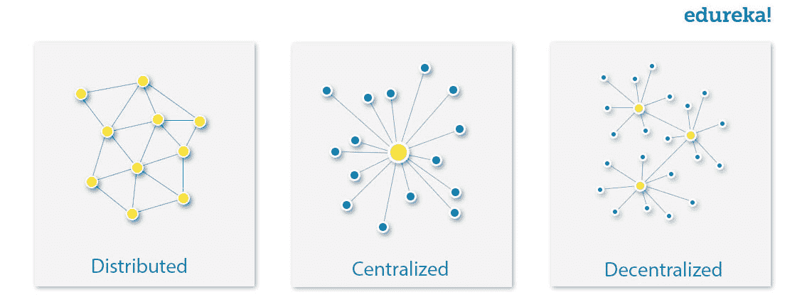
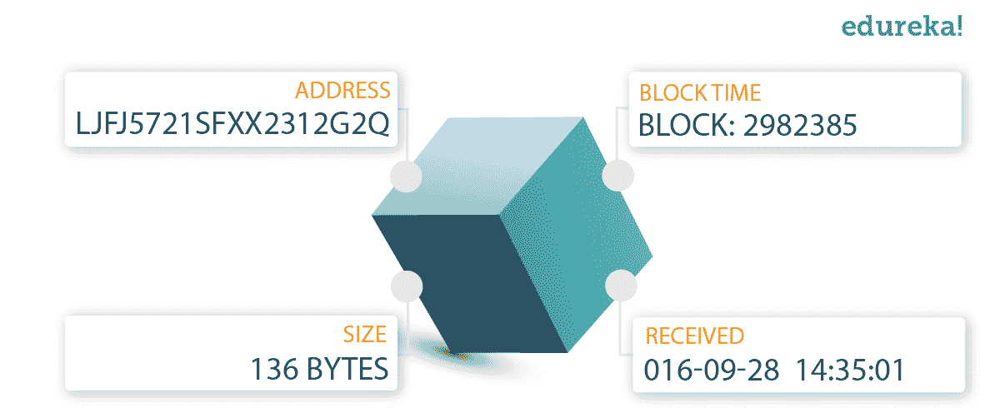
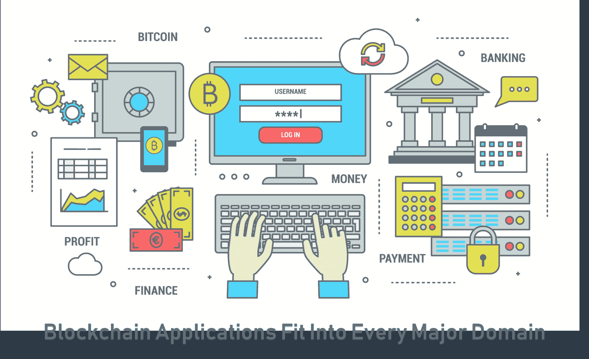
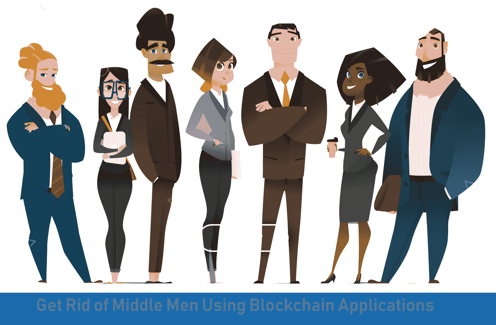

# 正在改变世界的区块链应用

> 原文：<https://www.edureka.co/blog/blockchain-applications/>

[区块链](https://www.edureka.co/blog/what-is-blockchain/)——信任的技术。区块链应用有可能改变我们交易、与政府互动以及验证商品真实性的方式，从土地到蔬菜。它将互联网的力量与先进的[加密技术](https://www.edureka.co/blog/what-is-cryptography/)的安全性相结合，提供了一种更快、更安全的方法来验证关键信息并建立信任。 最初是为 [数字货币](https://www.edureka.co/blog/top-5-cryptocurrencies/) 设计的，技术社区现在正在为这项技术寻找其他潜在用途。区块链本质上是交易的记录。这些交易可以是货币、货物、安全数据的任何移动，也可以是政府 ID 号 的分配。

在我们开始之前，让我先列出我将在博客中涉及的话题。【T2

*   [区块链应用的关键特征](#characteristics)
*   [是什么让区块链应用适合商业？](#blockchain-in-business)
*   [区块链应用列表](%22#list)

[//html5-player.libsyn.com/embed/episode/id/10411634/height/360/theme/legacy/thumbnail/yes/direction/backward/](//html5-player.libsyn.com/embed/episode/id/10411634/height/360/theme/legacy/thumbnail/yes/direction/backward/) **Key Characteristics of Blockchain Applications**

*   *共识*–区块链的所有参与者必须就单一数据值达成一致，以证明交易有效。
*   *出处*——区块链的参与者知道资产的来源及其所有权如何随着时间的推移而变化。
*   *不变性*–一旦交易被写入分类账，任何参与者，甚至不是区块链的管理员，都不能篡改交易。
*   *终结*——共享分类账提供了一个单一的场所来确定资产的所有权或交易的完成。还有就是确认交易一旦记录，就不能更改或撤销。

**是什么让区块链应用适合商业？**

*   *共享账本*——数据库，与区块链的所有参与者共享，数据在所有参与者之间复制和同步。
*   *权限*——区块链的建立需要为所有参与者设置权限。可以将权限设置为仅限于读取或授予参与者向网络写入新块的权限。
*   *共识*——区块链所有参与者同意网络验证交易记录。
*   *智能合约*——交易数据库中设置的业务条件，触发交易时执行。【T7****

通过在区块链网络上存储数据，它消除了集中式数据网络带来的风险，例如计算机黑客可以利用的可能性。区块链安全方法使用加密技术。公众可获得的结果给任何一种民意测验带来了透明度。 消费者很想知道公司对其产品所做的道德声明是否属实。区块链提供了一种认证你买的东西真伪的方法。

## **区块链应用列表**

无论你在哪个行业工作，区块链都有可能成为一个合适的切入点，彻底改变任何系统中的身份认证方式。下面是我编译的区块链应用程序列表。这些应用程序通常服务于不同的目的，但可能属于类似的领域，例如医疗保健和金融。

** 土地登记处**

一个面向未来的区块链房地产市场正在建立连接潜在买家和卖家的新商业模式。在区块链解决方案中，不需要第三方、律师和经纪人。 Ubiquity 与巴西房地产登记处合作开发了该项目，旨在降低成本，同时提高安全性和透明度。无处不在寻求土地记录办公室处理的财产所有权数据的不变性。这是一种从纸质记录向 100%基于计算机的解决方案转变的努力。区块链上存储的记录是不可变的。 同样，瑞典政府与**[ChromaWay](https://chromaway.com/)**合作测试基于区块链的土地注册的可能性。

**保险**

当我想到保险索赔时，我首先想到的是越来越多的欺诈索赔。现有的索赔流程可能非常复杂、时间过长且不方便，这可能会造成客户摩擦以及各方之间的信任缺失。 Everledger 已经提出了一个突破性的区块链解决方案，为最重视透明度、信任和出处的行业提供解决方案。

**投票**

人们总是怀疑投票系统保护数据和抵御潜在攻击的能力。每一张选票都对一个国家产生重大影响。 Agora 提供了一个区块链投票平台，以确保全球透明、可验证的选举。Agora 与塞拉里昂选举的合作是一个概念验证实验。有趣的是，政府官员和实验得出的结果是一样的。

现如今，拼车很普遍。乘客用现金或信用卡支付给司机。数字货币怎么样？LaZooz 是一个实时拼车服务，由区块链驱动。它可以根据乘客的位置实时同步空座位。通过使用加密货币技术，La`Zooz 与司机和乘客的“公平分享”奖励机制合作。

**美食**

有没有想过你正在吃的食物的完整性，它来自哪里，是如何制作的？ 配合 **[出处](https://www.provenance.org/how-it-works/shoppers)** ，可以实时跟踪生鲜农产品从源头到店铺的旅程。因此，你可以知道鸡排是否被感染，因为你知道它的来源。有了这个 ID，你就可以检查安全的数字历史，以及由一家公司提出的经过验证的声明，并从整个供应链中获得丰富的内容。区块链系统意味着更高水平的保密性和安全性，从而减少实现监管合规性的开销。

**患者数据管理**

在医疗行业，关键的患者数据和信息仍然分散在不同的部门和系统中。因此，关键数据在需要时无法访问和轻松获得。 **耐心**赋予人们掌控自己健康的权利。Patientory 是一个区块链解决方案，提供个人医疗保健解决方案来存储和管理健康信息。它们将医生、护理提供者和消费者都连接在一个安全的区块链平台上，创建了一个团队，共同努力提供最佳护理。

**药品溯源**

只有把药放进肚子里，你才能知道它是不是真的。**[block verify](http://www.blockverify.io/)**提供区块链解决方案，跟踪整个供应链中的药品，以确保消费者收到的是正品。 Blockverify 提供了一个透明的环境，在这里不可能复制产品，它可以跟踪整个系统中任何类型的欺诈交易。该系统创建不可变的记录，以确保数据完整性，同时，通过使用智能合同，它自动化了流程，从而为客户节省了大量成本。

**商业融资**

当前的借贷行业效率低下，尤其是大量的文件需要填写。现在，借贷双方都通过区块链连接到了世界各地。 **Lendoit** 正在颠覆传统的贷款行业，所有这些都没有给银行提成。作为贷款人，你可以保持完全匿名，不需要在任何地方注册。从市场上选择你喜欢的贷款。接下来是从你的钱包开始。连接到该平台的借款人将在低息环境下支付贷款。

**贸易融资**

截至目前， t 贸易融资是一个复杂的过程。来自出口商、进口商、银行、运输商、发货商、海关代理和监管机构的各方都需要在流程的各个环节进行检查和验证。该过程的每个连锁部分都依赖于前一阶段的成功完成和可靠的信息。 创建区块链贸易金融生态系统意味着将贸易的所有不同阶段结合起来，从生产到最终交付，包括其他银行、监管机构、海关和贸易周期的所有部分。

**巴达维亚** 使用了基于区块链的解决方案，旨在支持更高效、透明、安全和经济高效的交易，通过摆脱贸易融资部门对纸质记录的依赖来简化贸易融资流程。它消除了处理和比较文件的必要性，允许买方、卖方和银行高效、透明地执行交易。 最近，印度 ICICI 银行宣布已成功加入 250 多家企业的区块链申请。其背后的理念是通过区块链平台体验一种更省时、更省钱、更安全的承接国内&国际贸易交易的方式。

区块链作为金融机构和银行的解决方案，旨在以更低的成本、更高的安全性和更高的可靠性提供近乎即时的跨境支付。通过区块链，支付是不可改变的和准确的，与案件调查和诉讼相关的成本也在减少。 **[Axoni 的区块链平台](https://axoni.com/technology/)** 提供与第三方市场数据提供商的完全同步集成。它充当在系统和金融机构之间共享和同步数据的底层框架，同时维护资本市场所需的隐私、可伸缩性和审计。

所有这些区块链应用让人们以一种前所未有的方式保护数字关系。数据以不同的方式共享、保护和存储。智能合约正在改变数字关系，创造了代码自动化的能力。 看区块链项目，我们可以理解区块链技术不会消失。它已经完全改变了我们的经济和社会。

如果您希望了解更多关于区块链应用的知识，并在区块链技术领域建立职业生涯，请查看我们的 [**区块链课程**](https://www.edureka.co/blockchain-training) ，该课程提供现场讲师指导培训和真实项目体验。本培训将帮助您全面了解什么是区块链，并帮助您掌握该主题。

*对我们有疑问吗？请在“区块链应用”博客* *的评论区提出，我们将尽快回复您。*