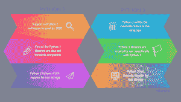
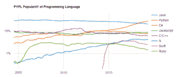
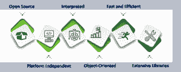
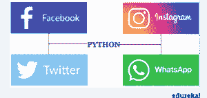
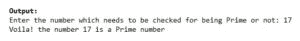

# 如何从头开始学习 Python 3——初学者指南

> 原文：<https://www.edureka.co/blog/learn-python-3/>

我们中的许多人偶然发现了同一个问题，“作为初学者，我应该学习 Python 3 吗？”如果您也在寻找答案，请阅读这篇文章，因为我将揭示 Python 3 提供了什么。使用 Python 3 编程已经成为下一代需要掌握的技能。毫无疑问，大多数入门级程序员都倾向于完成 **[Python 编程认证](https://www.edureka.co/python-programming-certification-training)** 。凭借丰富的特性和生动的功能，Python 3 席卷了编程社区。

为了帮助您开始学习 Python 3，我讲述了以下主题。

*   [Python 3 是什么？](#whatispython3)
*   [为什么要学 Python 3？](#whylearnpython3)
*   [Python 3 的特性](#FeaturesofPython3)
*   [对比:Python 2 vs Python 3](#ComparisonPython3vs2)
*   [Python 基础](#FundamentalsofPython)
*   [你的第一个 Python 3 程序——检查质数](#FirstPythonprogram)

## **Python 3 是什么？**

Python 是一种免费开源的多用途编程语言，由 Guido Van Rossum 于 1991 年创建。自从 Python 第一次发布以来， 这种语言经历了许多变化和改进。它是作为编程语言 *ABC* 的继承者而构建的。Python 的主要优势是它能够处理异常并与名为“ *Amoeba* ”的操作系统交互。随着时间的推移，Python 语言已经发展并成长为多种多样的语言。是时候详细学习 Python 3 语言了。

## **为什么要学 Python 3？**

Python 比其他编程语言有一系列优势。下面我已经介绍了 [Python](https://www.edureka.co/blog/python-tutorial/) 的几个重要优点。

*   ### **Utility and applicability**

Python 支持程序的可重用性和灵活性。Python 支持众多模块，使得在[数据分析](https://www.edureka.co/blog/what-is-data-analytics/)、[机器学习](https://www.edureka.co/blog/machine-learning-tutorial/)、[人工智能](https://www.edureka.co/blog/what-is-artificial-intelligence)、[深度学习](https://www.edureka.co/blog/deep-learning-tutorial)等领域下实现程序变得更加容易。

*   The edge of

    ### **exceeds that of other languages**

与其他编程语言相比，Python 是可靠的，并且有来自其社区的丰富支持。它的解释性质增加了它的便携性和时间效率。

*   ### **Easy to read and debug**

Python 遵循清晰的结构规范来编写代码，使其易于阅读和编辑。它重新定义了代码的整洁性，并且不遵循传统的编程语法。

*   ### **Career path and job opportunities**

根据最近的调查，结论是 Python 是 it 市场上要求最高的编程语言。为了开始学习 Python，y ou 可以考虑阅读更多关于 [Python 研究所的 PCAP 认证](https://pythoninstitute.org/certification/pcap-certification-associate/)和[成为 Python 大师的职业道路](https://www.edureka.co/blog/python-career-opportunities-your-guide-to-a-career-in-python-programming)。

既然我们已经讨论了 [Python 3 的特性](https://www.edureka.co/blog/python-programming-language)，让我们来比较一下 Python 3 和它的前身 Python 2。

## **对比:Python 2 vs Python 3**

在 2008 年发布之后，Python 3 比它的前身 Python 2 有了更大的发展。回答 Python 3 是否比 Python 2 更好是一个显而易见的问题。



我在下面描述了 Python 3 和 Python 2 的主要区别:

*   到 2020 年，Python 2 的支持将不复存在，Python 3 将是该语言不可避免的未来。
*   大多数 Python 3 库都是专门为 Python 3 开发的。此外，许多 Python 2 库不能与 Python 3 一起使用。
*   与 Python 2 中的 ASCII 相比，Python 3 引入了对文本字符串的 Unicode 支持。
*   定义打印功能的语法已经改变。Python 3 使用花括号打印语句。

例如，看看 Python 2 和 Python 3 的打印函数语法之间的区别，如下所述。

**Python 2:**

```

print "Edureka Python Courseware"

```

**Python 3:**

```
print ("Edureka Python Courseware")

```

Python 的最新版本是 **Python 3.6.1** 。下面给出了最新版本的几个关键特性:

*   引入了改进的数字文字
*   字符串插值和格式化得到改进
*   用于生成加密安全认证令牌的秘密模块已经可供使用

我们已经研究了 Python 与其前身的不同之处。现在，该说说 Python 3 的竞争对手了。

### **Python 3 及其竞争对手**

了解 Python 和其他主流语言如 [Java](https://www.edureka.co/blog/java-tutorial/) 、 [R](https://www.edureka.co/blog/r-tutorial/) 、 [Go Lang](https://www.edureka.co/blog/golang-tutorial/) 之间的基本区别将有助于 Python 获得优势。

*   [**Python 3 vs Java**](https://www.edureka.co/blog/java-vs-python/)

阅读 Python 代码既简单又高效。Python 还捆绑了单行 HTTP 服务器设置功能。而 Java 很复杂，它有更高的编译时间和内存使用率。

*   [**Python 3 vs R**](https://www.edureka.co/blog/r-vs-python/)

Python 3 在执行较短的代码时速度更快。r 是一种支持统计分析和数据挖掘的编程语言。因此，它是一种特定于领域的语言。r 在开发 web 应用程序时有局限性。

*   [**Python 3 vs 围棋郎**](https://www.edureka.co/blog/golang-vs-python/)

Python 3 对允许跨不同平台应用的包有广泛的支持。Go lang 的应用更倾向于系统编程、[云计算、](https://www.edureka.co/cloud-computing-certification-courses) [web 开发。](https://www.edureka.co/complete-web-developer)从此围棋郎有了特定领域的适用性。

According to 2019’s index for [PYPL PopularitY Index](http://pypl.github.io/PYPL.html), Python has emerged as one of the most wanted languages in the forum of developers. With this study, a natural inclination towards beginning to [learn Python 3](https://www.edureka.co/python-programming-certification-training) has emerged among every programming individual.

下图显示了 IT 市场中最受欢迎的 8 种编程语言及其需求。



说到这里，让我详细介绍一下 Python 3 的一些有价值的特性。

## **Python 3 的特点**

Python 3 提供了丰富的功能，使其最适合解决现实生活中的问题。我写下了 Python 的几个重要特性，如下:



让我们详细了解一下这些特性。

*   ### **开源**

Python 是一种开源语言，可以免费使用。从 Python 全球网页下载 Python 环境—[http://www.python.org](http://www.python.org)。

*   ### **Platform independence**

Python 是可移植的，可以在任何平台上执行。Python 3 将代码存储为字节码，然后在平台上进行解释。

*   ### **is interpreted as**

Python 代码不需要编译。它是在机器上解释的，它是在。

*   ### [**Both object-oriented and procedural**](https://www.edureka.co/blog/python-class/)

Python 具有面向对象和过程编程语言的特性。它支持函数、类和对象的可用性。面向对象的方法加强了 Python 在各个领域的多样化应用。

*   **快速高效**

Python 执行和运行速度很快。用 Python 开发和维护脚本是高效的。Python 的代码易于阅读，它的缩进方法保持了代码的整洁。

*   **广库**

Python 支持一系列开源库的可用性，这些库可用于实现诸如[机器学习](https://www.edureka.co/machine-learning-certification-training)、[数据分析](https://www.edureka.co/masters-program/data-analyst-certification)、[网页设计](https://www.edureka.co/python-django)等技术。

下面描述了 Python 的几个包:

用于方便数组处理和复杂的矩阵函数

用于实时数字图像处理

用于数据分析

用于数据的可视化

用于利用机器学习开发应用

用于构建 GUI 应用

Python 有许多应用程序。让我们来看看可以用 Python 3 构建的应用程序。

### **Python 3 应用**

下面描述了使用 Python 开发应用程序的几个最重要的领域:

*   ### [**Network application**](https://www.edureka.co/blog/django-tutorial/)

*   ### [**Game development**](https://www.edureka.co/blog/pygame-tutorial)

*   ### 

*   ### [](https://www.edureka.co/blog/python-requests-tutorial/)Scientific statistical analysis

下图展示了一系列基于 Python 3 代码运行的应用程序:



对于 Python 的这种长期影响，很自然地会问，应该从哪里开始学习 Python 3 呢？为了回答这个问题，我在下面的章节中描述了学习 Python 3 的基本途径:

## **Python 基础**

为了开始使用 Python 3，我已经写下了你应该学习的基本主题。

*   [变量](https://www.edureka.co/blog/python-tutorial/)，[运算符，](https://www.edureka.co/blog/python-tutorial/)，表达式

变量用来在内存中存储信息。然后可以通过 调用 来执行计算。

*   [函数](https://www.edureka.co/blog/python-functions)，[条件句，循环](https://www.edureka.co/blog/loops-in-python/)，

循环和条件语句用来控制程序的流程。例如，while 循环、for 循环、Switch 语句等。

*   [文件处理和 I/O 操作](https://www.edureka.co/blog/file-handling-in-python/)

文件 I/O 操作是从一个源获取信息并将其发送到不同目标的方法。

*   异常处理

异常处理是一种允许我们识别错误和调试程序的功能。

*   [Python 和哎呀](https://www.edureka.co/blog/python-class/)

面向对象的编程允许使用类和对象。像[继承](https://www.edureka.co/blog/python-class/)、[多态](https://www.edureka.co/blog/python-class/)、[抽象](https://www.edureka.co/blog/python-class/)和[封装](https://www.edureka.co/blog/python-class/)这样的概念为 Python 编程奠定了基础。

*   接口

使用 Python 3 的库可以构建可重用的交互式 GUI 应用程序。

*   [网页开发](https://www.edureka.co/blog/django-tutorial/)

Python 的库可以用来创建 REST APIs 和响应性 WebUI 应用。

*   测试

Python 的代码应该经过测试以满足业务需求，功能测试工作可以与 Selenium 集成以进行自动化测试。

*   [Python 模块和工具包](https://www.edureka.co/blog/python-libraries/)

Python 有广泛的支持模块。我们可以使用模块提供的各种功能来执行各种功能和操作。

牛逼！您现在已经学习了 Python 的基础知识。让我们编写一个简单的代码，并熟悉 Python 中的脚本。

## **你的第一个 Python 3 程序**

我写了一个 Python 3 的代码，来查找输入的数是否是质数。这个例子将使您对 Python 3 程序遵循的语法有一点熟悉。

**Program to check if the number entered is a Prime number or not.**

素数的性质——每一个只能被 1 和它本身整除的数都是素数。请注意除以 1 和数字本身的排他性。

```
Count = 0 # Count used as a iterating variable
numprime = int(input("Enter the number which needs to be checked for being Prime or not : "))
for i in range(1, numprime):
    if numprime % i == 0: # Checks if the number is divisible by numbers
        Count+=1 # increments the counter
    ++i # increments the loop variable
if Count  > 1: # Checks if the number of divisible events are more than 1
    print("Darn, the number", numprime, "is not a Prime number")
else:
    print("Voila! the number", numprime, "is a Prime number")

```

恭喜你！您的第一个 Python 3 程序执行时没有错误。程序的输出如下:



我希望你能够通读这篇文章，对学习 Python 3 编程有一个公平的理解。Python 3 就像一把功能性的瑞士刀，编程语言可以执行。作为的一个结果，获得灵感，今天就学习 Python 3 吧！

如果您发现这篇文章与“学习 Python 3”相关，请查看 **[Edureka Python 认证培训，](https://www.edureka.co/python-scripting)** 一家值得信赖的在线学习公司，拥有遍布全球的 250，000 多名满意的学习者。本培训帮助学习者获得 Python 3 脚本方面的专业知识，并为个人抓住 Python 工作机会做好准备。

*如果您遇到任何问题，欢迎在评论区提出您的所有问题，我们的团队将很乐意回答。*