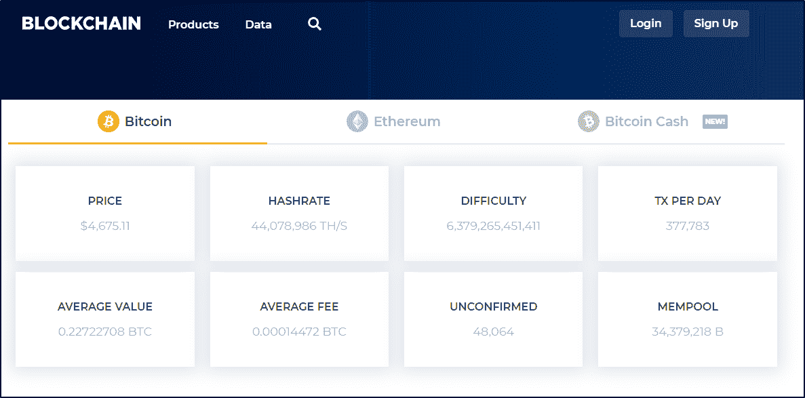
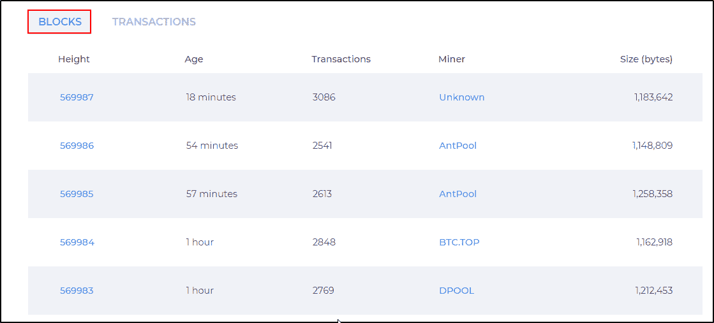
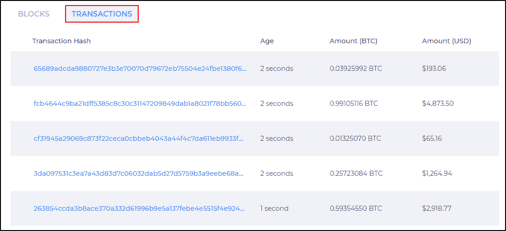
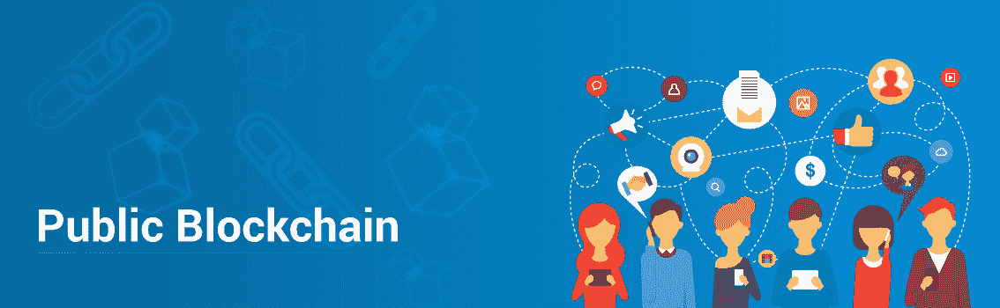
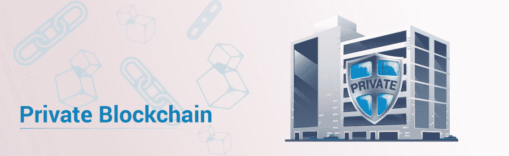
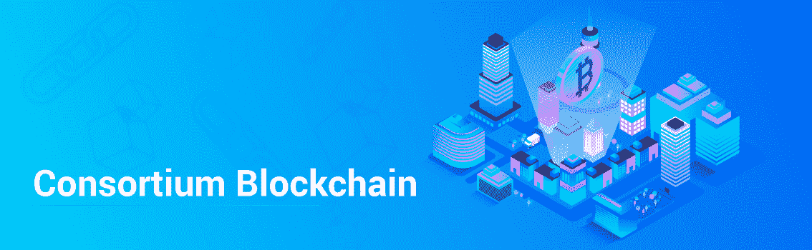

# 不同类型的区块链以及我们为什么需要它们

> 原文：<https://www.edureka.co/blog/types-of-blockchain/>

区块链凭借比特币进军 IT 行业，改变了世界看待在线交易的方式。随着区块链的流行，人们意识到区块链可以[超越比特币](https://www.edureka.co/blog/infographic-blockchain-beyond-bitcoin-platforms/)。多年来，医疗保健、房地产、政治等各种行业。，一直在尝试采用区块链技术。由于每个行业都有独特的工作方式，区块链不得不演变成不同的类型。在这篇博客中，我将解释不同类型的区块链及其基本原理。

本博客涵盖的主题有:

*   [为什么我们需要不同类型的区块链？](#WhydoweneeddifferenttypesofBlockchain)
*   [不同类型的区块链](#DifferenttypesofBlockchain)

## **为什么我们需要不同类型的区块链？**

如前所述，不同行业使用[区块链技术](https://www.edureka.co/blog/what-is-blockchain/)的方式不同。因此，在谈论不同类型的区块链之前，我想讨论一些区块链的应用，其中应用使用区块链的要求和方式是不同的。

我要从向世界介绍区块链技术的应用说起:**比特币**！

### **比特币**

比特币是最流行的加密货币之一。比特币是一种无需任何中间环节的在线货币交易方式。假设你想把一些比特币从你的账户转到另一个账户。你用收款人的账号 ID 转账比特币。交易被发送到[区块链采矿](https://www.edureka.co/blog/blockchain-mining/)进行验证，以避免欺诈。在交易被确认和验证之后，交易被添加到区块链块中，并且接收者接收比特币。

当谈到像比特币这样的加密货币时，任何人都应该能够访问它，进行交易并成为验证者。这就是为什么比特币对谁可以访问它没有限制。打开网络浏览器，进入[https://www.blockchain.com/explorer](https://www.blockchain.com/explorer)。在这里你会看到许多细节，如价格，散列，难度等。

如果您向下滚动同一页面，您将看到每个区块和交易的更多详细信息。

你可以看到很多信息都是公开的。但这并不意味着数据不安全。这些都是加密数据，敏感数据仍然是安全的。

### **多链**

多链是区块链的一种应用，被组织用来增强安全性。通过设置多链，您可以防止对敏感数据的未授权访问。在这里，区块链不对公众开放，它只对同一组织中的授权实体开放。

如果你拥有一个组织，并决定在区块链上存储金融交易的详细信息，你不会希望这些数据公开。数据应仅限于相关人员(财务部门、管理层、董事会等)。).

在区块链的这类应用中，应该限制可以加入网络和访问区块链的节点。只有受到网络管理员的邀请，才能加入网络。此外，参与者和验证者的访问受到限制。

多链(Multichain)是仅由单个组织使用的区块链。银行业使用的版本略有不同。

### **银行业区块链**

类似于 Multichain 只限于同一组织的人员，银行业中使用的区块链限制了该特定银行对区块链的访问。但这里的区别是，区块链应该对银行的所有分支机构开放，可能对不同银行的内部交易开放。

在这样的应用中，区块链不仅仅局限于一个节点，而是其他可信节点。有权访问区块链的节点应该得到授权。这就像一个区块链正在被信任的节点共享和限制。

现在你已经了解了区块链是如何以不同的方式用于不同的应用，让我们来看看区块链有哪些不同的类型。

## **不同类型的区块链**

根据应用的需要，区块链可以分为 3 种类型:

1.  [公有区块链](#PublicBlockchain)
2.  [私有区块链](#PrivateBlockchain)
3.  [财团区块链](#ConsortiumBlockchain)

### **公有区块链**

顾名思义，公共区块链是公开可访问的，对谁可以参与或作为验证者没有限制。在公共区块链，没有人能完全控制网络。这确保了数据安全性，并有助于不变性，因为单个人无法操纵区块链。

区块链上的权限在网络中的每个节点之间平均分配，由于这一点，公共区块链被认为是完全分布式的。

公共区块链主要用于**比特币**、**以太坊**、**莱特币**等加密货币。

### **私有区块链**

私有区块链(也称为许可区块链)对谁可以访问它并参与交易和验证有限制。只有预先选择的实体有权访问区块链。这些实体由各自的机构选择，并在构建区块链应用程序时由区块链开发者给予许可。假设需要向新用户授予权限或撤销现有用户的权限，网络管理员可以负责。

私有区块链主要在私有组织中使用，用于存储应该只对组织中的某些人可用的敏感信息。因为私有区块链是一个**封闭的**区块链，数据在组织内部，任何外部实体都无法触及。

### **财团区块链**

在财团区块链中，一些节点控制共识过程，一些其他节点可能被允许参与交易。财团区块链就像是公有和私有区块链的混合体。它是公共的，因为区块链正被不同的节点共享，它是私有的，因为可以访问区块链的节点受到限制。因此，它一部分是公有的，一部分是私有的。

这里有两种类型的用户:一是对区块链拥有控制权并决定谁应该拥有访问区块链的权限的用户，二是可以访问区块链的用户。

这种类型的区块链可用于组织准备共享区块链，但将数据访问限制在自己范围内，并防止公众访问。 现在，如果你想了解更多关于区块链架构的内容，[点击这里](https://www.edureka.co/blog/blockchain-architecture/)。

*有问题吗？请将它发布在 [Edureka 社区](https://edureka.co/community)上，我们将会回复您。*

如果你希望学习区块链，并在不同的区块链技术中建立职业生涯，那么请查看我们的 *[**区块链** **认证**](https://www.edureka.co/blockchain-training)* ，它带有讲师指导的现场培训和真实项目经验。该培训将帮助您全面了解什么是区块链，并帮助您掌握该主题。