# 2023 年最常问的人工智能面试问题

> 原文：<https://www.edureka.co/blog/interview-questions/artificial-intelligence-interview-questions/>

## **人工智能面试问题:**

自从我们意识到人工智能如何积极影响市场以来，几乎每个大型企业都在寻找人工智能专业人士来帮助他们实现他们的愿景。在这篇人工智能面试问题博客中，我收集了面试官最常问的问题。这些问题是查阅[机器学习课程](https://www.edureka.co/masters-program/machine-learning-engineer-training)后收集的。

如果你最近参加过任何人工智能面试，请将这些面试问题贴在评论区，我们会在第一时间回答。如果你心中有任何问题，你也可以在下面发表评论，这些问题可能会在你的人工智能面试中遇到。

在这篇关于人工智能面试问题的博客中，我将讨论在你的面试中被问到的与人工智能相关的顶级问题。所以，为了让你更好的理解，我把这个博客分成了以下三个部分:

1.  [人工智能基础级面试试题](#Artificial%20Intelligence%20Basic%20Level%20Interview%20Questions)
2.  [人工智能中级面试试题](#Artificial%20Intelligence%20Intermediate%20Level%20Interview%20Questions)
3.  [基于人工智能场景的面试问题](#Artificial%20Intelligence%20Scenario%20Based%20Interview%20Question)

## **人工智能基础级面试题**

### **Q1。AI、机器学习和深度学习有什么区别？【T2**

| 人工智能 | 机器学习 | 深度学习 |
| 起源于 1950 年代 | 起源于 1960 年代 | 起源于二十世纪七十年代 |
| 人工智能代表机器中的模拟智能 | ML 是让机器在没有被编程的情况下做出决定的实践 | DL 是使用人工神经网络解决复杂问题的过程 |
| 人工智能是数据科学的子集 | ML 是人工智能和数据科学的一个子集 | DL 是 ML、AI 和数据科学的子集 |
| 旨在制造能够像人类一样思考的机器 | 旨在制造通过数据学习的机器，以便它们能够解决问题 | 旨在构建自动发现特征检测模式的神经网络 |

*人工智能 vs 机器学习 vs 深度学习——人工智能面试问题——爱德华卡*

### **Q2。什么是人工智能？举例说明人工智能在日常生活中的应用。**

*“Artificial Intelligence (AI) is an area of computer science that emphasizes the creation of intelligent machines that work and react like humans.” “The capability of a machine to imitate the intelligent human behavior.”*

**********

***谷歌的搜索引擎——人工智能面试问题——爱德华卡***

*****谷歌的搜索引擎*** 最流行的[人工智能应用](https://www.edureka.co/blog/artificial-intelligence-applications/)之一就是谷歌搜索引擎。如果你打开 chrome 浏览器，开始输入一些东西，谷歌会立即提供推荐供你选择。搜索引擎背后的逻辑是人工智能。**

**AI 使用预测分析、NLP 和[机器学习](https://www.edureka.co/blog/what-is-machine-learning/)向你推荐相关搜索。这些推荐是基于谷歌收集的关于你的数据，如你的搜索历史、位置、年龄等。因此，谷歌利用人工智能来预测你可能在寻找什么。**

### ****Q3。人工智能有哪些不同的类型？****

***   **反应式机器 AI:** 基于现在的行动，它无法利用以前的经验形成现在的决策，同时更新自己的记忆。例如:深蓝*   **有限记忆 AI:** 用于自动驾驶汽车。他们不断检测周围车辆的运动，并将其添加到他们的记忆中。*   **心灵理论 AI:** 具有理解现实世界中情绪、人和其他事物能力的高级 AI。*   自我意识人工智能:拥有类似人类的意识和反应的人工智能。这样的机器有能力形成自我驱动的动作。*   **人工狭义智能(ANI):** 通用 AI，用于构建类似 Siri 的虚拟助手。*   **人工通用智能(AGI):** 又称强 AI。回答健康相关问题的 Pillo 机器人就是一个例子。*   人工超人类智能(ASI): 拥有人类所能做的一切甚至更多的能力的人工智能。一个例子是阿尔法 2，这是第一个人形机器人。**

### ****Q4。解释人工智能的不同领域。****

***AI 的领域——人工智能面试问题——爱德华卡***

***   机器学习:这是一门通过向计算机提供数据来让它们行动的科学，这样它们就可以自己学习一些技巧，而无需显式编程。*   **神经网络:**它们是一套算法和技术，按照人脑建模。[神经网络](https://www.edureka.co/blog/neural-network-tutorial/)旨在解决复杂和高级的机器学习问题。*   **机器人学:**机器人学是 AI 的一个子集，包括机器人的不同分支和应用。这些机器人是在真实世界环境中活动的人工智能体。人工智能机器人通过感知、移动和采取相关行动来操纵周围的物体。*   专家系统:专家系统是模仿人类决策能力的计算机系统。它是一种计算机程序，使用人工智能(AI)技术来模拟在特定领域拥有专业知识和经验的人或组织的判断和行为。*   **模糊逻辑系统:**模糊逻辑是一种基于“真实度”的计算方法，而不是现代计算机所基于的通常的“真或假”(1 或 0)布尔逻辑。模糊逻辑系统可以接受不精确的、失真的、有噪声的输入信息。*   **自然语言处理:**自然语言处理(NLP)是指分析自然人类语言以得出有用见解从而解决问题的人工智能方法。**

### ****Q5。机器学习和人工智能有什么关系？****

**人工智能是一种使机器能够模仿人类行为的技术。然而，机器学习是人工智能的子集。它是一门科学，通过向计算机提供数据并让它们自己学习一些技巧来让它们行动，而不需要明确的编程来这样做。**

**因此，机器学习是一种用于实现人工智能的技术。**

**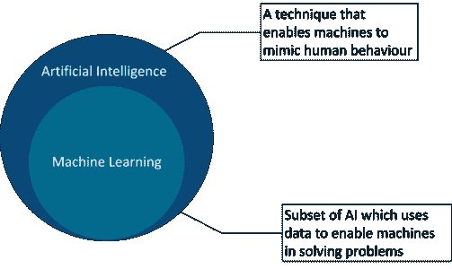**

***人工智能 vs 机器学习——人工智能面试问题——爱德华卡***

***另外，报名参加[人工智能课程](https://www.edureka.co/executive-programs/machine-learning-and-ai)，精通这个 AI 和 ML。***

### ****Q6。机器学习有哪些不同的类型？****

****

***机器学习的类型——人工智能面试问题——爱德华卡***

### ****Q7。什么是 Q-Learning？****

**Q-learning 是一种强化学习算法，在该算法中，代理试图从其过去的环境经验中学习最佳策略。一个代理人过去的经历是一个状态-行动-回报的序列:**

**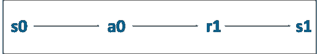**

***什么是 Q-Learning？–人工智能面试问题–爱德华卡***

**在上面的状态图中，代理(a0)处于状态(s0 ),并且正在执行一个动作(a0 ),该动作导致接收奖励(r1 ),因此被更新到状态(s1)。**

### ****Q8。什么是深度学习？****

**深度学习模仿我们大脑的工作方式，即从经验中学习。它使用神经网络的概念来解决复杂的问题。**

**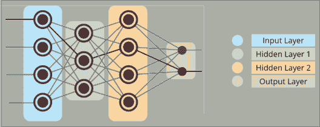**

***什么是深度学习？–人工智能面试问题–爱德华卡***

**任何深度神经网络都将由三种类型的层组成:**

***   **输入层:**该层接收所有的输入，并将它们转发到隐藏层进行分析*   **隐藏层:**在这一层中，进行各种计算，并将结果传递到输出层。可以有 n 个隐藏层，这取决于你要解决的问题。*   **输出层:**这一层负责将神经网络的信息传递给外界。**

### ****Q9。解释深度学习是如何工作的。****

**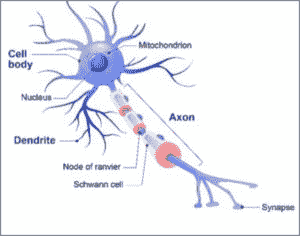**

***生物神经元——人工智能面试问题——爱德华卡***

***   深度学习基于大脑的基本单元，称为脑细胞或神经元。受神经元的启发，开发了人工神经元或感知器。*   生物神经元具有用来接收输入的树突。*   类似地，感知器接收多个输入，应用各种变换和功能，并提供输出。*   就像我们的大脑如何包含多个连接的神经元，称为神经网络一样，我们也可以有一个称为感知器的人工神经元网络，以形成深度神经网络。**

**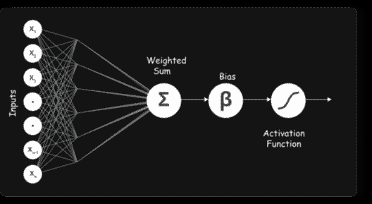**

***深度神经网络——人工智能面试问题——爱德华卡***

***   人工神经元或感知器模拟具有一组输入的神经元，每一个输入都被赋予特定的权重。然后，神经元对这些加权输入计算一些函数，并给出输出。**

### ****Q10。解释常用的人工神经网络。****

****前馈神经网络****

***   最简单的人工神经网络形式，数据或输入沿一个方向传输。*   数据通过输入节点，在输出节点上输出。这个神经网络可能有也可能没有隐藏层。**

**[**卷积神经网络**](https://www.edureka.co/blog/convolutional-neural-network/)**

***   这里，输入要素像过滤器一样以批处理方式获取。这将有助于网络记忆部分图像，并可以计算操作。*   主要用于信号和图像处理**

****[【RNN】](https://www.edureka.co/blog/recurrent-neural-networks/)–长短期记忆****

***   工作原理是保存图层的输出，并将其反馈给输入，以帮助预测图层的结果。*   在这里，您让神经网络处理前方传播，并记住它需要什么信息供以后使用*   通过这种方式，每个神经元将会记住它在之前的时间步骤中所拥有的一些信息。**

**[**Autoencoders**](https://www.edureka.co/blog/autoencoders-tutorial/)**

***   这些是无监督学习模型，具有输入层、输出层和连接它们的一个或多个隐藏层。*   输出图层与输入图层具有相同数量的单位。它的目的是重建自己的输入。*   通常是为了降维以及学习数据的生成模型。**

****Q11。什么是贝叶斯网络？T3****

***A Bayesian network is a statistical model that represents a set of variables and their conditional dependencies in the form of a directed acyclic graph.***

****在事件发生时，贝叶斯网络可用于预测几个可能的已知原因中的任何一个是促成因素的可能性。****

****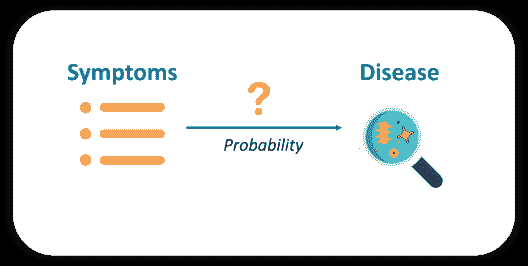****

*****贝叶斯网络——人工智能面试问题——爱德华卡*****

****例如，贝叶斯网络可以用来研究疾病和症状之间的关系。给定各种症状，贝叶斯网络对于计算各种疾病出现的概率是理想的。****

### ******Q12。解释用于测试机器智能的评估。******

****在人工智能(AI)中，图灵测试是一种确定计算机是否能够像人类一样思考的方法。****

### ******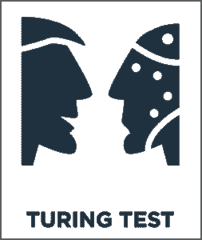******

*****AI 图灵测试——人工智能面试问题——爱德华卡*****

*****如果你想在 AIML 中快速推进你的职业生涯，那么参加这些由 Edureka 提供的[人工智能和机器学习课程](https://www.edureka.co/executive-programs/machine-learning-and-ai)，这些课程提供现场讲师指导培训、实时项目和认证。*****

## ******人工智能中级面试题******

### ******Q1。强化学习是如何工作的？举例说明。******

****通常，强化学习(RL)系统由两个主要组件组成:****

*****   代理人*   一个环境****

****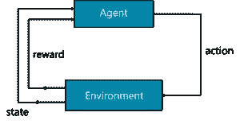****

*****强化学习——人工智能面试问题——爱德华卡*****

*****   环境是代理所作用的设置，代理代表 RL 算法。*   当环境向代理发送一个状态时，RL 过程开始，然后代理基于它的观察，响应于该状态采取动作。*   反过来，环境将下一个状态和相应的奖励发送回代理。代理将使用环境返回的奖励更新其知识，以评估其最后的动作。*   循环继续，直到环境发送一个终端状态，这意味着代理已经完成了他的所有任务。****

****为了更好地理解这一点，让我们假设我们的代理正在学习玩反击。RL 流程可分为以下步骤:****

********

*****《反恐精英》示例——人工智能面试问题——爱德华卡*****

*****   RL 代理(玩家 1)从环境中收集状态 S⁰(反击游戏)*   基于状态 S⁰，RL 代理采取动作 A⁰，(动作可以是导致结果的任何事情，即代理在游戏中向左或向右移动)。最初，动作是随机的*   环境现在处于一个新的状态 S(游戏中的新阶段)*   RL 代理现在从环境中获得奖励 R。该奖励可以是额外的点数或硬币*   这个 RL 循环一直持续到 RL 代理死亡或到达目的地，并且它连续输出状态、动作和奖励的序列。****

****要了解更多关于强化学习的信息，你可以浏览这段由我们的机器学习专家录制的视频。****

## ****强化学习教程|使用 Python 的强化学习示例| Edureka****

********

****[https://www.youtube.com/embed/LzaWrmKL1Z4?rel=0&showinfo=0](https://www.youtube.com/embed/LzaWrmKL1Z4?rel=0&showinfo=0)********In this video on “Reinforcement Learning Tutorial” you will get an in-depth understanding about how reinforcement learning is used in the real world.****

### ******Q2。举例说明马尔可夫的决策过程。******

*****The mathematical approach for mapping a solution in Reinforcement Learning is called Markov’s  Decision Process (MDP).***********The following parameters are used to attain a solution using MDP:

*   一组动作
*   状态集，S
*   奖励河
*   政策，π
*   价值，V

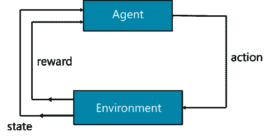

*马尔科夫的决策过程——人工智能面试问题——爱德华卡*

简而言之，代理必须采取行动(A)从开始状态转换到结束状态。在这样做的时候，代理人会因为他采取的每一个行动而获得奖励(R)。代理采取的一系列行动定义了策略(π),收集的奖励定义了价值(V)。这里的主要目标是通过选择最佳策略来最大化回报。

为了更好地理解 MDP，让我们使用 MDP 方法来解决最短路径问题:

*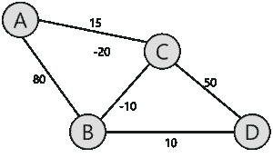最短路径问题——人工智能面试问题——爱德华卡*

给定上面的表示，我们这里的目标是找到‘A’和‘D’之间的最短路径。每条边都有一个与之关联的数字，这表示穿过该边的成本。现在，手头的任务是以尽可能低的成本从 A 点穿越到 D 点。

在这个问题中，

*   这组状态由节点表示，即{A，B，C，D}
*   动作是从一个节点遍历到另一个节点{A -> B，C -> D}
*   回报是每条边所代表的成本
*   策略是到达目的地的路径

你从节点 A 开始，一步一步地向你的目的地前进。最初，您只能看到下一个可能的节点，因此您可以随机开始，然后在遍历网络时学习。主要目标是选择成本最低的路径。

既然这是一个非常简单的问题，我就把它留给你来解决。一定要在评论区提到答案。

### **Q3。解释强化学习中的回报最大化。**

RL 代理的工作基于报酬最大化理论。这就是为什么 RL 代理必须以这样的方式训练，他采取最好的行动，以使回报最大化。

在某一特定时间对相应行动的集体奖励写为:

*奖励最大化方程——人工智能面试问题——爱德华卡*

上面的等式是奖励的理想表示。总的来说，在总结累积奖励时，事情不会像这样发展。

*奖励最大化——人工智能面试问题——爱德华卡*

我用一个小游戏来解释一下这个。在图中你可以看到一只狐狸，一些肉和一只老虎。

*   我们的 RL 代理是狐狸，他的最终目标是在被老虎吃掉之前吃掉最多的肉。
*   因为这只狐狸是一个聪明的家伙，他吃靠近他的肉，而不是靠近老虎的肉，因为他越靠近老虎，他被杀死的机会就越高。
*   这样一来，老虎附近的奖励，哪怕是更大的肉块，也会打折扣。这样做是因为不确定因素，老虎可能会杀死狐狸。

接下来要理解的是，奖励的贴现是如何工作的？为了做到这一点，我们定义了一个叫做伽马的贴现率。gamma 的值介于 0 和 1 之间。伽玛越小，折扣越大，反之亦然。

因此，我们的累积折扣奖励是:

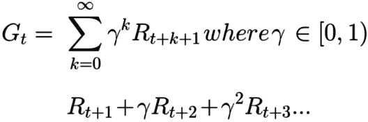

*带折扣方程的奖励最大化——人工智能面试问题——爱德华卡*

### **Q4。什么是开采和勘探权衡？**

强化学习中的一个重要概念是探索和利用的权衡。

顾名思义，探索就是探索和获取更多关于环境的信息。另一方面，利用是指使用已知的被利用信息来提高回报。

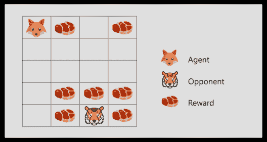

*剥削&探索——人工智能面试问题——爱德华卡*

*   考虑狐狸和老虎的例子，狐狸只吃靠近他的肉(小)块，但他不吃上面的大块肉，即使大块肉会给他更多的奖励。
*   如果狐狸只关注最接近的回报，他永远也不会到达大块的肉，这就叫剥削。
*   但是，如果狐狸决定探索一点，它可以找到更大的奖励，即大块的肉。这就是探索。

### **Q5。参数化&非参数化模型有什么区别？**

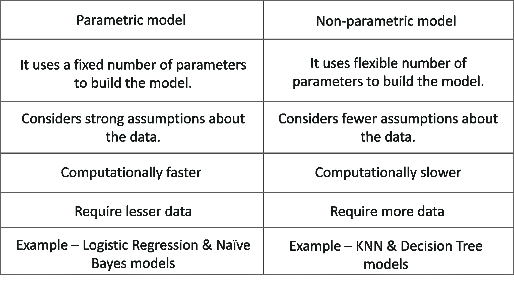

*参数 vs 非参数模型——人工智能面试问题——爱德华卡*

### **Q6。超参数和模型参数有什么区别？**

### **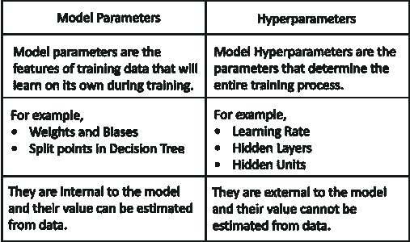**

*模型参数 vs 超参数——人工智能面试问题——爱德华卡*

### **Q7。深度神经网络中的超参数是什么？**

*   超参数是定义网络结构的变量。例如，学习率等变量定义了网络的训练方式。
*   它们用于定义网络中必须存在的隐藏层数。
*   更多的隐藏单元可以提高网络的精度，而较少的单元可能会导致拟合不足。

### **Q8。解释用于超参数优化的不同算法。**

**网格搜索**然后使用交叉验证技术评估模型。

**随机搜索** 它对搜索空间进行随机采样，并根据特定的概率分布评估集合。例如，可以检查随机选择的 100 个参数，而不是检查所有 10，000 个样本。

**贝叶斯优化** 这包括通过启用自动模型调整来微调超参数。用于逼近目标函数的模型被称为代理模型(高斯过程)。贝叶斯优化使用高斯过程(GP)函数来获得后验函数，以基于先验函数进行预测。

### **Q9。数据过度拟合是如何发生的，如何修复？**

*Overfitting occurs when a statistical model or machine learning algorithm captures the noise of the data. This causes an algorithm to show low bias but high variance in the outcome.***Overfitting can be prevented by using the following methodologies:

**交叉验证:**交叉验证背后的思想是分割训练数据，以便生成多个小型训练测试分割。然后，这些分割可用于调整您的模型。

**更多训练数据:**向机器学习模型提供更多数据有助于更好地分析和分类。然而，这并不总是有效的。

**去除特征:**很多时候，数据集包含分析不需要的无关特征或预测变量。这些特征只会增加模型的复杂性，从而导致数据过度拟合的可能性。因此，必须去除这种冗余变量。

**提前停止:**机器学习模型被迭代训练，这允许我们检查模型的每次迭代执行得有多好。但是经过一定次数的迭代后，模型的性能开始饱和。进一步的训练会导致过度适应，因此你必须知道在哪里停止训练。这可以通过一种称为提前停止的机制来实现。

**正则化:**正则化可以用 n 种方法来完成，方法取决于你正在实现的学习者的类型。例如，在决策树上执行修剪，在神经网络上使用丢弃技术，并且还可以应用参数调整来解决过拟合问题。

**使用集成模型:**集成学习是一种用于创建多个机器学习模型的技术，然后将这些模型组合起来以产生更准确的结果。这是防止过度拟合的最好方法之一。一个例子是随机森林，它使用决策树的集合来进行更准确的预测，以避免过度拟合。

### **Q10。提及一项有助于避免神经网络过度拟合的技术。【T2**

*Dropout 是一种正则化技术，用于避免神经网络中的过度拟合。这是一种在训练过程中随机选择神经元的技术。*

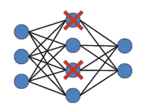

*辍学——人工智能面试问题——爱德华卡*

必须明智地选择网络的压降值。过低的值将导致最小的效果，过高的值将导致网络学习不足。

### **Q11。Keras、TensorFlow、PyTorch 等深度学习框架的目的是什么？**

*   Keras 是用 Python 编写的开源神经网络库。它旨在实现深度神经网络的快速实验。
*   [TensorFlow](https://www.edureka.co/blog/tensorflow-tutorial/) 是一个用于数据流编程的开源软件库。它用于机器学习应用，如神经网络。
*   [PyTorch](https://www.edureka.co/blog/pytorch-tutorial/) 是 Python 的开源机器学习库，基于 Torch。它用于自然语言处理等应用。

### **Q12。区分自然语言处理和文本挖掘。**

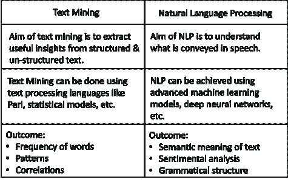

*文本挖掘 vs NLP——人工智能面试问题——爱德华卡*

### **Q13。NLP 的不同组成部分是什么？**

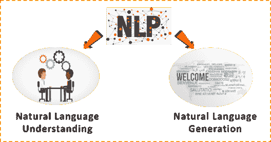

*NLP 的组成部分——人工智能面试问题——爱德华卡*

自然语言理解包括:

*   将输入映射到有用的表示
*   分析语言的不同方面

自然语言生成包括:

*   文本规划
*   句子规划
*   文本实现

### **Q14。什么是自然语言处理中的词干化&？**

词干算法的工作原理是，考虑到在屈折词中可以找到的常见前缀和后缀的列表，切断单词的结尾或开头。这种不分青红皂白的切割在某些情况下可以成功，但并不总是如此。

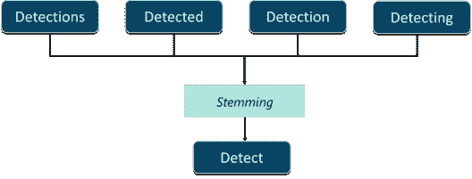

*词干——人工智能面试问题——爱德华卡*

另一方面，词汇化考虑了单词的形态分析。要做到这一点，有必要拥有详细的字典，算法可以通过这些字典将表单链接回其引理。

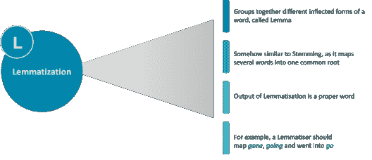

### **Q15。解释模糊逻辑架构。**

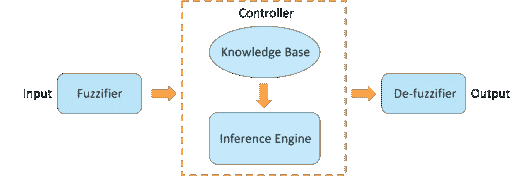

*模糊逻辑架构——人工智能面试问题——爱德华卡*

*   **模糊化模块**—系统输入被送入模糊化器，模糊化器将输入转换成模糊集。
*   **知识库**—存储专家提供的 IF-THEN 规则等分析方法。
*   **推理机**—它通过对输入和 IF-THEN 规则进行模糊推理来模拟人类的推理过程。
*   **去模糊化模块**—它将推理机获得的模糊集转换成清晰的值。

### **Q16。解释专家系统的组成。**

**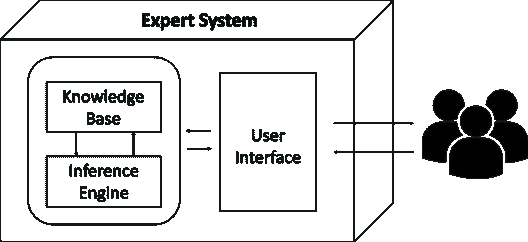**

*专家系统——人工智能面试问题——爱德华卡*

*   **知识库** 它包含特定领域的高质量知识。
*   **推理机** 它从知识库中获取知识并对其进行处理，以得出特定的解决方案。
*   **用户界面** 用户界面提供用户和专家系统本身之间的交互。

### **Q17。计算机视觉和 AI 是如何关联的？**

计算机视觉是人工智能的一个领域，用于从图像或多维数据中获取信息。机器学习算法如 K-means 用于图像分割，支持向量机用于图像分类等等。

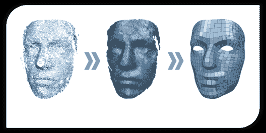

*计算机视觉与 AI——人工智能面试问题——爱德华卡*

因此，计算机视觉利用人工智能技术来解决复杂的问题，如物体检测、图像处理等。

### **Q18。图像分类哪个好？监督分类还是非监督分类？证明。**

*   在监督分类中，图像由机器学习专家手动输入和解释，以创建要素类。
*   在无监督分类中，机器学习软件基于图像像素值创建要素类。

所以从精度上来说，图像分类还是选择监督分类比较好。

### **Q19。图像处理中的有限差分滤波器对噪声非常敏感。为了解决这个问题，你可以使用哪种方法使噪声失真最小？**

图像平滑是用于减少噪声的最佳方法之一，通过迫使像素更像它们的邻居，这减少了由对比度引起的任何失真。

*图像平滑-人工智能面试问题-爱德华卡*

### **Q20。博弈论和 AI 是如何关联的？**

“在人工智能(AI)和深度学习系统的背景下，博弈论对于实现多智能体环境中所需的一些关键能力是必不可少的，在多智能体环境中，不同的人工智能程序需要交互或竞争以完成一个目标。”

*博弈论与 AI——人工智能面试问题——爱德华卡*

### **Q21。什么是极大极小算法？解释极大极小问题中涉及的术语。**

Minimax 是一种递归算法，用于在假设另一个玩家也在最佳状态下为该玩家选择最佳移动。

一个游戏可以定义为一个搜索问题，由以下部分组成:

*   **博弈树:**包含所有可能走法的树形结构。
*   **初始状态:**棋盘的初始位置，显示该由谁走。
*   **后继功能:**它定义了一个玩家可以采取的合法行动。
*   **终端状态:**是游戏结束时棋盘的位置。
*   **效用函数:**为游戏结果分配数值的函数。

## **基于人工智能场景的面试问题**

### **Q1。使用井字游戏展示极大极小算法的工作原理。**

游戏中有两个玩家:

*   这位玩家试图获得最高分
*   MIN: MIN 试图获得尽可能低的分数

以下方法适用于使用 Minimax 算法的井字游戏:

**第一步:**首先，从游戏的当前位置开始，一直到终端状态，生成整个游戏树。

**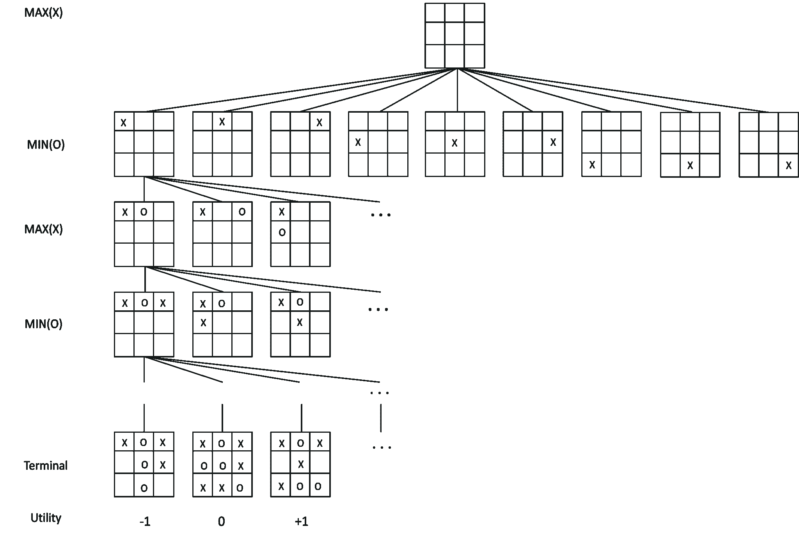**

*井字游戏——人工智能面试问题——爱德华卡*

**步骤 2:** 应用效用函数得到所有终端状态的效用值。

**第三步:**借助终端节点的效用，确定更高节点的效用。例如，在下图中，我们将终端状态的实用程序写在了方框中。

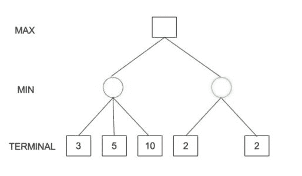

*井字游戏——人工智能面试问题——爱德华卡*

让我们计算终端上方层的左侧节点(红色)的效用:

*MIN{3，5，10}，即 3。* *因此，红色节点的效用为 3。*

*同理，对于同一层的绿色节点:* *MIN{2，2}，即 2。*

**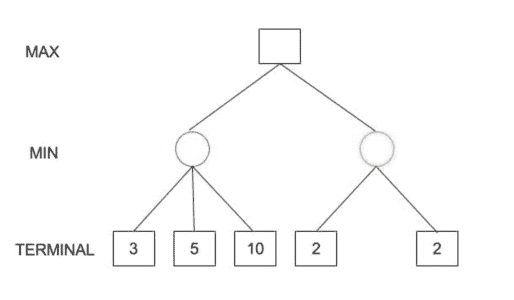**

*井字游戏——人工智能面试问题——爱德华卡*

**第四步:**计算效用值。

**第五步:**最终，所有备份的值到达树根。此时，MAX 必须选择最高值: *，即 MAX{3，2}，也就是 3。*

因此，MAX 的最佳开局棋步是左边的节点(或红色节点)。总结一下，

*Minimax Decision = MAX{MIN{3，5，10}，MIN{2，2}}* *= MAX{3，2}* *= 3*

### **Q2。哪种方法用于优化基于极大极小的游戏？**

**阿尔法-贝塔剪枝** 如果我们将阿尔法-贝塔剪枝应用于标准的极大极小算法，它会返回与标准算法相同的移动，但它会删除所有可能不影响最终决策的节点。

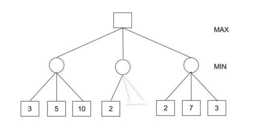

*Alpha-beta 剪枝——人工智能面试问题——edu reka*

在这种情况下，*Minimax Decision = MAX { MIN { 3，5，10}，MIN{2，a，b}，MIN{2，7，3}}* *= MAX{3，c，2}* *= 3*

提示:(MIN{2，a，b}肯定会小于或等于 2，即 c < =2，因此 MAX{3，c，2}必须是 3。)

### **Q3。脸书使用哪种算法进行人脸验证，它是如何工作的？**

脸书使用 DeepFace 进行人脸验证。它的工作原理是人脸验证算法，由人工智能(AI)技术使用神经网络模型构建。

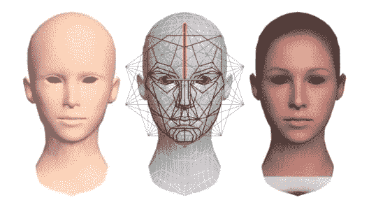

*人脸验证——人工智能面试问题——爱德华卡*

以下是人脸验证的方法:

**输入:**扫描带有大量复杂数据的野生形式的照片。这包括模糊的图像，高强度和高对比度的图像。

**过程:**在现代人脸识别中，该过程在 4 个原始步骤中完成:

*   检测面部特征
*   对齐并比较特征
*   使用 3D 图形表示关键模式
*   基于相似性对图像进行分类

**输出:**最终结果是一个人脸表示，它是从一个 9 层深度神经网络得到的

**训练数据:**超过 4000 人的 400 多万张面部图像

**结果:**脸书可以检测这两幅图像是否代表同一个人

### **Q4。解释目标营销背后的逻辑。机器学习对此有何帮助？**

目标营销包括将市场细分&将市场集中在几个关键的细分市场上，这些细分市场由需求和欲望与你的产品最匹配的客户组成。

这是吸引新业务、增加销售和发展公司的关键。

目标营销的妙处在于，通过将你的营销努力瞄准特定的消费者群体，它使你的产品和/或服务的促销、定价和分销变得更加容易和更具成本效益。

*定向营销——人工智能面试问题——爱德华卡*

目标营销中的机器学习:

*   ***文本分析系统:*** 文本分析的应用范围从搜索应用、文本分类、命名实体识别，到模式搜索和替换应用。
*   ***聚类:*** 应用包括客户细分、快速搜索、可视化。
*   ***分类:*** 像决策树和神经网络分类器，可以用于营销中的文本分类。
*   ***推荐系统:*** 和关联规则可以用来分析你的营销数据
*   ***购物篮分析:*** 购物篮分析解释了在交易中频繁出现的产品组合。

### **Q5。人工智能如何用于检测欺诈？**

*Artificial Intelligence is used in Fraud detection problems by implementing Machine Learning algorithms for detecting anomalies and studying hidden patterns in data.***

*利用 AI 进行欺诈检测——人工智能面试问题——爱德华卡*

检测欺诈活动遵循以下方法:

**数据提取:**在这一阶段，通过调查或网络搜集来收集数据。如果你试图检测信用卡欺诈，那么客户的信息就会被收集。这包括交易、购物、个人信息等。

**数据清洗:**在这个阶段，必须去除冗余数据。任何不一致或缺少值都可能导致错误的预测，因此必须在这一步处理这种不一致。

**数据探索&分析:**这是 AI 最重要的一步。这里你研究各种预测变量之间的关系。例如，如果一个人在某一天花了一笔不寻常的钱，欺诈事件发生的几率就非常高。这种模式必须在这个阶段被发现和理解。

**建立机器学习模型:**有许多机器学习算法可用于检测欺诈。一个这样的例子是逻辑回归，这是一种分类算法。它可用于将事件分为两类，即欺诈性事件和非欺诈性事件。

**模型评测:**在这里，你基本上测试的是机器学习模型的效率。如果有任何改进的空间，则执行参数调整。这提高了模型的准确性。

### **Q6。银行经理得到一个数据集，其中包含 1000 名申请贷款的申请人的记录。人工智能如何帮助经理了解他可以批准哪些贷款？解释一下。**

这个问题陈述可以使用 KNN 算法来解决，该算法将申请人的贷款请求分为两类:

1.  被认可的
2.  不赞成

*K 近邻是一种监督学习算法，它根据相邻数据点的特征将新数据点分类到目标类中。*

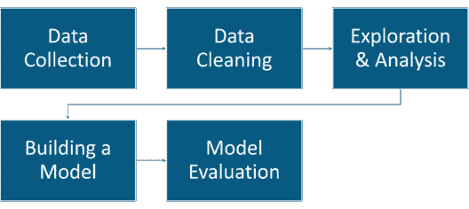

*使用 AI 的银行贷款审批——人工智能面试问题——爱德华卡*

可以执行以下步骤来预测是否必须批准贷款:

**数据提取:**在这一阶段，通过调查或网络搜集来收集数据。必须收集关于客户的数据。这包括他们的账户余额、信用额度、年龄、职业、贷款记录等。通过使用这些数据，我们可以预测是否批准申请人的贷款。

**数据清洗:**在这个阶段，必须去掉多余的变量。其中一些变量在预测申请人的贷款时并不重要，例如，诸如电话、并发信贷等变量。这样的变量必须去除，因为它们只会增加机器学习模型的复杂性。

**数据探索&分析:**这是 AI 最重要的一步。这里你研究各种预测变量之间的关系。例如，如果一个人有未偿还贷款的历史，那么他的贷款申请人很可能得不到批准。这种模式必须在这个阶段被发现和理解。

**建立机器学习模型:**有 n 种机器学习算法可用于预测申请人的贷款请求是否被批准。一个这样的例子是 K-最近邻，它是一种分类和回归算法。它将申请人的贷款请求分为两类，即批准和不批准。

**模型评测:**在这里，你基本上测试的是机器学习模型的效率。如果有任何改进的空间，则执行参数调整。这提高了模型的准确性。

### **Q7。你中了一张价值 200 万美元的彩票。我们都会收到这样的垃圾短信。如何利用 AI 来检测并过滤掉这类垃圾短信？**

为了理解垃圾邮件检测，让我们以 Gmail 为例。Gmail 利用机器学习从我们的收件箱中过滤出此类垃圾邮件。这些垃圾邮件过滤器用于将电子邮件分为两类，即垃圾邮件和非垃圾邮件。

让我们了解如何使用机器学习来检测垃圾邮件:

### **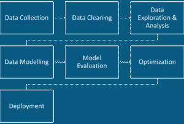**

*利用 AI 进行垃圾邮件检测——人工智能面试问题——爱德华卡*

*   机器学习过程总是从数据收集开始。我们都知道谷歌拥有的数据，显然不是纸质文件。他们有维护客户数据的数据中心。诸如电子邮件内容、标题、发件人等数据被存储。
*   接下来是数据清理。必须去除不必要的停用词和标点符号，以便仅使用相关数据来创建精确的机器学习模型。因此，在这一阶段，诸如“the”、“and”、“a”等停用词将被删除。文本以一种可以被分析的方式被格式化。
*   数据清理之后是数据探索和分析。很多时候，某些单词或短语经常出现在垃圾邮件中。像“抽奖”、“赚取”、“全额退款”这样的词表明该电子邮件更有可能是垃圾邮件。在这个阶段，必须理解这样的词和相互关系。
*   在从数据中检索有用的见解后，建立机器学习模型。为了将电子邮件分类为垃圾邮件或非垃圾邮件，您可以使用机器学习算法，如[逻辑回归](https://www.edureka.co/blog/logistic-regression-in-r/)、朴素贝叶斯等。使用训练数据集构建机器学习模型。这些数据用于训练模型，并通过使用过去的用户电子邮件数据使其学习。
*   这个阶段之后是模型评估。在此阶段，使用测试数据集测试模型，该数据集只不过是一组新的电子邮件。之后，基于机器学习模型能够正确分类电子邮件的准确度，对机器学习模型进行分级。
*   评估结束后，可以通过调整一些变量/参数来进一步改进模型。这个阶段也称为参数调整。在这里，您基本上是通过调整一些用于构建模型的参数来尝试提高机器学习模型的效率。
*   最后一个阶段是部署。在这里，该模型被部署到最终用户，在那里它实时处理电子邮件，并预测电子邮件是垃圾邮件还是非垃圾邮件。

### **Q8。假设您开始了一项网上购物业务，为了扩大业务，您想预测未来几个月的销售额。你会怎么做？解释一下。**

这可以通过研究过去的数据并建立一个模型来显示销售在一段时间内是如何变化的。销售预测是人工智能最常见的应用之一。线性回归是用于预测销售的最佳机器学习算法之一。

当销售额和时间都呈线性关系时，最好使用简单的线性回归模型。

*[线性回归](https://www.edureka.co/blog/linear-regression-in-r/)是根据自变量(X)的值来预测因变量(Y)的方法。它可以用于我们想要预测一些连续量的情况。*

*   因变量(Y): *需要预测其值的响应变量。*
*   自变量(X): *用于预测响应变量的预测变量。*

在本例中，因变量“Y”代表销售额，自变量“X”代表时间段。因为销售在一段时间内会发生变化，所以销售是因变量。

### **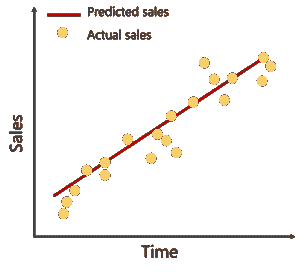**

*利用 AI 预测销量——人工智能面试问题——爱德华卡*

以下等式用于表示线性回归模型:

*Y=𝒃𝟎+𝒃𝟏 𝒙+ⅇ*

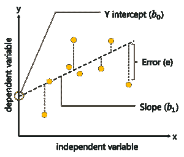

*线性回归——人工智能面试问题——爱德华卡*

这里，

*   Y =因变量
*   𝒃𝟎 = Y 轴截距
*   𝒃𝟏 =直线的斜率
*   x =独立变量
*   e =误差

因此，通过使用线性回归模型，其中 Y 轴表示销售额，X 轴表示时间段，我们可以很容易地预测未来几个月的销售额。

### **Q9。买了这个的顾客也买了这个……‘我们在亚马逊上购物时经常看到这种情况。推荐引擎背后的逻辑是什么？**

像亚马逊这样的电子商务网站利用机器学习向客户推荐产品。这种推荐的基本思想来源于协同过滤。协同过滤是比较具有相似购物行为的用户，以便向具有相似购物行为的新用户推荐产品的过程。

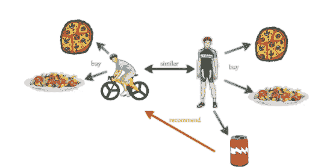

*使用 AI 的推荐系统——人工智能面试问题——爱德华卡*

为了更好地理解这一点，我们来看一个例子。假设用户 A 是一名运动爱好者，他买了披萨、意大利面和一杯可乐。几周后，另一个骑自行车的用户 B 买了披萨和意大利面。他没有购买可乐，但亚马逊向用户 B 推荐了一瓶可乐，因为他的购物行为和生活方式与用户 a 非常相似。这就是协同过滤的工作方式。

### **Q10。什么是购物篮分析，如何使用人工智能来执行该分析？**

市场购物篮分析解释了在交易中经常同时出现的产品组合。

例如，如果一个人买了面包，有 40%的可能性他也可能买黄油。通过了解物品之间的这种相关性，公司可以通过对这些物品给出相关的优惠和折扣代码来发展他们的业务。

市场购物篮分析是一种众所周知的做法，几乎所有大型零售商都遵循这种做法。这背后的逻辑是关联规则挖掘、Apriori 算法等机器学习算法:

*   关联规则挖掘是一种显示项目如何相互关联的技术。
*   *Apriori 算法利用频繁项集生成关联规则。它基于一个概念，即一个频繁项集的子集也必须是一个频繁项集。*

### **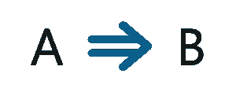**

*关联规则挖掘——人工智能面试问题——爱德华卡*

例如，上述规则表明，如果一个人购买了物品 A，那么他也会购买物品 B。以这种方式，零售商可以提供折扣，表明在购买物品 A 和 B 时，物品 c 将有 30%的折扣。这种规则是使用机器学习生成的。然后将这些应用到商品上，以增加销售和发展业务。

### **Q11。在任何一个房间(0，1，2，3，4)放置一个代理，目标是到达建筑物外(房间 5)。这能通过 AI 实现吗？如果是，解释如何做到这一点。**

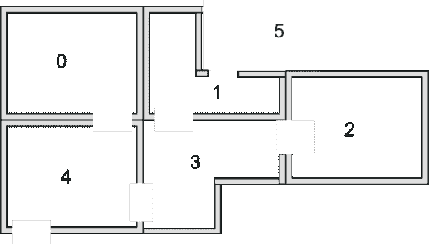

*强化学习——人工智能面试问题——爱德华卡*

在上图中:

*   建筑中由门连接的 5 个房间
*   每个房间都被编号为 0 到 4
*   建筑的外部可以被认为是一个大房间(5)
*   门 1 和门 4 直接从房间 5(外面)进入建筑

这个问题可以通过使用 Q 学习算法来解决，Q 学习算法是一种用于解决基于奖励的问题的强化学习算法。

让我们在图上表示房间，每个房间作为一个节点，每个门作为一个链接，就像这样:

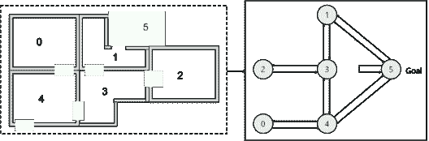

*强化学习——人工智能面试问题——爱德华卡*

下一步是将奖励值与每扇门关联起来:

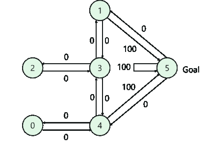

*强化学习——人工智能面试问题——爱德华卡*

*   直接通向目标的门有 100 的奖励
*   没有直接连接到目标房间的门没有奖励
*   因为门是双向的，所以每个房间都有两个箭头
*   每个箭头包含一个即时奖励值

现在让我们试着理解 Q-Learning 是如何被用来解决这个问题的。Q-Learning 中的术语包括状态和动作:

*   房间(包括房间 5)代表一种状态
*   代理从一个房间到另一个房间的移动代表一个动作

在该图中，状态被描绘为节点，而“动作”由箭头表示。假设代理从房间 2 穿越到房间 5，则采用以下路径:

1.  初始状态=状态 2
2.  状态 2 ->状态 3
3.  状态 3 ->状态(2，1，4)
4.  状态 4 ->状态 5

接下来，我们可以将状态图和即时奖励值放入奖励表或矩阵 R 中，如下所示:

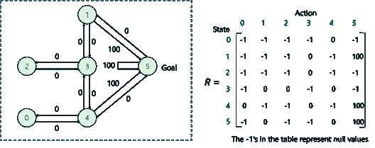

*强化学习——人工智能面试问题——爱德华卡*

下一步是添加另一个矩阵 Q，代表代理通过经验所学内容的记忆。

*   矩阵 Q 的行表示代理的当前状态
*   列表示可能导致下一个状态的动作

计算 Q 矩阵的公式:

***Q(状态，动作)= R(状态，动作)+Gamma * Max【Q(下一状态，所有动作)】***

这里，Q(状态，动作)和 R(状态，动作)表示奖励矩阵 R 和记忆矩阵 Q 中的状态和动作。

注意:伽玛参数的范围是 0 到 1 (0 <= Gamma > 1)。

*   如果 Gamma 接近于零，代理人将倾向于只考虑直接的回报。
*   如果伽马值更接近 1，代理人将会考虑更大权重的未来奖励

最后，按照以下步骤，代理将通过最佳路径到达房间 5:

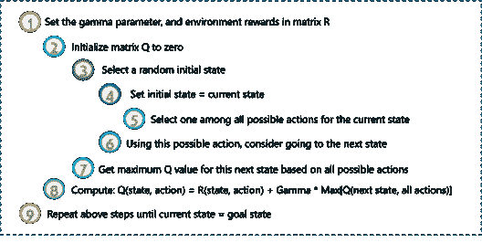

*强化学习——人工智能面试问题——爱德华卡*

### **Q12。印度的农作物产量正在下降，因为农民无法在早期发现农作物中的疾病。AI 能否用于农作物的病害检测？如果是，请解释。**

*AI 可用于实现图像处理和分类技术，用于叶部病害的提取和分类。*

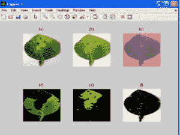

*利用 AI 进行图像处理——人工智能面试问题——爱德华卡*

这听起来很复杂，让我把它分成几个步骤:

**图像采集**:采集样本图像并存储为输入数据库。

**图像预处理:**图像预处理包括以下内容:

*   抑制不想要失真的改进的图像数据
*   增强图像特征
*   图像剪辑、增强、色彩空间转换
*   执行直方图均衡化来调整图像的对比度

**图像分割:**将一幅数字图像分割成多个片段，以便于图像分析的过程。分割是基于图像的特征，如颜色、纹理。用于分割的一种流行的机器学习方法是 K 均值聚类算法。

**特征提取:**这样做是为了提取可用于发现给定样本重要性的信息。Haar 小波变换可以用于纹理分析，并且计算可以通过使用灰度级共生矩阵来完成。

**分类:**最后使用线性[支持向量机](https://www.edureka.co/blog/support-vector-machine-in-r/)对叶部病害进行分类。SVM 是一个二元分类器，它使用一个超平面，称为两个类之间的决策边界。这导致了两类的形成:

1.  患病的叶子
2.  健康的叶子

因此，可以在计算机视觉中使用 AI，通过研究和处理图像来分类和检测疾病。这是 AI 最深刻的应用之一。

所以这些是人工智能面试中最常被问到的问题。然而，如果你想复习更多的知识，你可以浏览这些博客:

*   [初学者机器学习教程](https://www.edureka.co/blog/machine-learning-tutorial/)
*   [深度学习教程:利用深度学习的人工智能](https://www.edureka.co/blog/deep-learning-tutorial)
*   [机器学习算法](https://www.edureka.co/blog/machine-learning-algorithms/)
*   [机器学习面试问答指南](https://www.edureka.co/blog/machine-learning-interview-questions/)
*   [如何成为一名人工智能工程师？](https://www.edureka.co/blog/become-artificial-intelligence-engineer/)

至此，我们的博客到此结束。希望这些人工智能面试问题能帮助你在 AI 面试中获得 ace。

如果你想了解更多关于人工智能的知识，Edureka 提供了一个专门策划的  [**机器学习工程师硕士项目**](https://www.edureka.co/masters-program/machine-learning-engineer-training) ，让你精通监督学习、非监督学习和自然语言处理等技术。它包括人工智能&机器学习方面的最新进展和技术方法的培训，如深度学习、图形模型和强化学习。**********