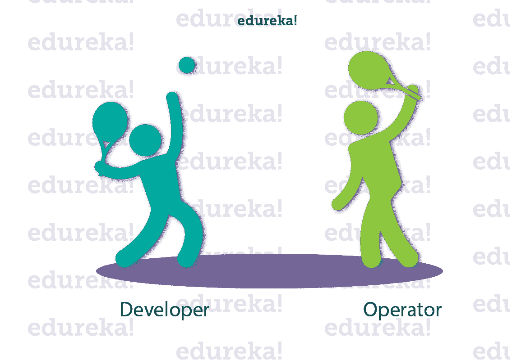
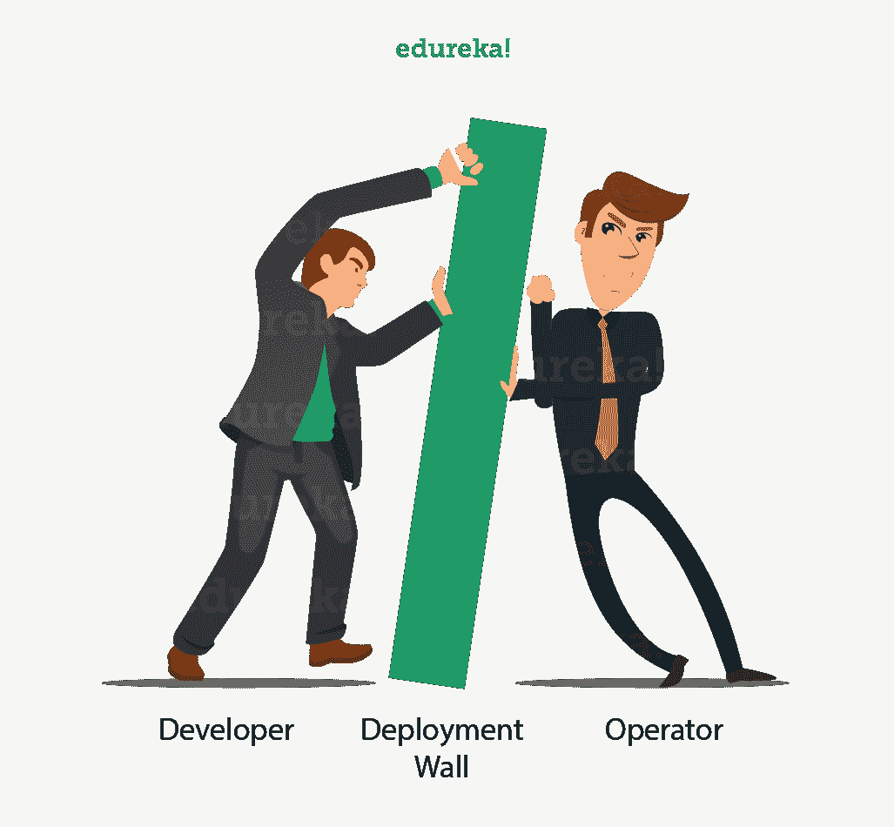

# AWS 认证 DevOps 工程师:完美融合

> 原文：<https://www.edureka.co/blog/aws-certified-devops-engineer/>

过去的二十年见证了计算和软件开发生命周期的巨大转变。因此，我们看到了对 [**在线 DevOps 培训**](https://www.edureka.co/devops-certification-training) & **[AWS 认证培训](https://www.edureka.co/aws-certification-training)** 的巨大需求，这涉及到负责这种范式转变的领域。这篇关于 **AWS 认证 DevOps 工程师**的文章告诉你为什么联合 AWS DevOps 认证是一个很好的选择。

在我们深入探讨之前，让我们先来看看这篇文章的议程:

1.  [什么是 AWS？](#WhatIsAWS?)
2.  [什么是 DevOps？](#WhatIsDevOps?)
3.  [为什么 AWS DevOps 在一起？](#WhyAWSDevOpsTogether?)
4.  [AWS 认证 DevOps 工程师](#AWSCertifiedDevOpsEngineer)

那我们开始吧

## **什么是 AWS？**

AWS 是亚马逊网络服务的缩写，是一家位于 Amazon.com T2 的子公司，以非常低廉的价格提供云计算服务，因此它的客户群从只有 5 名员工的小公司到拥有 10 万名员工的大企业都很强大。

亚马逊网络服务(AWS)是一个全面的、不断发展的云计算平台。它提供基础架构即服务(IaaS)、平台即服务(PaaS)和软件即服务(SaaS)产品的组合。如果您希望了解更多，这篇文章可能会有所帮助: **[什么是 AWS？](https://www.edureka.co/blog/what-is-aws/)**

<section class="col-md-12 col-lg-12 col-sm-12 col-xs-12 blogcontentsec">

<article class="maincontentblog">

## **什么是 DevOps？**

在这个快节奏的时代，我们看到人们更加重视软件部署的快速交付。因为为了在市场上保持竞争力，公司被期望在规定的时间内部署高质量的软件。因此，软件开发人员和系统管理员的角色变得非常重要。这两个团队之间发生了许多职责的转换。

**一个开发者**可能要等几周才能让产品部署到位，这在商业术语中也被称为 **【上市时间】** 。因此，这种延迟可能会给开发人员带来压力，因为他被迫重新调整**他的依赖活动，如** :

*   待定代码
*   旧代码
*   新产品
*   新功能

同样，当产品被放入**生产环境**时，产品可能会出现一些不可预见的错误。这是因为开发人员在可能不同于生产环境的开发环境中编写代码。

**另一方面，运营团队**负责维护和保证生产环境的正常运行时间。这带来了更多的挑战，因为用于管理早期数量的服务器的工具可能不足以满足未来和不断增长的服务器数量的需求。

运营团队还需要对代码进行**细微的修改，使其适应生产环境。因此，相应地安排这些部署的需求也在增长，这导致了时间延迟。**

有时运营团队可能会感到压力，似乎开发人员已经将他们的责任推到了责任墙**的运营方**。你可能会意识到，任何一方都不是罪魁祸首。

如果这两个团队能够合作会怎么样？如果他们:怎么办

*   可能会打破筒仓
*   分担责任
*   开始思维一致
*   团队合作

嗯，这就是 DevOps 做的事情，它帮助你让软件开发者和运营同步，提高生产力。想了解更多 DevOps，参考这个: **[DevOps 教程](https://www.edureka.co/blog/devops-tutorial)**

## **为什么 AWS DevOps 在一起？**

AWS 是最好的云服务提供商之一，另一方面，DevOps 是软件开发生命周期实施的*需求。上述原因使得 AWS DevOps 成为一个非常受欢迎的合并。*

众所周知，DevOps 有助于将开发者和管理员聚集在一起。它是怎么做到的？它使用了持续集成和部署的方法。这些是 AWS 提供的服务，非常适合 DevOps 方法:

*   AWS 云组
*   AWS EC2
*   AWS CloudWatch
*   AWS 代码管道
*   AWS 中的实例

所有这些服务都有助于持续集成和部署过程的自动化，它们也有助于改进和自动化监控和可伸缩性活动，从而使这两个 ie **[DevOps 和 AWS](https://www.edureka.co/blog/aws-devops-a-new-approach-to-software-deployment/)** 成为一个强有力的组合。

现在我们已经了解了所有这些术语，让我们试着了解一下 AWS Certfied DevOps Engineer，看看这项认证能给你带来什么好处。

## **AWS 认证 DevOps 工程师**

**AWS 认证 DevOps 工程师**拥有在 AWS 平台上**供应、操作和管理分布式应用系统的技术专长。个人负责:**

*   在 AWS 上实施和管理持续交付系统和方法
*   了解、实施和自动化安全控制、治理流程和合规性验证
*   在 AWS 上定义和部署监控、指标和日志系统
*   在 AWS 平台上实施高度可用、可扩展和自我修复的系统
*   设计、管理和维护自动化运营流程的工具

因此，如果某人通过了 AWS 认证，他或她就能熟练掌握上述技能。此外，DevOps 工程师的工作报酬肯定很高。如果你想了解开发工程师 的 **[薪水，这里有一篇文章](https://www.edureka.co/blog/devops-engineer-salary/)**

#### 那么如何获得认证呢？

该认证要求申请人参加助理级 AWS 认证开发人员或 AWS 认证系统运行管理员认证考试，并拥有两年或两年以上的 AWS 架构供应和管理经验。学生必须理解涉及 AWS 流程的持续部署(CD)和自动化的具体概念，并知道如何在 AWS 架构中实现它们。

**响应极限**

考生从四个或更多的回答选项中选择最能完成陈述或回答 问题的选项。干扰物或错误答案是知识 或技能不完整的考生可能会选择的回答选项，但通常是符合考试目标 定义的内容范围的似是而非的回答。

从 [AWS 云迁移](https://www.edureka.co/migrating-to-aws)中了解更多关于 AWS 及其框架的信息。

#### **本次考试使用的试题格式有:**

**选择题**

考生选择一个最能回答问题的选项或完成一个 陈述。该选项可以嵌入到一个图形中，考生在 上“点击”自己选择的选项即可完成试题。

考生选择一个以上最能回答问题的选项，或者 完成陈述。

**样品说明**

阅读陈述或问题，并从回答选项中选择仅代表给出信息的最正确或最佳答案的选项 。

#### **含量限度**

考试蓝图包括权重、考试目标和示例内容。包含示例主题和 概念，以阐明测试目标。它们不应被理解为 全面列举了本次考试的所有内容。

#### **课程大纲及权重:** **AWS 认证 DevOps 工程师**

| **域** | **权重(%)** |
| 连续交付和流程自动化 | 55 |
| 监控、指标和记录 | 20 |
| 安全性、治理和验证 | 10 |
| 高可用性和弹性 | 15 |

因此，适当的规划和投入肯定会帮助你成为 AWS 认证 DevOps 工程师，并在该领域取得成功。

有些人爱自备考，自考。而其他人更喜欢结构化培训。如果您也在寻找结构化的培训方法，那么请查看我们的 **[AWS DevOps 工程师](https://www.edureka.co/aws-certified-devops-training)** 认证计划，该计划包含讲师指导的现场培训和真实项目经验。本培训将帮助您深入了解 AWS DevOps 基础知识，并帮助您掌握成功的 AWS DevOps 职业生涯所必需的各种概念。如果你在寻找一份既有要求又有回报的职业。无论你是在 DevOps 工作过，还是该领域的新手，DevOps 中的 [PG 项目正是你需要学习的获得成功的方法。从基本到最先进的方法，我们涵盖了一切。](https://www.edureka.co/executive-programs/purdue-devops)

伙计们，这就是我们这篇关于“AWS certfied DevOps Engineer”的文章的结尾。我希望你有新的东西要学。 对这个话题有疑问，在评论区提吧。

</article>

</section>