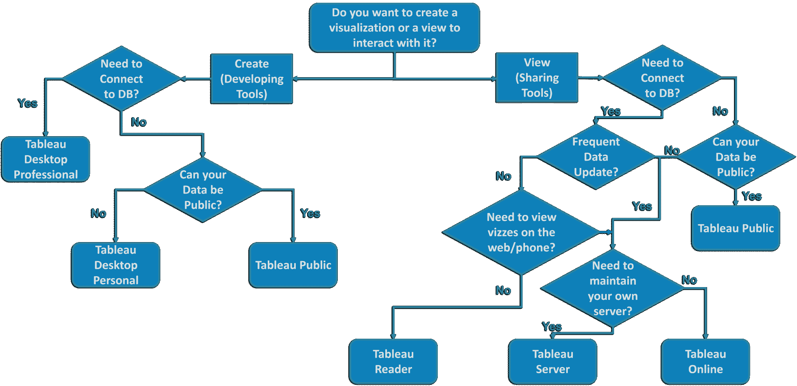
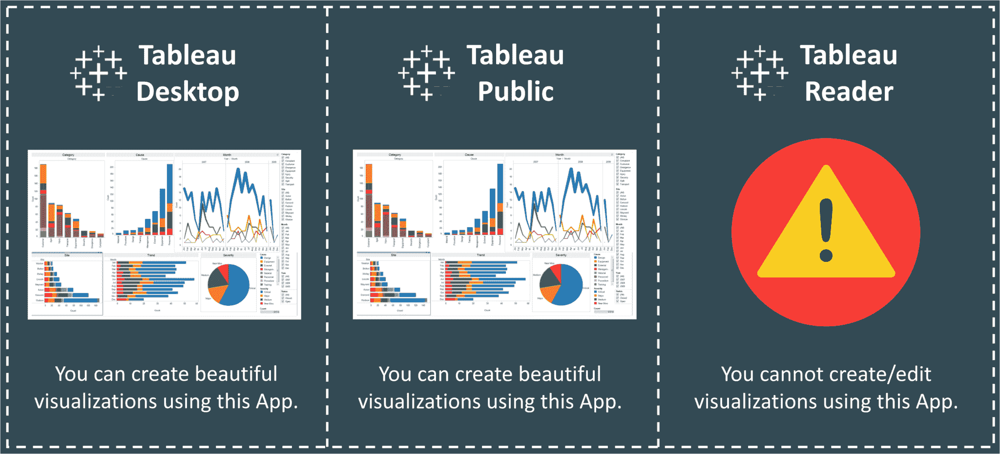
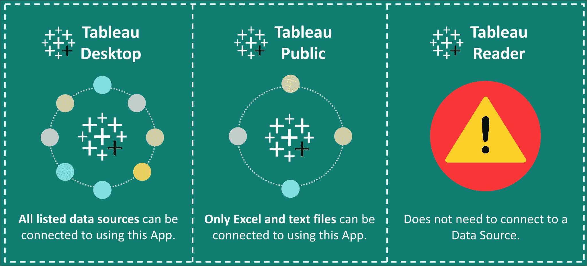
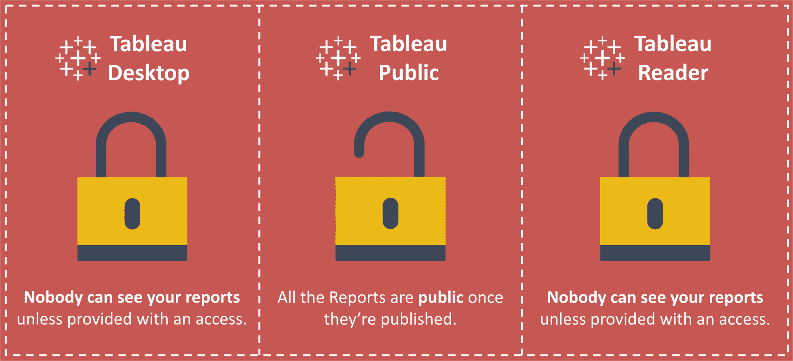
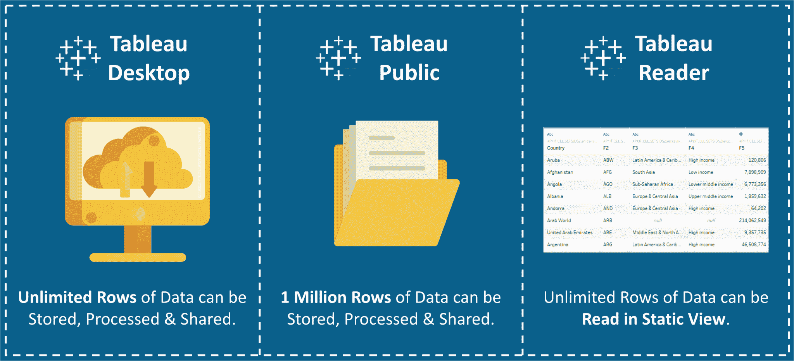
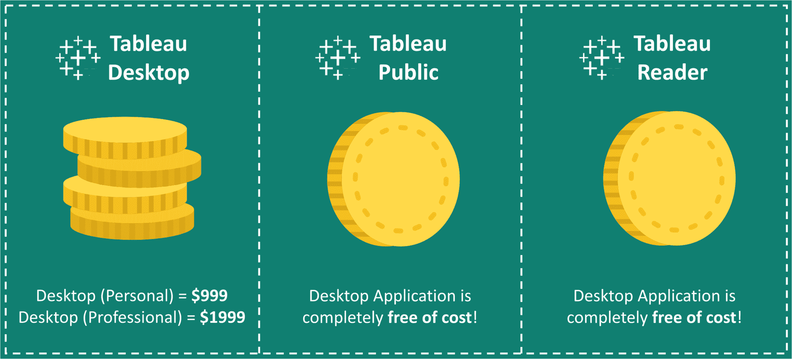
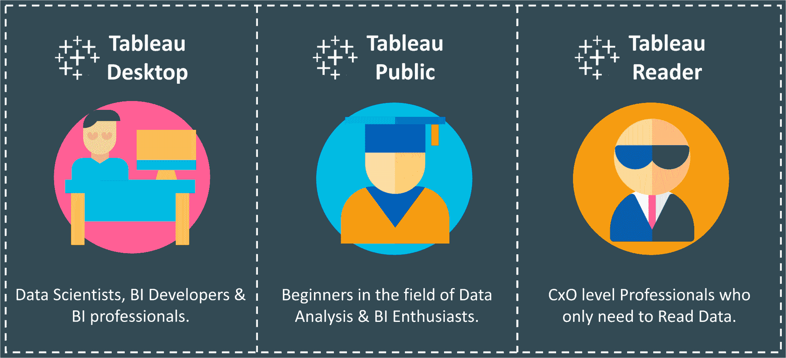

# 所有你需要选择正确的 Tableau 产品！

> 原文：<https://www.edureka.co/blog/tableau-desktop-vs-tableau-public-vs-tableau-reader/>

许多人经常在查看提供的不同软件选项时陷入困境。它们中的每一个都有一个不断增加的功能层。此外，您的意图也将决定您应该将什么软件版本合并到您的工作中。因此，我们决定通过对***Tableau Desktop vs Tableau Public vs Tableau Reader***做一点面对面的比较，让你的生活更简单。

这三个产品都是任何 [***Tableau 培训课程***](https://www.edureka.co/tableau-certification-training) 中必不可少的。

因此，比较应基于以下类别。

*   [**可以创建可视化吗？**](#creatingaviz)
*   [**可以连接哪些信号源？**](#datasources)
*   [**您的数据安全吗？**](#datasecurity)
*   [**可以存储多少数据？**](#datastoragecapacity)
*   [**多少钱？**](#license)
*   [**你的数据存储在哪里？**](#storagelocation)
*   [**目标人群是谁？**](#targetdemographic)

但是首先，让我通过下面的流程图给你一个你可能需要的软件版本的基本概念。

****

[***Tableau 桌面***](https://www.edureka.co/blog/tableau-tutorial/) 是一款数据可视化软件，让你在几分钟内看到并理解数据。专业版可以转换、处理和存储海量数据，这些数据负责组织的所有数据驱动型决策。

[***Tableau Public***](https://www.edureka.co/blog/tableau-public/)本质上是一款免费版的 Tableau 可视化软件。它允许您使用大多数软件功能。您可以创建可视化效果并连接到 CSV、文本和 Excel 文档。但是，最大的区别是 Tableau Public 不允许您在本地保存工作簿。

[https://www.youtube.com/embed/EpXPemL8qeU](https://www.youtube.com/embed/EpXPemL8qeU)

***Tableau Reader*** 允许您读取 Tableau 文件类型。如果要通过发送文件来共享工作簿，接收者需要 Tableau 阅读器来打开文档。那么，我们为什么需要读者呢？如果没有阅读器，您可能需要公开共享它或将工作簿转换为 PDF 格式。

## **Tableau 桌面 vs Tableau 公共 vs Tableau 阅读器**

## **可以创建可视化吗？**

## ****

创建可视化–Tableau 桌面 vs Tableau 公共 vs Tableau 阅读器

**Tableau Desktop** 本质上是使用一个基于 **AJAX** 的[***JavaScript***](https://www.edureka.co/blog/what-is-javascript/)应用来创建一个 viz。它可以让你抛弃幻灯片，转而使用你可以创建的、其他人可以探索的实时数据。

卓越的分析需要的不仅仅是漂亮的仪表盘。您还可以根据现有数据快速构建强大的计算，拖放参考线和预测，并查看统计汇总。

尽管是免费版本，Tableau Public 还是做了同样的事情。

但是 **Tableau Reader** 就像一个只读应用。它不支持创建/编辑故事或图表的功能。

## **可以连接哪些信号源？**

## ****

数据源–Tableau 桌面 vs Tableau 公共 vs Tableau 阅读器

**Tableau Desktop** 可以连接到本地或云中的数据，无论是大数据、SQL 数据库、电子表格还是 Google Analytics 和 Salesforce 等云应用程序。无需编写代码即可访问和组合不同的数据。超级用户可以透视、拆分和管理元数据，以优化数据源。

**Tableau 桌面公共版**处理来自 Microsoft Excel、多种文本文件格式、统计文件、Google sheets 和 web 数据连接器的数据。

**Tableau Reader** 不需要连接到任何数据源，但它可以读取基于 Tableau 支持的任何和所有列出的数据源构建的报表。

## **您的数据安全吗？**

## ****

安全性–Tableau 桌面 vs Tableau 公共 vs Tableau 阅读器

一旦你的报告发布到 ***Tableau 公共服务器上，你的数据就公开了。*** 对于其他两个选项，您需要一个访问链接来访问报告*。*

如果你想保护你的数据安全和隐私，你可以选择 **Tableau 服务器**。

*   它可以保护你私人服务器上的数据安全。
*   与 Tableau Mobile 配合使用，将数据带到任何地方。
*   允许来宾用户访问。

## **可以存储多少数据？【T2**

## ****

限制–Tableau 桌面 vs Tableau 公共 vs Tableau 阅读器

**Tableau Desktop** 对于它可以存储、处理或共享多少行数据没有限制，而**桌面公共**应用的限制最近已经更新为**一百万行**。

## **多少钱？【T2**

## ****

成本–Tableau 桌面 vs Tableau 公共 vs Tableau 阅读器

虽然 Tableau Public 和 Reader 应用程序完全免费，但 Tableau Desktop 的价格如下:

*   tableau Desktop Personal =**$ 35**(含年度维护 **$999** )
*   tableau Desktop Professional =**$ 70**(含年度维护**$ 1999**)

## **你的数据存储在哪里？【T2**

## 

对于 **Tableau Desktop** ，发布的报告可以保存在**本地驱动器**以及 **Tableau 服务器**上，而对于 **Tableau Public** ，发布的报告只能保存在 **Tableau 服务器**上。

使用**阅读器**无法发布报告**。**

## **目标人群是谁？**

## 

目标受众–Tableau 桌面 vs Tableau 公共 vs Tableau 阅读器

**Tableau Desktop** 是专为拥有 [***职业生涯的人设计的*** ***商业智能和数据仓储***](https://www.edureka.co/blog/data-warehousing-and-business-intelligence-career-path-bag-data-warehousing-and-data-mining) 如分析师和 BI 专业人士。

**Tableau Public** 面向任何有兴趣了解数据并以数据可视化的形式与世界分享这些发现的人。记者、作家、博客作者、学生等等。

**Tableau Reader** 适用于只需要监控分析的人。组织的首席执行官&首席财务官不会为会议制作仪表板，但肯定会对**向下钻取**和 [***发现从数据中产生的洞察力***](https://www.edureka.co/blog/do-magic-with-tableau) 感兴趣。

总之，Tableau 产品成功地利用了人们快速识别视觉模式的天生能力。该软件有助于创建令人信服的叙述，并从实时数据中获取见解。